# AVITO PRODUCT SPEC

> **NEEKLO Marketplace OS — Avito Product Bible / Master Specification**
>
> | | |
> | --- | --- |
> | Версия | 1.0.0 |
> | Дата | 2026-07-03 |
> | Домен | https://integrator.neeklo.ru |
> | Сервер | root@212.67.9.173 |
> | API Portal | https://developers.avito.ru/api-catalog |
> | OpenAPI | 3.0.0 |
> | Base URL | https://api.avito.ru |
> | Support | supportautoload@avito.ru, +7 495 777-10-66 |

**Статус:** Product Specification — реализация только после утверждения этого документа.

**Принцип:** Не придумывать функции без основания в официальной документации Avito.

---

## Document Control

| Поле | Значение |
| --- | --- |
| Официальных API-секций | 25 |
| Задокументированных HTTP-операций | 248 |
| Источник endpoints | GET https://developers.avito.ru/web/1/openapi/info/{slug} |
| NEEKLO Architecture | Stage 1–7 (Event Store → Avito Enterprise → Professional Workspace) |

---

## Table of Contents

1. [Executive Summary](#1-executive-summary)
2. [Полная карта API](#2-полная-карта-api)
3. [OAuth, Scopes, Tokens](#3-oauth-scopes-tokens)
4. [Матрица возможностей NEEKLO × Avito](#4-матрица-возможностей)
5. [User Flow: Account Connection](#5-user-flow-account-connection)
6. [Settings Screen Specification](#6-settings-screen)
7. [Ads Management](#7-ads-management)
8. [Ad Editor](#8-ad-editor)
9. [Regional Publishing](#9-regional-publishing)
10. [Autoload / Feed Manager](#10-autoload-feed-manager)
11. [Messenger / Inbox](#11-messenger-inbox)
12. [AI Agent](#12-ai-agent)
13. [Notifications](#13-notifications)
14. [Analytics](#14-analytics)
15. [Expenses / Budget](#15-expenses-budget)
16. [Media Studio](#16-media-studio)
17. [Competitors](#17-competitors)
18. [UI/UX + API Mapping per Screen](#18-ui-specifications)
19. [NEEKLO Architecture Mapping](#19-neeklo-architecture-mapping)
20. [Final Audit + Roadmap Avito Complete](#20-final-audit-roadmap)
A. [Appendix: Full Endpoint Catalog](#appendix-a-full-endpoint-catalog)
B. [Appendix: OAuth Scopes](#appendix-b-oauth-scopes)
C. [Appendix: Errors & Rate Limits](#appendix-c-errors-rate-limits)
D. [Appendix: Screen Specifications](#appendix-d-screen-specifications)

---

## 1. Executive Summary

### 1.1. Контекст продукта

NEEKLO Marketplace OS — event-sourced операционная система для продаж на маркетплейсах.
Avito — первый marketplace adapter. Продукт развёрнут на **integrator.neeklo.ru** (212.67.9.173).

### 1.2. Ключевые выводы из официальной документации Avito

| # | Вывод | Источник |
| --- | --- | --- |
| 1 | Два OAuth2 flow: `client_credentials` (личный кабинет) и `authorization_code` + `refresh_token` (приложения) | auth API |
| 2 | Access token TTL = **24 часа**; refresh token TTL = **1 год** | auth API |
| 3 | Messenger API требует тариф «Максимальный» (Товары/Работа) или «Расширенный/Максимальный» (Услуги) | messenger docs |
| 4 | Массовая публикация объявлений — через **Autoload** (XML/feed), не единый REST CRUD | autoload API |
| 5 | Item API — статистика, VAS, статусы; не полноценный CRUD для всех категорий | item API |
| 6 | Stats API — uniqViews, uniqContacts, uniqFavorites по itemIds | stats in item/messenger context |
| 7 | Promotion — отдельные API: promotion, cpa, cpxpromo, trxpromo, autostrategy | respective sections |
| 8 | Webhooks — Messenger v3 subscribe/unsubscribe | messenger API |
| 9 | Sandbox — только Delivery API | delivery-sandbox |
| 10 | **Нет API для мониторинга конкурентов** | — |
| 11 | Rate limits — заголовки X-RateLimit-Limit / X-RateLimit-Remaining (не все секции) | OpenAPI components |
| 12 | Иерархия аккаунтов — API только для **ключей компании**, не сотрудника | accounts-hierarchy, messenger docs |

### 1.3. Текущее состояние NEEKLO (Release 0.6–0.7)

| Модуль | UI | API | Avito API Grounding | Статус |
| --- | --- | --- | --- | --- |
| Account Center | /avito/accounts | GET/POST /api/avito/accounts* | core/v1/accounts/self | ✔ |
| Analytics | /avito/analytics | GET /api/avito/analytics/* | stats/v1/accounts/{id}/items | ✔ |
| Listing Generator | /avito/listing | POST /api/avito/listing/generate | AI local + autoload export (planned) | 🟡 |
| Regional Publishing | /avito/regional | POST /api/avito/regional/publish | Local drafts; autoload for publish | 🟡 |
| Knowledge Base | /avito/knowledge | /api/avito/knowledge/* | N/A (NEEKLO S3 + RAG) | ✔ |
| Inbox | /chats | /api/commerce/inbox/* | messenger/v1,v2,v3 | 🟡 partial |
| AI Agent | /chats, /ai/assistant | /api/avito/agent/reply | messenger:write | 🟡 |
| Notifications | /avito/notifications | /api/avito/notifications/* | webhook + external channels | 🟡 |
| Autoload Feed Manager | — | — | autoload/v4/* | 🔴 |
| Promotion Center | — | — | promotion/cpa/cpxpromo | 🔴 |
| Ad Editor (full) | /ads | /api/ads/* | items:info + autoload | 🔴 |
| Competitors | scaffold | — | **No official API** | 🔴 |

---

## 2. Полная карта API

Официальный каталог [developers.avito.ru/api-catalog](https://developers.avito.ru/api-catalog) содержит **25 секций** и **248 HTTP-операций**.

### 2.1. Summary by section

| # | Slug | Title | Operations | Rate Limit |
| ---: | --- | --- | ---: | --- |
| 1 | `accounts-hierarchy` | Иерархия Аккаунтов | 7 | — |
| 2 | `ads` | Авито Реклама | 24 | — |
| 3 | `auction` | CPA-аукцион | 2 | ✔ |
| 4 | `auth` | Авторизация | 3 | ✔ |
| 5 | `autoload` | Автозагрузка | 22 | ✔ |
| 6 | `autostrategy` | Автостратегия | 7 | ✔ |
| 7 | `autoteka` | Автотека | 27 | ✔ |
| 8 | `avito-promo` | Авито Promo | 13 | — |
| 9 | `calltracking` | CallTracking[КТ] | 3 | ✔ |
| 10 | `cpa` | CPA Авито | 11 | ✔ |
| 11 | `cpxpromo` | Настройка цены целевого действия | 5 | ✔ |
| 12 | `delivery-sandbox` | Доставка | 31 | ✔ |
| 13 | `item` | Объявления | 11 | ✔ |
| 14 | `job` | Авито.Работа | 25 | ✔ |
| 15 | `messenger` | Мессенджер | 13 | ✔ |
| 16 | `order-management` | Управление заказами | 12 | — |
| 17 | `promotion` | Продвижение | 7 | — |
| 18 | `ratings` | Рейтинги и отзывы | 4 | ✔ |
| 19 | `realty-reports` | Аналитика по недвижимости | 2 | ✔ |
| 20 | `sbc-gateway` | Рассылка скидок и спецпредложений в мессенджере (beta-version) | 5 | ✔ |
| 21 | `stock-management` | Управление остатками | 2 | — |
| 22 | `str` | Краткосрочная аренда | 5 | ✔ |
| 23 | `tariff` | Тарифы | 1 | ✔ |
| 24 | `trxpromo` | TrxPromo | 3 | — |
| 25 | `user` | Информация о пользователе | 3 | ✔ |

### 2.2.1. Иерархия Аккаунтов (`accounts-hierarchy`)

<details>
<summary>Official section documentation (excerpt)</summary>

## Общая информация
С помощью методов API из этого раздела вы можете взаимодействовать с иерархией аккаунтов Авито.

## Иерархия аккаунтов
В Авито существует две сущности: Компания и Сотрудник.
* Если сотрудник авторизовался в API под своим аккаунтом, то он работает с методами как будто он не связан с компанией.
* Для того чтобы в API сотруднику был связан с компанией необходимо передать заголовок `X-Employee-Of`. **Заголовок `X-Is-Employee` является устаревшим и не рекомендуется к использованию.**
* При передаче заголовка `X-Employee-Of` на сотрудника распространяется тариф компании.
* Не все методы поддерживают данный заголовок, смотрите их описание.
* Полезные методы работы с иерархией аккаунтов:
    * Получение информации о статусе пользователя в Иерархии Аккаунтов - можно узнать под каким пользователем сейчас идет авторизаци и кем он является isCompany - головной аккаует, isChief - руководитель и isEmployee - сотрудник.
    * Получение списка сотрудников иерархии - если вы компания или руководитель, то можете получить список своих подчиненных.
    * Прикрепление сотрудника иерархии к объявлениям, перезакрепление объявлений между сотрудниками иерархии - при смене сотрудника прикрепляется и список откликов к этой вакансии.
    * Получение списка телефонов компании - только активные номера.
    * Получение списка объявлений по сотруднику - сотрудник компании может получить список своих объявлений если передаст в качестве параметра `employeeId` самого себя.

## Список методов:
* [Получение информации о статусе в иерархии аккаунта пользователя, от которого идет запрос](#operation/checkAhUserV2).
* [Получение полной информации о статусе пользователя в ИА](#operation/getAhInfoV1),
* [Получение списка сотрудников иерархии](#operation/getEmployeesV1),
* [Прикрепление сотрудника иерархии к объявлениям, перезакрепление объявлений между сотрудниками иерархии](#operation/linkItemsV1),
* [Получение списка телефонов компании](#operation/listCompanyPhonesV1),
* [Получение списка объявлений по сотруднику](#operation/listItemsByEmployeeIdV1).


</details>

| Method | Path | operationId | Summary | Dep |
| --- | --- | --- | --- | --- |
| GET | `/checkAhUserV1` | `checkAhUserV1` | Получение информации о статусе пользователя в ИА | ⚠️ |
| GET | `/checkAhUserV2` | `checkAhUserV2` | Получение информации о статусе пользователя в ИА | — |
| GET | `/getAhInfoV1` | `getAhInfoV1` | Получение полной информации о статусе пользователя в ИА | — |
| GET | `/getEmployeesV1` | `getEmployeesV1` | Получение списка сотрудников иерархии | — |
| POST | `/linkItemsV1` | `linkItemsV1` | Прикрепление сотрудника иерархии к объявлениям, перезакрепление объявлений между сотрудниками иерархии | — |
| GET | `/listCompanyPhonesV1` | `listCompanyPhonesV1` | Получение списка телефонов компании | — |
| POST | `/listItemsByEmployeeIdV1` | `listItemsByEmployeeIdV1` | Получение списка объявлений по сотруднику | — |

#### Parameters & Responses per operation

##### `GET /checkAhUserV1` — Получение информации о статусе пользователя в ИА

> Устаревший метод, используйте /checkAhUserV2 либо /getAhInfoV1. Ручка для получения информации по ИА для пользователя.


**Responses:**

| Code | Description |
| --- | --- |
| 200 | Успешный ответ |
| 401 | Требуется аутентификация |
| 500 | Внутренняя ошибка метода API |

---

##### `GET /checkAhUserV2` — Получение информации о статусе пользователя в ИА

> Ручка для получения информации по ИА для пользователя. Если запрос делается от имени сотрудника, то необходимо указать заголовок X-Employee-Of.


**Responses:**

| Code | Description |
| --- | --- |
| 200 | Успешный ответ |
| 400 | Ошибка валидации |
| 401 | Требуется аутентификация |
| 500 | Внутренняя ошибка метода API |

---

##### `GET /getAhInfoV1` — Получение полной информации о статусе пользователя в ИА

> Ручка для получения информации по ИА для пользователя. Если запрос делается от имени сотрудника, то будет возвращён список компаний, которым он принадлежит.


**Responses:**

| Code | Description |
| --- | --- |
| 200 | Успешный ответ |
| 401 | Требуется аутентификация |
| 500 | Внутренняя ошибка метода API |

---

##### `GET /getEmployeesV1` — Получение списка сотрудников иерархии

> Для взаимодействия с иерархией аккаунтов необходимо приобрести тариф в [личном кабинете](https://www.avito.ru/paid-services/listing-fees).


**Responses:**

| Code | Description |
| --- | --- |
| 200 | Успешный ответ |
| 400 | Ошибка валидации |
| 401 | Требуется аутентификация |
| 500 | Внутренняя ошибка метода API |

---

##### `POST /linkItemsV1` — Прикрепление сотрудника иерархии к объявлениям, перезакрепление объявлений между сотрудниками иерархии

> Для взаимодействия с иерархией аккаунтов необходимо приобрести тариф в [личном кабинете](https://www.avito.ru/paid-services/listing-fees).


**Request Body Content-Types:** application/json

**Responses:**

| Code | Description |
| --- | --- |
| 204 | Успешный ответ |
| 400 | Ошибка валидации |
| 401 | Требуется аутентификация |
| 403 | Перелинковка айтема недоступна |
| 500 | Внутренняя ошибка метода API |

---

##### `GET /listCompanyPhonesV1` — Получение списка телефонов компании

> Для взаимодействия с иерархией аккаунтов необходимо приобрести тариф в [личном кабинете](https://www.avito.ru/paid-services/listing-fees).


**Parameters:**

| Name | In | Required | Description |
| --- | --- | --- | --- |
| `cursor` | query | no | Курсор для получения следующей страницы. Передается из предыдущего ответа. |

**Responses:**

| Code | Description |
| --- | --- |
| 200 | Успешный ответ |
| 400 | Ошибка валидации |
| 401 | Требуется аутентификация |
| 500 | Внутренняя ошибка метода API |

---

##### `POST /listItemsByEmployeeIdV1` — Получение списка объявлений по сотруднику

> Ручка для получения списка объявлений по сотруднику с фильтром по категории объявлений. Получение объявлений по компании недоступно.

**Request Body Content-Types:** application/json

**Responses:**

| Code | Description |
| --- | --- |
| 200 | Успешный ответ |
| 400 | Ошибка валидации |
| 401 | Требуется аутентификация |
| 403 | Перелинковка айтема недоступна |
| 500 | Внутренняя ошибка метода API |

---

### 2.2.2. Авито Реклама (`ads`)

<details>
<summary>Official section documentation (excerpt)</summary>

# API Авито Реклама

Публичное API кабинета Авито Реклама для управления рекламными аккаунтами, рекламодателями, договорами, кампаниями, группами объявлений, креативами и пользователями.

- **Базовый URL (prod):** `https://api.avito.ru/ads/`
- **Базовый URL (sandbox):** `https://api.avito.ru/ads-sandbox/`
- **Версия:** v1
- **Формат:** JSON
- **Авторизация:** OAuth 2.0 client credentials (Bearer token)

> Нашли ошибку в документации или что-то не хватает в API Авито Реклама? [Пройдите короткий опрос ↗](https://survey.uxfeedback.ru/WUP9kBTpyutd) — мы учитываем все обращения при планировании развития API Авито Реклама.

---

## Быстрый старт

Минимальный путь от нуля до первого запроса.

### 1. Получите ключи доступа

Во вкладке **API** кабинета Авито Реклама создайте `client_id` и `client_secret`. Действие доступно только пользователю с ролью Администратора. Полученные ключи привязаны к конкретному рекламному аккаунту — для дочерних аккаунтов выпускайте отдельные ключи.

### 2. Получите access token

```bash
curl --request POST \
  --url https://api.avito.ru/token \
  --header 'Content-Type: application/x-www-form-urlencoded' \
  --data grant_type=client_credentials \
  --data client_id=ВАШ_CLIENT_ID \
  --data client_secret=ВАШ_CLIENT_SECRET
```

Ответ:

```json
{
  "access_token": "chGeRx_aRDqcz_fbGvPGSgebH_TMK_pKDOIzFxeR",
  "expires_in": 86400,
  "token_type": "Bearer"

</details>

| Method | Path | operationId | Summary | Dep |
| --- | --- | --- | --- | --- |
| GET | `/ads/v1/account/{accountID}` | `V1GetAccountByID` | Получить аккаунт по ID | — |
| POST | `/ads/v1/account/{accountID}` | `V1CreateAccount` | Создать аккаунт в песочнице | — |
| POST | `/ads/v1/account/{accountID}/add-user` | `V1AddUser` | Добавить пользователя в аккаунт | — |
| POST | `/ads/v1/account/{accountID}/advertisers` | `V1GetAdvertisersList` | Получить список рекламодателей по фильтрам | — |
| GET | `/ads/v1/account/{accountID}/balance` | `V1GetAccountBalanceByID` | Получить баланс аккаунта по ID | — |
| POST | `/ads/v1/account/{accountID}/bonus-transfer` | `V1TransferBonus` | Перевод бонусов между аккаунтом родителем и дочерними на одном договоре | — |
| POST | `/ads/v1/account/{accountID}/campaigns` | `V1GetCampaignsList` | Получить список кампаний по фильтрам | — |
| POST | `/ads/v1/account/{accountID}/campaigns/{campaignID}/creatives/stats` | `V1GetCreativesStatistic` | Получить статистику по креативам кампании | — |
| POST | `/ads/v1/account/{accountID}/campaigns/{campaignID}/groups/stats` | `V1GetGroupsStatistic` | Получить статистику по группам кампании | — |
| POST | `/ads/v1/account/{accountID}/campaigns/{campaignID}/stats` | `V1GetCampaignStatistic` | Получить статистику по кампании | — |
| GET | `/ads/v1/account/{accountID}/children` | `V1GetChildAccountsList` | Получить список дочерних аккаунтов | — |
| GET | `/ads/v1/account/{accountID}/children-with-balances` | `V1GetChildAccountsWithBalancesList` | Получить список дочерних аккаунтов с балансами | — |
| POST | `/ads/v1/account/{accountID}/contracts` | `V1GetContractsList` | Получить список договоров по фильтрам | — |
| POST | `/ads/v1/account/{accountID}/create-advertiser` | `V1CreateAdvertiser` | Создать рекламодателя | — |
| POST | `/ads/v1/account/{accountID}/create-contract` | `V1CreateContract` | Создание изначального договора | — |
| POST | `/ads/v1/account/{accountID}/create-nonpayer-child-account` | `V1CreateNonPayerAccount` | Создание дочернего аккаунта на договоре родителя | — |
| POST | `/ads/v1/account/{accountID}/creatives` | `V1GetCreativesList` | Получить список креативов по фильтрам | — |
| DELETE | `/ads/v1/account/{accountID}/delete-user/{userID}` | `V1DeleteUser` | Удалить пользователя из аккаунта | — |
| POST | `/ads/v1/account/{accountID}/funds-transfer` | `V1TransferFunds` | Перевод денег между аккаунтом родителем и дочерними на одном договоре | — |
| POST | `/ads/v1/account/{accountID}/group/{groupID}/change-budget` | `V1ChangeBudget` | Изменить бюджет группы | — |
| POST | `/ads/v1/account/{accountID}/group/{groupID}/change-price` | `V1ChangePrice` | Изменить цену группы | — |
| POST | `/ads/v1/account/{accountID}/groups` | `V1GetGroupsList` | Получить список групп по фильтрам | — |
| POST | `/ads/v1/account/{accountID}/set-user-role` | `V1SetUserRole` | Изменить роль пользователя в аккаунте | — |
| GET | `/ads/v1/account/{accountID}/users` | `V1GetUsersListByAccount` | Получить список пользователей аккаунта | — |

#### Parameters & Responses per operation

##### `GET /ads/v1/account/{accountID}` — Получить аккаунт по ID

> Возвращает реквизиты рекламного аккаунта по его ID: ИНН, КПП, ОГРН, юридический и фактический адреса, контактное лицо и менеджера.
Токен имеет доступ только к тому аккаунту, в котором был выдан.


**Responses:**

| Code | Description |
| --- | --- |
| 200 | Ok |
| 400 | Некорректный запрос |
| 401 | Не авторизован |
| 403 | Доступ запрещен |
| 404 | Аккаунт не найден |
| 429 | Слишком много запросов |
| 500 | Ошибка сервера |
| 503 | Сервис недоступен |

---

##### `POST /ads/v1/account/{accountID}` — Создать аккаунт в песочнице

> Создаёт тестовый аккаунт. Метод работает **только в песочнице** (`https://api.avito.ru/ads-sandbox/`); для боевых аккаунтов используйте веб-интерфейс кабинета.
Ограничения песочницы: время жизни аккаунта — до 00:00 текущего дня; в сутки можно создать не более 1 тестового аккаунта.


**Request Body Content-Types:** application/json

**Responses:**

| Code | Description |
| --- | --- |
| 200 | Ok |
| 207 | Аккаунт создан, но часть sandbox-данных не подготовилась |
| 400 | Некорректный запрос |
| 401 | Не авторизован |
| 403 | Доступ запрещен |
| 429 | Слишком много запросов |
| 500 | Ошибка сервера |
| 503 | Сервис недоступен |

---

##### `POST /ads/v1/account/{accountID}/add-user` — Добавить пользователя в аккаунт

> Добавляет пользователя Авито в рекламный аккаунт с указанной ролью. Доступные роли: `admin` (полный доступ) и `viewer` (только просмотр).
Пользователь идентифицируется по `userId` (ID профиля на Авито).


**Request Body Content-Types:** application/json

**Responses:**

| Code | Description |
| --- | --- |
| 200 | Ok |
| 400 | Некорректный запрос |
| 401 | Не авторизован |
| 403 | Доступ запрещен |
| 429 | Слишком много запросов |
| 500 | Ошибка сервера |
| 503 | Сервис недоступен |

---

##### `POST /ads/v1/account/{accountID}/advertisers` — Получить список рекламодателей по фильтрам

> Возвращает список рекламодателей аккаунта с пагинацией. Доступные фильтры: список `ids`, список `inns`, список ролей (`roles`).
Параметры пагинации: `limit` — от 1 до 100 (по умолчанию 20), `page` — от 1.


**Request Body Content-Types:** application/json

**Responses:**

| Code | Description |
| --- | --- |
| 200 | Ok |
| 400 | Некорректный запрос |
| 401 | Не авторизован |
| 403 | Доступ запрещен |
| 404 | Аккаунт не найден |
| 429 | Слишком много запросов |
| 500 | Ошибка сервера |
| 503 | Сервис недоступен |

---

##### `GET /ads/v1/account/{accountID}/balance` — Получить баланс аккаунта по ID

> Возвращает текущий баланс рекламного аккаунта: денежные средства (`balance`) и бонусы (`bonusBalance`).
Все суммы — в рублях, целые числа.


**Responses:**

| Code | Description |
| --- | --- |
| 200 | Ok |
| 400 | Некорректный запрос |
| 401 | Не авторизован |
| 403 | Доступ запрещен |
| 404 | Аккаунт не найден |
| 429 | Слишком много запросов |
| 500 | Ошибка сервера |
| 503 | Сервис недоступен |

---

##### `POST /ads/v1/account/{accountID}/bonus-transfer` — Перевод бонусов между аккаунтом родителем и дочерними на одном договоре

> Переводит бонусы между родительским и дочерним аккаунтом-неплательщиком. Логика направления та же, что у `funds-transfer`: `accountID` в path — источник, `accountIdTo` в body — получатель; для перевода с дочернего на родителя нужен токен дочернего аккаунта.
Сумма `amount` — целое число, не меньше 1 бонуса.


**Request Body Content-Types:** application/json

**Responses:**

| Code | Description |
| --- | --- |
| 200 | Ok |
| 400 | Некорректный запрос |
| 401 | Не авторизован |
| 403 | Доступ запрещен |
| 404 | Аккаунт не найден |
| 429 | Слишком много запросов |
| 500 | Ошибка сервера |
| 503 | Сервис недоступен |

---

##### `POST /ads/v1/account/{accountID}/campaigns` — Получить список кампаний по фильтрам

> Возвращает список рекламных кампаний аккаунта с пагинацией. Поддерживает фильтрацию по ID, моделям оплаты (`CPM`/`CPC`), типам кампании (`textImage`/`HTML`/`video`), статусам, менеджерам, рекламодателям, договорам, диапазону дат создания и диапазону периода размещения.
Параметры пагинации: `limit` — от 1 до 100 (по умолчанию 20), `page` — от 1.


**Request Body Content-Types:** application/json

**Responses:**

| Code | Description |
| --- | --- |
| 200 | Ok |
| 400 | Некорректный запрос |
| 401 | Не авторизован |
| 403 | Доступ запрещен |
| 404 | Аккаунт не найден |
| 429 | Слишком много запросов |
| 500 | Ошибка сервера |
| 503 | Сервис недоступен |

---

##### `POST /ads/v1/account/{accountID}/campaigns/{campaignID}/creatives/stats` — Получить статистику по креативам кампании

> Возвращает статистику по конкретным креативам указанной кампании за заданный период. В `creativeIDs` нужно передать минимум один ID креатива.
**Ограничение:** максимальный период между `dateFrom` и `dateTo` — 100 дней.


**Request Body Content-Types:** application/json

**Responses:**

| Code | Description |
| --- | --- |
| 200 | Ok |
| 400 | Некорректный запрос |
| 401 | Не авторизован |
| 403 | Доступ запрещен |
| 404 | Кампания не найдена |
| 429 | Слишком много запросов |
| 500 | Ошибка сервера |
| 503 | Сервис недоступен |

---

##### `POST /ads/v1/account/{accountID}/campaigns/{campaignID}/groups/stats` — Получить статистику по группам кампании

> Возвращает статистику по конкретным группам объявлений внутри указанной кампании за заданный период. В `groupIDs` нужно передать минимум один ID группы.
**Ограничение:** максимальный период между `dateFrom` и `dateTo` — 100 дней.


**Request Body Content-Types:** application/json

**Responses:**

| Code | Description |
| --- | --- |
| 200 | Ok |
| 400 | Некорректный запрос |
| 401 | Не авторизован |
| 403 | Доступ запрещен |
| 404 | Кампания не найдена |
| 429 | Слишком много запросов |
| 500 | Ошибка сервера |
| 503 | Сервис недоступен |

---

##### `POST /ads/v1/account/{accountID}/campaigns/{campaignID}/stats` — Получить статистику по кампании

> Возвращает агрегированную статистику по кампании (показы, клики, CTR, расход, CPM/CPC, метрики видеопросмотров) за указанный период с дневной гранулярностью, а также сводку по группам и креативам кампании.
**Ограничение:** максимальный период между `dateFrom` и `dateTo` — 100 дней.


**Request Body Content-Types:** application/json

**Responses:**

| Code | Description |
| --- | --- |
| 200 | Ok |
| 400 | Некорректный запрос |
| 401 | Не авторизован |
| 403 | Доступ запрещен |
| 404 | Кампания не найдена |
| 429 | Слишком много запросов |
| 500 | Ошибка сервера |
| 503 | Сервис недоступен |

---

##### `GET /ads/v1/account/{accountID}/children` — Получить список дочерних аккаунтов

> Возвращает список дочерних аккаунтов, привязанных к текущему (родительскому) аккаунту, вместе с их договорами. 
У дочерних аккаунтов на одном договоре с родителем не передается информация о договоре.
Если нужны также балансы дочерних аккаунтов, используйте `GET /ads/v1/account/{accountID}/children-with-balances`.


**Responses:**

| Code | Description |
| --- | --- |
| 200 | Ok |
| 400 | Некорректный запрос |
| 401 | Не авторизован |
| 403 | Доступ запрещен |
| 404 | Аккаунт не найден |
| 429 | Слишком много запросов |
| 500 | Ошибка сервера |
| 503 | Сервис недоступен |

---

##### `GET /ads/v1/account/{accountID}/children-with-balances` — Получить список дочерних аккаунтов с балансами

> Возвращает список дочерних аккаунтов вместе с их балансами (денежные средства, бонусы).
Удобно для проверки результата переводов через `funds-transfer` / `bonus-transfer`.


**Responses:**

| Code | Description |
| --- | --- |
| 200 | Ok |
| 400 | Некорректный запрос |
| 401 | Не авторизован |
| 403 | Доступ запрещен |
| 404 | Аккаунт не найден |
| 429 | Слишком много запросов |
| 500 | Ошибка сервера |
| 503 | Сервис недоступен |

---

##### `POST /ads/v1/account/{accountID}/contracts` — Получить список договоров по фильтрам

> Возвращает список договоров аккаунта с пагинацией. Доступные фильтры: `ids` (ID договоров), `numbers` (номера договоров), `contractors` и `clients` (фильтры по сторонам договора).
Параметры пагинации: `limit` — от 1 до 100 (по умолчанию 20), `page` — от 1.


**Request Body Content-Types:** application/json

**Responses:**

| Code | Description |
| --- | --- |
| 200 | Ok |
| 400 | Некорректный запрос |
| 401 | Не авторизован |
| 403 | Доступ запрещен |
| 404 | Аккаунт не найден |
| 429 | Слишком много запросов |
| 500 | Ошибка сервера |
| 503 | Сервис недоступен |

---

##### `POST /ads/v1/account/{accountID}/create-advertiser` — Создать рекламодателя

> Создаёт рекламодателя — юридическое лицо (или ИП), от лица которого будут размещаться рекламные кампании в этом аккаунте.
Один аккаунт может иметь несколько рекламодателей. Если рекламодатель и аккаунт — одно и то же ЮЛ/ИП, договор между ними создавать не нужно; иначе после создания рекламодателя необходимо создать договор через `POST /ads/v1/account/{accountID}/create-contract`.


**Request Body Content-Types:** application/json

**Responses:**

| Code | Description |
| --- | --- |
| 200 | Ok |
| 400 | Некорректный запрос |
| 401 | Не авторизован |
| 403 | Доступ запрещен |
| 404 | Аккаунт не найден |
| 429 | Слишком много запросов |
| 500 | Ошибка сервера |
| 503 | Сервис недоступен |

---

##### `POST /ads/v1/account/{accountID}/create-contract` — Создание изначального договора

> Создаёт изначальный договор между аккаунтом и рекламодателем. Договор требуется только если рекламодатель и аккаунт — не одно и то же ЮЛ/ИП; для совпадающих контрагентов договор не создаётся.
Для дополнительного соглашения укажите `parentId` (родительский договор) и не передавайте `intermediary`; для внешнего договора (`type = external`) передайте `cid` и не передавайте `parentId`.


**Request Body Content-Types:** application/json

**Responses:**

| Code | Description |
| --- | --- |
| 200 | Ok |
| 400 | Некорректный запрос |
| 401 | Не авторизован |
| 403 | Доступ запрещен |
| 404 | Аккаунт не найден |
| 429 | Слишком много запросов |
| 500 | Ошибка сервера |
| 503 | Сервис недоступен |

---

##### `POST /ads/v1/account/{accountID}/create-nonpayer-child-account` — Создание дочернего аккаунта на договоре родителя

> Создаёт дочерний аккаунта под текущим (родительским) аккаунтом на том же договоре. В ответе возвращаются `accountID`, `clientKey` и `clientSecret` — пара ключей для генерации отдельного токена дочернего аккаунта.
В песочнице токен для созданного дочернего аккаунта использовать **нельзя**; проверить факт создания можно через `GET /ads/v1/account/{accountID}/children`.


**Request Body Content-Types:** application/json

**Responses:**

| Code | Description |
| --- | --- |
| 200 | Ok |
| 400 | Некорректный запрос |
| 401 | Не авторизован |
| 403 | Доступ запрещен |
| 404 | Аккаунт не найден |
| 429 | Слишком много запросов |
| 500 | Ошибка сервера |
| 503 | Сервис недоступен |

---

##### `POST /ads/v1/account/{accountID}/creatives` — Получить список креативов по фильтрам

> Возвращает список креативов аккаунта с пагинацией. Поддерживает фильтрацию по ID креативов, ID групп, ID кампаний, моделям оплаты, типам кампании, статусам, менеджерам, рекламодателям и периоду размещения.
Параметры пагинации: `limit` — от 1 до 100 (по умолчанию 20), `page` — от 1.


**Request Body Content-Types:** application/json

**Responses:**

| Code | Description |
| --- | --- |
| 200 | Ok |
| 400 | Некорректный запрос |
| 401 | Не авторизован |
| 403 | Доступ запрещен |
| 404 | Аккаунт не найден |
| 429 | Слишком много запросов |
| 500 | Ошибка сервера |
| 503 | Сервис недоступен |

---

##### `DELETE /ads/v1/account/{accountID}/delete-user/{userID}` — Удалить пользователя из аккаунта

> Удаляет пользователя из рекламного аккаунта. Доступ пользователя к аккаунту прекращается сразу после успешного выполнения запроса.
`userID` в path — ID пользователя, которого нужно удалить.


**Responses:**

| Code | Description |
| --- | --- |
| 200 | Ok |
| 400 | Некорректный запрос |
| 401 | Не авторизован |
| 403 | Доступ запрещен |
| 429 | Слишком много запросов |
| 500 | Ошибка сервера |
| 503 | Сервис недоступен |

---

##### `POST /ads/v1/account/{accountID}/funds-transfer` — Перевод денег между аккаунтом родителем и дочерними на одном договоре

> Переводит денежные средства между родительским и дочерним аккаунтом на одном договоре. `accountID` в path — аккаунт-источник (с него списываются деньги), `accountIdTo` в body — аккаунт-получатель.
Перевод выполняется от имени аккаунта-источника, поэтому для перевода с дочернего на родительский нужен токен дочернего аккаунта. Сумма `amount` — целое число, не меньше 1 рубля.


**Request Body Content-Types:** application/json

**Responses:**

| Code | Description |
| --- | --- |
| 200 | Ok |
| 400 | Некорректный запрос |
| 401 | Не авторизован |
| 403 | Доступ запрещен |
| 404 | Аккаунт не найден |
| 429 | Слишком много запросов |
| 500 | Ошибка сервера |
| 503 | Сервис недоступен |

---

##### `POST /ads/v1/account/{accountID}/group/{groupID}/change-budget` — Изменить бюджет группы

> Устанавливает новый бюджет для указанной группы объявлений. Значение `budget` указывается в рублях с НДС, целое число.
**Ограничение:** `budget` — целое число не меньше 1. Метод работает только для групп с ручным управлением ставкой.


**Request Body Content-Types:** application/json

**Responses:**

| Code | Description |
| --- | --- |
| 200 | Ok |
| 400 | Некорректный запрос |
| 401 | Не авторизован |
| 403 | Доступ запрещен |
| 404 | Аккаунт или группа не найдены |
| 429 | Слишком много запросов |
| 500 | Ошибка сервера |
| 503 | Сервис недоступен |

---

##### `POST /ads/v1/account/{accountID}/group/{groupID}/change-price` — Изменить цену группы

> Устанавливает новую цену (CPC или CPM в зависимости от модели оплаты кампании) для указанной группы объявлений. Значение `price` указывается в рублях с НДС, целое число.
**Ограничение:** `price` — целое число не меньше 1. Метод работает только для групп с ручным управлением ставкой.


**Request Body Content-Types:** application/json

**Responses:**

| Code | Description |
| --- | --- |
| 200 | Ok |
| 400 | Некорректный запрос |
| 401 | Не авторизован |
| 403 | Доступ запрещен |
| 404 | Аккаунт или группа не найдены |
| 429 | Слишком много запросов |
| 500 | Ошибка сервера |
| 503 | Сервис недоступен |

---

##### `POST /ads/v1/account/{accountID}/groups` — Получить список групп по фильтрам

> Возвращает список групп объявлений аккаунта с пагинацией. Поддерживает фильтрацию по ID групп, ID кампаний, статусам, скоростям показов (`paces`), менеджерам, рекламодателям, моделям оплаты и периоду размещения.
Параметры пагинации: `limit` — от 1 до 100 (по умолчанию 20), `page` — от 1.


**Request Body Content-Types:** application/json

**Responses:**

| Code | Description |
| --- | --- |
| 200 | Ok |
| 400 | Некорректный запрос |
| 401 | Не авторизован |
| 403 | Доступ запрещен |
| 404 | Аккаунт не найден |
| 429 | Слишком много запросов |
| 500 | Ошибка сервера |
| 503 | Сервис недоступен |

---

##### `POST /ads/v1/account/{accountID}/set-user-role` — Изменить роль пользователя в аккаунте

> Меняет роль уже добавленного в аккаунт пользователя. Доступные значения роли: `admin` (полный доступ) и `viewer` (только просмотр).
Если пользователя нужно полностью убрать, используйте `DELETE /ads/v1/account/{accountID}/delete-user/{userID}`.


**Request Body Content-Types:** application/json

**Responses:**

| Code | Description |
| --- | --- |
| 200 | Ok |
| 400 | Некорректный запрос |
| 401 | Не авторизован |
| 403 | Доступ запрещен |
| 429 | Слишком много запросов |
| 500 | Ошибка сервера |
| 503 | Сервис недоступен |

---

##### `GET /ads/v1/account/{accountID}/users` — Получить список пользователей аккаунта

> Возвращает список пользователей, имеющих доступ к рекламному аккаунту, с их ролями и флагом `hasLoggedIn` (заходил ли пользователь в аккаунт хотя бы раз).
Метод без пагинации — возвращает всех пользователей сразу.


**Responses:**

| Code | Description |
| --- | --- |
| 200 | Ok |
| 400 | Некорректный запрос |
| 401 | Не авторизован |
| 403 | Доступ запрещен |
| 429 | Слишком много запросов |
| 500 | Ошибка сервера |
| 503 | Сервис недоступен |

---

### 2.2.3. CPA-аукцион (`auction`)

<details>
<summary>Official section documentation (excerpt)</summary>

# Общая информация
Система аукционных механик Авито позволяет выбирать клиенту уровень продвижения для его объявлений, уровень продвижения регулируется ставками, чем выше ставка тем выше в поиске объявление.

Подключить аукцион целевых действий поможет персональный менеджер. Посмотреть актуальную информацию о том, кому он доступен можно по [ссылке](https://www.avito.ru/b2b/auction/) в блоке ответов на вопросы.

Вы можете интегрировать аукционную механику Авито в свою систему, чтобы:
- получать действующие ставки и срок их действия
- устанавливать новые ставки и срок их действия.


С помощью методов API из этого раздела можно:

- получить информацию о действующих и доступных ставках, а также сроке их действия;
- сохранить новые ставки;

# Список методов:


***getUserBids***
Получение информации о действующих и доступных ставках.

***saveItemBids***
Сохранение новых ставок и срока действия. Возможно сохранение только доступных ставок, полученных методом getUserBids.


</details>

| Method | Path | operationId | Summary | Dep |
| --- | --- | --- | --- | --- |
| GET | `/auction/1/bids` | `getUserBids` | Получение информации о действующих и доступных ставках | — |
| POST | `/auction/1/bids` | `saveItemBids` | Сохранение новых ставок | — |

#### Parameters & Responses per operation

##### `GET /auction/1/bids` — Получение информации о действующих и доступных ставках

> Метод позволяет получать доступные ставки (ставка указана в копейках), а также показывает действующую ставку и время ее действия (если время действия не указано значит ставка действует бессрочно)по юзеру.
Максимальное количество запросов в минуту - 200.


**Parameters:**

| Name | In | Required | Description |
| --- | --- | --- | --- |
| `undefined` | undefined | no |  |
| `fromItemID` | query | no | Идентификатор последнего объявления в предыдущей пачке (по умолчанию 0) |
| `batchSize` | query | no | Кол-во объявлений в пачке (максимум 200) |

**Responses:**

| Code | Description |
| --- | --- |
| 200 | Ok |
| 400 |  |
| 401 |  |
| 429 | Превышено допустимое количество запросов |
| 500 |  |

---

##### `POST /auction/1/bids` — Сохранение новых ставок

> Метод позволяет сохранить для объявлений ставку (ставка указана в копейках) и время ее действия. Доступные ставки можно получить с помощью метода getUserBids 
Максимальное число идентификаторов объявления в запросе = 200.
Максимальное количество запросов в минуту - 200.


**Parameters:**

| Name | In | Required | Description |
| --- | --- | --- | --- |
| `undefined` | undefined | no |  |

**Request Body Content-Types:** application/json

**Responses:**

| Code | Description |
| --- | --- |
| 200 | Ok |
| 400 |  |
| 401 |  |
| 429 | Превышено допустимое количество запросов |
| 500 |  |

---

### 2.2.4. Авторизация (`auth`)

<details>
<summary>Official section documentation (excerpt)</summary>

## Общая информация

С помощью методов из этого раздела вы сможете получить доступ к API, чтобы
настроить интеграцию с Авито или пользоваться уже настроенной интеграцией.

## Список методов:

***client_credentials*** (персональная авторизация)

**Как пользоваться:**
1. В личном кабинете получите client_id и сlient_secret.
2. Укажите полученные данные и тип авторизации «client_credentials» и отправьте
запрос к методу token.
3. Полученный токен доступа используйте при обращении по API в заголовке вида
**Authorization: Bearer &lt;ACCESS_TOKEN&gt;**

Важно: время действия токена ограничено — 24 часа с момента его получения. После
этого нужно будет запрашивать новый токен по инструкции выше.

***authorization_code*** (авторизация других пользователей через приложение)

**Как пользоваться:**
1. [Зарегистрируйте приложение](https://developers.avito.ru/applications), которое будет работать с Авито по API. Укажите:
   * имя приложения — его будут видеть другие пользователи в
   форме подтверждения доступа;
   * Redirect URI — ссылка на страницу сайта или приложения, на
   которую попадёт пользователь после того, как подтвердит доступ;

   Важно заполнить это поле правильно: указать адрес, который
   работает по https-протоколу и сможет обрабатывать приходящие
   на него запросы, обогащённые кодом авторизации.
   * описание приложения — расскажите пользователям, для чего
   нужно ваше приложение и как оно работает;
2. Отправьте пользователю ссылку вида

    [https://avito.ru/oauth?response_type=code&amp;pro_users_flow=true&amp;client_id=](https://avito.ru/oauth?response_type=code&amp;pro_users_flow=true&amp;client_id=)&lt;CLIENT_ID&gt;&amp;scope=messenger:read,messenger:write — по ней он получит доступ к вашему приложению.

    Обратите внимание: в query параметрах указаны скоупы, доступ к которым должен
    будет одобрить пользователь. Запрашивать нужно те скоупы, которые действительно
    нужны для работы вашего приложения. Полный список доступных скоупов

</details>

| Method | Path | operationId | Summary | Dep |
| --- | --- | --- | --- | --- |
| POST | `/token` | `getAccessToken` | Получение access token | — |
| POST | `/token‎` | `getAccessTokenAuthorizationCode` | Получение access token | — |
| POST | `/token‎‎` | `refreshAccessTokenAuthorizationCode` | Обновление access token | — |

#### Parameters & Responses per operation

##### `POST /token` — Получение access token

> Получения временного ключа для авторизации

**Request Body Content-Types:** application/x-www-form-urlencoded

**Responses:**

| Code | Description |
| --- | --- |
| 200 | Успешный ответ |

---

##### `POST /token‎` — Получение access token

> Получения временного ключа для авторизации запроса от лица пользователя

**Request Body Content-Types:** application/x-www-form-urlencoded

**Responses:**

| Code | Description |
| --- | --- |
| 200 | Успешный ответ |

---

##### `POST /token‎‎` — Обновление access token

> Обновление временного ключа для авторизации запроса от лица пользователя

**Request Body Content-Types:** application/x-www-form-urlencoded

**Responses:**

| Code | Description |
| --- | --- |
| 200 | Успешный ответ |

---

### 2.2.5. Автозагрузка (`autoload`)

<details>
<summary>Official section documentation (excerpt)</summary>

## Общая информация
С помощью методов API из этого раздела вы можете:

- самостоятельно подключить и управлять настройками автозагрузки;
- самостоятельно запустить автозагрузку;
- получить историю загрузок;
- посмотреть подробные данные о текущей или последней успешно завершённой загрузке;
- проверить информацию по отдельным объявлениям: статус, ошибки загрузки, ссылки на Авито.
- получить дерево категорий и его поля.

<span id="migration-v4"></span>

&nbsp;

## Переход с v2/v3 методов отчётов на v4 методы загрузок

С 08.06.2026 опубликованы методы v4 для работы с загрузками. Старые методы v2/v3 для работы с отчётами выводятся из эксплуатации. Вам нужно перейти на новые методы в течение 9 месяцев (до 08.03.2027).

**Этапы вывода из эксплуатации**:

- 08.06.2026 — запуск методов v4. Методы v2/v3 продолжают работать без изменений, помечены `deprecated`.
- 08.09.2026 — старые методы начнут возвращать меньше исторических данных (данные старше 7 дней будут неполными).
- 08.03.2027 — старые методы будут удалены, начнут возвращать `410 Gone`.

**Breaking changes** - данные которых нет в новых методах:

- Теперь информацию по объявлениям в загрузке можно посмотреть только по [текущей](#operation/getCurrentUploadItems) и по [последней успешной](#operation/getLastSuccessfulUploadItems) загрузке.
- Данные об услугах продвижения (`applied_vas`). Применённые VAS по объявлению доступны через [`getItemInfo`](https://developers.avito.ru/api-catalog/item/documentation#operation/getItemInfo).
- Данные о списаниях (`fee_info`, `listing_fees`). История операций по кошельку доступна через [`getUserInfoSelf`](https://developers.avito.ru/api-catalog/user/documentation#operation/getUserInfoSelf).
- Поля `finished_at` (время окончания публикации) и `processing_time` (длительность обработки) — без замены.
- Подкатегории в разделе "Успешно опубликовано" (`successful`) в `sections_stats` больше не возвращаются, только общее количество в `successful.count`.

**Соответствие старых методов новым**:

- [`getReportsV2`](#operation/getReportsV2) → [`getUploads`](#operation/getUploads).
- [`getReportByIdV2`](#operation/getReportByIdV2), [`getReportByIdV3`](#operation/getReportByIdV3) → [`getUploads`](#operation/getUploads).
- [`getLastCompletedReport`](#operation/getLastCompletedReport) (v2), [`getLastCompletedReportV3`](#operation/getLastCompletedReportV3) → [`getLastSuccessfulUpload`](#operation/getLastSuccessfulUpload).
- [`getReportItemsById`](#operation/getReportItemsById) → [`getLastSuccessfulUploadItems`](#operation/getLastSuccessfulUploadItems). Параметр `report_id` больше не нужен — всегда возвращается последняя успешно завершённая загрузка.
- [`getAutoloadItemsInfoV2`](#operation/getAutoloadItemsInfoV2) → [`getLastSuccessfulUploadItems`](#operation/getLastSuccessfulUploadItems).
- [`getReportItemsFeesById`](#operation/getReportItemsFeesById) → без прямой замены. История операций по кошельку доступна через [`getUserInfoSelf`](https://developers.avito.ru/api-catalog/user/documentation#operation/getUserInfoSelf).

</details>

| Method | Path | operationId | Summary | Dep |
| --- | --- | --- | --- | --- |
| GET | `/autoload/v1/profile` | `getProfile` | Получение профиля пользователя автозагрузки (deprecated) | ⚠️ |
| POST | `/autoload/v1/profile` | `createOrUpdateProfile` | Создание/редактирование настроек профиля пользователя автозагрузки (deprecated) | ⚠️ |
| POST | `/autoload/v1/upload` | `upload` | Загрузка файла по ссылке | — |
| GET | `/autoload/v1/user-docs/node/{node_slug}/fields` | `userDocsNodeFields` | Получения полей категории | — |
| GET | `/autoload/v1/user-docs/tree` | `userDocsTree` | Получение дерева категорий | — |
| GET | `/autoload/v2/items/ad_ids` | `getAdIdsByAvitoIds` | ID объявлений из файла | — |
| GET | `/autoload/v2/items/avito_ids` | `getAvitoIdsByAdIds` | ID объявлений на Авито | — |
| GET | `/autoload/v2/profile` | `getProfileV2` | Получение профиля пользователя автозагрузки | — |
| POST | `/autoload/v2/profile` | `createOrUpdateProfileV2` | Создание/редактирование настроек профиля пользователя автозагрузки | — |
| GET | `/autoload/v2/reports` | `getReportsV2` | Список отчётов автозагрузки (deprecated) | ⚠️ |
| GET | `/autoload/v2/reports/items` | `getAutoloadItemsInfoV2` | Объявления по ID в автозагрузке (deprecated) | ⚠️ |
| GET | `/autoload/v2/reports/last_completed_report` | `getLastCompletedReport` | Статистика по последней выгрузке (deprecated) | ⚠️ |
| GET | `/autoload/v2/reports/{report_id}` | `getReportByIdV2` | Статистика по конкретной выгрузке (deprecated) | ⚠️ |
| GET | `/autoload/v2/reports/{report_id}/items` | `getReportItemsById` | Все объявления из конкретной выгрузки (deprecated) | ⚠️ |
| GET | `/autoload/v2/reports/{report_id}/items/fees` | `getReportItemsFeesById` | Списания за объявления в конкретной выгрузке (deprecated) | ⚠️ |
| GET | `/autoload/v3/reports/last_completed_report` | `getLastCompletedReportV3` | Статистика по последней выгрузке (deprecated) | ⚠️ |
| GET | `/autoload/v3/reports/{report_id}` | `getReportByIdV3` | Статистика по конкретной выгрузке (deprecated) | ⚠️ |
| GET | `/autoload/v4/uploads` | `getUploads` | История загрузок | — |
| GET | `/autoload/v4/uploads/current` | `getCurrentUpload` | Текущая загрузка | — |
| GET | `/autoload/v4/uploads/current/items` | `getCurrentUploadItems` | Объявления текущей загрузки | — |
| GET | `/autoload/v4/uploads/last_successful` | `getLastSuccessfulUpload` | Последняя успешно завершённая загрузка | — |
| GET | `/autoload/v4/uploads/last_successful/items` | `getLastSuccessfulUploadItems` | Объявления последней успешно завершённой загрузки | — |

#### Parameters & Responses per operation

##### `GET /autoload/v1/profile` — Получение профиля пользователя автозагрузки (deprecated)

> Возвращает настройки профиля пользователя автозагрузки.
С 23.12.2024 вместо поля upload_url используйте поле feeds_data. В нём содержится название файла и ссылка на него. [Новая версия](https://developers.avito.ru/api-catalog/autoload/documentation#operation/getProfileV2)

**Responses:**

| Code | Description |
| --- | --- |
| 200 | Успешное получение данных пользователя
 |
| 400 | Неверный запрос |
| 403 | Доступ запрещён |
| 404 | Профиль не найден |
| 500 | Внутренняя ошибка метода API |

---

##### `POST /autoload/v1/profile` — Создание/редактирование настроек профиля пользователя автозагрузки (deprecated)

> Предназначен для создания и управления профилем автозагрузки. Если профиля еще не существует - через этот метод можно его создать. 

С 23.12.2024 вместо поля upload_url используйте поле feeds_data. В нём содержится название файла и ссылка на него. [Новая версия](https://developers.avito.ru/api-catalog/autoload/documentation#operation/createOrUpdateProfileV2)


**Request Body Content-Types:** application/json

**Responses:**

| Code | Description |
| --- | --- |
| 200 | Успешное обновление настроек профиля |
| 400 | Неверный запрос |
| 403 | Доступ запрещён |
| 500 | Внутренняя ошибка метода API |

---

##### `POST /autoload/v1/upload` — Загрузка файла по ссылке

> Метод запускает процесс выгрузки объявлений из файла по ссылке, которая указана
[в настройках автозагрузки](https://www.avito.ru/autoload/settings) в профиле Авито.
В течение часа таким способом можно запустить только одну выгрузку.

**Важно**: на загрузки с помощью этого метода не распространяются лимиты на количество публикаций, которые указаны в настройках автозагрузки в профиле Авито.
Все объявления из файла, которые могут быть опубликованы или активированы, будут опубликованы или активированы.

📝 [Напишите нам](https://docs.google.com/forms/d/e/1FAIpQLSdfTHlP6PKtOb08fxD7BaJ0VjtkaLXoRAswhF9gnKvrEyY16g/viewform?usp=sf_link),
если в методе вам не хватает каких-либо данных.


**Responses:**

| Code | Description |
| --- | --- |
| 200 | Выгрузка файла по ссылке запущена успешно |
| default | Информация об ошибке |

---

##### `GET /autoload/v1/user-docs/node/{node_slug}/fields` — Получения полей категории

> Метод позволяет получить поля конкретной категории и их параметры, зависимости полей, возможные значения и их типы, предупреждения (например, когда поле станет обязательным) и ссылки на каталоги значений.

📝 [Напишите нам](https://docs.google.com/forms/d/e/1FAIpQLSdfTHlP6PKtOb08fxD7BaJ0VjtkaLXoRAswhF9gnKvrEyY16g/viewform?usp=sf_link), если в методе вам не хватает каких-либо данных.


**Responses:**

| Code | Description |
| --- | --- |
| 200 | Успешное получение полей для переданной категории |
| 304 | Вернётся пустой ответ, если дата в заголовке If-Modified-Since раньше даты последней сборки документации. |
| 400 | Неправильный запрос |
| 403 | Ошибка авторизации пользователя |
| 404 | Запрашиваемый ресурс не найден |

---

##### `GET /autoload/v1/user-docs/tree` — Получение дерева категорий

> Метод позволяет получить дерево категорий Авито в виде массива.  
📝 [Напишите нам](https://docs.google.com/forms/d/e/1FAIpQLSdfTHlP6PKtOb08fxD7BaJ0VjtkaLXoRAswhF9gnKvrEyY16g/viewform?usp=sf_link), если в методе вам не хватает каких-либо данных.


**Responses:**

| Code | Description |
| --- | --- |
| 200 | Успешное получение дерева категорий |
| 304 | Вернётся пустой ответ, если дата в заголовке If-Modified-Since раньше даты последней сборки документации. |
| 403 | Ошибка авторизации пользователя |

---

##### `GET /autoload/v2/items/ad_ids` — ID объявлений из файла

> Метод позволяет получить идентификаторы (ID) объявлений из файла автозагрузки по ID объявлений на Авито.

📝 [Напишите нам](https://docs.google.com/forms/d/e/1FAIpQLSdfTHlP6PKtOb08fxD7BaJ0VjtkaLXoRAswhF9gnKvrEyY16g/viewform?usp=sf_link),
если в методе вам не хватает каких-либо данных.


**Parameters:**

| Name | In | Required | Description |
| --- | --- | --- | --- |
| `query` | query | yes | Список ID объявлений.
Формат значения: строка с идентификаторами объявлений на Авито, перечисленными через «,» или «\|».
 |
| `undefined` | undefined | no |  |

**Responses:**

| Code | Description |
| --- | --- |
| 200 | Успешный ответ |
| default | Все ошибки |

---

##### `GET /autoload/v2/items/avito_ids` — ID объявлений на Авито

> Метод позволяет получить идентификаторы (ID) объявлений на Авито по идентификаторам объявлений из файла автозагрузки.

📝 [Напишите нам](https://docs.google.com/forms/d/e/1FAIpQLSdfTHlP6PKtOb08fxD7BaJ0VjtkaLXoRAswhF9gnKvrEyY16g/viewform?usp=sf_link),
если в методе вам не хватает каких-либо данных.


**Parameters:**

| Name | In | Required | Description |
| --- | --- | --- | --- |
| `query` | query | yes | Список ID объявлений.
Формат значения: строка с [идентификаторами объявлений из файла](https://autoload.avito.ru/format/realty/#Id),
перечисленными через «,» или «\|»
 |
| `undefined` | undefined | no |  |

**Responses:**

| Code | Description |
| --- | --- |
| 200 | Успешный ответ |
| default | Информация об ошибке |

---

##### `GET /autoload/v2/profile` — Получение профиля пользователя автозагрузки

> Возвращает настройки профиля пользователя автозагрузки. С 23.12.2024 вместо поля upload_url используйте поле feeds_data. В нём содержится название файла и ссылка на него.

**Responses:**

| Code | Description |
| --- | --- |
| 200 | Успешное получение данных пользователя
 |
| 400 | Неверный запрос |
| 403 | Доступ запрещён |
| 404 | Профиль не найден |
| 500 | Внутренняя ошибка метода API |

---

##### `POST /autoload/v2/profile` — Создание/редактирование настроек профиля пользователя автозагрузки

> Предназначен для создания и управления профилем автозагрузки. Если профиля еще не существует - через этот метод можно его создать. С 23.12.2024 вместо поля feed_url используйте поле feeds_data. В нём содержится название файла и ссылка на него.


**Request Body Content-Types:** application/json

**Responses:**

| Code | Description |
| --- | --- |
| 200 | Успешное обновление настроек профиля |
| 400 | Неверный запрос |
| 403 | Доступ запрещён |
| 500 | Внутренняя ошибка метода API |

---

##### `GET /autoload/v2/reports` — Список отчётов автозагрузки (deprecated)

> По запросу вы получите список отчётов автозагрузки.
Они будут отсортированы в порядке убывания: самый свежий отчёт — в начале списка.

📝 [Напишите нам](https://docs.google.com/forms/d/e/1FAIpQLSdfTHlP6PKtOb08fxD7BaJ0VjtkaLXoRAswhF9gnKvrEyY16g/viewform?usp=sf_link),
если в методе вам не хватает каких-либо данных.

Метод будет отключен 08.03.2027. С 08.09.2026 метод начнёт возвращать меньше данных. Подробнее читайте в [плане миграции](https://developers.avito.ru/api-catalog/autoload/documentation#migration-v4).


**Parameters:**

| Name | In | Required | Description |
| --- | --- | --- | --- |
| `per_page` | query | no | Количество отчётов на странице: целое число больше 0 и меньше или равно 200.
 |
| `page` | query | no | Номер страницы: целое число больше или равно 0.
 |
| `date_from` | query | no | Фильтр по дате создания отчёта «от» (от такой-то даты).
Формат значения: RFC3339
 |
| `date_to` | query | no | Фильтр по дате создания отчёта «до» (до такой-то даты).
Формат значения: RFC3339
 |
| `undefined` | undefined | no |  |

**Responses:**

| Code | Description |
| --- | --- |
| 200 | Успешный ответ |
| default | Информация об ошибке |

---

##### `GET /autoload/v2/reports/items` — Объявления по ID в автозагрузке (deprecated)

> По запросу API отдаст данные по конкретным объявлениям.

📝 [Напишите нам](https://docs.google.com/forms/d/e/1FAIpQLSdfTHlP6PKtOb08fxD7BaJ0VjtkaLXoRAswhF9gnKvrEyY16g/viewform?usp=sf_link),
если в методе вам не хватает каких-либо данных.

Метод будет отключен 08.03.2027. С 08.09.2026 метод начнёт возвращать меньше данных. Подробнее читайте в [плане миграции](https://developers.avito.ru/api-catalog/autoload/documentation#migration-v4).


**Parameters:**

| Name | In | Required | Description |
| --- | --- | --- | --- |
| `query` | query | yes | Идентификаторы объявлений из файла ([параметр Id](https://autoload.avito.ru/format/realty/#Id)).
Формат значения: строка, содержащая от 1 до 100 идентификаторов, перечисленных через «,» или «\|».
 |
| `undefined` | undefined | no |  |

**Responses:**

| Code | Description |
| --- | --- |
| 200 | Успешный ответ |
| default | Информация об ошибке |

---

##### `GET /autoload/v2/reports/last_completed_report` — Статистика по последней выгрузке (deprecated)

> Метод возвращает сводную статистику с результатами последней завершённой выгрузки.
Например, сколько объявлений было в файле и сколько из них было опубликовано с ошибками или без.

📝 [Напишите нам](https://docs.google.com/forms/d/e/1FAIpQLSdfTHlP6PKtOb08fxD7BaJ0VjtkaLXoRAswhF9gnKvrEyY16g/viewform?usp=sf_link),
если в методе вам не хватает каких-либо данных.

С 23.12.2024 вместо поля feed_url используйте поле feeds_urls. В нём содержится название файла и ссылка на него.

Метод будет отключен 08.03.2027. С 08.09.2026 метод начнёт возвращать меньше данных. Подробнее читайте в [плане миграции](https://developers.avito.ru/api-catalog/autoload/documentation#migration-v4).


**Parameters:**

| Name | In | Required | Description |
| --- | --- | --- | --- |
| `undefined` | undefined | no |  |

**Responses:**

| Code | Description |
| --- | --- |
| 200 | Успешный ответ |
| default | Информация об ошибке |

---

##### `GET /autoload/v2/reports/{report_id}` — Статистика по конкретной выгрузке (deprecated)

> Метод возвращает сводную статистику с результатами конкретной выгрузки — по ID отчёта.
Например, сколько объявлений было в файле и сколько из них было опубликовано с ошибками или без.

📝 [Напишите нам](https://docs.google.com/forms/d/e/1FAIpQLSdfTHlP6PKtOb08fxD7BaJ0VjtkaLXoRAswhF9gnKvrEyY16g/viewform?usp=sf_link),
если в методе вам не хватает каких-либо данных.

С 23.12.2024 вместо поля feed_url используйте поле feeds_urls. В нём содержится название файла и ссылка на него.

Метод будет отключен 08.03.2027. С 08.09.2026 метод начнёт возвращать меньше данных. Подробнее читайте в [плане миграции](https://developers.avito.ru/api-catalog/autoload/documentation#migration-v4).


**Parameters:**

| Name | In | Required | Description |
| --- | --- | --- | --- |
| `report_id` | path | yes | Идентификатор отчёта (ID) |
| `undefined` | undefined | no |  |

**Responses:**

| Code | Description |
| --- | --- |
| 200 | Успешный ответ |
| default | Информация об ошибке |

---

##### `GET /autoload/v2/reports/{report_id}/items` — Все объявления из конкретной выгрузки (deprecated)

> С помощью этого метода можно получить результаты обработки каждого объявления в конкретной выгрузке.

📝 [Напишите нам](https://docs.google.com/forms/d/e/1FAIpQLSdfTHlP6PKtOb08fxD7BaJ0VjtkaLXoRAswhF9gnKvrEyY16g/viewform?usp=sf_link),
если в методе вам не хватает каких-либо данных.

С 23.12.2024 добавляется поле feed_name. В нём содержится название файла.

Метод будет отключен 08.03.2027. С 08.09.2026 метод начнёт возвращать меньше данных. Подробнее читайте в [плане миграции](https://developers.avito.ru/api-catalog/autoload/documentation#migration-v4).


**Parameters:**

| Name | In | Required | Description |
| --- | --- | --- | --- |
| `report_id` | path | yes | Идентификатор отчёта (ID) |
| `per_page` | query | no | Количество объявлений на странице: целое число больше 0 и меньше или равно 200
 |
| `page` | query | no | Номер страницы: целое число больше или равно 0
 |
| `query` | query | no | Фильтр по ID объявления.
Формат значения: строка с [идентификаторами объявлений из файла](https://autoload.avito.ru/format/realty/#Id)
или идентификаторами объявлений на Авито, перечисленными через «,» или «\|».
 |
| `sections` | query | no | Фильтр объявлений по разделам. Формат значения: строка с идентификаторами разделов, перечисленными через «,» или «\|».
Получить список разделов для конкретного отчёта можно с помощью метода
[Статистика по конкретной выгрузке](https://developers.avito.ru/api-catalog/autoload/documentation#operation/getReportByIdV3).
 |

**Responses:**

| Code | Description |
| --- | --- |
| 200 | Успешный ответ |
| default | Информация об ошибке |

---

##### `GET /autoload/v2/reports/{report_id}/items/fees` — Списания за объявления в конкретной выгрузке (deprecated)

> С помощью этого метода можно получить информацию о списаниях за размещение каждого объявления в конкретной выгрузке.

📝 [Напишите нам](https://docs.google.com/forms/d/e/1FAIpQLSdfTHlP6PKtOb08fxD7BaJ0VjtkaLXoRAswhF9gnKvrEyY16g/viewform?usp=sf_link),
если в методе вам не хватает каких-либо данных.

Метод будет отключен 08.03.2027. С 08.09.2026 метод начнёт возвращать меньше данных. Подробнее читайте в [плане миграции](https://developers.avito.ru/api-catalog/autoload/documentation#migration-v4).


**Parameters:**

| Name | In | Required | Description |
| --- | --- | --- | --- |
| `report_id` | path | yes | Идентификатор отчёта (ID) |
| `per_page` | query | no | Количество объявлений на странице: целое число больше 0 и меньше или равно 200
 |
| `page` | query | no | Номер страницы: целое число больше или равно 0
 |
| `ad_ids` | query | no | Фильтр по ID объявления.
Формат значения: строка с [идентификаторами объявлений из файла](https://autoload.avito.ru/format/realty/#Id),
перечисленными через «,» или «\|».
 |
| `avito_ids` | query | no | Фильтр по AvitoID объявления.
Формат значения: строка с идентификаторами объявлений на Авито, перечисленными через «,» или «\|».
 |

**Responses:**

| Code | Description |
| --- | --- |
| 200 | Успешный ответ |
| default | Информация об ошибке |

---

##### `GET /autoload/v3/reports/last_completed_report` — Статистика по последней выгрузке (deprecated)

> Метод возвращает сводную статистику с результатами последней завершённой выгрузки.
Например, сколько объявлений было в файле и сколько из них было опубликовано с ошибками или без.

📝 [Напишите нам](https://docs.google.com/forms/d/e/1FAIpQLSdfTHlP6PKtOb08fxD7BaJ0VjtkaLXoRAswhF9gnKvrEyY16g/viewform?usp=sf_link),
если в методе вам не хватает каких-либо данных.

С 23.12.2024 вместо поля feed_url используйте поле feeds_urls. В нём содержится название файла и ссылка на него.

Метод будет отключен 08.03.2027. С 08.09.2026 метод начнёт возвращать меньше данных. Подробнее читайте в [плане миграции](https://developers.avito.ru/api-catalog/autoload/documentation#migration-v4).


**Parameters:**

| Name | In | Required | Description |
| --- | --- | --- | --- |
| `undefined` | undefined | no |  |

**Responses:**

| Code | Description |
| --- | --- |
| 200 | Успешный ответ |
| default | Информация об ошибке |

---

##### `GET /autoload/v3/reports/{report_id}` — Статистика по конкретной выгрузке (deprecated)

> Метод возвращает сводную статистику с результатами конкретной выгрузки — по ID отчёта.
Например, сколько объявлений было в файле и сколько из них было опубликовано с ошибками или без.

📝 [Напишите нам](https://docs.google.com/forms/d/e/1FAIpQLSdfTHlP6PKtOb08fxD7BaJ0VjtkaLXoRAswhF9gnKvrEyY16g/viewform?usp=sf_link),
если в методе вам не хватает каких-либо данных.

С 23.12.2024 вместо поля feed_url используйте поле feeds_urls. В нём содержится название файла и ссылка на него.

Метод будет отключен 08.03.2027. С 08.09.2026 метод начнёт возвращать меньше данных. Подробнее читайте в [плане миграции](https://developers.avito.ru/api-catalog/autoload/documentation#migration-v4).


**Parameters:**

| Name | In | Required | Description |
| --- | --- | --- | --- |
| `report_id` | path | yes | Идентификатор отчёта (ID) |
| `undefined` | undefined | no |  |

**Responses:**

| Code | Description |
| --- | --- |
| 200 | Успешный ответ |
| default | Информация об ошибке |

---

##### `GET /autoload/v4/uploads` — История загрузок

> Возвращает список загрузок. Самая свежая загрузка — в начале списка.


**Parameters:**

| Name | In | Required | Description |
| --- | --- | --- | --- |
| `perPage` | query | no | Количество загрузок на странице
 |
| `page` | query | no | Номер страницы
 |
| `dateFrom` | query | no | Фильтр по дате загрузки «от» (от такой-то даты).
Формат значения: RFC3339
 |
| `dateTo` | query | no | Фильтр по дате загрузки «до» (до такой-то даты).
Формат значения: RFC3339
 |
| `undefined` | undefined | no |  |

**Responses:**

| Code | Description |
| --- | --- |
| 200 | Успешный ответ |
| 400 | Невалидные параметры запроса |
| 403 | Доступ запрещён |
| 404 | Загрузка не найдена |
| 429 | Превышен лимит запросов |
| 500 | Внутренняя ошибка метода API |
| 503 | Метод API временно недоступен |

---

##### `GET /autoload/v4/uploads/current` — Текущая загрузка

> Возвращает текущую загрузку пользователя, т.е. последнюю загрузку, которая обработала хотя бы одно объявление фида. Подходит, когда нужны самые актуальные данные. Но эти данные могут меняться в процессе загрузки - для получения стабильных данных лучше использовать метод [последней завершённой загрузки](#operation/getLastSuccessfulUpload).
Если подходящей загрузки нет — возвращается ответ `404`.


**Parameters:**

| Name | In | Required | Description |
| --- | --- | --- | --- |
| `undefined` | undefined | no |  |

**Responses:**

| Code | Description |
| --- | --- |
| 200 | Успешный ответ |
| 400 | Невалидные параметры запроса |
| 403 | Доступ запрещён |
| 404 | Загрузка не найдена |
| 429 | Превышен лимит запросов |
| 500 | Внутренняя ошибка метода API |
| 503 | Метод API временно недоступен |

---

##### `GET /autoload/v4/uploads/current/items` — Объявления текущей загрузки

> Возвращает объявления [текущей загрузки](#operation/getCurrentUpload).

Если подходящей загрузки нет — возвращается ответ `404`.


**Parameters:**

| Name | In | Required | Description |
| --- | --- | --- | --- |
| `query` | query | no | Поиск по одному или нескольким [идентификаторам объявлений из файла](https://www.avito.ru/autoload/documentation/templates/66940?fileFormat=xml#field-Id),
перечисленным через «,» или «\|».
Без параметра — возвращаются все объявления с пагинацией.
 |
| `sections` | query | no | Фильтр по разделам отчёта. Формат значения: строка со slug разделов,
перечисленными через запятую.
 |
| `perPage` | query | no | Количество объявлений на странице
 |
| `page` | query | no | Номер страницы
 |
| `undefined` | undefined | no |  |

**Responses:**

| Code | Description |
| --- | --- |
| 200 | Успешный ответ |
| 400 | Невалидные параметры запроса |
| 403 | Доступ запрещён |
| 404 | Загрузка не найдена |
| 429 | Превышен лимит запросов |
| 500 | Внутренняя ошибка метода API |
| 503 | Метод API временно недоступен |

---

##### `GET /autoload/v4/uploads/last_successful` — Последняя успешно завершённая загрузка

> Возвращает последнюю успешно завершённую загрузку, т.е. загрузку, которая обработала все объявления фида. Для самой последней загрузки возможны задержки при определении того, что загрузка завершена — в таком случае смотрите актуальные данные в методе [текущей загрузки](#operation/getCurrentUpload).

Если подходящей загрузки нет — возвращается ответ `404`.


**Parameters:**

| Name | In | Required | Description |
| --- | --- | --- | --- |
| `undefined` | undefined | no |  |

**Responses:**

| Code | Description |
| --- | --- |
| 200 | Успешный ответ |
| 400 | Невалидные параметры запроса |
| 403 | Доступ запрещён |
| 404 | Загрузка не найдена |
| 429 | Превышен лимит запросов |
| 500 | Внутренняя ошибка метода API |
| 503 | Метод API временно недоступен |

---

##### `GET /autoload/v4/uploads/last_successful/items` — Объявления последней успешно завершённой загрузки

> Возвращает объявления [последней успешно завершённой загрузки](#operation/getLastSuccessfulUpload).

Если подходящей загрузки нет — возвращается ответ `404`.


**Parameters:**

| Name | In | Required | Description |
| --- | --- | --- | --- |
| `query` | query | no | Поиск по одному или нескольким [идентификаторам объявлений из файла](https://www.avito.ru/autoload/documentation/templates/66940?fileFormat=xml#field-Id),
перечисленным через «,» или «\|».
Без параметра — возвращаются все объявления с пагинацией.
 |
| `sections` | query | no | Фильтр по разделам отчёта. Формат значения: строка со slug разделов,
перечисленными через запятую.
 |
| `perPage` | query | no | Количество объявлений на странице
 |
| `page` | query | no | Номер страницы
 |
| `undefined` | undefined | no |  |

**Responses:**

| Code | Description |
| --- | --- |
| 200 | Успешный ответ |
| 400 | Невалидные параметры запроса |
| 403 | Доступ запрещён |
| 404 | Загрузка не найдена |
| 429 | Превышен лимит запросов |
| 500 | Внутренняя ошибка метода API |
| 503 | Метод API временно недоступен |

---

### 2.2.6. Автостратегия (`autostrategy`)

<details>
<summary>Official section documentation (excerpt)</summary>

## Автостратегия

С помощью методов API из этого раздела вы можете запускать и настраивать
кампании Автостратегии из профиля агентства, с которым вы работаете.

Автостратегию можно подключить только для объявлений из категории «Транспорт».

## Список методов:

***/autostrategy/v1/budget***
Рассчитать минимальный, рекомендуемый и максимальный бюджеты для кампании

***/autostrategy/v1/campaign/create***
Создать кампанию для продвижению выбранных объявлений

***/autostrategy/v1/campaign/edit***
Редактировать кампанию: можно заменить объявления, время, когда кампания
начнётся и закончится, размер бюджета

***/autostrategy/v1/campaign/stop***
Остановить запущенную кампанию

***/autostrategy/v1/campaign/info***
Получить подробную информацию о кампании: список объявлений и прогнозы по
количеству звонков и просмотров

***/autostrategy/v1/campaigns***
Получить список всех созданных кампаний

***/autostrategy/v1/stat***
Получить статистику звонков и просмотров у объявлений из кампании

</details>

| Method | Path | operationId | Summary | Dep |
| --- | --- | --- | --- | --- |
| POST | `/autostrategy/v1/budget` | `getAutostrategyBudget` | Расчет бюджета кампании | — |
| POST | `/autostrategy/v1/campaign/create` | `createAutostrategyCampaign` | Создание новой кампании | — |
| POST | `/autostrategy/v1/campaign/edit` | `editAutostrategyCampaign` | Редактирование кампании | — |
| POST | `/autostrategy/v1/campaign/info` | `getAutostrategyCampaignInfo` | Получение полной информации о кампании | — |
| POST | `/autostrategy/v1/campaign/stop` | `stopAutostrategyCampaign` | Остановка кампании | — |
| POST | `/autostrategy/v1/campaigns` | `getAutostrategyCampaigns` | Получение списка кампаний | — |
| POST | `/autostrategy/v1/stat` | `getAutostrategyStat` | Получение статистики по кампании | — |

#### Parameters & Responses per operation

##### `POST /autostrategy/v1/budget` — Расчет бюджета кампании


**Request Body Content-Types:** application/json

**Responses:**

| Code | Description |
| --- | --- |
| 200 | Успешный ответ |
| 400 | Неверный запрос |
| 401 | Требуется аутентификация |
| 409 | Ошибка бизнес-логики |
| 500 | Внутренняя ошибка метода API |

---

##### `POST /autostrategy/v1/campaign/create` — Создание новой кампании


**Request Body Content-Types:** application/json

**Responses:**

| Code | Description |
| --- | --- |
| 200 | Успешный ответ |
| 400 | Неверный запрос |
| 401 | Требуется аутентификация |
| 409 | Ошибка бизнес-логики |
| 500 | Внутренняя ошибка метода API |

---

##### `POST /autostrategy/v1/campaign/edit` — Редактирование кампании

> **Возможно редактирование лишь только кампаний, имеющих тип `AS`**


**Request Body Content-Types:** application/json

**Responses:**

| Code | Description |
| --- | --- |
| 200 | Успешный ответ |
| 400 | Неверный запрос |
| 401 | Требуется аутентификация |
| 409 | Ошибка бизнес-логики |
| 500 | Внутренняя ошибка метода API |

---

##### `POST /autostrategy/v1/campaign/info` — Получение полной информации о кампании


**Request Body Content-Types:** application/json

**Responses:**

| Code | Description |
| --- | --- |
| 200 | Успешный ответ |
| 400 | Неверный запрос |
| 401 | Требуется аутентификация |
| 409 | Ошибка бизнес-логики |
| 500 | Внутренняя ошибка метода API |

---

##### `POST /autostrategy/v1/campaign/stop` — Остановка кампании


**Request Body Content-Types:** application/json

**Responses:**

| Code | Description |
| --- | --- |
| 200 | Успешный ответ |
| 400 | Неверный запрос |
| 401 | Требуется аутентификация |
| 500 | Внутренняя ошибка метода API |

---

##### `POST /autostrategy/v1/campaigns` — Получение списка кампаний

> **Получение кампаний текущего пользователя с учетом фильтров**


**Request Body Content-Types:** application/json

**Responses:**

| Code | Description |
| --- | --- |
| 200 | Успешный ответ |
| 400 | Неверный запрос |
| 401 | Требуется аутентификация |
| 500 | Внутренняя ошибка метода API |

---

##### `POST /autostrategy/v1/stat` — Получение статистики по кампании


**Request Body Content-Types:** application/json

**Responses:**

| Code | Description |
| --- | --- |
| 200 | Успешный ответ |
| 400 | Неверный запрос |
| 401 | Требуется аутентификация |
| 409 | Ошибка бизнес-логики |
| 500 | Внутренняя ошибка метода API |

---

### 2.2.7. Автотека (`autoteka`)

<details>
<summary>Official section documentation (excerpt)</summary>

## Общая информация

Для того чтобы воспользоваться данным функционалом, вам необходимо стать партнером Автотеки.

Стать официальным партнером и получить доступ к данным методам можно,
подав заявку через [Обратную связь с Autoteka](https://autoteka.ru/feedback).

В качестве темы запроса нужно указать **"Сотрудничество"**.

В рамках публичного API существует ряд сценариев использования:
* Отчет по авто
* Сервис тизеров
* Сервис ТТХ
* Оценка стоимости авто по ТТХ
* Сервис скоринга рисков

Для использования каждого из сценариев необходимо использовать отдельную учетную запись Автотеки.

## Обратная совместимость

Количество и набор данных в отчете со временем увеличивается, мы следим за обратной совместимостью и не вносим структурные изменения в ранее созданные блоки.
Объекты могут только расширяться новыми полями.
Структурные изменения объектов или удаления полей (нарушение обратной совместимости) будут доступны через новую версию (префикс v, текущая версия v1).

## Обработка исключительных ситуаций

Если данных нет по каким-либо причинам, то в теле ответа будет передано значение <b>null</b>, если поле указано как <b>nullable</b>.
Поле может отсутствовать, если оно не перечислено в блоке <b>required</b>.

## Технические особенности
Следует учесть, что конечные ip-адреса могут меняться. Если вы используете белый список ip, то
запросите, пожалуйста, у нас актуальный диапазон адресов.

## Примеры справочных значений
Примеры данных, которые могут быть в полях json-отчёта, мы указываем в поле спецификации <b>enum</b>.
<b>Важно:</b> это не исчерпывающий список значений, при интеграции следует учитывать, что могут приходить иные значения.
Данные приведены для примера, чтобы можно было сделать вывод о том, какого вида информация приходит в поле.

Пути API могут перемещаться, поэтому следует корректно обратабывать 301, 302-редиректы.


</details>

| Method | Path | operationId | Summary | Dep |
| --- | --- | --- | --- | --- |
| POST | `/autoteka/v1/catalogs/resolve` | `catalogsResolve` | Получение актуальных параметров Автокаталога
 | — |
| POST | `/autoteka/v1/get-leads/` | `getLeads` | Получение событий сервиса Сигнал
 | — |
| POST | `/autoteka/v1/monitoring/bucket/add` | `monitoringBucketAdd` | Добавить идентификаторы (vin/frame) на мониторинг
 | — |
| POST | `/autoteka/v1/monitoring/bucket/delete` | `monitoringBucketDelete` | Полная очистка списка мониторинга
 | — |
| POST | `/autoteka/v1/monitoring/bucket/remove` | `monitoringBucketRemove` | Удаление идентификаторов из мониторинга (vin/frame)
 | — |
| GET | `/autoteka/v1/monitoring/get-reg-actions/` | `monitoringGetRegActions` | Получение событий мониторинга
 | — |
| GET | `/autoteka/v1/packages/active_package` | `getActivePackage` | Запрос остатка отчётов пользователя
 | — |
| POST | `/autoteka/v1/previews` | `postPreviewByVin` | Превью по VIN или номеру кузова
 | — |
| GET | `/autoteka/v1/previews/{previewId}` | `getPreview` | Получение превью по его ID
 | — |
| POST | `/autoteka/v1/reports` | `postReport` | Отчет по превью
 | — |
| POST | `/autoteka/v1/reports-by-vehicle-id` | `postReportByVehicleId` | Отчет по идентификатору авто (vin/frame)
 | — |
| GET | `/autoteka/v1/reports/list/` | `getReportList` | Получение списка отчётов
 | — |
| GET | `/autoteka/v1/reports/{report_id}` | `getReport` | Получение отчета по его ID
 | — |
| POST | `/autoteka/v1/request-preview-by-external-item` | `postPreviewByExternalItem` | Превью по ID объявления другой площадки
 | — |
| POST | `/autoteka/v1/request-preview-by-item-id` | `postPreviewByItemId` | Превью по ID объявления Авито | — |
| POST | `/autoteka/v1/request-preview-by-regnumber` | `postPreviewByRegNumber` | Превью по государственному номеру
 | — |
| POST | `/autoteka/v1/scoring/by-vehicle-id` | `scoringByVehicleId` | Скоринг рисков по идентификатору авто (vin/frame)
 | — |
| GET | `/autoteka/v1/scoring/{scoring_id}` | `scoringGetById` | Получение скоринга рисков по его ID
 | — |
| POST | `/autoteka/v1/specifications/by-plate-number` | `specificationByPlateNumber` | Запрос характеристик по регистрационному номеру
 | — |
| POST | `/autoteka/v1/specifications/by-vehicle-id` | `specificationByVehicleId` | Запрос характеристик по идентификатору авто (vin/frame)
 | — |
| GET | `/autoteka/v1/specifications/specification/{specificationID}` | `specificationGetById` | Получение характеристик по ID запроса
 | — |
| POST | `/autoteka/v1/sync/create-by-regnumber` | `postSyncCreateReportByRegNumber` | Синхронное создание отчета по ГРЗ
 | — |
| POST | `/autoteka/v1/sync/create-by-vin` | `postSyncCreateReportByVin` | Синхронное создание отчёта по VIN или номеру кузова
 | — |
| POST | `/autoteka/v1/teasers` | `postTeaser` | Тизер по идентификатору авто (vin/frame)
 | — |
| GET | `/autoteka/v1/teasers/{teaser_id}` | `getTeaser` | Получение тизера по ID тизера
 | — |
| POST | `/autoteka/v1/valuation/by-specification` | `valuationBySpecification` | Получение оценки по параметрам
 | — |
| POST | `/token` | `getAccessToken` | Получение access token
 | — |

#### Parameters & Responses per operation

##### `POST /autoteka/v1/catalogs/resolve` — Получение актуальных параметров Автокаталога


> Метод для получения возможных параметров для заполнения пользователем.
Первый запрос можно сделать без параметров, получить данные и далее, передавая нужные id и valueId в повторном запросе, получить все параметры.


**Parameters:**

| Name | In | Required | Description |
| --- | --- | --- | --- |
| `undefined` | undefined | no |  |

**Request Body Content-Types:** application/json

**Responses:**

| Code | Description |
| --- | --- |
| 200 | Успешный ответ |
| 400 | Ошибка валидации входных параметров |
| 403 | Операцию невозможно выполнить |
| 404 | Информация не найдена |
| 500 | Информация об ошибке |

---

##### `POST /autoteka/v1/get-leads/` — Получение событий сервиса Сигнал


> Метод получения событий сервиса Сигнал


**Request Body Content-Types:** application/json

**Responses:**

| Code | Description |
| --- | --- |
| 200 | Успешный ответ |
| 400 | Ошибка валидации входных параметров |
| 403 | У пользователя нет доступа к разделу |
| 500 | Информация об ошибке |

---

##### `POST /autoteka/v1/monitoring/bucket/add` — Добавить идентификаторы (vin/frame) на мониторинг


> Метод для добавления идентификаторов (vin/frame) на мониторинг.
Чтобы подключить эту возможность, обратитесь к менеджеру Автотеки.


**Request Body Content-Types:** application/json

**Responses:**

| Code | Description |
| --- | --- |
| 200 | Успешный ответ |
| 400 | Ошибка валидации входных параметров |
| 403 | У пользователя нет доступа к разделу |
| 500 | Информация об ошибке |

---

##### `POST /autoteka/v1/monitoring/bucket/delete` — Полная очистка списка мониторинга


> Метод для очистки списка мониторинга


**Responses:**

| Code | Description |
| --- | --- |
| 200 | Успешный ответ |
| 403 | У пользователя нет доступа к разделу |
| 500 | Информация об ошибке |

---

##### `POST /autoteka/v1/monitoring/bucket/remove` — Удаление идентификаторов из мониторинга (vin/frame)


> Метод удаления идентификаторов из мониторинга (vin/frame)


**Request Body Content-Types:** application/json

**Responses:**

| Code | Description |
| --- | --- |
| 200 | Успешный ответ |
| 400 | Ошибка валидации входных параметров |
| 403 | У пользователя нет доступа к разделу |
| 500 | Информация об ошибке |

---

##### `GET /autoteka/v1/monitoring/get-reg-actions/` — Получение событий мониторинга


> Метод получение событий мониторинга


**Responses:**

| Code | Description |
| --- | --- |
| 200 | Успешный ответ |
| 400 | Ошибка валидации входных параметров |
| 403 | У пользователя нет доступа к разделу |
| 500 | Информация об ошибке |

---

##### `GET /autoteka/v1/packages/active_package` — Запрос остатка отчётов пользователя


> Возвращает остаток отчётов в текущем пакете пользователя


**Responses:**

| Code | Description |
| --- | --- |
| 200 | Успешный ответ |
| 403 | Активный пакет не найден |
| 500 | Информация об ошибке |

---

##### `POST /autoteka/v1/previews` — Превью по VIN или номеру кузова


> Возвращает идентификатор `previewId`, по которому асинхронно с помощью [запроса на получение превью по ID](#operation/getPreview) можно получить результат


**Parameters:**

| Name | In | Required | Description |
| --- | --- | --- | --- |
| `undefined` | undefined | no |  |

**Request Body Content-Types:** application/json

**Responses:**

| Code | Description |
| --- | --- |
| 200 | Успешный ответ |
| 400 | Ошибка валидации входных параметров |
| 403 | Операцию невозможно выполнить |
| 404 | Информация не найдена |
| 429 | Превышено допустимое количество запросов |
| 500 | Информация об ошибке |

---

##### `GET /autoteka/v1/previews/{previewId}` — Получение превью по его ID


> Возвращает текущий статус сбора информации превью, и краткую инфо по запрашиваемому `VIN`


**Responses:**

| Code | Description |
| --- | --- |
| 200 | Успешный ответ |
| 400 | Ошибка валидации входных параметров |
| 403 | Операцию невозможно выполнить |
| 404 | Информация не найдена |
| 500 | Информация об ошибке |

---

##### `POST /autoteka/v1/reports` — Отчет по превью


> Метод для запроса отчета по `previewId`, возвращает идентификатор отчета по которому сформированный отчет можно получить в [методе для получения отчета по его идентификатору](#operation/getReport). При запросе происходит списание доступных отчетов


**Parameters:**

| Name | In | Required | Description |
| --- | --- | --- | --- |
| `undefined` | undefined | no |  |

**Request Body Content-Types:** application/json

**Responses:**

| Code | Description |
| --- | --- |
| 200 | Успешный ответ |
| 400 | Ошибка валидации входных параметров |
| 403 | Операцию невозможно выполнить |
| 404 | Данные по превью не найдены |
| 500 | Информация об ошибке |

---

##### `POST /autoteka/v1/reports-by-vehicle-id` — Отчет по идентификатору авто (vin/frame)


> Метод для запроса отчета по идентификатору авто (vin/frame), возвращает идентификатор отчета по которому сформированный отчет можно получить в [методе для получения отчета по его идентификатору](#operation/getReport). При запросе происходит списание доступных отчетов


**Parameters:**

| Name | In | Required | Description |
| --- | --- | --- | --- |
| `undefined` | undefined | no |  |

**Request Body Content-Types:** application/json

**Responses:**

| Code | Description |
| --- | --- |
| 200 | Успешный ответ |
| 400 | Ошибка валидации входных параметров |
| 403 | Операцию невозможно выполнить |
| 404 | Информация не найдена |
| 429 | Превышено допустимое количество запросов |
| 500 | Информация об ошибке |

---

##### `GET /autoteka/v1/reports/list/` — Получение списка отчётов


> Получение списка запрошенных ранее отчетов [запроса на создание отчета](#operation/postReport)


**Responses:**

| Code | Description |
| --- | --- |
| 200 | Успешный ответ |
| 400 | Ошибка валидации входных параметров |
| 500 | Информация об ошибке |

---

##### `GET /autoteka/v1/reports/{report_id}` — Получение отчета по его ID


> Получение подробного отчета по его идентификатору, полученному из [запроса на создание отчета](#operation/postReport)


**Responses:**

| Code | Description |
| --- | --- |
| 200 | Успешный ответ |
| 400 | Ошибка валидации входных параметров |
| 403 | Операцию невозможно выполнить |
| 404 | Отчет не найден |
| 500 | Информация об ошибке |

---

##### `POST /autoteka/v1/request-preview-by-external-item` — Превью по ID объявления другой площадки


> Возвращает идентификатор `previewId`, по которому асинхронно с помощью [запроса на получение превью по ID](#operation/getPreview) можно получить результат


**Parameters:**

| Name | In | Required | Description |
| --- | --- | --- | --- |
| `undefined` | undefined | no |  |

**Request Body Content-Types:** application/json

**Responses:**

| Code | Description |
| --- | --- |
| 200 | Успешный ответ |
| 400 | Ошибка валидации входных параметров |
| 403 | Операцию невозможно выполнить |
| 404 | Информация не найдена |
| 429 | Превышено допустимое количество запросов |
| 500 | Информация об ошибке |

---

##### `POST /autoteka/v1/request-preview-by-item-id` — Превью по ID объявления Авито

> Возвращает идентификатор `previewId`, по которому асинхронно с помощью [запроса на получение превью по ID](#operation/getPreview) можно получить результат


**Parameters:**

| Name | In | Required | Description |
| --- | --- | --- | --- |
| `undefined` | undefined | no |  |

**Request Body Content-Types:** application/json

**Responses:**

| Code | Description |
| --- | --- |
| 200 | Успешный ответ |
| 400 | Ошибка валидации входных параметров |
| 403 | Операцию невозможно выполнить |
| 404 | Preview не найдено |
| 500 | Информация об ошибке |

---

##### `POST /autoteka/v1/request-preview-by-regnumber` — Превью по государственному номеру


> Возвращает идентификатор `previewId`, по которому асинхронно с помощью [запроса на получение превью по ID](#operation/getPreview) можно получить результат


**Parameters:**

| Name | In | Required | Description |
| --- | --- | --- | --- |
| `undefined` | undefined | no |  |

**Request Body Content-Types:** application/json

**Responses:**

| Code | Description |
| --- | --- |
| 200 | Успешный ответ |
| 400 | Ошибка валидации входных параметров |
| 403 | Операцию невозможно выполнить |
| 404 | Информация не найдена |
| 429 | Превышено допустимое количество запросов |
| 500 | Информация об ошибке |

---

##### `POST /autoteka/v1/scoring/by-vehicle-id` — Скоринг рисков по идентификатору авто (vin/frame)


> Метод для запроса скоринга рисков по идентификатору авто (vin/frame). Возвращает идентификатор, по которому скоринг можно получить в [методе для получения скоринга рисков по его идентификатору](#operation/scoringGetById). При запросе происходит списание доступных проверок.

Чтобы подключить эту возможность, обратитесь к менеджеру Автотеки. Обратите внимание, что для её подключения надо завести отдельную учётную запись Автотеки.


**Parameters:**

| Name | In | Required | Description |
| --- | --- | --- | --- |
| `undefined` | undefined | no |  |

**Request Body Content-Types:** application/json

**Responses:**

| Code | Description |
| --- | --- |
| 200 | Успешный ответ |
| 400 | Ошибка валидации входных параметров |
| 403 | Операцию невозможно выполнить |
| 404 | Информация не найдена |
| 429 | Превышено допустимое количество запросов |
| 500 | Информация об ошибке |

---

##### `GET /autoteka/v1/scoring/{scoring_id}` — Получение скоринга рисков по его ID


> Получение скоринга рисков по его идентификатору, полученному из [запроса на создание скоринга](#operation/scoringByVehicleId).

Чтобы подключить эту возможность, обратитесь к менеджеру Автотеки. Обратите внимание, что для её подключения надо завести отдельную учётную запись Автотеки.


**Responses:**

| Code | Description |
| --- | --- |
| 200 | Успешный ответ |
| 400 | Ошибка валидации входных параметров |
| 403 | Операцию невозможно выполнить |
| 404 | Отчет не найден |
| 500 | Информация об ошибке |

---

##### `POST /autoteka/v1/specifications/by-plate-number` — Запрос характеристик по регистрационному номеру


> Метод для запроса на получение спецификации по регистрационному номеру, возвращает идентификатор спецификации, по которому можно получить спецификацию в [методе для получения спецификации](#operation/specificationGetById).

Чтобы подключить эту возможность, обратитесь к менеджеру Автотеки. Обратите внимание, что для её подключения надо завести отдельную учётную запись Автотеки.


**Parameters:**

| Name | In | Required | Description |
| --- | --- | --- | --- |
| `undefined` | undefined | no |  |

**Request Body Content-Types:** application/json

**Responses:**

| Code | Description |
| --- | --- |
| 200 | Успешный ответ |
| 400 | Ошибка валидации входных параметров |
| 403 | Операцию невозможно выполнить |
| 404 | Информация не найдена |
| 429 | Превышено допустимое количество запросов |
| 500 | Информация об ошибке |

---

##### `POST /autoteka/v1/specifications/by-vehicle-id` — Запрос характеристик по идентификатору авто (vin/frame)


> Метод для запроса на получение спецификации по идентификатору авто (vin/frame), возвращает идентификатор спецификации, по которому можно получить спецификацию в [методе для получения спецификации](#operation/specificationGetById).

Чтобы подключить эту возможность, обратитесь к менеджеру Автотеки. Обратите внимание, что для её подключения надо завести отдельную учётную запись Автотеки.


**Parameters:**

| Name | In | Required | Description |
| --- | --- | --- | --- |
| `undefined` | undefined | no |  |

**Request Body Content-Types:** application/json

**Responses:**

| Code | Description |
| --- | --- |
| 200 | Успешный ответ |
| 400 | Ошибка валидации входных параметров |
| 403 | Операцию невозможно выполнить |
| 404 | Информация не найдена |
| 500 | Информация об ошибке |

---

##### `GET /autoteka/v1/specifications/specification/{specificationID}` — Получение характеристик по ID запроса


> Метод для получения спецификации по ее идентификатору.

Чтобы подключить эту возможность, обратитесь к менеджеру Автотеки. Обратите внимание, что для её подключения надо завести отдельную учётную запись Автотеки.


**Responses:**

| Code | Description |
| --- | --- |
| 200 | Успешный ответ |
| 400 | Ошибка валидации входных параметров |
| 403 | Операцию невозможно выполнить |
| 404 | Информация не найдена |
| 500 | Информация об ошибке |

---

##### `POST /autoteka/v1/sync/create-by-regnumber` — Синхронное создание отчета по ГРЗ


> Метод для создания отчета по государственному регистрационному номеру в синхронном режиме без превью. Возвращает отчет. Таймаут - 30 секунд. Списывает проверку. Если в течение 30 секунд отчет не был сформирован, повторный запрос в течение часа не спишет дополнительных проверок.
Чтобы подключить эту возможность, обратитесь к менеджеру Автотеки.


**Parameters:**

| Name | In | Required | Description |
| --- | --- | --- | --- |
| `undefined` | undefined | no |  |

**Request Body Content-Types:** application/json

**Responses:**

| Code | Description |
| --- | --- |
| 200 | Успешный ответ |
| 400 | Ошибка валидации входных параметров |
| 403 | Операцию невозможно выполнить |
| 500 | Информация об ошибке |

---

##### `POST /autoteka/v1/sync/create-by-vin` — Синхронное создание отчёта по VIN или номеру кузова


> Метод для создания отчета по VIN или номеру кузова в синхронном режиме без превью. Возвращает отчет. Таймаут - 30 секунд. Списывает проверку. Если в течение 30 секунд отчет не был сформирован, повторный запрос в течение часа не спишет дополнительных проверок.
Чтобы подключить эту возможность, обратитесь к менеджеру Автотеки.


**Parameters:**

| Name | In | Required | Description |
| --- | --- | --- | --- |
| `undefined` | undefined | no |  |

**Request Body Content-Types:** application/json

**Responses:**

| Code | Description |
| --- | --- |
| 200 | Успешный ответ |
| 400 | Ошибка валидации входных параметров |
| 403 | Операцию невозможно выполнить |
| 500 | Информация об ошибке |

---

##### `POST /autoteka/v1/teasers` — Тизер по идентификатору авто (vin/frame)


> Метод для создания тизера по идентификатору авто (vin/frame), возвращает идентификатор отчета, по которому сформированный тизер можно получить в [методе для получения тизера по идентификатору отчета](#operation/getTeaser). При запросе происходит списание доступных отчетов.

Чтобы подключить эту возможность, обратитесь к менеджеру Автотеки. Обратите внимание, что для её подключения надо завести отдельную учётную запись Автотеки.


**Parameters:**

| Name | In | Required | Description |
| --- | --- | --- | --- |
| `undefined` | undefined | no |  |

**Request Body Content-Types:** application/json

**Responses:**

| Code | Description |
| --- | --- |
| 200 | Успешный ответ |
| 400 | Ошибка валидации входных параметров |
| 403 | Операцию невозможно выполнить |
| 404 | Информация не найдена |
| 429 | Превышено допустимое количество запросов |
| 500 | Информация об ошибке |

---

##### `GET /autoteka/v1/teasers/{teaser_id}` — Получение тизера по ID тизера


> Получение тизера по его идентификатору, полученному из [запроса на создание тизера](#operation/postTeaser).

Чтобы подключить эту возможность, обратитесь к менеджеру Автотеки. Обратите внимание, что для её подключения надо завести отдельную учётную запись Автотеки.


**Responses:**

| Code | Description |
| --- | --- |
| 200 | Успешный ответ |
| 400 | Ошибка валидации входных параметров |
| 403 | Операцию невозможно выполнить |
| 404 | Информация не найдена |
| 500 | Информация об ошибке |

---

##### `POST /autoteka/v1/valuation/by-specification` — Получение оценки по параметрам


> Метод для получения оценки по параметрам, полученным из методов [получения спецификации по ее идентификатору](#operation/specificationID) и [получения параметров автокаталога Авито](#operation/catalogsResolve)

Чтобы подключить эту возможность, обратитесь к менеджеру Автотеки. Обратите внимание, что для её подключения надо завести отдельную учётную запись Автотеки.


**Parameters:**

| Name | In | Required | Description |
| --- | --- | --- | --- |
| `undefined` | undefined | no |  |

**Request Body Content-Types:** application/json

**Responses:**

| Code | Description |
| --- | --- |
| 200 | Успешный ответ |
| 400 | Ошибка валидации входных параметров |
| 403 | Операцию невозможно выполнить |
| 404 | Информация не найдена |
| 429 | Превышено допустимое количество запросов |
| 500 | Информация об ошибке |

---

##### `POST /token` — Получение access token


> Получение временного ключа для авторизации, пример `curl -L -X POST 'https://pro.autoteka.ru/token/' -H 'Content-Type: application/x-www-form-urlencoded' --data-urlencode 'grant_type=client_credentials' --data-urlencode 'client_id=XXX' --data-urlencode 'client_secret=YYY'`


**Parameters:**

| Name | In | Required | Description |
| --- | --- | --- | --- |
| `grant_type` | query | yes | Тип OAuth flow – строка client_credentials |
| `client_id` | query | yes |  |
| `client_secret` | query | yes |  |

**Responses:**

| Code | Description |
| --- | --- |
| 200 | Успешный ответ |

---

### 2.2.8. Авито Promo (`avito-promo`)

<details>
<summary>Official section documentation (excerpt)</summary>

## Общая информация

API агентств для селлеров Авито Promo, с помощью которого можно:

- выполнять проверку ИНН селлеров и приглашать новых клиентов;
- получать список клиентов агентства и их статистику по объявлениям и расходам;
- получать информацию о балансе агентства и переводить средства на Кошельки клиентов;
- и др.

Описание API произведено в формате
  [**Swagger 3.0**](https://github.com/OAI/OpenAPI-Specification/blob/master/versions/3.0.0.md).
  Вы можете использовать данный файл для ознакомления с методами API,
  а также для генерации базового кода для работы с API на удобном для вас языке программирования с помощью утилиты
  [**Swagger Codegen**](https://swagger.io/swagger-codegen/)
  или online-сервиса [**Swagger Editor**](https://editor.swagger.io/).

**Авито API для бизнеса предоставляется согласно
  [Условиям использования](https://www.avito.ru/legal/pro_tools/public-api).**


</details>

| Method | Path | operationId | Summary | Dep |
| --- | --- | --- | --- | --- |
| POST | `/agency/balance` | `agencyBalance` | Перевод средств на счёт клиента | — |
| GET | `/agency/transactions` | `agencyTransactions` | Получение списка незавершённых транзакций | — |
| GET | `/agency/transactions/{transaction_id}` | `agencyTransaction` | Получение информации о транзакции | — |
| POST | `/api/1/agency/clients` | `agencyClients` | Получение списка клиентов | — |
| POST | `/api/1/agency/clients/target/create` | `agencyClientsTargetCreate` | Создание задачи на проверку ИНН клиентов | — |
| POST | `/api/1/agency/clients/target/result` | `agencyClientsTargetResult` | Получение результата проверки ИНН клиентов | — |
| GET | `/api/1/agency/finances/balance` | `agencyFinancesBalance` | Получение баланса агентства | — |
| POST | `/api/1/agency/finances/transactionsHistory` | `agencyFinancesTransactionsHistory` | Получение всех операций с балансом агентства | — |
| POST | `/api/1/agency/users/invite/send` | `agencyUsersInviteSend` | Отправка приглашения нового клиента | — |
| POST | `/api/1/agency/users/invite/status` | `agencyUsersInviteStatus` | Получение статуса приглашения нового клиента | — |
| POST | `/api/1/agency/users/verificationStatus` | `agencyUsersVerificationStatus` | Получение статуса верификации нового клиента | — |
| POST | `/stats/v2/accounts/{user_id}/items` | `statsAccountsItems` | Получение статистических показателей клиента | — |
| POST | `/stats/v2/accounts/{user_id}/spendings` | `statsAccountsSpendings` | Получение статистики расходов клиента | — |

#### Parameters & Responses per operation

##### `POST /agency/balance` — Перевод средств на счёт клиента

> Данный метод выполняет перевод средств агентства на счёт клиента (актуально для рекламной модели).
При пополнении счёта клиента должны совпадать ИНН и КПП для:

- аккаунта, от имени которого выполняется запрос;
- аккаунта, на чей счёт нужно перевести средства;
- платежа, из которого берётся указанная сумма.

### Параметры тела запроса

- `userId` — идентификатор клиента, на счёт которого переводятся средства.
- `amount` — сумма перевода в рублях.

### Успешный ответ

Метод возвращает назад информацию о созданной транзакции:

- `result.transactionId` — идентификатор транзакции,
  с помощью которого можно получить информацию о транзакции
  (см. метод [Получение информации о транзакции](#operation/agencyTransaction)).
- `result.status` — статус транзакции.
- `result.reason` — причина текущего

**Parameters:**

| Name | In | Required | Description |
| --- | --- | --- | --- |
| `undefined` | undefined | no |  |

**Request Body Content-Types:** application/json

**Responses:**

| Code | Description |
| --- | --- |
| 200 | Успешный ответ |
| 400 |  |
| 401 |  |
| 403 |  |
| 429 |  |
| 500 |  |

---

##### `GET /agency/transactions` — Получение списка незавершённых транзакций

> Данный метод позволяет получить список незавершённых транзакций.

### Успешный ответ

Метод возвращает назад массив незавершённых транзакций `result`.

#### Транзакция

В данных транзакции возвращается её идентификатор `transactionId` и статус `status`.
По идентификатору транзакции с помощью метода
  [Получение информации о транзакции](#operation/agencyTransaction) можно получить сообщение об ошибке,
  если её статус имеет значение `error`.

#### Статус транзакции

- `success` — перевод средств успешно завершён.
- `processing` — транзакция создана, но её обработка ещё не завершена.
- `error` — при обработке транзакции произошла ошибка.


**Parameters:**

| Name | In | Required | Description |
| --- | --- | --- | --- |
| `undefined` | undefined | no |  |

**Responses:**

| Code | Description |
| --- | --- |
| 200 | Успешный ответ |
| 400 |  |
| 401 |  |
| 403 |  |
| 429 |  |
| 500 |  |

---

##### `GET /agency/transactions/{transaction_id}` — Получение информации о транзакции

> Данный метод позволяет получить информацию о транзакции.

### Параметры тела запроса

- `transactionId` — идентификатор транзакции
  (см. метод [Перевод средств на счёт клиента](#operation/agencyBalance)).

### Успешный ответ

Метод возвращает назад идентификатор транзакции `result.transactionId` и её статус `result.status`.
Если статус имеет значение `error`, то также возвращается сообщение об ошибке `result.message`.

#### Статус транзакции

- `success` — перевод средств успешно завершён.
- `processing` — транзакция создана, но её обработка ещё не завершена.
- `error` — при обработке транзакции произошла ошибка.

#### Сообщение об ошибке

- «transfer not found» — транзакция с заданным `transactionId` не найдена.
- «Недостаточно средств у рекламного агентства» — транзакцию не удалось выпо

**Parameters:**

| Name | In | Required | Description |
| --- | --- | --- | --- |
| `undefined` | undefined | no |  |
| `undefined` | undefined | no |  |

**Responses:**

| Code | Description |
| --- | --- |
| 200 | Успешный ответ |
| 400 |  |
| 401 |  |
| 403 |  |
| 404 |  |
| 429 |  |
| 500 |  |

---

##### `POST /api/1/agency/clients` — Получение списка клиентов

> Данный метод позволяет получить список клиентов агентства с дополнительной информацией о них.

### Параметры тела запроса

- `limit` — инструмент пагинации, ограничивает количество клиентов в ответе (максимум 100).
- `offset` — инструмент пагинации, выполняет смещение, с которого начинается выборка клиентов (по умолчанию 0).
- `extra` — настройка дополнительной информации, если нужно включить её в ответ.

#### Дополнительная информация о клиентах

Можно включить в список клиентов дополнительную информацию о них,
  установив в `true` необходимые опции `extra`:

- `balance` — текущий баланс Кошелька клиента.
- `subscription` — текущая подписка клиента.
- `advance` — остаток аванса тарифа клиента, если есть.
- `statistics` — статистика клиента (расходы, количество объявлений, просмотров и кон

**Parameters:**

| Name | In | Required | Description |
| --- | --- | --- | --- |
| `undefined` | undefined | no |  |

**Request Body Content-Types:** application/json

**Responses:**

| Code | Description |
| --- | --- |
| 200 | Успешный ответ |
| 400 |  |
| 401 |  |
| 403 |  |
| 429 |  |
| 500 |  |

---

##### `POST /api/1/agency/clients/target/create` — Создание задачи на проверку ИНН клиентов

> Данный метод запускает задачу на проверку ИНН клиентов.

### Параметры запроса

- `innList` — не пустой список до 100 ИНН.

### Успешный ответ

Метод возвращает назад идентификатор задачи `result.taskId`,
  с помощью которого можно будет получить её статус и результаты проверки
  (см. метод [Получение результата проверки ИНН клиентов](#operation/agencyClientsTargetResult)).


**Parameters:**

| Name | In | Required | Description |
| --- | --- | --- | --- |
| `undefined` | undefined | no |  |

**Request Body Content-Types:** application/json

**Responses:**

| Code | Description |
| --- | --- |
| 200 | Успешный ответ |
| 400 |  |
| 401 |  |
| 403 |  |
| 404 |  |
| 429 |  |
| 500 |  |

---

##### `POST /api/1/agency/clients/target/result` — Получение результата проверки ИНН клиентов

> Данный метод позволяет получить по идентификатору статус задачи проверки ИНН клиентов,
  а также результаты этой проверки, если задача завершилась успешно.

### Параметры тела запроса

- `taskId` — идентификатор задачи
  (см. метод [Создание задачи на проверку ИНН клиентов](#operation/agencyClientsTargetCreate)).

### Успешный ответ

Метод возвращает назад статус задачи `result.status` и итог проверки `result.items`,
  если задача успешно завершена.

#### Статус задачи

- `pending` — задача ещё в процессе выполнения.
- `success` — задача успешно завершена.

#### Итог проверки

Итог проверки представлен массивом результатов по каждому из исходного списка ИНН:

- `inn` — проверенный ИНН.
- `isError` — была ли ошибка при проверке.
  Если да, то результат проверки такого ИНН следует игнорирова

**Parameters:**

| Name | In | Required | Description |
| --- | --- | --- | --- |
| `undefined` | undefined | no |  |

**Request Body Content-Types:** application/json

**Responses:**

| Code | Description |
| --- | --- |
| 200 | Успешный ответ |
| 400 |  |
| 401 |  |
| 403 |  |
| 404 |  |
| 429 |  |
| 500 |  |

---

##### `GET /api/1/agency/finances/balance` — Получение баланса агентства

> Данный метод позволяет получить текущий баланс средств агентства.

### Успешный ответ

Метод возвращает назад информацию о балансе агентства `result`:

- `full` — сумма полного баланса средств агентства в копейках.
- `pending` — сумма баланса средств агентства, находящихся «в обработке», в копейках.


**Parameters:**

| Name | In | Required | Description |
| --- | --- | --- | --- |
| `undefined` | undefined | no |  |

**Responses:**

| Code | Description |
| --- | --- |
| 200 | Успешный ответ |
| 400 |  |
| 401 |  |
| 403 |  |
| 429 |  |
| 500 |  |

---

##### `POST /api/1/agency/finances/transactionsHistory` — Получение всех операций с балансом агентства

> Данный метод позволяет получить список всех операций с балансом средств агентства.

### Параметры тела запроса

- `dateFrom` — дата в формате RFC3339, с которой требуется получить операции с балансом.
- `dateTo` — дата в формате RFC3339, по которую требуется получить операции с балансом.
- `limit` — инструмент пагинации, ограничивает количество операций в ответе (максимум 1000).
- `offset` — инструмент пагинации, выполняет смещение, с которого начинается выборка операций.

### Успешный ответ

Метод возвращает назад список транзакций `result.items` — операции с балансом средств агентства.

#### Транзакция

Транзакция содержит в себе следующую информацию:

- `transactionId` — идентификатор транзакции.
- `operationDateTime` — дата и время проведения транзакции.
- `amount` — сумма транзакции в

**Parameters:**

| Name | In | Required | Description |
| --- | --- | --- | --- |
| `undefined` | undefined | no |  |

**Request Body Content-Types:** application/json

**Responses:**

| Code | Description |
| --- | --- |
| 200 | Успешный ответ |
| 400 |  |
| 401 |  |
| 403 |  |
| 429 |  |
| 500 |  |

---

##### `POST /api/1/agency/users/invite/send` — Отправка приглашения нового клиента

> Данный метод отправляет приглашение новому клиенту.

### Параметры тела запроса

- `userId` — идентификатор приглашаемого пользователя.
- `type` — тип необходимой связи клиента с агентством: `adv` — по рекламной, `trx` — по транзакционной модели.

### Успешный ответ

Метод возвращает назад идентификатор приглашения `result.inviteId`,
  с помощью которого можно будет получить его статус
  (см. метод [Получение статуса приглашения нового клиента](#operation/agencyUsersInviteStatus)),
  а также статус верификации рекламного аккаунта клиента
  (см. метод [Получение статуса верификации нового клиента](#operation/agencyUsersVerificationStatus)).


**Parameters:**

| Name | In | Required | Description |
| --- | --- | --- | --- |
| `undefined` | undefined | no |  |

**Request Body Content-Types:** application/json

**Responses:**

| Code | Description |
| --- | --- |
| 200 | Успешный ответ |
| 400 |  |
| 401 |  |
| 403 |  |
| 404 |  |
| 429 |  |
| 500 |  |

---

##### `POST /api/1/agency/users/invite/status` — Получение статуса приглашения нового клиента

> Данный метод позволяет получить статус отправленного приглашения нового клиента.

### Параметры тела запроса

- `inviteId` — идентификатор отправленного приглашения
  (см. метод [Отправка приглашения нового клиента](#operation/agencyUsersInviteSend)).

### Успешный ответ

Метод возвращает назад статус приглашения `result.status`:

- `pending` — приглашение ожидает подтверждения клиентом.
- `success` — приглашение успешно подтверждено.
- `decline` — приглашение отклонено клиентом.


**Parameters:**

| Name | In | Required | Description |
| --- | --- | --- | --- |
| `undefined` | undefined | no |  |

**Request Body Content-Types:** application/json

**Responses:**

| Code | Description |
| --- | --- |
| 200 | Успешный ответ |
| 400 |  |
| 401 |  |
| 403 |  |
| 404 |  |
| 429 |  |
| 500 |  |

---

##### `POST /api/1/agency/users/verificationStatus` — Получение статуса верификации нового клиента

> Данный метод позволяет получить статус верификации подтвердившего приглашение клиента.

### Параметры тела запроса

- `inviteId` — идентификатор приглашения клиента
  (см. метод [Отправка приглашения нового клиента](#operation/agencyUsersInviteSend)).

### Успешный ответ

Метод возвращает назад статус приглашения `result.status`:

- `verified` — клиент верифицирован.
- `not-verified` — клиент ещё не верифицирован.

В том числе метод возвращает идентификатор подтвердившего приглашение клиента `result.userId`.
Если при приглашении был указан тип связи по рекламной модели
  (см. метод [Отправка приглашения нового клиента](#operation/agencyUsersInviteSend)),
  то также возвращается идентификатор рекламного аккаунта клиента `result.agencyClientUserId`.


**Parameters:**

| Name | In | Required | Description |
| --- | --- | --- | --- |
| `undefined` | undefined | no |  |

**Request Body Content-Types:** application/json

**Responses:**

| Code | Description |
| --- | --- |
| 200 | Успешный ответ |
| 400 |  |
| 401 |  |
| 403 |  |
| 404 |  |
| 429 |  |
| 500 |  |

---

##### `POST /stats/v2/accounts/{user_id}/items` — Получение статистических показателей клиента

> Данный метод позволяет получить различные статистические показатели объявлений клиента.

### Доступ к данным клиента

Для того, чтобы получить данные статистики конкретного клиента,
  необходимо указать идентификатор аккаунта клиента в качестве значения параметра URL `user_id`,
  а также значения заголовка `X-AgencyClientId`! 

### Параметры тела запроса

- `dateFrom` — дата в формате `YYYY-MM-DD`, с которой требуется получить статистику.
- `dateTo` — дата в формате `YYYY-MM-DD`, по которую требуется получить статистику (включительно).
- `grouping` — группировка показателей.
- `metrics` — набор необходимых показателей.

Добавьте ограничения `filter`, если нужно отфильтровать данные статистики:

- `categoryIDs` — по категориям (идентификаторы). См. доступные значения в
  [Справочнике иденти

**Parameters:**

| Name | In | Required | Description |
| --- | --- | --- | --- |
| `undefined` | undefined | no |  |
| `undefined` | undefined | no |  |
| `undefined` | undefined | no |  |

**Request Body Content-Types:** application/json

**Responses:**

| Code | Description |
| --- | --- |
| 200 | Успешный ответ |
| 400 |  |
| 401 |  |
| 403 |  |
| 429 |  |
| 500 |  |

---

##### `POST /stats/v2/accounts/{user_id}/spendings` — Получение статистики расходов клиента

> Данный метод позволяет получить статистику расходов клиента.

### Доступ к данным клиента

Для того, чтобы получить данные статистики конкретного клиента,
  необходимо указать идентификатор аккаунта клиента в качестве значения параметра URL `user_id`,
  а также значения заголовка `X-AgencyClientId`!

### Параметры тела запроса

- `dateFrom` — дата в формате `YYYY-MM-DD`, с которой требуется получить статистику.
- `dateTo` — дата в формате `YYYY-MM-DD`, по которую требуется получить статистику (включительно).
- `grouping` — группировка расходов.
- `spendingTypes` — массив необходимых категорий расходов.

 Добавьте ограничения `filter`, если нужно отфильтровать данные статистики:

- `categoryIDs` — по категориям (идентификаторы). См. доступные значения в
  [Справочнике идентификаторов катего

**Parameters:**

| Name | In | Required | Description |
| --- | --- | --- | --- |
| `undefined` | undefined | no |  |
| `undefined` | undefined | no |  |
| `undefined` | undefined | no |  |

**Request Body Content-Types:** application/json

**Responses:**

| Code | Description |
| --- | --- |
| 200 | Успешный ответ |
| 400 |  |
| 401 |  |
| 403 |  |
| 429 |  |
| 500 |  |

---

### 2.2.9. CallTracking[КТ] (`calltracking`)

<details>
<summary>Official section documentation (excerpt)</summary>

## Общая информация

Вы можете получить актуальную информацию о звонках, полученных через услугу Коллтрекинг.
## Список методов:

**callById** Получение информации о звонке по идентификатору

**callsByTime** Получение списка звонков с параметрами по времени создания

**getRecordByCallId** Получение аудиозаписи звонка по идентификатору. Доступно только пользователям расширенного и максимального тарифов с включенной услугой Коллтрекинг.

</details>

| Method | Path | operationId | Summary | Dep |
| --- | --- | --- | --- | --- |
| POST | `/calltracking/v1/getCallById/` | `get_call_by_id` | Звонок по идентификатору | — |
| POST | `/calltracking/v1/getCalls/` | `get_calls` | Звонки по времени | — |
| GET | `/calltracking/v1/getRecordByCallId/` | `get_record_by_call_id` | Получение аудиозаписи звонка по идентификатору | — |

#### Parameters & Responses per operation

##### `POST /calltracking/v1/getCallById/` — Звонок по идентификатору

> Возвращает информацию о звонке по его id(callId)

**Request Body Content-Types:** application/json

**Responses:**

| Code | Description |
| --- | --- |
| 200 |  |

---

##### `POST /calltracking/v1/getCalls/` — Звонки по времени

> Возвращает список звонков с фильтром по времени звонка

**Request Body Content-Types:** application/json

**Responses:**

| Code | Description |
| --- | --- |
| 200 |  |

---

##### `GET /calltracking/v1/getRecordByCallId/` — Получение аудиозаписи звонка по идентификатору

> Возвращает запись звонка по его id (callId).

Мы гарантируем, что записи звонка доступны для получения в течение 3х месяцев после завершения звонка.

Записи звонка становятся доступны в данном API с некоторой задержкой после окончания звонка. Обычно эта задержка составляет до 30 минут.


**Parameters:**

| Name | In | Required | Description |
| --- | --- | --- | --- |
| `callId` | query | yes | Идентификатор звонка |

**Responses:**

| Code | Description |
| --- | --- |
| 200 | Успешный ответ |
| 400 | Bad Request |
| 401 | Need authorization |
| 403 | Forbidden |
| 404 | Not Found |
| 425 | Too early |
| 500 | Internal server error |

---

### 2.2.10. CPA Авито (`cpa`)

<details>
<summary>Official section documentation (excerpt)</summary>

## Общая информация

Вы можете получить актуальную информацию о статистике целевых действий (звонки и чаты) и
балансе своего тарифа. Если у вас тариф с оплатой за звонки и/или чаты, вы также можете их
опротестовать.

## Список методов:

***balanceInfo***
Получить информацию о балансе пользователя и внесённом за текущий период авансе

***call/{call_id}***
Получение записи звонка по идентификатору

***callById***
Получение модели звонка по идентификатору

***callsByTime***
Получение списка звонков с параметрами по времени создания

***createComplaint***
Опротестовать звонок

***chatByActionId/{actionId}***
Получение модели чата по идентификатору

***chatsByTime***
Получение списка чатов с параметрами по времени создания

***createComplaintByActionId***
Опротестовать чат/звонок

***phonesInfoFromChats***
Получить информацию о номерах телефонов из целевых чатов


</details>

| Method | Path | operationId | Summary | Dep |
| --- | --- | --- | --- | --- |
| GET | `/cpa/v1/call/{call_id}` | `getCall` | Запись звонка (deprecated) | ⚠️ |
| GET | `/cpa/v1/chatByActionId/{actionId}` | `chatByActionId` | Чат | — |
| POST | `/cpa/v1/chatsByTime` | `chatsByTime` | Чаты по времени (deprecated) | — |
| POST | `/cpa/v1/createComplaint` | `postCreateComplaint` | Создание жалобы для звонков | — |
| POST | `/cpa/v1/createComplaintByActionId` | `createComplaintByActionId` | Создание жалобы для звонков/чатов | — |
| POST | `/cpa/v1/phonesInfoFromChats` | `phonesInfoFromChats` | Информация по номерам телефонов из целевых чатов | — |
| POST | `/cpa/v2/balanceInfo` | `balanceInfoV2` | Баланс (deprecated) | ⚠️ |
| POST | `/cpa/v2/callById` | `getCallByIdV2` | Звонок | ⚠️ |
| POST | `/cpa/v2/callsByTime` | `getCallsByTimeV2` | Звонки по времени | — |
| POST | `/cpa/v2/chatsByTime` | `chatsByTime` | Чаты по времени | — |
| POST | `/cpa/v3/balanceInfo` | `balanceInfoV3` | Баланс | — |

#### Parameters & Responses per operation

##### `GET /cpa/v1/call/{call_id}` — Запись звонка (deprecated)

> __DEPRECATED__
__Используйте endpoint [get_record_by_call_id](https://developers.avito.ru/api-catalog/calltracking/documentation#operation/get_record_by_call_id)__
Получение записи звонка по идентификатору


**Responses:**

| Code | Description |
| --- | --- |
| 200 | Успешный ответ |
| 404 | Звонок не найден |
| 429 | Превышено допустимое количество запросов |
| 500 | Внутренняя ошибка метода API |

---

##### `GET /cpa/v1/chatByActionId/{actionId}` — Чат

> Получение модели чата по идентификатору Максимальное количество запросов в минуту - 3.

**Parameters:**

| Name | In | Required | Description |
| --- | --- | --- | --- |
| `undefined` | undefined | no |  |
| `undefined` | undefined | no |  |
| `actionId` | path | yes | Идентификатор целевого действия |

**Responses:**

| Code | Description |
| --- | --- |
| 200 | Успешный ответ |
| 401 |  |
| 403 |  |
| 404 |  |
| 429 | Превышено допустимое количество запросов |
| 500 |  |

---

##### `POST /cpa/v1/chatsByTime` — Чаты по времени (deprecated)

> Получение списка чатов по времени создания (deprecated). Максимальное количество запросов в минуту - 60.

**Request Body Content-Types:** application/json

**Responses:**

| Code | Description |
| --- | --- |
| 200 | Успешный ответ |
| 400 |  |
| 401 |  |
| 403 |  |
| 404 |  |
| 429 | Превышено допустимое количество запросов |
| 500 |  |

---

##### `POST /cpa/v1/createComplaint` — Создание жалобы для звонков

> Создание жалобы на звонок по идентификатору. Максимальное количество запросов в минуту - 1.

**Request Body Content-Types:** application/json

**Responses:**

| Code | Description |
| --- | --- |
| 200 | Успешный ответ или сообщение об ошибке |
| 429 | Превышено допустимое количество запросов |

---

##### `POST /cpa/v1/createComplaintByActionId` — Создание жалобы для звонков/чатов

> Создание жалобы на целевое действие по actionId. Максимальное количество запросов в минуту - 3.

**Request Body Content-Types:** application/json

**Responses:**

| Code | Description |
| --- | --- |
| 200 | Успешный ответ или сообщение об ошибке |
| 400 |  |
| 401 |  |
| 403 |  |
| 404 |  |
| 429 | Превышено допустимое количество запросов |
| 500 |  |

---

##### `POST /cpa/v1/phonesInfoFromChats` — Информация по номерам телефонов из целевых чатов

> Получение информации по номерам телефонов из целевых чатов Максимальное количество запросов в минуту - 5.

**Request Body Content-Types:** application/json

**Responses:**

| Code | Description |
| --- | --- |
| 200 | Успешный ответ |
| 400 |  |
| 401 |  |
| 403 |  |
| 404 |  |
| 429 | Превышено допустимое количество запросов |
| 500 |  |

---

##### `POST /cpa/v2/balanceInfo` — Баланс (deprecated)

> __Используйте endpoint [balanceInfoV3](https://developers.avito.ru/api-catalog/cpa/documentation#operation/balanceInfoV3)__<br> Получение информации о балансе пользователя (баланс, долг, аванс текущего месяца) в копейках. Максимальное количество запросов в минуту - 1.

**Request Body Content-Types:** application/json

**Responses:**

| Code | Description |
| --- | --- |
| 200 | Успешный ответ или сообщение об ошибке |
| 429 | Превышено допустимое количество запросов |

---

##### `POST /cpa/v2/callById` — Звонок

> Получение модели звонка по идентификатору

**Request Body Content-Types:** application/json

**Responses:**

| Code | Description |
| --- | --- |
| 200 | Успешный ответ или сообщение об ошибке |
| 429 | Превышено допустимое количество запросов |

---

##### `POST /cpa/v2/callsByTime` — Звонки по времени

> Получение списка звонков по времени создания. Максимальное количество запросов в минуту - 1.

**Request Body Content-Types:** application/json

**Responses:**

| Code | Description |
| --- | --- |
| 200 | Успешный ответ или сообщение об ошибке |
| 429 | Превышено допустимое количество запросов |

---

##### `POST /cpa/v2/chatsByTime` — Чаты по времени

> Получение списка чатов по времени создания. Максимальное количество запросов в минуту - 40.

**Request Body Content-Types:** application/json

**Responses:**

| Code | Description |
| --- | --- |
| 200 | Успешный ответ |
| 400 |  |
| 401 |  |
| 403 |  |
| 404 |  |
| 429 | Превышено допустимое количество запросов |
| 500 |  |

---

##### `POST /cpa/v3/balanceInfo` — Баланс

> Получение информации о текущем балансе пользователя в копейках. Максимальное количество запросов в минуту - 1.

**Request Body Content-Types:** application/json

**Responses:**

| Code | Description |
| --- | --- |
| 200 | Успешный ответ или сообщение об ошибке |
| 429 | Превышено допустимое количество запросов |

---

### 2.2.11. Настройка цены целевого действия (`cpxpromo`)

<details>
<summary>Official section documentation (excerpt)</summary>

# Общая информация
Настройка цены целевого действия — это новый для Авито тип продвижения. Вы выбираете цену, которую готовы заплатить за целевое действие будущего клиента — просмотр, отклик, звонок или чат. Чем она выше, тем больше внимания получит ваше объявление и большее количество конкурентов обойдёт. [Подробности](https://www.avito.ru/business/cpx_promo)

Обратите внимание, что вы можете устанавливать значение цены за целевое действие, бюджета и лимита только кратное рублю.

Сейчас настройка цены целевого действия работает в тестовом режиме и доступна не всем. Мы отправили электронные письма тем, кто может ей воспользоваться.

</details>

| Method | Path | operationId | Summary | Dep |
| --- | --- | --- | --- | --- |
| GET | `/cpxpromo/1/getBids/{itemId}` | `getBids` | Получение детализированной информации о действующих и доступных ценах за целевые действия и бюджетах | — |
| POST | `/cpxpromo/1/getPromotionsByItemIds` | `getPromotionsByItemIds` | Получение текущих цен за целевое действие и бюджетов по нескольким объявлениям | — |
| POST | `/cpxpromo/1/remove` | `removePromotion` | Остановка продвижения | — |
| POST | `/cpxpromo/1/setAuto` | `saveAutoBid` | Применение автоматической настройки | — |
| POST | `/cpxpromo/1/setManual` | `saveManualBid` | Применение ручной настройки | — |

#### Parameters & Responses per operation

##### `GET /cpxpromo/1/getBids/{itemId}` — Получение детализированной информации о действующих и доступных ценах за целевые действия и бюджетах

> Метод позволяет получить детализированную информацию о действующих и доступных ценах целевого действия (в копейках), бюджетах (в копейках) и преимуществах перед конкурентами.
Максимальное количество запросов в минуту - 20


**Parameters:**

| Name | In | Required | Description |
| --- | --- | --- | --- |
| `undefined` | undefined | no |  |
| `itemId` | path | yes |  |

**Responses:**

| Code | Description |
| --- | --- |
| 200 | Ok |
| 400 |  |
| 401 |  |
| 429 | Превышено допустимое количество запросов |
| 500 |  |

---

##### `POST /cpxpromo/1/getPromotionsByItemIds` — Получение текущих цен за целевое действие и бюджетов по нескольким объявлениям

> Метод позволяет получить текущие цены целевого действия (в копейках) и бюджеты (в копейках) по нескольким объявлениям.
Максимальное количество передаваемых объявлений - 200.
Максимальное количество запросов в минуту - 400.


**Parameters:**

| Name | In | Required | Description |
| --- | --- | --- | --- |
| `undefined` | undefined | no |  |

**Request Body Content-Types:** application/json

**Responses:**

| Code | Description |
| --- | --- |
| 200 | Ok |
| 400 |  |
| 401 |  |
| 429 | Превышено допустимое количество запросов |
| 500 |  |

---

##### `POST /cpxpromo/1/remove` — Остановка продвижения

> Метод позволяет остановить продвижение и переключиться на цены из прайс-листа. 
Максимальное количество запросов в минуту - 300


**Parameters:**

| Name | In | Required | Description |
| --- | --- | --- | --- |
| `undefined` | undefined | no |  |

**Request Body Content-Types:** application/json

**Responses:**

| Code | Description |
| --- | --- |
| 200 | Ok |
| 400 |  |
| 401 |  |
| 429 | Превышено допустимое количество запросов |
| 500 |  |

---

##### `POST /cpxpromo/1/setAuto` — Применение автоматической настройки

> Метод позволяет установить бюджет (в копейках) и срок, за который потратится этот бюджет ("1d" — сутки; "7d" — неделя; "30d" — месяц). Бюджет указывать необязательно.

Автоматическое продвижение пока что нельзя запустить в категории «Транспорт»

Максимальное количество запросов в минуту - 10.


**Parameters:**

| Name | In | Required | Description |
| --- | --- | --- | --- |
| `undefined` | undefined | no |  |

**Request Body Content-Types:** application/json

**Responses:**

| Code | Description |
| --- | --- |
| 200 | Ok |
| 400 |  |
| 401 |  |
| 429 | Превышено допустимое количество запросов |
| 500 |  |

---

##### `POST /cpxpromo/1/setManual` — Применение ручной настройки

> Метод позволяет установить цену за целевое действие и лимит трат (обе суммы нужно указать в копейках).

Цена целевого действия должна быть больше минимальной цены (посмотреть минимальную цену можно в ручке получения получения детализированной информации о действующих и доступных ценах за целевые действия и бюджетах). Лимит трат указывать необязательно.

Максимальное количество запросов в минуту - 20.


**Parameters:**

| Name | In | Required | Description |
| --- | --- | --- | --- |
| `undefined` | undefined | no |  |

**Request Body Content-Types:** application/json

**Responses:**

| Code | Description |
| --- | --- |
| 200 | Ok |
| 400 |  |
| 401 |  |
| 429 | Превышено допустимое количество запросов |
| 500 |  |

---

### 2.2.12. Доставка (`delivery-sandbox`)

<details>
<summary>Official section documentation (excerpt)</summary>

# Термины и сокращения

- 3PL (от англ. third party logistics) – служба доставки, исполняющая полный цикл логистических услуг. Т.е. приемку, 
магистральную перевозку, выдачу и т.д.
- Посылка (от англ. parcel, PARCEL) – отслеживаемый объект, который едет в физическом мире от точки отправки до точки вручения.
- PUDO (от англ. Pick Up Drop Off) – пункт выдачи / получения заказов. Может быть постаматом.
- Заказ (сделка, от англ. order) – набор товаров, которые заказал покупатель на Avito.
- ПВЗ – пункт выдачи / получения заказов. ПВЗ == PUDO.
- Постамат – автоматизированная станция приема и выдачи посылок. Тот же ПВЗ, только без живых людей и более ограниченной
пропускной способностью из-за своих габаритов.
- Посылка (от англ. parcel) – отслеживаемый объект, который движется в реальном мире от точки отправки до
точки вручения.
- СД – служба доставки.
- СЦ – сортировочный центр.
- Терминал – узел маршрута доставки. Например, "терминалом" может быть ПВЗ, СЦ или постамат.
- ЦиК – процедура проверки целостности и комплектности посылки. Может осуществляться как на приёме посылки,
так и на выдаче.
- Прямой поток – процесс доставки посылки от отправителя к получателю.
- Обратный поток – процесс доставки возврата от получателя к отправителю. Обратный поток начинается после агентского или 
клиентского возвратов.
- Агентский возврат – возврат без выдачи посылки получателю. Возможен в случае отказа получателя от получения 
посылки в ПВЗ без вручения. Либо получатель не пришел за посылкой вовсе, она оказалась невостребованной. Агентский возврат 
осуществляется под номером прямой посылки Avito.
- Клиентский возврат – возврат, который инициирует получатель после того, как посылка ему была выдана. Возможностью 
клиентского возврата управляет Avito, позволяя или не позволяя получателю инициировать создание новой возвратной посылки.
- ВГХ – весогабаритные характеристики. Употребляем как в отношении посылки, так и в отношении отдельного взятого товара,
которые могут лежать в посылки. ВГХ – вес, длина, ширина, высота.
- C2C (от англ. client to client) – этот термин употребляется по отношению к бизнес-процессам, в которых конечными 
клиентами являются физические лица. Классическая сделка купли-продажи на Avito происходит между продавцом-физлицом и 
покупателем, который тоже физическое лицо.
- B2C (от англ. business to client) – этот термин употребляется по отношению к бизнес-процессам, в которых конечными
клиентами являются юридическое и физическое лица. Например, юридическое лицо "ИП Иванов" отправил с доставкой
свой товар физическому лицу Сергееву Сергею Сергеевичу.
- КГТ - крупногабаритные товары.

# C2C-ПВЗ сценарий
C2C-ПВЗ сценарий называется так, потому что посылка “едет” от отправителя-физлица к получателю, который тоже является
физическим лицом.

Это простейший сценарий, который является "базовым" для всех остальных сценариев вроде B2C и кросс-доставки. Несмотря на

</details>

| Method | Path | operationId | Summary | Dep |
| --- | --- | --- | --- | --- |
| POST | `/cancelAnnouncement` | `CancelAnnouncement3PL` | Отмена анонса в СД | — |
| POST | `/createAnnouncement` | `CreateAnnouncement3PL` | Создание анонса в СД | — |
| POST | `/createParcel` | `createParcel` | Создание посылки | — |
| POST | `/delivery-sandbox/announcements/create` | `CreateAnnouncement` | Создание анонса в Avito | — |
| POST | `/delivery-sandbox/announcements/track` | `TrackAnnouncement` | Трекинг анонсов | — |
| POST | `/delivery-sandbox/areas/custom-schedule` | `customAreaSchedule` | Установка графика работы на определённый день | — |
| POST | `/delivery-sandbox/cancelParcel` | `cancelParcel` | Отмена посылки | — |
| POST | `/delivery-sandbox/order/checkConfirmationCode` | `checkConfirmationCode` | Проверка кода подтверждения | — |
| POST | `/delivery-sandbox/order/properties` | `setOrderProperties` | Добавление / изменение параметров доставки посылки | — |
| POST | `/delivery-sandbox/order/realAddress` | `setOrderRealAddress` | Фактический адрес приёма / возврата посылки | — |
| POST | `/delivery-sandbox/order/tracking` | `tracking` | Трекинг | — |
| POST | `/delivery-sandbox/prohibitOrderAcceptance` | `prohibitOrderAcceptance` | Запрет приёма посылки от отправителя | — |
| GET | `/delivery-sandbox/sorting-center` | `GetSortingCenter` | Получить список сортировочных центров | — |
| POST | `/delivery-sandbox/tariffs/sorting-center` | `AddSortingCenter` | Загрузить сортировочные центры | — |
| POST | `/delivery-sandbox/tariffs/{tariff_id}/areas` | `AddAreasSandbox` | Загрузить области доставки | — |
| POST | `/delivery-sandbox/tariffs/{tariff_id}/tagged-sorting-centers` | `AddTagsToSortingCenter` | Установка тэгов своим и/или чужим сортировочным центрам | — |
| POST | `/delivery-sandbox/tariffs/{tariff_id}/terminals` | `AddTerminalsSandbox` | Загрузить терминалы | — |
| POST | `/delivery-sandbox/tariffs/{tariff_id}/terms` | `UpdateTerms` | Обновить сроки по тарифу | — |
| POST | `/delivery-sandbox/tariffsV2` | `AddTariffSandboxV2` | Загрузить новый тариф v2 | — |
| GET | `/delivery-sandbox/tasks/{task_id}` | `GetTask` | Получение информации по задаче | — |
| POST | `/delivery-sandbox/v1/cancelAnnouncement` | `v1cancelAnnouncement` | Отправка события об отмене тестового анонса | — |
| POST | `/delivery-sandbox/v1/cancelParcel` | `v1CancelParcel` | Отмена тестовой посылки | — |
| POST | `/delivery-sandbox/v1/changeParcel` | `v1changeParcel` | Создание заявки на изменение данных тестовой посылки | — |
| POST | `/delivery-sandbox/v1/createAnnouncement` | `v1createAnnouncement` | Создание тестового анонса | — |
| POST | `/delivery-sandbox/v1/getAnnouncementEvent` | `v1getAnnouncementEvent` | Получение последнего события тестового анонса | — |
| POST | `/delivery-sandbox/v1/getChangeParcelInfo` | `v1getChangeParcelInfo` | Получение информации об изменении тестовой посылки | — |
| POST | `/delivery-sandbox/v1/getParcelInfo` | `v1getParcelInfo` | Получение информации о тестовой посылке | — |
| POST | `/delivery-sandbox/v1/getRegisteredParcelID` | `v1getRegisteredParcelID` | Получение ID зарегистрированной тестовой посылки | — |
| POST | `/delivery-sandbox/v2/createParcel` | `CreateSandboxParcelV2` | Создание тестовой посылки | — |
| POST | `/delivery/order/changeParcelResult` | `ChangeParcelResult` | Отправка результата исполнения заявки | — |
| POST | `/sandbox/changeParcels` | `ChangeParcels` | Обновление свойств посылок | — |

#### Parameters & Responses per operation

##### `POST /cancelAnnouncement` — Отмена анонса в СД

> Описание работы анонсов [здесь](https://developers.avito.ru/api-catalog/delivery-sandbox/documentation#info/anonsy).

Метод реализуется на стороне службы доставки. Метод предназначен для отмены анонса.


**Request Body Content-Types:** application/json

**Responses:**

| Code | Description |
| --- | --- |
| 200 | Response |
| 401 |  |
| 403 |  |
| 500 |  |

---

##### `POST /createAnnouncement` — Создание анонса в СД

> Описание работы анонсов [здесь](https://developers.avito.ru/api-catalog/delivery-sandbox/documentation#info/anonsy).

Метод реализуется на стороне службы доставки. Метод создает анонс о планируемой отгрузке из службы доставки, указанной в поле "sender", в службу доставки, указанную в поле "receiver".


**Request Body Content-Types:** application/json

**Responses:**

| Code | Description |
| --- | --- |
| 200 | Response |
| 401 |  |
| 403 |  |
| 500 |  |

---

##### `POST /createParcel` — Создание посылки

> Метод реализуется на стороне службы доставки.

Описание механики работы и дополнительные требования см. [здесь](https://developers.avito.ru/api-catalog/delivery-sandbox/documentation#info/sozdanie_posylki).


**Request Body Content-Types:** application/json

**Responses:**

| Code | Description |
| --- | --- |
| 200 | Посылка создана / случилась ошибка. |
| 401 |  |
| 403 |  |
| 500 |  |

---

##### `POST /delivery-sandbox/announcements/create` — Создание анонса в Avito

> Описание работы анонсов [здесь](https://developers.avito.ru/api-catalog/delivery-sandbox/documentation#info/anonsy).

Создает анонс о планируемой отгрузке в Avito. После успешного создания анонс направляется в службу доставки указанную в поле "receiver".


**Request Body Content-Types:** application/json

**Responses:**

| Code | Description |
| --- | --- |
| 200 | Response |
| 401 |  |
| 403 |  |
| 500 |  |

---

##### `POST /delivery-sandbox/announcements/track` — Трекинг анонсов

> Описание работы анонсов [здесь](https://developers.avito.ru/api-catalog/delivery-sandbox/documentation#info/anonsy).

Метод для приема треков по анонсу от служб доставок.


**Request Body Content-Types:** application/json

**Responses:**

| Code | Description |
| --- | --- |
| 200 | Response |
| 401 |  |
| 403 |  |
| 500 |  |

---

##### `POST /delivery-sandbox/areas/custom-schedule` — Установка графика работы на определённый день

> Метод можно использовать для установки расписания отличного от регулярного, например для того, чтобы установить
праздничные дни нерабочими или установить для них расписание отличное от регулярного.


**Request Body Content-Types:** application/json

**Responses:**

| Code | Description |
| --- | --- |
| 200 | OK |
| 401 |  |
| 500 |  |

---

##### `POST /delivery-sandbox/cancelParcel` — Отмена посылки

> Метод должен быть имплементирован на стороне службы доставки.

Описание механики работы и дополнительные требования см. [здесь](https://developers.avito.ru/api-catalog/delivery-sandbox/documentation#info/otmena_posylki).


**Request Body Content-Types:** application/json

**Responses:**

| Code | Description |
| --- | --- |
| 200 | OK |
| 401 |  |
| 500 |  |

---

##### `POST /delivery-sandbox/order/checkConfirmationCode` — Проверка кода подтверждения

> Метод для проверки службой доставки кода подтверждения, который пользователь показал на пункте выдачи заказа.<br />

### Статус проверки кода
\| status      \|       Значение                                \|
\|-------------\|-----------------------------------------------\|
\|   success   \| Код верный.                                   \|
\|   fail      \| Код неверный.                                 \|
\|   expired   \| Код подтверждения устарел.                    \|
\|   attempts  \| Превышено максимальное количество попыток.    \|


**Request Body Content-Types:** application/json

**Responses:**

| Code | Description |
| --- | --- |
| 200 | OK |
| 401 |  |
| 403 |  |
| 500 |  |

---

##### `POST /delivery-sandbox/order/properties` — Добавление / изменение параметров доставки посылки

> Метод используется для отправки в Avito параметров, относящихся к доставке посылки. <br />
В случае повторной передачи параметров, данные будут перезаписаны. <br />
Важно передавать актуальные данные. Например, если конечная стоимость доставки заказа изменилась, нужно отправить ее заново. <br />

### Описание ошибок
\| http code \|   error code         \|       error message                               \|
\|-----------\|----------------------\|---------------------------------------------------\|
\|    200    \|   ORDER_ID_INVALID   \| Could not found order by id and provider name     \|
\|    200    \|   ORDER_ID_INVALID   \| Incorrect order id                                \|
\|    200    \|   PROPERTIES_INVALID \| Failed to get properties from request             \|
\|    200    \|   PROPERTIES_INVALID \| 

**Request Body Content-Types:** application/json

**Responses:**

| Code | Description |
| --- | --- |
| 200 | OK |
| 401 |  |
| 403 |  |
| 500 |  |

---

##### `POST /delivery-sandbox/order/realAddress` — Фактический адрес приёма / возврата посылки

> ### Фактический ПВЗ приема
Фактический ПВЗ приема посылки посылки нужен Avito для работы как с [агентскими](https://developers.avito.ru/api-catalog/delivery-sandbox/documentation#info/agentskie_vozvraty), так и с [клиентскими](https://developers.avito.ru/api-catalog/delivery-sandbox/documentation#info/klientskie_vozvraty) возвратами. 
Если получатель посылки откажется от её получения "на месте", то Avito понадобится показать ПВЗ возврата
отправителю, а этим ПВЗ будет фактический ПВЗ приема. Если же посылку нужно будет вернуть отправителю через клиентский 
возврат, то для создания отдельной возвратной посылки Avito критически важно знать тот же фактический ПВЗ приема.<br/>

Присылайте адрес в момент приема посылки от отправителя или чуть позже, если нет возможности это делать сразу.<br/>

#

**Request Body Content-Types:** application/json

**Responses:**

| Code | Description |
| --- | --- |
| 200 | OK |
| 401 |  |
| 403 |  |
| 500 |  |

---

##### `POST /delivery-sandbox/order/tracking` — Трекинг

> 
Метод для передачи информации по трекингу посылки от службы доставки в Avito.

Механика работы и прочие важные моменты описаны в [разделе](https://developers.avito.ru/api-catalog/delivery-sandbox/documentation#info/treking).

Обязательно ознакомьтесь и реализуйте [политику повторов запросов](https://developers.avito.ru/api-catalog/delivery-sandbox/documentation#info/politika_povtorov_v_trekinge).


**Request Body Content-Types:** application/json

**Responses:**

| Code | Description |
| --- | --- |
| 200 | OK |
| 401 |  |
| 403 |  |
| 500 |  |

---

##### `POST /delivery-sandbox/prohibitOrderAcceptance` — Запрет приёма посылки от отправителя

> Метод должен быть имплементирован на стороне службы доставки.

Описание механики работы и дополнительные требования см. [здесь](https://developers.avito.ru/api-catalog/delivery-sandbox/documentation#info/zapret_priema_posylki).


**Request Body Content-Types:** application/json

**Responses:**

| Code | Description |
| --- | --- |
| 200 | OK |
| 401 |  |
| 500 |  |

---

##### `GET /delivery-sandbox/sorting-center` — Получить список сортировочных центров

> Возвращает сортировочные центы для переданных служб доставки

### Справочник служб доставки
\|    код    \|    Название  \|
\|-----------\|--------------\|
\|   pochta  \| Почта России \|
\|   exmail  \| ExMail       \|
\|     bb    \| Boxberyy     \|
\|     pp    \| PickPoint    \|
\|    dpd    \| DPD          \|

### Описание ошибок
\| http code \|   error code                  \|       error message                                      \|
\|-----------\|-------------------------------\|----------------------------------------------------------\|
\|    200    \| INVALID_QUERY_PARAMETERS      \| Failed to convert entities: {error description}          \|
\|    200    \| INVALID_QUERY_PARAMETERS      \| Failed to get entities from request: {error description} \|
\|    500    \| FAILED_TO_GET_SORTING_CENTERS \| Failed to get sort

**Responses:**

| Code | Description |
| --- | --- |
| 200 | OK |
| 401 |  |
| 403 |  |
| 500 |  |

---

##### `POST /delivery-sandbox/tariffs/sorting-center` — Загрузить сортировочные центры

> Создание задачи на загрузку своих сортировочных центров и первичная валидация данных.  
После загрузки сортировочных центров им необходимо проставить тэги отдельным запросом  

Данные необходимо загружать по мере обновления данных о сортировочных центрах (как правило это 1-2 раза в сутки)

### Описание ошибок
\| http code \|   error code                  \|       error message                        \|
\|-----------\|-------------------------------\|--------------------------------------------\|
\|    200    \| INVALID_ENTITY                \| Failed to get sorting centers from request \|
\|    200    \| INVALID_ENTITY                \| Empty sorting centers list                 \|
\|    200    \| INVALID_ENTITY                \| Failed to convert sorting centers          \|
\|    500    \| FAILED_TO_ADD_SORTIN

**Request Body Content-Types:** application/json

**Responses:**

| Code | Description |
| --- | --- |
| 200 | OK |
| 401 |  |
| 403 |  |
| 500 |  |

---

##### `POST /delivery-sandbox/tariffs/{tariff_id}/areas` — Загрузить области доставки

> Метод позволяет загрузить области, в которых возможна услуга курьерской доставки/забора
В качестве классификатора адресов используются индесы Почты России, то есть в 1 индекс включаются все адреса,
которые к нему относятся.

### Описание ошибок
\| http code \|   error code      \|       error message                                       \|
\|-----------\|-------------------\|-----------------------------------------------------------\|
\|    200    \| URL_PATH_INVALID  \| Tariff id must be int url path                            \|
\|    200    \| TERMINALS_INVALID \| Failed to convert areas: {error description}          \|
\|    200    \| TERMINALS_INVALID \| Failed to get terminals from request: {error description} \|


**Request Body Content-Types:** application/json

**Responses:**

| Code | Description |
| --- | --- |
| 200 | OK |
| 401 |  |
| 403 |  |
| 500 |  |

---

##### `POST /delivery-sandbox/tariffs/{tariff_id}/tagged-sorting-centers` — Установка тэгов своим и/или чужим сортировочным центрам

> Создание задачи на установку тэгов из своего тарифа своим и/или чужим сортировочным центрам.  
В рамках одного тарифа одному сортировочному центру может соответствовать только один тэг.  
Перепривязка сортировочного центра к тэгу в рамках одного тарифа невозможна, в случае ошибочной привязки необходимо сообщить об этом своему менеджеру по логистике.   

### Описание ошибок
\| http code \|   error code                          \|           error message                                      \|
\|-----------\|---------------------------------------\|--------------------------------------------------------------\|
\|    200    \| INVALID_ENTITY                        \| Failed to get tags from request                              \|
\|    200    \| INVALID_ENTITY                        \| Empty tags list    

**Request Body Content-Types:** application/json

**Responses:**

| Code | Description |
| --- | --- |
| 200 | OK |
| 401 |  |
| 403 |  |
| 500 |  |

---

##### `POST /delivery-sandbox/tariffs/{tariff_id}/terminals` — Загрузить терминалы

> Загрузить новые терминалы

Данные необходимо загружать по мере обновления данных о ПВЗ (как правило это 1-2 раза в сутки)

### Система апрува терминалов

При загрузке терминалов система автоматически сравнивает новые данные с текущими в базе.
Если процент критичных изменений превышает заданный порог — задача переходит в статус `pending_approval`
и требует ручного одобрения.

**Критичные изменения** (хотя бы одно из):
- Добавление нового терминала
- Удаление терминала
- Изменение сервисов (приём/выдача/возврат)
- Изменение ограничений (вес/размеры/стоимость)
- Изменение расписания
- Изменение тега (направления)
- Сдвиг координат более чем на 100 метров

Формула: `критичных / (существующих + добавленных) * 100% > порог`

При срабатывании апрува задача переходит в статус `pending_approval`, а

**Request Body Content-Types:** application/json

**Responses:**

| Code | Description |
| --- | --- |
| 200 | OK |
| 401 |  |
| 403 |  |
| 500 |  |

---

##### `POST /delivery-sandbox/tariffs/{tariff_id}/terms` — Обновить сроки по тарифу

> Создание задачи на обновление сроков в тарифе. Подробнее про сроки можно почитать в разделе загрузки тарифа https://developers.avito.ru/api-catalog/delivery-sandbox/documentation#operation/AddTariffSandboxV2.  

Важно ! Список новых сроков должен полностью соответствовать по deliveryProviderZoneId и name списку сроков, переданному при создании тарифа.
Т.е. необходимо перечислить все те же deliveryProviderZoneId и name, но можете поменять сроки (maxTerm и/или minTerm).
Если в какой-то зоне сроки не меняются, то необходимо все равно передать ее в исходном виде (без изменения в maxTerm и minTerm.
При загрузке неполного списка обновление сроков упадет с ошибкой (об этом узнать можно будет через [метод получения результата выполнения задачи](#operation/GetTask))

### Описание ошибок
\| http code

**Request Body Content-Types:** application/json

**Responses:**

| Code | Description |
| --- | --- |
| 200 | OK |
| 401 |  |
| 403 |  |
| 500 |  |

---

##### `POST /delivery-sandbox/tariffsV2` — Загрузить новый тариф v2

> 
Нефункциональные требования:

Максимальный размер тела запроса - 400MB<br/>
Максимальное количество направлений - 1 миллион

Метод позволяет службам доставки самостоятельно управлять:
  1. Доступностью направлений доставки
  2. Стоимостью доставки по каждому из направлений
  3. Сроками доставки по каждому из направлений

## Используемые термины:

- **Пункт выдачи заказов (ПВЗ)(Terminal)** - место, в котором в зависимости от списка предоставляемых услуг пользователь может сдать/получить/вернуть посылку

- **Область доставки (Area)** - зона (список индексов Почты России), в которой осуществляется курьерская доставка/забор посылок

- **Хаб/Сортировочный центр (SortingCenter)** - место, где сортируются посылки для дальнейшей отправки в ПВЗ (используется для кросс-доставки)

- **Тэг направлени

**Request Body Content-Types:** application/json

**Responses:**

| Code | Description |
| --- | --- |
| 200 | OK |
| 401 |  |
| 403 |  |
| 500 |  |

---

##### `GET /delivery-sandbox/tasks/{task_id}` — Получение информации по задаче

> Получить информацию о задаче

Примерное время выполнения задачи от 5 до 20 минут

### Возможные статусы задачи
 Задача может быть в одном из следующих статусов:
  * `processing` - задача ждёт очередь на выполнение или уже выполняется
  * `success` - задача успешно выполнена
  * `failed` - задача завершилась с ошибкой или не смогла завершиться по техническим причинам
  * `pending_approval` - загрузка терминалов приостановлена, процент критичных изменений превысил допустимый порог и требуется ручное одобрение
  * `declined` - загрузка терминалов отклонена

### Описание ошибок
\| http code \|   error code       \|       error message          \|
\|-----------\|--------------------\|------------------------------\|
\|    200    \| URL_PATH_INVALID   \| Task id must be int url path \|
\|    200    \| INVALID

**Responses:**

| Code | Description |
| --- | --- |
| 200 | Successful |
| 401 |  |
| 403 |  |
| 500 |  |

---

##### `POST /delivery-sandbox/v1/cancelAnnouncement` — Отправка события об отмене тестового анонса

> Метод доступен только в Песочнице.

Описание работы анонсов [здесь](https://developers.avito.ru/api-catalog/delivery-sandbox/documentation#info/anonsy).

Метод запускает процесс отмены тестового анонса.
При успешном выполнении в ответе должен быть статус success. По предоставленному вами url (параметр options.urlToCancelAnnouncement)
должно прийти сообщение об отмене анонса.

### Вариант использования
Метод призван облегчить тестирование интеграции вашего API по обмену анонсами с Avito.
В метод необходимо передать ID тестового анонса, созданного ранее посредством [метода создания тестового анонса](#operation/v1createAnnouncement).

### Описание ошибок
\| http code \|   error code                \|
\|-----------\|-----------------------------\|
\|    200    \| VALIDATION_ERROR            \|
\|    200

**Request Body Content-Types:** application/json

**Responses:**

| Code | Description |
| --- | --- |
| 200 | Successful |
| 500 | Error |

---

##### `POST /delivery-sandbox/v1/cancelParcel` — Отмена тестовой посылки

> Метод доступен только в Песочнице.

Метод инициирует [запрет приёма посылки](#operation/prohibitOrderAcceptance) в службе доставки и, если он состоялся, то посылка отменяется.
Отменить можно только те посылки, которые были созданы с помощью [метода создания тестовой посылки](#operation/v1createParcel).

По умолчанию запрос на запрет приема посылки будет отправлен в мок. Чтобы изменить это поведение и получить запрос у себя в системе,
воспользуйтесь параметром `options.cancelationUrl`.


**Request Body Content-Types:** application/json

**Responses:**

| Code | Description |
| --- | --- |
| 200 | Successful |
| 500 | Error |

---

##### `POST /delivery-sandbox/v1/changeParcel` — Создание заявки на изменение данных тестовой посылки

> Метод доступен только в Песочнице.

Описание механики изменения посылок [здесь](https://developers.avito.ru/api-catalog/delivery-sandbox/documentation#info/izmenenie_svoystv_posylok).

Метод создаёт заявку на изменение данных посылки. Например, на изменение ФИО и телефона получателя.

По умолчанию запрос на создание заявки не будет отправлен в вашу систему. Чтобы это произошло, необходимо
заполнить параметр options.changeParcelUrl.


**Request Body Content-Types:** application/json

**Responses:**

| Code | Description |
| --- | --- |
| 200 | Successful |
| 500 | Error |

---

##### `POST /delivery-sandbox/v1/createAnnouncement` — Создание тестового анонса

> Метод доступен только в Песочнице.

Описание работы анонсов [здесь](https://developers.avito.ru/api-catalog/delivery-sandbox/documentation#info/anonsy).

Метод запускает процесс создания тестового анонса.
При успешном выполнении в ответе должен быть статус success, а предоставленный анонс должен прийти по указанному 
вами URL (параметр options.urlToSendAnnouncement).

При формировании тестового анонса необходимо указать ID тестовых посылок (параметр packages.parcelIDs). 
ID тестовых посылок можно узнать при помощи двух методов [создания тестовой посылки](#operation/v1createParcel)
и [получения ее ID](#operation/v1getRegisteredParcelID). Обращаем внимание, что для тестирования приема входящих
анонсов необходимо создать кросс-доставочную посылку (в параметре options.xDelivery.leg выставить ф

**Request Body Content-Types:** application/json

**Responses:**

| Code | Description |
| --- | --- |
| 200 | Successful |
| 500 | Error |

---

##### `POST /delivery-sandbox/v1/getAnnouncementEvent` — Получение последнего события тестового анонса

> Метод доступен только в Песочнице.

Описание работы анонсов [здесь](https://developers.avito.ru/api-catalog/delivery-sandbox/documentation#info/anonsy).

Метод позволяет проверить последнее зарегистрированное событие по анонсу.

### Вариант использования
Метод призван облегчить тестирование интеграции вашего api по обмену анонсами с Avito.
Метод можно использовать в связке с [методом отмены анонса](#operation/v1cancelAnnouncement) для проверки того, что 
последнее событие тестового анонса изменилось.

### Описание ошибок
\| http code \|   error code                \|
\|-----------\|-----------------------------\|
\|    200    \| VALIDATION_ERROR            \|
\|    200    \| ANNOUNCEMENT_NOT_FOUND      \|
\|    500    \| INTERNAL_ERROR              \|


**Request Body Content-Types:** application/json

**Responses:**

| Code | Description |
| --- | --- |
| 200 | Successful |
| 500 | Error |

---

##### `POST /delivery-sandbox/v1/getChangeParcelInfo` — Получение информации об изменении тестовой посылки

> Метод доступен только в Песочнице.

Описание механики изменения посылок [здесь](https://developers.avito.ru/api-catalog/delivery-sandbox/documentation#info/izmenenie_svoystv_posylok).

Метод возвращает информацию о заявке на изменение данных тестовой посылки. Информацию можно получить только по тем заявкам
которые были созданы с помощью [метода создания заявки на изменение данных](#operation/v1changeParcel).


**Request Body Content-Types:** application/json

**Responses:**

| Code | Description |
| --- | --- |
| 200 | Successful |
| 500 | Error |

---

##### `POST /delivery-sandbox/v1/getParcelInfo` — Получение информации о тестовой посылке

> Метод доступен только в Песочнице.

Метод возвращает информацию о тестовой посылке. Информацию можно получить только по тем посылкам
которые были созданы с помощью [метода создания тестовой посылки](#operation/v1createParcel).


**Request Body Content-Types:** application/json

**Responses:**

| Code | Description |
| --- | --- |
| 200 | Successful |
| 500 | Error |

---

##### `POST /delivery-sandbox/v1/getRegisteredParcelID` — Получение ID зарегистрированной тестовой посылки

> Метод доступен только в Песочнице.

Метод возвращает идентификатор зарегистрированной тестовой посылки, созданной с помощью
[метода создания тестовой посылки](#operation/v1createParcel).

Вариант использования метода см. в описании [метода создания тестовой посылки](#operation/v1createParcel)

### Описание ошибок
\| http code \|   error code       \|       error message          \|
\|-----------\|--------------------\|------------------------------\|
\|    200    \| NOT_FOUND          \| parcel not found             \|
\|    200    \| NOT_REGISTERED     \| parcel not registered yet    \|
\|    200    \| VALIDATION_ERROR   \| wrong orderID format         \|
\|    500    \| INTERNAL_ERROR     \| get parcel id failed         \|


**Request Body Content-Types:** application/json

**Responses:**

| Code | Description |
| --- | --- |
| 200 | Successful |
| 500 | Error |

---

##### `POST /delivery-sandbox/v2/createParcel` — Создание тестовой посылки

> Метод доступен только в Песочнице.

Метод запускает процесс создания тестовой посылки.

Описание механики работы и дополнительные требования см. [здесь](#info/sozdanie_testovyh_posylok).

### Описание ошибок
\| http code \|   error code       \|       error message          \|
\|-----------\|--------------------\|------------------------------\|
\|    200    \| UNKNOWN_PROVIDER   \| unknown provider             \|
\|    200    \| VALIDATION_ERROR   \| invalid request              \|
\|    200    \| LIMIT_REACHED      \| create parcels limit reached \|
\|    500    \| INTERNAL_ERROR     \| create parcel error          \|


**Request Body Content-Types:** application/json

**Responses:**

| Code | Description |
| --- | --- |
| 200 | Successful |
| 500 | Error |

---

##### `POST /delivery/order/changeParcelResult` — Отправка результата исполнения заявки

> Описание механики изменения посылок [здесь](https://developers.avito.ru/api-catalog/delivery-sandbox/documentation#info/izmenenie_svoystv_posylok).

Метод для передачи результата исполнения заявки, созданной с помощью метода [/changeParcels](#operation/ChangeParcels).

### Описание ошибок
\| http code \|   error code         \|       причина ошибки                                                                                                                                                 \|
\|-----------\|----------------------\|----------------------------------------------------------------------------------------------------------------------------------------------------------------------\|
\|    200    \| ID_INVALID           \| “id” заявки невалидный.                                          

**Request Body Content-Types:** application/json

**Responses:**

| Code | Description |
| --- | --- |
| 200 | Successful |
| 500 | Error |

---

##### `POST /sandbox/changeParcels` — Обновление свойств посылок

> Описание механики изменения посылок [здесь](https://developers.avito.ru/api-catalog/delivery-sandbox/documentation#info/izmenenie_svoystv_posylok).

Метод реализуется на стороне службы доставки. Предназначен для обновления различных свойств посылок по инициативе Avito.


**Request Body Content-Types:** application/json

**Responses:**

| Code | Description |
| --- | --- |
| 200 | Все заявки внутри транзакции зарегистрированы / случилась ошибка. |
| 401 |  |
| 403 |  |
| 500 |  |

---

### 2.2.13. Объявления (`item`)

<details>
<summary>Official section documentation (excerpt)</summary>

## Общая информация

Вы сможете применять услуги продвижения к опубликованным объявлениям,
настроить интеграцию цен: если вы обновите стоимость предложения в вашей
системе, она автоматически обновится в объявлении на Авито, а ещё — получать
статистику по объявлениям и услугам продвижения.

По статистике видно, сколько раз объявления открывали и добавляли в избранное,
какие услуги продвижения вы применили, а также количество целевых, пропущенных,
новых или повторных и отмеченных как спам звонков.

С помощью методов API из этого раздела можно:
* применить к объявлению услугу продвижения;
* обновить цену в объявлении;
* узнать количество полученных, пропущенных, повторных или новых звонков по
объявлению, а также сколько раз объявление открыли, добавили в избранное
или связались по нему с помощью сообщений или звонков через приложение;
* получить статистику расходов профиля;
* получить информацию, какие услуги продвижения были применены к вашим
объявлениям и сколько они стоили.

</details>

| Method | Path | operationId | Summary | Dep |
| --- | --- | --- | --- | --- |
| POST | `/core/v1/accounts/{userId}/vas/prices` | `vasPrices` | Получение информации о стоимости услуг продвижения и доступных значках | — |
| POST | `/core/v1/accounts/{user_id}/calls/stats/` | `postCallsStats` | Получение статистики по звонкам | — |
| GET | `/core/v1/accounts/{user_id}/items/{item_id}/` | `getItemInfo` | Получение информации по объявлению | — |
| PUT | `/core/v1/accounts/{user_id}/items/{item_id}/vas` | `putItemVas` | Применение дополнительных услуг | — |
| GET | `/core/v1/items` | `getItemsInfo` | Получение информации по объявлениям | — |
| POST | `/core/v1/items/{item_id}/update_price` | `updatePrice` | Обновление цены объявления
 | — |
| PUT | `/core/v2/accounts/{user_id}/items/{item_id}/vas_packages` | `putItemVasPackageV2` | Применение пакета дополнительных услуг | — |
| PUT | `/core/v2/items/{itemId}/vas/` | `applyVas` | Применение услуг продвижения | — |
| POST | `/stats/v1/accounts/{user_id}/items` | `itemStatsShallow` | Получение статистики по списку объявлений | — |
| POST | `/stats/v2/accounts/{user_id}/items` | `itemAnalytics` | Получение статистических показателей по профилю | — |
| POST | `/stats/v2/accounts/{user_id}/spendings` | `accountSpendings` | Получение статистики расходов профиля | — |

#### Parameters & Responses per operation

##### `POST /core/v1/accounts/{userId}/vas/prices` — Получение информации о стоимости услуг продвижения и доступных значках

> Возвращает в ответ список объектов со следующей структурой:
- `itemId` – идентификатор объявления
- `vas` – список объектов, которые содержат информацию о стоимости дополнительных услуг и пакетов дополнительных услуг для каждого объявления. Структура объекта:
  - `slug` – идентификатор услуги или пакета услуг:
    - `highlight` — [услуга продвижения "Выделить"](https://support.avito.ru/articles/200026858)
    - `xl` – [услуга продвижения "XL-объявление"](https://support.avito.ru/articles/685)
    - `stickerpack_x1` – [1 значок на XL-объявлении](https://support.avito.ru/articles/2450) 
    - `stickerpack_x2` – [2 значка на XL-объявлении](https://support.avito.ru/articles/2450)
    - `stickerpack_x3` – [3 значка на XL-объявлении](https://support.avito.ru/articles/2450)

    - `x2_1` – [пакет

**Request Body Content-Types:** application/json

**Responses:**

| Code | Description |
| --- | --- |
| 200 | Успешный ответ |
| default | Информация об ошибке |

---

##### `POST /core/v1/accounts/{user_id}/calls/stats/` — Получение статистики по звонкам

> Получение агрегированной статистики звонков, полученных пользователем


**Request Body Content-Types:** application/json

**Responses:**

| Code | Description |
| --- | --- |
| 200 | Успешный ответ |
| 400 | Неверный запрос |
| 401 | Требуется аутентификация |
| 404 | Неверный user_id в запросе |
| 500 | Внутренняя ошибка метода API |
| 503 | Метод API временно недоступен |

---

##### `GET /core/v1/accounts/{user_id}/items/{item_id}/` — Получение информации по объявлению

> Возвращает данные об объявлении - его статус, список примененных услуг Максимальное количество запросов в минуту - 500
**Внимание:** для получения статистики объявления должен использоваться метод:
[получение статистики по списку объявлений](#operation/itemStatsShallow)


**Responses:**

| Code | Description |
| --- | --- |
| 200 | Успешный ответ |
| 429 | Превышено допустимое количество запросов |
| default | Информация об ошибке |

---

##### `PUT /core/v1/accounts/{user_id}/items/{item_id}/vas` — Применение дополнительных услуг

> **Внимание:** метод объявлен устаревшим и больше не поддерживается. Вместо него используйте метод `/core/v2/items/{itemId}/vas/`

Применение дополнительной услуги к объявлению, в ответе возвращает данные о примененной услуге и сумму списания.
[Более подробная информация по дополнительным услугам](https://support.avito.ru/sections/200009758)

**Внимание:** получение ошибки при выполнении этой операции не означает, что услуга точно не была куплена.
В этом случае рекомендуется подождать несколько минут и проверить, что услуга отсутствует в списке применённых, а только затем повторить попытку.


**Request Body Content-Types:** application/json

**Responses:**

| Code | Description |
| --- | --- |
| 200 | Успешный ответ |
| default | Информация об ошибке |

---

##### `GET /core/v1/items` — Получение информации по объявлениям

> Возвращает список объявлений авторизованного пользователя - статус, категорию и ссылку на сайте.
**Внимание! В настоящий момент этот метод не работает с объявлениями [сотрудников](https://pro.avito.ru/employees).** Он позволяет получить объявления только для пользователя, который указан владельцем этого объявления. В случае сотрудника это будет главный аккаунт компании, для авторизованного сотрудника вернётся пустой список объявлений.
Максимальное количество запросов в минуту - 25.


**Responses:**

| Code | Description |
| --- | --- |
| 200 | Успешный ответ |
| 429 | Превышено допустимое количество запросов |
| default | Информация об ошибке |

---

##### `POST /core/v1/items/{item_id}/update_price` — Обновление цены объявления


> Обновляет цену товара по id. 
Максимальное количество запросов в минуту - 150.
**Внимание! Доступно для категорий Товары, Запчасти, Авто, Недвижимость (кроме краткосрочной)**


**Request Body Content-Types:** application/json

**Responses:**

| Code | Description |
| --- | --- |
| 200 | Успешный ответ |
| 400 | Неверный запрос |
| 401 | Требуется аутентификация |
| 404 | Неверный user_id в запросе |
| 429 | Превышено количество запросов |

---

##### `PUT /core/v2/accounts/{user_id}/items/{item_id}/vas_packages` — Применение пакета дополнительных услуг

> **Внимание:** метод объявлен устаревшим и больше не поддерживается. Вместо него используйте метод `/core/v2/items/{itemId}/vas/`

Применение пакета дополнительных услуг к объявлению, в ответе возвращает сумму списания.

**Внимание:** получение ошибки при выполнении этой операции не означает, что пакет точно не была куплен.
В этом случае рекомендуется подождать несколько минут и проверить, что пакет отсутствует в списке применённых, а только затем повторить попытку.


**Request Body Content-Types:** application/json

**Responses:**

| Code | Description |
| --- | --- |
| 200 | Успешный ответ |
| default | Информация об ошибке |

---

##### `PUT /core/v2/items/{itemId}/vas/` — Применение услуг продвижения

> С помощью этого метода вы можете применить к опубликованному объявлению одну или несколько услуг продвижения (например, «XL-объявление», «Выделение цветом» и «До 10 раз больше просмотров на 7 дней»). В рамках одного запроса услуга может быть применена только один раз. 

Если для вашего объявления доступны значки (такие как «Без ДТП», «Срочно», «1 владелец»), при подключении услуги «XL-объявление» вы можете передать их список (не более трёх значков). В этом случае добавьте соответствующую услугу на 1, 2 или 3 значка.

[Подробнее об услугах продвижения](https://support.avito.ru/partitions/131)

Чтобы получить список доступных услуг и значков,  используйте метод `/core/v1/accounts/{userId}/vas/prices`.

Если заказ сформирован успешно, в ответ вы получите уникальные идентификаторы операций пок

**Request Body Content-Types:** application/json

**Responses:**

| Code | Description |
| --- | --- |
| 200 | Успешный ответ |
| 500 | Ответ с ошибкой |

---

##### `POST /stats/v1/accounts/{user_id}/items` — Получение статистики по списку объявлений

> Получение счетчиков по переданному списку объявлений пользователя.

**Внимание:** в запросе может быть передано не более 200 идентификаторов объявлений.

**Внимание:** глубина такого запроса ограничена 270 днями.

### Счетчики
* ~~views - общее число просмотров объявления;~~ __DEPRECATED (будет удалено в апреле 2021 г.).__ Используйте поле uniqViews.
* uniqViews - число уникальных пользователей, просмотревших объявление;
* ~~contacts - число контактов [1];~~ __DEPRECATED (будет удалено в апреле 2021 г.).__ Используйте поле uniqContacts.
* uniqContacts - число уникальных пользователей, совершивших контакты [1];
* ~~favorites - число добавлений объявления в "избранное";~~ __DEPRECATED (будет удалено в апреле 2021 г.).__ Используйте поле uniqFavorites.
* uniqFavorites - число уникальных польз

**Request Body Content-Types:** application/json

**Responses:**

| Code | Description |
| --- | --- |
| 200 | Успешный ответ |
| 400 | Неверный запрос |
| 401 | Требуется аутентификация |
| 404 | Неверный user_id в запросе |
| 500 | Внутренняя ошибка метода API |
| 503 | Метод API временно недоступен |

---

##### `POST /stats/v2/accounts/{user_id}/items` — Получение статистических показателей по профилю

> Получение статистических показателей по профилю.
### Группировки показателей
Используйте группировки, чтобы получать конкретную статистику.  Например, можете запросить только общие значения показателей, а если нужны подробности, — значения показателей по каждому объявлению или за определённый период. Доступные группировки:

  - **totals** — по общему значению показателя за определённый период, без детализации;
  - **item** — по объявлениям;
  - **day** — по дням;
  - **week** — по неделям;
  - **month** — по месяцам.


### Доступные показатели по объявлениям
#### Основные

  - **views** - Просмотры. Сколько раз объявление показывалось в результатах поиска и рекомендациях. Несколько показов за сутки одному пользователю считаются как один.
  - **contacts** - Контакты. Количество пользователе

**Request Body Content-Types:** application/json

**Responses:**

| Code | Description |
| --- | --- |
| 200 | Successful response |
| 400 | Неверный запрос |
| 401 | Требуется аутентификация |
| 403 | Доступ запрещен |
| 429 | Слишком много запросов |
| 500 | Error response |

---

##### `POST /stats/v2/accounts/{user_id}/spendings` — Получение статистики расходов профиля

> Получение статистики расходов профиля.

**Внимание:** Глубина данных статистики такого запроса ограничена 270 днями.

**Внимание:** Система позволяет делать не более одного запроса в минуту на данный метод.

### Группировки расходов
Используйте группировки, чтобы получать конкретную статистику. Доступные группировки:

  - **day** — по дням;
  - **week** — по неделям;
  - **month** — по месяцам.


### Доступные типы расходов

  - **all** - Все расходы в копейках. Сколько всего денег вы потратили на объявления и прочие услуги.
    - **promotion** - Расходы на продвижение в копейках. Сколько денег вы потратили на продвижение объявлений и услуги, которые влияют на внешний вид объявления.
    - **presence** - Расходы на размещение и целевые действия в копейках. Сколько денег вы потратили на раз

**Request Body Content-Types:** application/json

**Responses:**

| Code | Description |
| --- | --- |
| 200 | Successful response |
| 400 | Неверный запрос |
| 401 | Требуется аутентификация |
| 403 | Доступ запрещен |
| 429 | Слишком много запросов |
| 500 | Error response |

---

### 2.2.14. Авито.Работа (`job`)

<details>
<summary>Official section documentation (excerpt)</summary>

## Общая информация

С помощью методов API из этого раздела вы можете публиковать и редактировать
объявления в категории Работа, включать и отключать уведомления на отклики по
вашим вакансиям, искать резюме и покупать контакты.

## Работа с API
### Действующие ограничения на каждый API метод
* Для работы с API необходимо [подключить](https://www.avito.ru/tariff/cpa/profile) Максимальную подписку в Работе, [подробно](https://support.avito.ru/sections/294) о тарифах.
* Базовое ограничение на число запросов - 10 rps
* Для изменения установленного лимита обратитесь в службу поддержки
* В случае превышения ограничения на количество запросов, вы получите ответ с кодом `429` и заголовками:
  * **X-RateLimit-Limit** - текущее установленное ограничение на число запросов в минуту
  * **X-RateLimit-Remaining** - доступно оставшиеся количество запросов в текущем временном окне

## Работа с откликами
### Работа с откликами через обратный вызов (webhook)

Преимущества Webhook'а (*Предпочтительный способ интеграции*): 
* Реакция на события в реальном времени, при каких-либо изменениях в отклике происходит вызов Webhook'а, обновление резюме, прохождение чат-бота и т.д.
* Интеграция веб-приложение с внешними службами или API. Вместо опроса API с использованием cron, веб-приложение может принимать уведомления через Webhook о наличии новых данных и активно реагировать на них.
* Возможность указывать Webhook для каждого приложения.
* Позволяет избежать лишних опросов и запросов к API с использованием cron, даже когда нет новых данных или изменений, требующих обработки.
* Использование Webhook позволяет избежать необходимости ждать определенного времени, как в случае с использованием cron.

##### Алгоритм интеграции:
1. Реализуйте на стороне вашего сервиса POST-метод, который:
   * на вход принимает тело запроса формата `{"applyId": "623850d1d3819d935dd02702"}`, где `applyId `- это идентификатор отклика.
   * поддерживает заголовок `X-Secret`, для проверки подлинности источника данных.
   * проверьте доступность метода, перед сохранением Webhook'а на него уйдет POST-запрос с пустым body, а в заголовке передадим `X-Secret`. В ответ ожидается код ответа 2\*\* в течение одной секунды.
2. [Авторизация](#ApiDocumentationBlock), получить токен временного доступа.
3. [Включите уведомления на отклик](#operation/applicationsWebhookPut), в качестве url укажите ссылку на ваш POST-метод, в качестве secret укажите строку максимальной длины 100 символов, которая будет передаваться в заголовке X-Secret при запросе к вашему сервису.
   * метод создания/изменения webhook, проверит доступность созданного в п.1 метода из контура Авито, отправив запрос с пустым телом по указанному url. 
4. [Получить список ваших вакансий](../item/documentation#operation/getItemsInfo), для фильтрации необходимо передать `category=111`, где 111 - это категория вакансии. Сохранить id вакансии и описание, что бы в дальнейшем понимать на какую вакансию произошел отклик.
5. [Получить информацию по откликам](#operation/applicationsGetByIds), передайте `applyId` в качестве параметра ids, не больше 100 откликов за раз, для получения подробной информации. В ответе присутствует `vacancy_id `- по которому можно определить вакансию, по которой был совершен отклик.


Блок схема:


</details>

| Method | Path | operationId | Summary | Dep |
| --- | --- | --- | --- | --- |
| POST | `/job/v1/applications/apply_actions` | `applicationsApplyActions` | Батчевая смена статуса откликов
 | — |
| POST | `/job/v1/applications/get_by_ids` | `applicationsGetByIds` | Получение списка откликов
 | — |
| GET | `/job/v1/applications/get_ids` | `applicationsGetIds` | Получение идентификаторов откликов
 | — |
| GET | `/job/v1/applications/get_states` | `applicationsGetStates` | Получение списка возможных статусов откликов
 | — |
| POST | `/job/v1/applications/set_is_viewed` | `applicationsSetIsViewed` | Изменение статуса отклика
 | — |
| DELETE | `/job/v1/applications/webhook` | `applicationsWebhookDelete` | Отключение уведомлений по откликам (webhook)
 | — |
| GET | `/job/v1/applications/webhook` | `applicationsWebhookGet` | Получение информации о подписках (webhook)
 | — |
| PUT | `/job/v1/applications/webhook` | `applicationsWebhookPut` | Включение уведомлений по откликам (webhook)
 | — |
| GET | `/job/v1/applications/webhooks` | `applicationsWebhooksGet` | Получение списка подписок (webhook)
 | — |
| GET | `/job/v1/resumes/` | `resumesGet` | Поиск резюме
 | — |
| GET | `/job/v1/resumes/{resume_id}/contacts/` | `resumeGetContacts` | Доступ к контактным данным соискателя
 | — |
| POST | `/job/v1/vacancies` | `vacancyCreate` | Публикация вакансии | — |
| PUT | `/job/v1/vacancies/archived/{vacancy_id}` | `vacancyArchive` | Остановка публикации вакансии | — |
| PUT | `/job/v1/vacancies/{vacancy_id}` | `vacancyUpdate` | Редактирование вакансии | — |
| POST | `/job/v1/vacancies/{vacancy_id}/prolongate` | `vacancyProlongate` | Реактивация вакансии | — |
| GET | `/job/v2/resumes/{resume_id}` | `resumeGetItem` | Просмотр данных резюме
 | — |
| GET | `/job/v2/vacancies` | `searchVacancy` | Поиск вакансий
 | — |
| POST | `/job/v2/vacancies` | `vacancyCreateV2` | Публикация вакансии v2 | — |
| POST | `/job/v2/vacancies/batch` | `vacanciesGetByIds` | Просмотр данных вакансий
 | — |
| POST | `/job/v2/vacancies/statuses` | `vacancyGetStatuses` | Получение статуса публикации вакансий V2 | — |
| POST | `/job/v2/vacancies/update/{vacancy_uuid}` | `vacancyUpdateV2` | Редактирование вакансии v2 | — |
| GET | `/job/v2/vacancies/{vacancy_id}` | `vacancyGetItem` | Просмотр данных вакансии
 | — |
| PUT | `/job/v2/vacancies/{vacancy_uuid}/auto_renewal` | `vacancyAutoRenewal` | Автопродление вакансии v2 | — |
| GET | `/job/v2/vacancy/dict` | `getDicts` | Получение списка доступных словарей | — |
| GET | `/job/v2/vacancy/dict/{dictionary_id}` | `getDictByID` | Получение доступных значений списка по ID словаря | — |

#### Parameters & Responses per operation

##### `POST /job/v1/applications/apply_actions` — Батчевая смена статуса откликов


> Переводит сразу несколько откликов в новый статус одним запросом. В запросе нужно передать целевой статус, а также список идентификаторов откликов, к которым он должен быть применён
Максимальный размер батча — не более 100 идентификаторов откликов в одном запросе


**Request Body Content-Types:** application/json

**Responses:**

| Code | Description |
| --- | --- |
| 200 | Успешный ответ |
| 429 | Превышено допустимое количество запросов |

---

##### `POST /job/v1/applications/get_by_ids` — Получение списка откликов


> Получение списка откликов по uuid, полученным по  [подписке на уведомления](https://developers.avito.ru/api-catalog/job/documentation#operation/applicationsWebhookPut) (webhook) и через метод  [получение идентификаторов откликов](https://developers.avito.ru/api-catalog/job/documentation#operation/applicationsGetIds) Максимальный лимит = 100


**Request Body Content-Types:** application/json

**Responses:**

| Code | Description |
| --- | --- |
| 200 | Успешный ответ |
| 429 | Превышено допустимое количество запросов |

---

##### `GET /job/v1/applications/get_ids` — Получение идентификаторов откликов


> Возвращает лимитированное количество идентификаторов откликов отсортированных по дате создания  начиная с самых свежих, для последующего получения по ним расширенной информации через метод [получение списка откликов](https://developers.avito.ru/api-catalog/job/documentation#operation/applicationsGetByIds).
Максимальный лимит = 100


**Parameters:**

| Name | In | Required | Description |
| --- | --- | --- | --- |
| `undefined` | undefined | no |  |
| `updatedAtFrom` | query | no | Фильтр по дате обновления (от). Обязателен, если не указан updatedAtFrom. Формат YYYY-MM-DD. |
| `createdAtFrom` | query | no | Фильтр по дате создания (от). Обязателен, если не указан createdAtFrom. Формат YYYY-MM-DD. |
| `cursor` | query | no | <p>Идентификатор последнего отклика из предыдущего запроса</p>

<p>Пример использования параметра:</p>

<p>Получение первой страницы откликов, с датой обновления от 12 июня 2022 года:</p>

<p><code>GET /job/v1/applications/get_ids?updatedAtFrom=2022-06-12</code></p>

<p><code>[<br>
  &nbsp{"id": "62e3e7e542c3d9af3d85205e",<...>},<br>
  &nbsp<...>,<br>
  &nbsp{"id": "<strong>623850d1d3819d935dd02702</strong>",<...>}<br>
]</code></p>

<p>Получение следующей страницы откликов:</p>

<p><code>GET /job/v1/applications/get_ids?updatedAtFrom=2022-06-12&cursor=<strong>623850d1d3819d935dd02702</strong></code></p>
 |
| `vacancyIds` | query | no | Идентификаторы вакансий. Опциональный фильтр (можно указать одно или несколько значений через запятую) |
| `is_viewed` | query | no | Отклик просмотрен |
| `state` | query | no | Статус отклика. Опциональный фильтр по текущему статусу отклика |

**Responses:**

| Code | Description |
| --- | --- |
| 200 | Успешный ответ |
| 429 | Превышено допустимое количество запросов |

---

##### `GET /job/v1/applications/get_states` — Получение списка возможных статусов откликов


> Возвращает список доступных статусов откликов и их описания


**Responses:**

| Code | Description |
| --- | --- |
| 200 | Успешный ответ |
| 400 | Ошибка в теле запроса |
| 401 | Требуется аутентификация |
| 402 | Ошибка оплаты |
| 403 | Получение данных по откликам недоступно |
| 404 | Данные по откликам не найдены |
| 429 | Превышено допустимое количество запросов |
| 500 | Внутренняя ошибка метода API |
| 503 | Метод API временно недоступен |

---

##### `POST /job/v1/applications/set_is_viewed` — Изменение статуса отклика


> Возвращает информацию по откликам и статусу просмотренности отклика, при изменении статуса также статус изменится в Авито Pro.  Максимальный лимит = 100


**Request Body Content-Types:** application/json

**Responses:**

| Code | Description |
| --- | --- |
| 200 | Успешный ответ |
| 429 | Превышено допустимое количество запросов |

---

##### `DELETE /job/v1/applications/webhook` — Отключение уведомлений по откликам (webhook)


> Отписка от уведомлений о создании и обновлении откликов на вакансии. Если авторизация происходит от имени приложения, отписка от вебхука будет для приложения


**Parameters:**

| Name | In | Required | Description |
| --- | --- | --- | --- |
| `undefined` | undefined | no |  |

**Responses:**

| Code | Description |
| --- | --- |
| 200 | Успешный ответ |

---

##### `GET /job/v1/applications/webhook` — Получение информации о подписках (webhook)


> Получение информации по существующим подпискам на создание и обновление откликов. Будет возвращен самый старый активный вебхук. Если авторизация происходит от имени приложения, будет возвращен вебхук приложения


**Responses:**

| Code | Description |
| --- | --- |
| 200 | Успешный ответ |

---

##### `PUT /job/v1/applications/webhook` — Включение уведомлений по откликам (webhook)


> Подписка на уведомления о создании и обновлении откликов на вакансии. Если авторизация происходит от имени приложения, вебхук будет привязан к приложению. Исключение:
  - изменение сотрудника относящегося к объявлению (employee_id)

Важно: 
  Проверьте доступность url, при его недоступности из контура Авито webhook не будет создан/перезаписан.
  Если url недоступен больше месяца, то он удаляется и на него не придут новые уведомления.
  Список адресов с которых идут запросы по url IP 185.89.12.0/22, 146.158.48.0/21, 185.79.237.224/28 и 87.245.204.32/28.


**Request Body Content-Types:** application/json

**Responses:**

| Code | Description |
| --- | --- |
| 200 | Успешный ответ |

---

##### `GET /job/v1/applications/webhooks` — Получение списка подписок (webhook)


> Получение списка активных подписок на создание и обновление откликов в хронологическом порядке от самого старого к самому новому. Если авторизация происходит от имени приложения, будут возвращены вебхуки приложения


**Responses:**

| Code | Description |
| --- | --- |
| 200 | Успешный ответ |

---

##### `GET /job/v1/resumes/` — Поиск резюме


**Responses:**

| Code | Description |
| --- | --- |
| 200 | Успешный ответ |
| 400 | Неверный запрос |
| 401 | Требуется аутентификация |
| 429 | Превышено допустимое количество запросов |
| 500 | Внутренняя ошибка метода API |
| 503 | Метод API временно недоступен |

---

##### `GET /job/v1/resumes/{resume_id}/contacts/` — Доступ к контактным данным соискателя


> Для получения контактов пользователя необходимо приобрести пакет просмотров в [личном кабинете](https://www.avito.ru/paid-services/contact-packages/cvs). Если резюме было получено из отклика, контакты предоставляются без списания из пакета просмотров.


**Responses:**

| Code | Description |
| --- | --- |
| 200 | Успешный ответ |
| 400 | Неверный запрос |
| 401 | Требуется аутентификация |
| 402 | Требуется пополнение пакета просмотров резюме |
| 403 | Требуется верификация работодателя |
| 404 | Резюме не найдено |
| 429 | Превышено допустимое количество запросов |
| 500 | Внутренняя ошибка метода API |
| 503 | Метод API временно недоступен |

---

##### `POST /job/v1/vacancies` — Публикация вакансии

> Для публикации вакансии необходимо приобрести тариф в [личном кабинете](https://www.avito.ru/paid-services/listing-fees).


**Request Body Content-Types:** application/json

**Responses:**

| Code | Description |
| --- | --- |
| 201 | Успешный ответ |
| 400 | Ошибка в поле вакансии |
| 401 | Требуется аутентификация |
| 402 | Ошибка оплаты |
| 403 | Создание вакансий недоступно |
| 404 | Ресурс не найден |
| 429 | Превышено допустимое количество запросов |
| 500 | Внутренняя ошибка метода API |
| 503 | Метод API временно недоступен |

---

##### `PUT /job/v1/vacancies/archived/{vacancy_id}` — Остановка публикации вакансии

> Снимает с публикации объявление в категории Вакансии.


**Request Body Content-Types:** application/json

**Responses:**

| Code | Description |
| --- | --- |
| 204 | Успешный ответ |
| 400 | Ошибка в поле запроса |
| 401 | Требуется аутентификация |
| 402 | Ошибка оплаты |
| 403 | Остановка публикации вакансий недоступно |
| 404 | Вакансия не найдена |
| 429 | Превышено допустимое количество запросов |
| 500 | Внутренняя ошибка метода API |
| 503 | Метод API временно недоступен |

---

##### `PUT /job/v1/vacancies/{vacancy_id}` — Редактирование вакансии

> Редактирует объявление в категории Вакансии. Необходимо приобрести тариф в [личном кабинете](https://www.avito.ru/paid-services/listing-fees).


**Request Body Content-Types:** application/json

**Responses:**

| Code | Description |
| --- | --- |
| 204 | Успешный ответ |
| 400 | Ошибка в поле вакансии |
| 401 | Требуется аутентификация |
| 402 | Ошибка оплаты |
| 403 | Редактирование вакансий недоступно |
| 404 | Редактируемая вакансия не найдена |
| 409 | Конфликт при редактировании вакансии |
| 429 | Превышено допустимое количество запросов |
| 500 | Внутренняя ошибка метода API |
| 503 | Метод API временно недоступен |

---

##### `POST /job/v1/vacancies/{vacancy_id}/prolongate` — Реактивация вакансии

> Реактивирует объявление в категории Вакансии. Необходимо приобрести тариф в [личном кабинете](https://www.avito.ru/paid-services/listing-fees).


**Request Body Content-Types:** application/json

**Responses:**

| Code | Description |
| --- | --- |
| 204 | Успешный ответ |
| 400 | Ошибка в поле вакансии |
| 401 | Требуется аутентификация |
| 402 | Ошибка оплаты |
| 403 | Активация вакансий недоступна |
| 404 | Вакансия не найдена |
| 429 | Превышено допустимое количество запросов |
| 500 | Внутренняя ошибка метода API |
| 503 | Метод API временно недоступен |

---

##### `GET /job/v2/resumes/{resume_id}` — Просмотр данных резюме


> По умолчанию fields и params выводятся все. Если указана только часть полей - остальные поля будут отсутствовать в ответе.


**Responses:**

| Code | Description |
| --- | --- |
| 200 | Успешный ответ |
| 400 | Неверный запрос |
| 401 | Требуется аутентификация |
| 404 | Резюме не найдено |
| 429 | Превышено допустимое количество запросов |
| 500 | Внутренняя ошибка метода API |
| 503 | Метод API временно недоступен |

---

##### `GET /job/v2/vacancies` — Поиск вакансий


**Parameters:**

| Name | In | Required | Description |
| --- | --- | --- | --- |
| `undefined` | undefined | no |  |
| `per_page` | query | no | Количество записей на странице (положительное число от 10 до 100) |
| `page` | query | no | Номер страницы (положительное число больше 0, произведение page на per_page не должно превышать 5000) |
| `location` | query | no | Идентификатор региона поиска (можно указать несколько значений через запятую)
<br>
Метод принимает идентификаторы сущностей Region и City из [справочника](https://autoload.avito.ru/format/Locations.xml).
 |
| `business_area` | query | no | Идентификатор сферы деятельности  <br> Получить актуальный список доступных значений можно из справочника `business_area` через метод [getDictByID](/api-catalog/job/documentation#operation/getDictByID). <br> Статичный [справочник](https://www.avito.st/s/openapi/catalog-business-area.xml) объявлен устаревшим и более не будет использоваться.  <br>
 |
| `work_format` | query | no | Формат работы (можно указать несколько значений через запятую) <br> Получить актуальный список доступных значений можно из справочника `work_format` через метод [getDictByID](/api-catalog/job/documentation#operation/getDictByID). <br>
 |
| `schedule` | query | no | Режим работы (можно указать несколько значений через запятую) <br> Получить актуальный список доступных значений можно из справочника `schedules` через метод [getDictByID](/api-catalog/job/documentation#operation/getDictByID). <br>
 |

**Responses:**

| Code | Description |
| --- | --- |
| 200 | Успешный ответ |
| 204 | Отсутствуют данные по запросу |
| 400 | Неверный запрос |
| 401 | Требуется аутентификация |
| 403 | Доступ запрещен |
| 500 | Внутренняя ошибка метода API |
| 503 | Метод API временно недоступен |

---

##### `POST /job/v2/vacancies` — Публикация вакансии v2

> Для публикации вакансии необходимо приобрести тариф в [личном кабинете](https://www.avito.ru/paid-services/listing-fees).
Для проверки статуса публикации используйте полученный идентификатор в [методе получения статуса](https://developers.avito.ru/api-catalog/job/documentation#operation/vacancyGetStatuses).


**Parameters:**

| Name | In | Required | Description |
| --- | --- | --- | --- |
| `undefined` | undefined | no |  |
| `X-Is-Employee` | header | no | Устаревший заголовок, используйте X-Employee-Of. Вакансия будет публиковаться от имени сотрудника компании, к которой он привязан.
 |
| `X-Employee-Of` | header | no | Идентификатор компании, от имени которой работает сотрудник. Вакансия будет публиковаться от имени сотрудника компании, к которой он привязан.
 |

**Request Body Content-Types:** application/json

**Responses:**

| Code | Description |
| --- | --- |
| 202 | Успешный ответ |
| 400 | Ошибка в поле вакансии |
| 401 | Требуется аутентификация |
| 403 | Создание вакансий недоступно |
| 429 | Превышено допустимое количество запросов |
| 500 | Внутренняя ошибка метода API |
| 503 | Метод API временно недоступен |

---

##### `POST /job/v2/vacancies/batch` — Просмотр данных вакансий


> По умолчанию fields и params выводятся все. Если указана только часть полей - остальные поля будут отсутствовать в ответе.
Для просмотра данных необходимо быть владельцем вакансии.


**Request Body Content-Types:** application/json

**Responses:**

| Code | Description |
| --- | --- |
| 200 | Успешный ответ |
| 400 | Неверный запрос |
| 401 | Требуется аутентификация |
| 403 | Пользователь не владелец объявления |
| 404 | Вакансия не найдена |
| 429 | Превышено допустимое количество запросов |
| 500 | Внутренняя ошибка метода API |
| 503 | Метод API временно недоступен |

---

##### `POST /job/v2/vacancies/statuses` — Получение статуса публикации вакансий V2

> Получение списка статусов процесса публикации и модерации вакансий.
В запросе используйте идентификатор, полученный [методе
публикации вакансии v2](https://developers.avito.ru/api-catalog/job/documentation#operation/vacancyCreateV2)


**Request Body Content-Types:** application/json

**Responses:**

| Code | Description |
| --- | --- |
| 200 | Успешный ответ |
| 400 | Ошибка в формате запроса |
| 401 | Требуется аутентификация |
| 403 | Пользователь не авторизован для этой операции |
| 429 | Превышено допустимое количество запросов |
| 500 | Внутренняя ошибка метода API |
| 503 | Метод API временно недоступен |

---

##### `POST /job/v2/vacancies/update/{vacancy_uuid}` — Редактирование вакансии v2

> Редактирует объявление в категории Вакансии. Необходимо приобрести тариф в [личном кабинете](https://www.avito.ru/paid-services/listing-fees).


**Request Body Content-Types:** application/json

**Responses:**

| Code | Description |
| --- | --- |
| 202 | Успешный ответ |
| 400 | Ошибка в поле вакансии |
| 401 | Требуется аутентификация |
| 403 | Создание вакансий недоступно |
| 429 | Превышено допустимое количество запросов |
| 500 | Внутренняя ошибка метода API |
| 503 | Метод API временно недоступен |

---

##### `GET /job/v2/vacancies/{vacancy_id}` — Просмотр данных вакансии


> По умолчанию fields и params выводятся все. Если указана только часть полей - остальные поля будут отсутствовать в ответе.
Для просмотра данных необходимо быть владельцем вакансии.


**Responses:**

| Code | Description |
| --- | --- |
| 200 | Успешный ответ |
| 400 | Неверный запрос |
| 401 | Требуется аутентификация |
| 403 | Пользователь не владелец объявления |
| 404 | Вакансия не найдена |
| 429 | Превышено допустимое количество запросов |
| 500 | Внутренняя ошибка метода API |
| 503 | Метод API временно недоступен |

---

##### `PUT /job/v2/vacancies/{vacancy_uuid}/auto_renewal` — Автопродление вакансии v2

> Включает или выключает автопродление вакансии. Если вакансия в архиве, то при включении автопродления вакансия будет автоматически поднята из архива.


**Request Body Content-Types:** application/json

**Responses:**

| Code | Description |
| --- | --- |
| 204 | Успешный ответ |
| 400 | Неверный запрос |
| 401 | Требуется аутентификация |
| 404 | вакансия не найдена |
| 500 | Внутренняя ошибка метода API |
| 503 | Метод API временно недоступен |

---

##### `GET /job/v2/vacancy/dict` — Получение списка доступных словарей

> Возвращает все доступные словари (Заменяет существующие списки)

**Responses:**

| Code | Description |
| --- | --- |
| 200 | Успешный ответ с массивом категорий |
| 500 | Внутренняя ошибка метода API |

---

##### `GET /job/v2/vacancy/dict/{dictionary_id}` — Получение доступных значений списка по ID словаря

> Возвращает доступные значения по имени справочника. Значения с признаком deprecated не могут использоваться при создании и обновлении вакансий.

**Responses:**

| Code | Description |
| --- | --- |
| 200 | Успешный ответ |
| 500 | Внутренняя ошибка метода API |

---

### 2.2.15. Мессенджер (`messenger`)

<details>
<summary>Official section documentation (excerpt)</summary>

## Общая информация

Вы можете интегрировать мессенджер Авито в свою CRM-систему, чтобы обрабатывать сообщения от покупателей в привычном интерфейсе.

В Товарах и Работе Messenger API доступен только на уровне подписки «Максимальный». В Услугах Messenger API доступен на уровнях подписки «Расширенный» и «Максимальный».

С помощью методов API из этого раздела можно:
* [получить список бесед](#operation/getChatsV2),
* [посмотреть чат и сообщения в нём](#operation/getMessagesV3),
* [отправить](#operation/postSendMessage), [удалить](#operation/deleteMessage), или [отметить](#operation/chatRead) сообщение прочитанным,
* [добавить пользователя в чёрный список](#operation/postBlacklistV2), чтобы не получать от него сообщения,
* [подписаться](#operation/postWebhookV3) и [отписаться](#operation/postWebhookUnsubscribe) от уведомлений о сообщениях через механизм Webhook
* [загрузить изображение](#operation/uploadImages) и [отправить его в виде сообщения](#operation/postSendImageMessage)
* [получить голосовые сообщения](#operation/getVoiceFiles)
* и многое другое

## Работа с Иерархией Аккаунтов

Методы API работают только для основного аккаунта компании. Для работы с чатами компании нужно использовать ключ авторизации компании. Использование методов API с ключом авторизации сотрудника приведёт к ограничениям, описанным ниже:
* Получение списка чатов не будет возвращать чаты по объявлениям, где пользователь является привязанным сотрудником, а не автором объявления.

Следующие методы вернут ошибку при использовании ключа авторизации сотрудника для объявлений компании:
* Просмотр чата и сообщений в чате.
* Отправка, удаление или отметка сообщения прочитанным в чате.
* Добавление пользователя в черный список  в чате.
* Отправка изображений в чате.
* Получение и загрузка голосовых сообщений.

## Сообщения от чат-ботов Авито

Сообщения от чат-ботов Авито доступны для чтения так же, как и сообщения от пользователей.

Чтобы отличить сообщения чат-ботов, используется специальный тип – поле `type` в объекте `Message` — для сообщений чат-ботов он равен *system*.
У таких сообщений заполнено поле `flow_id`. Оно содержит идентификатор чат-бота, отправившего сообщение.

### Популярные чат-боты Авито

Здесь представлены идентификаторы наиболее популярных или полезных чат-ботов Авито.

* *seller_audience_discount*: персональное предложение (скидка и т.п.) от продавца покупателю; 

</details>

| Method | Path | operationId | Summary | Dep |
| --- | --- | --- | --- | --- |
| POST | `/messenger/v1/accounts/{user_id}/chats/{chat_id}/messages` | `postSendMessage` | Отправка сообщения | — |
| POST | `/messenger/v1/accounts/{user_id}/chats/{chat_id}/messages/image` | `postSendImageMessage` | Отправка сообщения с изображением | — |
| POST | `/messenger/v1/accounts/{user_id}/chats/{chat_id}/messages/{message_id}` | `deleteMessage` | Удаление сообщения | — |
| POST | `/messenger/v1/accounts/{user_id}/chats/{chat_id}/read` | `chatRead` | Прочитать чат | — |
| GET | `/messenger/v1/accounts/{user_id}/getVoiceFiles` | `getVoiceFiles` | Получение голосовых сообщений | — |
| POST | `/messenger/v1/accounts/{user_id}/uploadImages` | `uploadImages` | Загрузка изображений | — |
| POST | `/messenger/v1/subscriptions` | `getSubscriptions` | Получение подписок (webhooks) | — |
| POST | `/messenger/v1/webhook/unsubscribe` | `postWebhookUnsubscribe` | Отключение уведомлений (webhooks) | — |
| POST | `/messenger/v2/accounts/{user_id}/blacklist` | `postBlacklistV2` | Добавление пользователя в blacklist | — |
| GET | `/messenger/v2/accounts/{user_id}/chats` | `getChatsV2` | Получение информации по чатам | — |
| GET | `/messenger/v2/accounts/{user_id}/chats/{chat_id}` | `getChatByIdV2` | Получение информации по чату | — |
| GET | `/messenger/v3/accounts/{user_id}/chats/{chat_id}/messages/` | `getMessagesV3` | Получение списка сообщений V3 | — |
| POST | `/messenger/v3/webhook` | `postWebhookV3` | Включение уведомлений V3 (webhooks) | — |

#### Parameters & Responses per operation

##### `POST /messenger/v1/accounts/{user_id}/chats/{chat_id}/messages` — Отправка сообщения

> На данный момент можно отправить только текстовое сообщение


**Request Body Content-Types:** application/json

**Responses:**

| Code | Description |
| --- | --- |
| 200 | Успешный ответ |

---

##### `POST /messenger/v1/accounts/{user_id}/chats/{chat_id}/messages/image` — Отправка сообщения с изображением

> Метод используется для отправки сообщения с изображением.

Для отправки сообщения с изображением необходимо передать в запросе id изображения, полученного после загрузки.


**Request Body Content-Types:** application/json

**Responses:**

| Code | Description |
| --- | --- |
| 200 | Успешный ответ |

---

##### `POST /messenger/v1/accounts/{user_id}/chats/{chat_id}/messages/{message_id}` — Удаление сообщения

> Сообщение не пропадает из истории, а меняет свой тип на deleted.
Удалять сообщения можно не позднее часа с момента их отправки.


**Responses:**

| Code | Description |
| --- | --- |
| 200 | Успешный ответ |

---

##### `POST /messenger/v1/accounts/{user_id}/chats/{chat_id}/read` — Прочитать чат

> После успешного получения списка сообщений необходимо вызвать этот метод для того, чтобы чат стал прочитанным.


**Responses:**

| Code | Description |
| --- | --- |
| 200 | Успешный ответ |

---

##### `GET /messenger/v1/accounts/{user_id}/getVoiceFiles` — Получение голосовых сообщений

> Метод используется для получения ссылки на файл с голосовым сообщением по идентификатору voice_id, получаемому из тела сообщения с типом voice.

Особенности работы с голосовыми сообщениями:
- Голосовые сообщения Авито используют кодек **[opus](https://ru.wikipedia.org/wiki/Opus_(%D0%BA%D0%BE%D0%B4%D0%B5%D0%BA))** внутри **.mp4** контейнера; 
- Ссылка на голосовое сообщение доступна в течение **одного часа** с момента запроса. Попытка получить файл по ссылке спустя это время приведёт к ошибке. Для восстановления доступа необходимо получить новую ссылку на файл;
- Как и с обычными сообщениями, получение ссылки на файл доступно только для пользователей, находящихся в беседе, где голосовое сообщение было отправлено;


**Responses:**

| Code | Description |
| --- | --- |
| 200 | Успешный ответ |

---

##### `POST /messenger/v1/accounts/{user_id}/uploadImages` — Загрузка изображений

> Метод используется для загрузки изображений в формате JPEG, HEIC, GIF, BMP или PNG.

Особенности работы с загрузкой изображений:
- Метод поддерживает только одиночные изображения; для загрузки нескольких картинок необходимо сделать несколько запросов;
- Максимальный размер файла — 24 МБ;
- Максимальное разрешение — 75 мегапиксилей;


**Request Body Content-Types:** multipart/form-data

**Responses:**

| Code | Description |
| --- | --- |
| 200 | Успешный ответ |

---

##### `POST /messenger/v1/subscriptions` — Получение подписок (webhooks)

> Получение списка подписок


**Responses:**

| Code | Description |
| --- | --- |
| 200 | Успешный ответ |

---

##### `POST /messenger/v1/webhook/unsubscribe` — Отключение уведомлений (webhooks)

> Отключение уведомлений


**Request Body Content-Types:** application/json

**Responses:**

| Code | Description |
| --- | --- |
| 200 | Успешный ответ |

---

##### `POST /messenger/v2/accounts/{user_id}/blacklist` — Добавление пользователя в blacklist

> Добавление пользователя в blacklist


**Request Body Content-Types:** application/json

**Responses:**

| Code | Description |
| --- | --- |
| 200 | Успешный ответ |

---

##### `GET /messenger/v2/accounts/{user_id}/chats` — Получение информации по чатам

> Возвращает список чатов


**Responses:**

| Code | Description |
| --- | --- |
| 200 | Успешный ответ |

---

##### `GET /messenger/v2/accounts/{user_id}/chats/{chat_id}` — Получение информации по чату

> Возвращает данные чата и последнее сообщение в нем


**Responses:**

| Code | Description |
| --- | --- |
| 200 | Успешный ответ |

---

##### `GET /messenger/v3/accounts/{user_id}/chats/{chat_id}/messages/` — Получение списка сообщений V3

> Получение списка сообщений.  **Не помечает чат прочитанным.**
После успешного получения списка сообщений необходимо вызвать [метод](https://api.avito.ru/docs/api.html#operation/chatRead), который сделает сообщения прочитанными.
Для получения новых сообщений в реальном времени используйте [webhooks](https://api.avito.ru/docs/api.html#operation/postWebhookV3)


**Responses:**

| Code | Description |
| --- | --- |
| 200 | Успешный ответ |

---

##### `POST /messenger/v3/webhook` — Включение уведомлений V3 (webhooks)

> Включение webhook-уведомлений. 

Схему JSON приходящего в webhook сообщения можно увидеть в примерах ответов.

После регистрации url'а для получения веб-хуков, убедитесь, что он доступен, работает и возвращает статус 200 ОК соблюдая timeout 2s,
например, выполнив запрос:

curl --connect-timeout 2 <url-вашего-вебхука> -i -d '{}'


**Request Body Content-Types:** application/json

**Responses:**

| Code | Description |
| --- | --- |
| 200 | Успешный ответ |
| 201 | JSON сообщения, который будет приходить в webhook |

---

### 2.2.16. Управление заказами (`order-management`)

<details>
<summary>Official section documentation (excerpt)</summary>

## Общая информация

<div style="padding: 15px; border: 1px solid #faebcc; margin-bottom: 20px; border-radius: 4px; color: #8a6d3b;; background-color: #fcf8e3;">
API работает только с Авито Доставкой для бизнеса. Чтобы её включить, нужно указать реквизиты компании и настроить тариф.
[Подробнее](https://www.avito.ru/general/dostavka/)
</div>

С помощью методов API из этого раздела вы можете управлять своими заказами, созданными на Авито:

- Получать список заказов;
- Переводить заказ в другой статус;
- Передавать трек-номер для доставки партнёрами продавца (DBS);
- Передавать маркировки системы "Честный знак";
- Получать возможные сроки приезда курьера для отправки заказа (Courier);
- Выставить выбранный временной промежуток приезда курьера для отправки заказа (Courier);
- Выбрать отделение Почты, через которое будет принят возврат заказа на обратном потоке (Courier);
- Подготовить заказ, передавать сроки бронирования, адрес и сообщение покупателю (CNC).

Для разных способов доставки могут быть доступны не все действия с заказом.
Подробнее смотри [способы доставки](#info/sposoby_dostavki) и [получение заказов](#info/poluchenie_zakazov).

## Способы доставки

Заказы в Авито может быть создан с разными типами доставки. Подробнее про разные способы доставки можно почитать
в [разделе помощи Авито](https://support.avito.ru/categories/6).
В API поддерживаются следующие типы:

- **pvz** \- ПВЗ;
- **dbs** \- Доставка партнёрами продавца (ПВЗ);
- **rdbs** \- Доставка курьером продавца;
- **courier** \- Доставка курьером Яндекса;
- **cnc** \- Самовывоз;
- **postamat** \- Доставка через постамат;

С точки зрения API, основное отличие состоит в доступных действиях с заказами:

| Действие/Способ доставки                                 | pvz | dbs | rdbs | courier | cnc | postamat |
|:---------------------------------------------------------|:---:|:---:|:----:|:-------:|:---:|:--------:|
| Передача маркировок                                      |  ✓  |  ✓  |  ✓   |    ✓    |  ✓  |    ✓     |
| Подтверждение заказа                                     |  ✓  |  ✓  |  ✓   |         |     |    ✓     |

</details>

| Method | Path | operationId | Summary | Dep |
| --- | --- | --- | --- | --- |
| POST | `/order-management/1/markings` | `markings` | Передача честного знака | — |
| POST | `/order-management/1/order/acceptReturnOrder` | `acceptReturnOrder` | Выбор отделения отделения Почты России для получения возврата | — |
| POST | `/order-management/1/order/applyTransition` | `applyTransition` | Изменение статуса заказа | — |
| POST | `/order-management/1/order/checkConfirmationCode` | `checkConfirmationCode` | Метод для проверки кода подтверждения заказа. | — |
| POST | `/order-management/1/order/cncSetDetails` | `cncSetDetails` | Метод для подготовки заказа с самовывозом | — |
| GET | `/order-management/1/order/getCourierDeliveryRange` | `getCourierDeliveryRange` | Метод получения доступных временных промежутков приезда курьера | — |
| POST | `/order-management/1/order/setCourierDeliveryRange` | `setCourierDeliveryRange` | Метод выбора определённого доступного временного промежутка для приезда курьера | — |
| POST | `/order-management/1/order/setTrackingNumber` | `setOrderTrackingNumber` | Передача трек-номера | — |
| GET | `/order-management/1/orders` | `getOrders` | Получение информации о заказах | — |
| POST | `/order-management/1/orders/labels` | `generateLabels` | Создать задачу на генерацию этикеток (до 100). | — |
| POST | `/order-management/1/orders/labels/extended` | `generateLabelsExtended` | Создать задачу на генерацию этикеток (до 1000). | — |
| GET | `/order-management/1/orders/labels/{taskID}/download` | `downloadLabel` | Скачать сгенерированный PDF-файл (этикетку). | — |

#### Parameters & Responses per operation

##### `POST /order-management/1/markings` — Передача честного знака

> Метод для передачи честного знака для товаров в заказе.
Максимальное количество элементов в одном запросе - 50.
Максимальное количество запросов в минуту - 100.


**Parameters:**

| Name | In | Required | Description |
| --- | --- | --- | --- |
| `undefined` | undefined | no |  |

**Request Body Content-Types:** application/json

**Responses:**

| Code | Description |
| --- | --- |
| 200 | Success |
| 400 |  |
| 401 |  |
| 403 |  |
| 429 |  |
| 500 |  |

---

##### `POST /order-management/1/order/acceptReturnOrder` — Выбор отделения отделения Почты России для получения возврата

> Данный метод применяется для подтверждения возврата товара и выбора отделения Почты России, куда будет доставлен возврат.
Максимальное количество запросов в минуту - 100.


**Parameters:**

| Name | In | Required | Description |
| --- | --- | --- | --- |
| `undefined` | undefined | no |  |

**Request Body Content-Types:** application/json

**Responses:**

| Code | Description |
| --- | --- |
| 200 | Success |
| 400 |  |
| 401 |  |
| 403 |  |
| 429 |  |
| 500 |  |

---

##### `POST /order-management/1/order/applyTransition` — Изменение статуса заказа

> Данный метод применяется для изменения статуса заказа, в частности для подтверждения или отмены заказа.
Максимальное количество запросов в минуту - 100.


**Parameters:**

| Name | In | Required | Description |
| --- | --- | --- | --- |
| `undefined` | undefined | no |  |

**Request Body Content-Types:** application/json

**Responses:**

| Code | Description |
| --- | --- |
| 200 | Success |
| 400 |  |
| 401 |  |
| 403 |  |
| 429 |  |
| 500 |  |

---

##### `POST /order-management/1/order/checkConfirmationCode` — Метод для проверки кода подтверждения заказа.

> Данный метод используется для подтверждения личности для получения заказа в ПВЗ. Пользователь называет код  из приложения сотруднику СД. Далее через API служба доставки проверяет его валидность.
Максимальное количество запросов в минуту - 2000.


**Parameters:**

| Name | In | Required | Description |
| --- | --- | --- | --- |
| `undefined` | undefined | no |  |

**Request Body Content-Types:** application/json

**Responses:**

| Code | Description |
| --- | --- |
| 200 | Success |
| 400 |  |
| 401 |  |
| 403 |  |
| 429 |  |
| 500 |  |

---

##### `POST /order-management/1/order/cncSetDetails` — Метод для подготовки заказа с самовывозом

> Данный метод применяется продавцом для подготовки заказа и передачи адреса, сроков бронирования и сообщения покупателю.
Максимальное количество запросов в минуту - 60


**Parameters:**

| Name | In | Required | Description |
| --- | --- | --- | --- |
| `undefined` | undefined | no |  |

**Request Body Content-Types:** application/json

**Responses:**

| Code | Description |
| --- | --- |
| 200 | Success |
| 400 |  |
| 401 |  |
| 403 |  |
| 429 |  |
| 500 |  |

---

##### `GET /order-management/1/order/getCourierDeliveryRange` — Метод получения доступных временных промежутков приезда курьера

> Данный метод применяется для получения всех промежутков времени, когда курьер может приехать забрать товар, чтобы отвезти его покупателю.
Максимальное количество запросов в минуту - 100.


**Parameters:**

| Name | In | Required | Description |
| --- | --- | --- | --- |
| `undefined` | undefined | no |  |
| `orderId` | query | yes | ID заказа |
| `address` | query | no | Адрес продавца |

**Responses:**

| Code | Description |
| --- | --- |
| 200 | Success |
| 400 |  |
| 401 |  |
| 403 |  |
| 429 |  |
| 500 |  |

---

##### `POST /order-management/1/order/setCourierDeliveryRange` — Метод выбора определённого доступного временного промежутка для приезда курьера

> Данный метод применяется после метода получения всех промежутков времени, когда курьер может приехать и забрать товар.  Вызвав этот метод, продавец выбирает определённый временной промежуток приезда курьера.
Также этот метод можно вызвать, чтобы изменить время приезда курьера, если он ещё не забрал посылку. Максимальное количество запросов в минуту - 200.


**Parameters:**

| Name | In | Required | Description |
| --- | --- | --- | --- |
| `undefined` | undefined | no |  |

**Request Body Content-Types:** application/json

**Responses:**

| Code | Description |
| --- | --- |
| 200 | Успешный выбор времени приезда курьера |
| 400 |  |
| 401 |  |
| 403 |  |
| 429 |  |
| 500 |  |

---

##### `POST /order-management/1/order/setTrackingNumber` — Передача трек-номера

> Метод для передачи трек-номера для доставки партнёрами продавца (DBS)
Максимальное количество запросов в минуту - 100.


**Parameters:**

| Name | In | Required | Description |
| --- | --- | --- | --- |
| `undefined` | undefined | no |  |

**Request Body Content-Types:** application/json

**Responses:**

| Code | Description |
| --- | --- |
| 200 | Success |
| 400 |  |
| 401 |  |
| 403 |  |
| 429 |  |
| 500 |  |

---

##### `GET /order-management/1/orders` — Получение информации о заказах

> Получение информации о заказах по статусу.
Максимальное количество запросов в минуту - 500.


**Parameters:**

| Name | In | Required | Description |
| --- | --- | --- | --- |
| `undefined` | undefined | no |  |
| `ids` | query | no | Идентификаторы заказов
 |
| `statuses` | query | no | Статус, по которому нужно получить заказы.

- on_confirmation - ожидает подтверждения

- ready_to_ship - ждет отправки

- in_transit - в пути

- canceled - отменный заказ

- delivered - доставлен покупателю

- on_return - на возврате

- in_dispute - по заказу открыт спор

- closed - заказ закрыт
 |
| `dateFrom` | query | no | Метка времени, с момента которого созданы покупки |
| `page` | query | no | Номер страницы для пагинации |
| `limit` | query | no | Максимальное количество заказов на странице |

**Responses:**

| Code | Description |
| --- | --- |
| 200 | Success |
| 400 |  |
| 401 |  |
| 403 |  |
| 429 |  |
| 500 |  |

---

##### `POST /order-management/1/orders/labels` — Создать задачу на генерацию этикеток (до 100).

> Создаёт задачу на генерацию PDF-этикеток для заказов (до 100 штук).  Возвращает идентификатор задачи для последующей проверки статуса и скачивания результата. 
Максимальное количество запросов в минуту - 1000. Эта ручка доступна только для ПВЗ заказов.


**Parameters:**

| Name | In | Required | Description |
| --- | --- | --- | --- |
| `undefined` | undefined | no |  |

**Request Body Content-Types:** application/json

**Responses:**

| Code | Description |
| --- | --- |
| 200 | Success |
| 400 |  |
| 401 |  |
| 403 |  |
| 429 |  |
| 500 |  |

---

##### `POST /order-management/1/orders/labels/extended` — Создать задачу на генерацию этикеток (до 1000).

> Создаёт задачу на генерацию PDF-этикеток для заказов (до 1000 штук).  Возвращает идентификатор задачи для последующей проверки статуса и скачивания результата.
Максимальное количество запросов в минуту - 1. Эта ручка доступна только для ПВЗ заказов.


**Parameters:**

| Name | In | Required | Description |
| --- | --- | --- | --- |
| `undefined` | undefined | no |  |

**Request Body Content-Types:** application/json

**Responses:**

| Code | Description |
| --- | --- |
| 200 | Success |
| 400 |  |
| 401 |  |
| 403 |  |
| 429 |  |
| 500 |  |

---

##### `GET /order-management/1/orders/labels/{taskID}/download` — Скачать сгенерированный PDF-файл (этикетку).

> Скачивание сгенерированного PDF-файла с этикетками по идентификатору задачи.  Файл доступен после успешного завершения генерации.
Максимальное количество запросов в минуту - 1000.


**Parameters:**

| Name | In | Required | Description |
| --- | --- | --- | --- |
| `undefined` | undefined | no |  |
| `taskID` | path | yes | ID задачи на генерацию |

**Responses:**

| Code | Description |
| --- | --- |
| 200 | Success |
| 400 |  |
| 401 |  |
| 403 |  |
| 404 |  |
| 429 |  |
| 500 |  |

---

### 2.2.17. Продвижение (`promotion`)

<details>
<summary>Official section documentation (excerpt)</summary>

## Общая информация
Новая версия API для управления услугами продвижения по объявлениям.

Старую версию API можно найти в разделе [Объявления](/api-catalog/item/documentation).

### Авторизация

Подробно про авторизацию можно прочитать в разделе [Авторизация](/api-catalog/auth/documentation)

### Ограничения
В случае превышения ограничения на количество запросов, вы получите ответ с кодом `429` и заголовками:

* **X-RateLimit-Limit** - текущее установленное ограничение на число запросов в минуту
* **X-RateLimit-Remaining** - доступно оставшиеся количество запросов в текущем временном окне

### Оплата услуг продвижения

В текущий момент оплата услуг продвижения при подключении через Public API доступна только с Кошелька Авито.

### Иерархия аккаунтов

В Авито существует две сущности: Компания и Сотрудник.
Если сотрудник авторизовался в API под своим аккаунтом, то он работает с методами как будто он не связан с компанией.

Для того чтобы пользователю через API работать от имени Компании - необходимо передать заголовок `X-Employee-Of`.
Не все методы требуют данный заголовок, смотрите их описание.
**Заголовок `X-Is-Employee` является устаревшим и не рекомендуется к использованию.**
 
Более подробно с API [Иерархия Аккаунтов](/api-catalog/accounts-hierarchy/documentation) можно ознакомиться в соответствующем разделе.

#### Подключение услуг продвижения от имени Сотрудника

Для подключения услуг продвижения из-под аккаунта Сотрудника на балансе "Лимит на продвижение" должно быть достаточно средств.  

### Услуги BBIP ("Продвижение с прогнозом")

Более подробно об услуге можно почитать на сайте Авито:
* [Продвижение с прогнозом просмотров](https://www.avito.ru/business/promotion/views-forecast)

#### Подключение

</details>

| Method | Path | operationId | Summary | Dep |
| --- | --- | --- | --- | --- |
| POST | `/promotion/v1/items/services/bbip/forecasts/get` | `get_bbip_forecasts_by_items_v1` | BBIP. Прогноз продвижения | — |
| PUT | `/promotion/v1/items/services/bbip/orders/create` | `create_bbip_order_for_items_v1` | BBIP. Подключение услуги продвижения | — |
| POST | `/promotion/v1/items/services/bbip/suggests/get` | `get_bbip_suggests_by_items_v1` | BBIP. Варианты бюджета продвижения | — |
| POST | `/promotion/v1/items/services/dict` | `get_dict_of_services_v1` | Словарь типов услуг продвижения | — |
| POST | `/promotion/v1/items/services/get` | `get_services_by_items_v1` | Список услуг продвижения | — |
| POST | `/promotion/v1/items/services/orders/get` | `list_orders_by_user_v1` | Список заявок | — |
| POST | `/promotion/v1/items/services/orders/status` | `get_order_status_v1` | Статус заявки | — |

#### Parameters & Responses per operation

##### `POST /promotion/v1/items/services/bbip/forecasts/get` — BBIP. Прогноз продвижения

> Получение прогноза продвижения по объявлениям

**Rate limit:** 100 RPM


**Request Body Content-Types:** application/json

**Responses:**

| Code | Description |
| --- | --- |
| 200 | Ok |
| 400 | Ошибка валидации |
| 401 | Ошибка авторизации |
| 403 | Ошибка доступа |
| 404 | Объявление не найдено |
| 422 | Ошибка обработки запроса |
| 500 | Внутренняя ошибка сервиса |

---

##### `PUT /promotion/v1/items/services/bbip/orders/create` — BBIP. Подключение услуги продвижения

> Создать заявку на подключение услуг продвижения.

Создание заявки для набора объявлений возможно только в случае если ни по одному из объявлений не возникло ошибок.

При успешном создании заявки система возвращает `orderId` (идентификатор заявки),
на основе которого можно проверять как статус заявки, так и статус подключения услуг по объявлениям.

**Rate limit:** 10 RPM


**Request Body Content-Types:** application/json

**Responses:**

| Code | Description |
| --- | --- |
| 200 | Ok |
| 400 | Ошибка валидации |
| 401 | Ошибка авторизации |
| 402 | Недостаточно средств |
| 403 | Ошибка доступа |
| 404 | Объявление не найдено |
| 422 | Ошибка обработки запроса |
| 500 | Внутренняя ошибка сервиса |

---

##### `POST /promotion/v1/items/services/bbip/suggests/get` — BBIP. Варианты бюджета продвижения

> Получение доступных вариантов бюджета для продвижения

**Rate limit:** 100 RPM


**Request Body Content-Types:** application/json

**Responses:**

| Code | Description |
| --- | --- |
| 200 | OK |
| 400 | Ошибка валидации |
| 401 | Ошибка авторизации |
| 403 | Ошибка доступа |
| 404 | Объявление не найдено |
| 422 | Ошибка обработки запроса |
| 500 | Внутренняя ошибка сервиса |

---

##### `POST /promotion/v1/items/services/dict` — Словарь типов услуг продвижения

> Получение словаря типов услуг продвижения

**Rate limit:** 100 RPM


**Responses:**

| Code | Description |
| --- | --- |
| 200 | Ok |
| 400 | Ошибка валидации |
| 401 | Ошибка авторизации |
| 403 | Ошибка доступа |
| 422 | Ошибка обработки запроса |
| 500 | Внутренняя ошибка сервиса |

---

##### `POST /promotion/v1/items/services/get` — Список услуг продвижения

> Получение списка активных услуг продвижения по объявлениям
 
**Rate limit:** 100 RPM


**Request Body Content-Types:** application/json

**Responses:**

| Code | Description |
| --- | --- |
| 200 | Ok |
| 400 | Ошибка валидации |
| 401 | Ошибка авторизации |
| 403 | Ошибка доступа |
| 404 | Объявления не найдены |
| 422 | Ошибка обработки запроса |
| 500 | Внутренняя ошибка сервиса |

---

##### `POST /promotion/v1/items/services/orders/get` — Список заявок

> Получение списка заявок на подключение услуг.

**Rate limit:** 100 RPM


**Request Body Content-Types:** application/json

**Responses:**

| Code | Description |
| --- | --- |
| 200 | Ok |
| 400 | Ошибка валидации |
| 403 | Ошибка доступа |
| 404 | Объявление не найдено |
| 422 | Ошибка обработки запроса |
| 500 | Внутренняя ошибка сервиса |

---

##### `POST /promotion/v1/items/services/orders/status` — Статус заявки

> Получение статуса заявки на подключение услуг продвижения

**Rate limit:** 100 RPM


**Request Body Content-Types:** application/json

**Responses:**

| Code | Description |
| --- | --- |
| 200 | Ok |
| 400 | Ошибка валидации |
| 401 | Ошибка авторизации |
| 403 | Ошибка доступа |
| 404 | Объявление не найдено |
| 422 | Ошибка обработки запроса |
| 500 | Внутренняя ошибка сервиса |

---

### 2.2.18. Рейтинги и отзывы (`ratings`)

<details>
<summary>Official section documentation (excerpt)</summary>

## Общая информация

С помощью методов из этого раздела вы можете узнать рейтинг продавца или
нескольких продавцов, получить список опубликованных отзывов, ответить на отзыв
или удалить ответ.

## Список методов:

***/ratings/v1/answers***
Ответить на отзыв

***/ratings/v1/answers/{answer_id}***
Удалить ответ

***/ratings/v1/info***
Получить информацию о рейтинге продавца

***/ratings/v1/reviews***
Получить список опубликованных отзывов

</details>

| Method | Path | operationId | Summary | Dep |
| --- | --- | --- | --- | --- |
| POST | `/ratings/v1/answers` | `createReviewAnswerV1` | Отправка ответа на отзыв | — |
| DELETE | `/ratings/v1/answers/{answer_id}` | `removeReviewAnswerV1` | Запрос на удаление ответа на отзыв | — |
| GET | `/ratings/v1/info` | `getRatingsInfoV1` | Получение информации о рейтинге пользователя | — |
| GET | `/ratings/v1/reviews` | `getReviewsV1` | Получение списка активных отзывов на пользователя с пагинацией | — |

#### Parameters & Responses per operation

##### `POST /ratings/v1/answers` — Отправка ответа на отзыв


**Request Body Content-Types:** application/json

**Responses:**

| Code | Description |
| --- | --- |
| 200 | Успешный ответ |
| 400 | Неверный запрос |
| 401 | Требуется аутентификация |
| 403 | Нет доступа к созданию ответов на отзывы |
| 404 | Отзыв не найден |
| 500 | Внутренняя ошибка метода API |

---

##### `DELETE /ratings/v1/answers/{answer_id}` — Запрос на удаление ответа на отзыв


**Responses:**

| Code | Description |
| --- | --- |
| 200 | Успешный ответ |
| 400 | Неверный запрос |
| 401 | Требуется аутентификация |
| 403 | Нет доступа к удалению ответов на отзывы |
| 404 | Ответ не найден |
| 500 | Внутренняя ошибка метода API |

---

##### `GET /ratings/v1/info` — Получение информации о рейтинге пользователя


**Responses:**

| Code | Description |
| --- | --- |
| 200 | Успешный ответ |
| 401 | Требуется аутентификация |
| 403 | Нет доступа к рейтингу |
| 500 | Внутренняя ошибка метода API |

---

##### `GET /ratings/v1/reviews` — Получение списка активных отзывов на пользователя с пагинацией


**Parameters:**

| Name | In | Required | Description |
| --- | --- | --- | --- |
| `offset` | query | yes | Смещение |
| `limit` | query | yes | Лимит количества отзывов |

**Responses:**

| Code | Description |
| --- | --- |
| 200 | Успешный ответ |
| 400 | Неверный запрос |
| 401 | Требуется аутентификация |
| 403 | Нет доступа к списку отзывов |
| 500 | Внутренняя ошибка метода API |

---

### 2.2.19. Аналитика по недвижимости (`realty-reports`)

| Method | Path | operationId | Summary | Dep |
| --- | --- | --- | --- | --- |
| GET | `/realty/v1/marketPriceCorrespondence/{itemId}/{price}` | `market_price_correspondence_v1` | Получение соответствия переданной цены рыночной цене | — |
| POST | `/realty/v1/report/create/{itemId}` | `CreateReportForClassified` | Получение аналитического отчета по недвижимости | — |

#### Parameters & Responses per operation

##### `GET /realty/v1/marketPriceCorrespondence/{itemId}/{price}` — Получение соответствия переданной цены рыночной цене

> Получение соответствия переданной цены рыночной цене

**Данный метод доступен только пользователям с активной подпиской «Лидер» в категории «Недвижимость»**


**Parameters:**

| Name | In | Required | Description |
| --- | --- | --- | --- |
| `itemId` | path | yes | Идентифиактор объявления |
| `price` | path | yes | Цена |

**Responses:**

| Code | Description |
| --- | --- |
| 200 | Успешный ответ |
| 400 | Некорректный запрос |
| 401 | Неавторизован |
| 403 | Ошибка доступа |
| 404 | Не найдено |
| 500 | Внутренняя ошибка |

---

##### `POST /realty/v1/report/create/{itemId}` — Получение аналитического отчета по недвижимости

> Получение аналитического отчета по недвижимости

**Данный метод доступен только пользователям с активной подпиской «Лидер» в категории «Недвижимость»**


**Parameters:**

| Name | In | Required | Description |
| --- | --- | --- | --- |
| `itemId` | path | yes | Идентификатор объявления |

**Responses:**

| Code | Description |
| --- | --- |
| 200 | Успешный ответ |
| 400 | Некорректный запрос |
| 401 | Неавторизован |
| 403 | Ошибка доступа |
| 500 | Внутренняя ошибка |

---

### 2.2.20. Рассылка скидок и спецпредложений в мессенджере (beta-version) (`sbc-gateway`)

<details>
<summary>Official section documentation (excerpt)</summary>

## Общая информация

С помощью методов API из этого раздела вы можете отправлять через мессенджер рассылки скидок и спецпредложений покупателям,
которые добавили ваши объявления в избранное,
получать информацию о доступных для применения услуги объявлениях,
информацию об остатке количества рассылок в тарифе (если тариф подключен).

## Список методов:
* [создать рассылку](#operation/openApiMultiCreate),
* [подтвердить и оплатить рассылку](#operation/openApiMultiConfirm),
* [проверить доступность услуги по каждому из переданных объявлений](#operation/openApiAvailable),
* [получить информацию по тарифу](#operation/openApiTariffInfo),
* [получить статистику по заданному периоду](#operation/openApiStats).

## Использование:
1. [Проверить доступность услуги](#operation/openApiAvailable). Чтобы позволить пользователю выбирать только из объявлений, для которых доступна услуга.
2. [Создать рассылку](#operation/openApiMultiCreate). После создания показать пользователю доступные для настройки параметры: тип предложения, размер скидки (только для discount type), размер аудитории, дату истечения действия предложения.
3. [Подтвердить рассылку](#operation/openApiMultiConfirm). Списываются деньги (либо сообщения из тарифа) и отправляется рассылка с выбранными параметрами.

</details>

| Method | Path | operationId | Summary | Dep |
| --- | --- | --- | --- | --- |
| POST | `/special-offers/v1/available` | `openApiAvailable` | Получение информации об объявлениях | — |
| POST | `/special-offers/v1/multiConfirm` | `openApiMultiConfirm` | Отправка и оплата рассылки | — |
| POST | `/special-offers/v1/multiCreate` | `openApiMultiCreate` | Создание рассылки | — |
| POST | `/special-offers/v1/stats` | `openApiStats` | Получение статистики | — |
| POST | `/special-offers/v1/tariffInfo` | `openApiTariffInfo` | Получение информации о тарифе | — |

#### Parameters & Responses per operation

##### `POST /special-offers/v1/available` — Получение информации об объявлениях

> Позволяет проверить доступность услуги по каждому из переданных объявлений


**Request Body Content-Types:** application/json

**Responses:**

| Code | Description |
| --- | --- |
| 200 | Успешный ответ |
| 400 | Ошибка валидации входных параметров |
| 401 | Авторизованный user не найден |
| 403 | Нет доступа к объявлению/-ям |
| 500 | Внутренняя ошибка |

---

##### `POST /special-offers/v1/multiConfirm` — Отправка и оплата рассылки

> Подтверждение отправки рассылки и ее оплата (из кошелька Авито)


**Request Body Content-Types:** application/json

**Responses:**

| Code | Description |
| --- | --- |
| 200 | Успешный ответ |
| 400 | Ошибка валидации входных параметров |
| 401 | Авторизованный user не найден |
| 403 | Невозможно подтвердить оплату рассылки |
| 500 | Внутренняя ошибка |

---

##### `POST /special-offers/v1/multiCreate` — Создание рассылки

> Создание рассылки по нескольким объявлениям, c фиксацией аудитории для рассылки


**Request Body Content-Types:** application/json

**Responses:**

| Code | Description |
| --- | --- |
| 200 | Успешный ответ |
| 400 | Ошибка валидации входных параметров |
| 401 | Авторизованный user не найден |
| 403 | Нельзя отправить рассылку по объявлению/-ям |
| 500 | Внутренняя ошибка |

---

##### `POST /special-offers/v1/stats` — Получение статистики

> Статистика по отправленным рассылкам за период


**Request Body Content-Types:** application/json

**Responses:**

| Code | Description |
| --- | --- |
| 200 | Успешный ответ |
| 400 | Ошибка валидации входных параметров |
| 401 | Авторизованный user не найден |
| 500 | Внутренняя ошибка |

---

##### `POST /special-offers/v1/tariffInfo` — Получение информации о тарифе

> Узнать сколько осталось рассылок в тарифе (если активного тарифа нет, придет пустой ответ)


**Responses:**

| Code | Description |
| --- | --- |
| 200 | Успешный ответ |
| 401 | Авторизованный user не найден |
| 500 | Внутренняя ошибка |

---

### 2.2.21. Управление остатками (`stock-management`)

<details>
<summary>Official section documentation (excerpt)</summary>

## Общая информация

С помощью метода API из этого раздела вы можете контролировать количество
остатков в объявлениях, размещённых на Авито. Данные синхронизируются с вашей
системой учёта.

### В объявлении появится отметка о количестве

Покупатели увидят, что вы продаёте несколько штук, упаковок или других единиц товара — и смогут купить больше одной.

### Как это работает с Авито Доставкой
Если она есть в категории и вы её включите, то сразу несколько человек смогут оформить заказ.

А если укажете точное количество товара, мы поможем не набрать лишних заказов: когда запасы закончатся, кнопка «Купить с доставкой» пропадёт из объявления.

***Метод stock-management/1/stocks***

Загрузите ID товаров и их количество — метод обработает данные и сообщит,
успешно ли прошло обновление по каждой позиции.

Если вы являетесь пользователем автозагрузки, item_id(avito_id) можно получить, использовав [эндпоинт](https://developers.avito.ru/api-catalog/autoload/documentation#operation/getAvitoIdsByAdIds).

***Метод stock-management/1/info***

Для получения информации о текущем количестве остатков передайте список ID объявлений


</details>

| Method | Path | operationId | Summary | Dep |
| --- | --- | --- | --- | --- |
| POST | `/stock-management/1/info` | `` | Получение остатков | — |
| PUT | `/stock-management/1/stocks` | `` | Редактирование остатков | — |

#### Parameters & Responses per operation

##### `POST /stock-management/1/info` — Получение остатков

> Максимальное количество элементов в одном запросе - 10

Максимальное количество запросов в минуту - 100

Возвращает в ответ массив объектов со следующей структурой:
- `itemId` - идентификатор объявления
- `isUnlimited` - признак неограниченности остатков
- `isMultiple` - флаг с подачи или редактирования "Несколько штук в наличии"
- `quantity` - доступное количество товара (количество с подачи или редактирования минус бронь)
- `isOutOfStock` - признак того, что у объявления закончилось доступное кол-во товара


**Parameters:**

| Name | In | Required | Description |
| --- | --- | --- | --- |
| `undefined` | undefined | no |  |

**Request Body Content-Types:** application/json

**Responses:**

| Code | Description |
| --- | --- |
| 200 | Success |
| 400 |  |
| 401 |  |
| 429 |  |
| 500 |  |

---

##### `PUT /stock-management/1/stocks` — Редактирование остатков

> Максимальное количество элементов в одном запросе - 200

Максимальное количество запросов в минуту - 100

Возвращает в ответ массив объектов со следующей структурой:
- `errors` – массив, который содержит информацию о ошибках, возникших при обновлении остатков.
- `item_id` – идентификатор объявления, для которого мы обновляем остатки.
- `external_id` – идентификатор объявления во внешней системе, для которого мы обновляем остатки.
- `success` – флаг, успешно ли прошло обновление остатка для объявления.


**Parameters:**

| Name | In | Required | Description |
| --- | --- | --- | --- |
| `undefined` | undefined | no |  |

**Request Body Content-Types:** application/json

**Responses:**

| Code | Description |
| --- | --- |
| 200 | Success |
| 400 |  |
| 401 |  |
| 429 |  |
| 500 |  |

---

### 2.2.22. Краткосрочная аренда (`str`)

<details>
<summary>Official section documentation (excerpt)</summary>

## Общая информация

Методы позволяют управлять объявлениями о посуточной аренде, контролировать
загруженность, создавать и редактировать брони, цены, условия. Даже если
размещать объявления на разных площадках, информация о свободных датах будет
актуальной — так вы сможете избежать овербукинга.

С помощью методов API из этого раздела можно:
* отмечать забронированные даты в календаре занятости объекта
недвижимости;
* получить параметры бронирований по объявлению на Авито за выбранный
период: стоимость проживания и сумма внесённой предоплаты, количество
гостей и их контакты, даты заезда и выезда;
* обновлять параметры (цена за ночь, доплата за гостя, минимальная
продолжительность брони) для выбранного промежутка времени — например,
вы можете указать одну цену аренды в летний период, и другую в осенне-
зимний.

**Как происходит синхронизация:**

Для работы с API получите авторизационные ключи и отправьте запрос на чтение или
изменение данных.

Чтобы избежать овербукинга, выполните запрос чтения занятых дат на объекте
аренды. Если они свободны — можно выполнить бронирование в сторонней системе.
Если заняты — создайте запись о бронировании на Авито.

Важно: данные обновляются регулярно, поэтому запрос на чтение данных нужно
выполнять периодически.

</details>

| Method | Path | operationId | Summary | Dep |
| --- | --- | --- | --- | --- |
| POST | `/core/v1/accounts/{user_id}/items/{item_id}/bookings` | `putBookingsInfo` | Заполнение календаря занятости объекта недвижимости | — |
| GET | `/realty/v1/accounts/{user_id}/items/{item_id}/bookings` | `getRealtyBookings` | Получение списка броней по объявлению
 | — |
| POST | `/realty/v1/accounts/{user_id}/items/{item_id}/prices` | `postRealtyPrices` | Актуализация параметров для выбранных периодов
 | — |
| POST | `/realty/v1/items/intervals` | `putIntervals` | Заполнение доступности объекта недвижимости с квотами и без | — |
| POST | `/realty/v1/items/{item_id}/base` | `postBaseParams` | Установка базовых параметров
 | — |

#### Parameters & Responses per operation

##### `POST /core/v1/accounts/{user_id}/items/{item_id}/bookings` — Заполнение календаря занятости объекта недвижимости

> Заполнение календаря занятости объекта недвижимости (для краткосрочной аренды)


**Request Body Content-Types:** application/json

**Responses:**

| Code | Description |
| --- | --- |
| 200 | Успешный ответ |
| 400 | Bad request |
| 403 | Пользователь не владеет айтемом |
| 404 | Айтем не найден |
| 409 | На заданные даты есть оплаченные брони |
| 422 | Неверные данные |
| 500 | Внутренняя ошибка |

---

##### `GET /realty/v1/accounts/{user_id}/items/{item_id}/bookings` — Получение списка броней по объявлению


> Возвращает информацию о бронированиях объекта за весь период.


**Responses:**

| Code | Description |
| --- | --- |
| 200 | Успешный ответ |
| 400 | Bad request |
| 403 | Пользователь не владеет айтемом |
| 404 | Айтем не найден |
| 422 | Неверные данные |
| 500 | Внутренняя ошибка |

---

##### `POST /realty/v1/accounts/{user_id}/items/{item_id}/prices` — Актуализация параметров для выбранных периодов


> Обновляет параметры (цена за ночь, доплата за гостя, минимальная продолжительность брони) для каждого из переданных диапазонов дат, изменения применяются к каждой дате диапазона. В случае, если на занимаемые даты есть брони в неподтвержденных статусах, то брони переводятся в статус overbook.


**Request Body Content-Types:** application/json

**Responses:**

| Code | Description |
| --- | --- |
| 200 | Успешный ответ |
| 400 | Bad request |
| 403 | Пользователь не владеет айтемом |
| 404 | Айтем не найден |
| 422 | Неверные данные |
| 500 | Внутренняя ошибка |

---

##### `POST /realty/v1/items/intervals` — Заполнение доступности объекта недвижимости с квотами и без

> Заполнение календаря доступности объекта недвижимости с квотами и без (для краткосрочной аренды)


**Request Body Content-Types:** application/json

**Responses:**

| Code | Description |
| --- | --- |
| 200 | Успешный ответ |
| 400 | Bad request |
| 403 | Пользователь не владеет айтемом |
| 404 | Айтем не найден |
| 422 | Неверные данные |
| 500 | Внутренняя ошибка |

---

##### `POST /realty/v1/items/{item_id}/base` — Установка базовых параметров


> Обновляет базовые параметры: цена за ночь, минимальное количество ночей, доплата за гостя,  количество гостей больше которых активируется опция доплаты за гостя, период бесплатной отмены, параметры мгновенного бронирования (активность, максимальное/минимальное количество дней до заселения), скидки на бронирование.


**Request Body Content-Types:** application/json

**Responses:**

| Code | Description |
| --- | --- |
| 200 | Успешный ответ |
| 400 | Bad request |
| 403 | Пользователь не владеет айтемом |
| 404 | Айтем не найден |
| 422 | Неверные данные |
| 500 | Внутренняя ошибка |

---

### 2.2.23. Тарифы (`tariff`)

<details>
<summary>Official section documentation (excerpt)</summary>

## Общая информация

С помощью метода API из этого раздела вы можете получить подробную информацию
о тарифе пользователя на текущий и запланированный период: тип тарифа, дату
начала действия, выбранные категории, бонусы и общую стоимость.

Важно: информация доступна для любых тарифов в категории «Транспорт», кроме
CPA-тарифов.

</details>

| Method | Path | operationId | Summary | Dep |
| --- | --- | --- | --- | --- |
| GET | `/tariff/info/1` | `getTariffInfo` | Информация по тарифу | — |

#### Parameters & Responses per operation

##### `GET /tariff/info/1` — Информация по тарифу

> Получение информации по тарифу.

**Внимание:** информация доступна только для тарифов в категории "Транспорт". **Тариф должен быть не "СРА"**


**Responses:**

| Code | Description |
| --- | --- |
| 200 | Успешный ответ |
| 401 | Требуется аутентификация |
| 404 | Тариф не найден |
| 500 | Внутренняя ошибка метода API |

---

### 2.2.24. TrxPromo (`trxpromo`)

<details>
<summary>Official section documentation (excerpt)</summary>

# Общая информация
С помощью методов API из этого раздела вы сможете настроить размер комиссии и запустить продвижение одного или нескольких объявлений. Организовать интеграцию между Авито и сторонней системой можно в обе стороны.

Продвижение за комиссию доступно некоторым продавцам на оплате успешных сделок, а также для объявлений в посуточной аренде квартир. Вы выбираете комиссию, которую готовы заплатить за сделку: в посуточной аренде общую. Чем выше комиссия, тем чаще люди будут видеть объявление. 


</details>

| Method | Path | operationId | Summary | Dep |
| --- | --- | --- | --- | --- |
| POST | `/trx-promo/1/apply` | `api_trx_promo_open_api_apply` | Запуск продвижения | — |
| POST | `/trx-promo/1/cancel` | `api_trx_promo_open_api_cancel` | Остановка продвижения | — |
| GET | `/trx-promo/1/commissions` | `api_trx_promo_open_api_commissions` | Проверка доступности продвижения и размера комиссий | — |

#### Parameters & Responses per operation

##### `POST /trx-promo/1/apply` — Запуск продвижения

> Запуск продвижения. Этот метод применяет настройки продвижения к вашим объявлениям.

Укажите плату за продвижение: от 1 до 15%.  Ещё выберите даты продвижения: все свободные или период.

Плата за продвижение прибавится к базовой комиссии — получится общая комиссия. А базовая комиссия будет [зависеть от мгновенного бронирования](https://www.avito.ru/realestate/kratkosrochnaya_arenda/test_commission/)

Например, если выбрали плату за продвижение 2%, то в поле commission  напишите «200».

В ответе вы получите детальную информацию по каждому объявлению. Если продвижение не запустится, вы увидите ошибки:

1001 — ошибка валидации параметров

1002 — вам недоступно продвижение за комиссию


**Parameters:**

| Name | In | Required | Description |
| --- | --- | --- | --- |
| `undefined` | undefined | no |  |
| `undefined` | undefined | no |  |
| `undefined` | undefined | no |  |

**Request Body Content-Types:** application/json

**Responses:**

| Code | Description |
| --- | --- |
| 200 | Ok |
| 400 |  |
| 401 |  |
| 403 |  |
| 500 |  |

---

##### `POST /trx-promo/1/cancel` — Остановка продвижения

> Этот метод позволяет отменить действующее и запланированное продвижение для объявления.

В ответе вы получите детальную информацию по каждому объявлению. Если продвижение не отменится, в ответе вы получите ошибки:

1001 — ошибка валидации параметров

1002 — вам недоступно продвижение за комиссию


**Parameters:**

| Name | In | Required | Description |
| --- | --- | --- | --- |
| `undefined` | undefined | no |  |
| `undefined` | undefined | no |  |
| `undefined` | undefined | no |  |

**Request Body Content-Types:** application/json

**Responses:**

| Code | Description |
| --- | --- |
| 200 | Ok |
| 400 |  |
| 401 |  |
| 403 |  |
| 500 |  |

---

##### `GET /trx-promo/1/commissions` — Проверка доступности продвижения и размера комиссий

> Метод позволяет узнать, доступно ли продвижение за комиссию для объявлений, и посмотреть, какие комиссии будут.

В ответе вы получите детальную информацию по каждому объявлению. Коды ошибок:

1001 — ошибка валидации параметров


**Parameters:**

| Name | In | Required | Description |
| --- | --- | --- | --- |
| `undefined` | undefined | no |  |
| `undefined` | undefined | no |  |
| `undefined` | undefined | no |  |

**Request Body Content-Types:** application/json

**Responses:**

| Code | Description |
| --- | --- |
| 200 | Ok |
| 400 |  |
| 401 |  |
| 403 |  |
| 500 |  |

---

### 2.2.25. Информация о пользователе (`user`)

<details>
<summary>Official section documentation (excerpt)</summary>

## Общая информация

С помощью методов API из этого раздела вы можете получить информацию о вашем
профиле: имя, телефон, электронный адрес, ссылку на профиль, а ещё — историю
списаний и пополнение Авито кошелька, а также его текущий баланс.

Получить данные о других пользователях с помощью этих методов нельзя.

## Список методов:

**[Получение истории операций пользователя](https://developers.avito.ru/api-catalog/user/documentation#operation/postOperationsHistory)**
Получить историю операций пользователя (списания и пополнение Авито кошелька)
за определенный период времени

**[Получение информации об авторизованном пользователе](https://developers.avito.ru/api-catalog/user/documentation#operation/getUserInfoSelf)**
Получить данные пользователя

**[Получение баланса кошелька пользователя](https://developers.avito.ru/api-catalog/user/documentation#operation/getUserBalance)**
Узнать баланс Авито кошелька: сколько денег и бонусов на счёте у пользователя

</details>

| Method | Path | operationId | Summary | Dep |
| --- | --- | --- | --- | --- |
| POST | `/core/v1/accounts/operations_history/` | `postOperationsHistory` | Получение истории операций пользователя | — |
| GET | `/core/v1/accounts/self` | `getUserInfoSelf` | Получение информации об авторизованном пользователе | — |
| GET | `/core/v1/accounts/{user_id}/balance/` | `getUserBalance` | Получение баланса кошелька пользователя | — |

#### Parameters & Responses per operation

##### `POST /core/v1/accounts/operations_history/` — Получение истории операций пользователя

> Возвращает список операций пользователя (списания/пополнение кошелька - деньги и бонусы) за определенный временной период (задается пользователем)


**Request Body Content-Types:** application/json

**Responses:**

| Code | Description |
| --- | --- |
| 200 | Успешный ответ |
| 401 | Требуется аутентификация |
| 500 | Внутренняя ошибка метода API |
| 503 | Метод API временно недоступен |

---

##### `GET /core/v1/accounts/self` — Получение информации об авторизованном пользователе

> Возвращает идентификатор пользователя и его регистрационные данные


**Responses:**

| Code | Description |
| --- | --- |
| 200 | Успешный ответ |
| 401 | Требуется аутентификация |
| 403 | Неверный Token/Oauth Scope |
| 500 | Внутренняя ошибка метода API |
| 503 | Метод API временно недоступен |

---

##### `GET /core/v1/accounts/{user_id}/balance/` — Получение баланса кошелька пользователя

> Возвращает сумму реальных денежных средств в кошельке, а также сумму бонусных средств


**Responses:**

| Code | Description |
| --- | --- |
| 200 | Успешный ответ |
| 401 | Требуется аутентификация |
| 403 | Неверный Token/Oauth Scope |
| 404 | Неверный user_id в запросе |
| 500 | Внутренняя ошибка метода API |
| 503 | Метод API временно недоступен |

---

## 3. OAuth, Scopes, Tokens

### 3.1. Типы авторизации (официально)

| Flow | Grant Type | Use Case | Refresh | TTL Access | TTL Refresh |
| --- | --- | --- | --- | --- | --- |
| Персональная | `client_credentials` | Интеграция своего аккаунта Avito Pro | Re-request token | 24h | N/A |
| Приложение | `authorization_code` | Доступ к данным других пользователей | `refresh_token` | 24h | 1 year |

### 3.2. Token endpoints

| Method | Path | operationId | Purpose |
| --- | --- | --- | --- |
| POST | `/token` | getAccessToken | client_credentials → access_token |
| POST | `/token` (variant) | getAccessTokenAuthorizationCode | authorization_code → access + refresh |
| POST | `/token` (variant) | refreshAccessTokenAuthorizationCode | refresh_token → new tokens |

**Request (client_credentials):**
```
POST https://api.avito.ru/token
Content-Type: application/x-www-form-urlencoded

grant_type=client_credentials&client_id=CLIENT_ID&client_secret=CLIENT_SECRET
```

**Response 200:**
```json
{ "access_token": "...", "expires_in": 86400, "token_type": "Bearer" }
```

### 3.3. Authorization Code flow (multi-tenant apps)

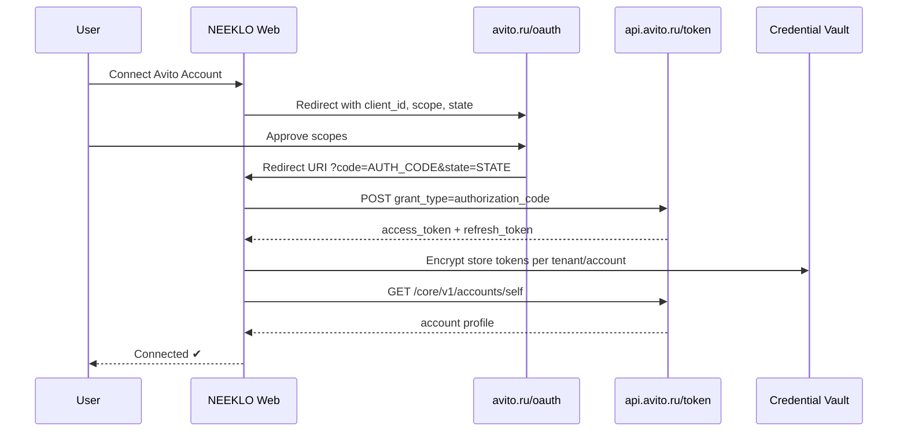

### 3.4. NEEKLO Credential Storage (planned — ADR Stage 4)

| Field | Storage | Encrypted | Notes |
| --- | --- | --- | --- |
| client_id | Tenant settings OR env (single-tenant deploy) | No | integrator.neeklo.ru uses env today |
| client_secret | Vault / env | **Yes** | Never expose to frontend |
| access_token | Redis cache + DB | Yes | TTL aligned with expires_in |
| refresh_token | DB vault | **Yes** | Only for authorization_code flow |
| scopes | DB | No | Audit which permissions granted |

### 3.5. Error codes (auth)

| HTTP | Meaning | NEEKLO UX |
| --- | --- | --- |
| 401 | Invalid credentials | «Проверьте Client ID / Secret» |
| 403 | Expired token | Auto-refresh or re-connect |
| 402 | Subscription required | «Требуется тариф Расширенный/Максимальный» |

---

## 4. Матрица возможностей

Легенда: ✔ = официальный API + реализуемо | 🟡 = частично / workaround | 🔴 = нет в API | ✔* = реализовано в NEEKLO |

| Feature | Avito API | API Exists | NEEKLO Status | Limitation | Comment |
| --- | --- | --- | --- | --- | --- |
| OAuth client_credentials | POST /token | ✔ | — | 24h token, no refresh | NEEKLO uses this today |
| OAuth authorization_code | POST /token + avito.ru/oauth | ✔ | — | App registration required | Multi-tenant roadmap |
| Refresh token | POST /token refresh_token | ✔ | — | 1 year refresh TTL | Not wired in NEEKLO yet |
| Profile / Self | GET /core/v1/accounts/self | ✔ | — | user:read scope for apps | ✔* implemented |
| Wallet balance | user API | ✔ | — | user_balance:read | Not in NEEKLO UI |
| Operation history | user API | ✔ | — | user_operations:read | Maps to Budget import |
| List items (REST CRUD) | item API | 🟡 | — | items:info — read/status/VAS, not full CRUD | Use Autoload for write |
| Create ad via REST | item API | 🔴 | — | Publication via Autoload feed | Local draft + export |
| Edit ad via REST | item API | 🟡 | — | Limited; category-dependent | Autoload preferred |
| Archive ad | item API | 🟡 | — | Via item status / autoload | NEEKLO domain event AdArchived |
| Apply VAS / promotion | promotion, items:apply_vas | ✔ | — | Paid services | Not implemented |
| Item statistics | POST /stats/v1/accounts/{id}/items | ✔ | — | stats:read, max 1000 items/request | ✔* implemented |
| Autoload upload | autoload/v4/* | ✔ | — | XML/feed based | 🔴 not implemented |
| Autoload reports | autoload reports | ✔ | — | autoload:reports scope | Feed status UI planned |
| Messenger list chats | GET messenger v2 | ✔ | — | Subscription required | 🟡 listConversations stub |
| Messenger read messages | GET messenger v3 | ✔ | — | messenger:read | 🟡 partial |
| Messenger send text | POST messenger v1 messages | ✔ | — | messenger:write | ✔* implemented |
| Messenger send image | uploadImages + postSendImageMessage | ✔ | — | messenger:write | Not implemented |
| Messenger voice | getVoiceFiles | ✔ | — | messenger:read | Not implemented |
| Messenger webhook | postWebhookV3 | ✔ | — | HTTPS callback URL | 🟡 verifySignature stub |
| Messenger blacklist | postBlacklistV2 | ✔ | — | messenger:write | Not in UI |
| Regional multi-city publish | — | 🔴 | — | No single API; duplicate via Autoload | Local draft batches |
| Competitor tracking | — | 🔴 | — | No official API | Separate module / manual |
| CPA / auction | cpa, auction APIs | ✔ | — | B2B vertical | Out of MVP scope |
| Job vacancies | job API | ✔ | — | job:* scopes | Separate vertical |
| STR (short rent) | str API | ✔ | — | short_term_rent:* | Category-specific |
| Delivery orders | order-management | ✔ | — | B2C sellers only | Not in scope |
| Ratings/reviews | ratings API | ✔ | — | Read/manage reviews | Future |
| CallTracking | calltracking API | ✔ | — | Phone analytics | Future |
| Realty analytics | realty-reports | ✔ | — | Real estate vertical | Future |
| Stock management | stock-management | ✔ | — | Quantity in listing | Autoload attrs |
| SBC discount broadcast | sbc-gateway beta | ✔ | — | Beta | Future |
| Sandbox (full) | — | 🔴 | — | Only delivery-sandbox exists | Use prod carefully |

---

## 5. User Flow: Account Connection

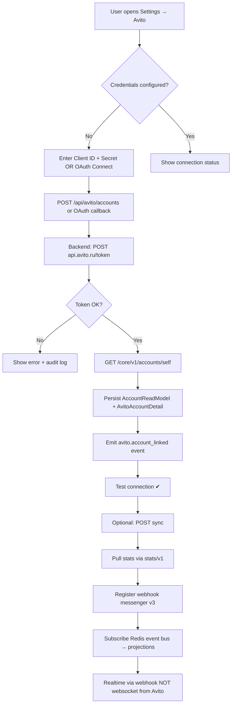

### 5.1. Refresh Token sub-flow (authorization_code only)

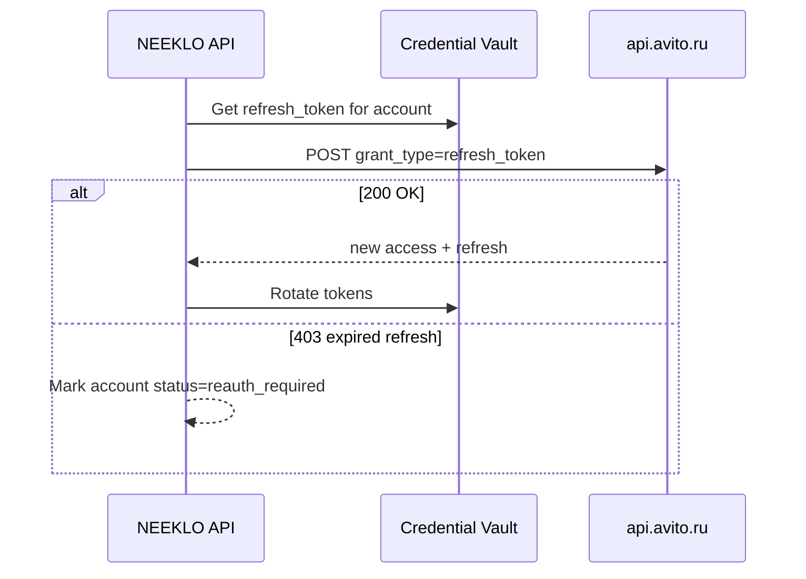

### 5.2. Realtime model (honest)

| Mechanism | Avito provides | NEEKLO implements |
| --- | --- | --- |
| Webhook push (messages) | ✔ Messenger v3 | POST /api/webhooks/avito (planned) |
| WebSocket from Avito | 🔴 No | — |
| Polling chats | ✔ API allowed | Fallback with rate limit respect |
| SSE to browser | N/A | NEEKLO internal SSE (Stage 0.8+) |

---

## 6. Settings Screen

**Route:** `/settings/avito` (new) or extend `/avito/accounts`
**NEEKLO API:** `/api/avito/*` + `/api/marketplace/accounts`

### 6.1. Layout sections

| Section | Fields | API Mapping |
| --- | --- | --- |
| General | Account name, marketplace=avito, active toggle | AccountReadModel |
| OAuth | Client ID, Client Secret (masked), Redirect URI (read-only) | Env / vault |
| Scopes | Checklist of granted scopes | OAuth token response.scope |
| Webhook | Webhook URL (generated), Secret, Subscribe button | postWebhookV3 |
| Tokens | Access expiry, Refresh expiry, Force refresh | Internal |
| Status | connected / degraded / reauth_required | health + plugin |
| Test connection | Button → health check | GET /core/v1/accounts/self |
| Sync history | Table from AvitoAccountDetail.syncHistory | avito.account_sync_* events |
| Error log | AuditLog filtered action=avito_* | Observability |
| Rate limits | Last X-RateLimit-* headers | Response interceptor |
| API logs | Request log (admin only) | TelemetrySpan |

### 6.2. UX Specification

- Client Secret: never show after save; rotate flow
- Redirect URI for integrator.neeklo.ru: `https://integrator.neeklo.ru/api/auth/os/callback`
- Warning banner if tariff insufficient (402 from messenger)
- Empty state links to https://www.avito.ru/professionals/api

### 6.3. Sequence: Test Connection

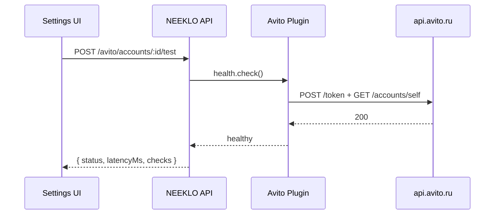

---

## 7. Ads Management

**Route:** `/ads` (existing Ads Workspace)

### 7.1. Data sources

| Source | When | API |
| --- | --- | --- |
| NEEKLO Event Store + AdReadModel | Primary list | /api/ads |
| Avito Item API | Enrich status/externalId | items:info (scope) |
| Autoload reports | Sync publish state | autoload:reports |

### 7.2. Feature matrix

| UI Feature | Official API | Implementation |
| --- | --- | --- |
| List + pagination | AdReadModel cursor | ✔* |
| Filters status/marketplace/region | Read model | ✔* |
| Search title | SearchIndexEntry | ✔* commerce search |
| Folders / Groups | — | NEEKLO AdGroupReadModel (local) |
| Tags / Labels | — | NEEKLO metadata (local) |
| Drafts | — | NEEKLO draft ads (local events) |
| Archive | item status / autoload | Domain AdArchived event |
| History | Event store | ListingHistoryEntry |
| Copy ad | — | Clone aggregate → new AdCreated |
| Bulk price change | autoload feed OR manual | NEEKLO bulk job → export XML |
| Bulk publish | autoload | 🔴 Feed Manager required |
| Bulk archive | autoload deactivate | 🔴 Feed Manager |

### 7.3. Use Cases

| ID | Actor | Flow | Edge Case |
| --- | --- | --- | --- |
| AD-01 | Manager | Filter active ads in Moscow | Empty → calm empty state |
| AD-02 | Manager | Bulk +10% price | Preview diff before apply |
| AD-03 | Owner | Export selected to Autoload XML | Invalid category → validation errors |
| AD-04 | System | Sync externalId from Avito | API 403 → show reauth |

---

## 8. Ad Editor

**Route:** `/ads?id={adId}` (Ads Workspace detail panel)

### 8.1. Single-page sections

| Block | Editable | Avito API | NEEKLO fallback |
| --- | --- | --- | --- |
| Photos | Yes | Autoload images / item | S3 MediaAsset |
| Video | Category-dependent | Autoload | URL reference |
| Title | Yes | Autoload field | Local + AI generator |
| Description | Yes | Autoload | Local + AI |
| Category / Subcategory | Yes | Autoload taxonomy | Static map + KB |
| Attributes | Yes | Autoload params | Category schema cache |
| Price | Yes | Autoload Price | AdReadModel |
| Address / City / Region | Yes | Autoload Address | Region IDs |
| Status | Read + actions | items:info | Projection |
| Views / Contacts | Read | stats/v1 | MetricSnapshot |
| Statistics chart | Read | stats:v1 daily | Analytics Center |
| Comments | — | 🔴 No API | — |
| History | Read | — | Event stream replay |
| AI suggestions | Yes | — | AiGateway + Intelligence |
| Competitors | Read | 🔴 No API | Manual / future module |

### 8.2. Publish action (honest UX)

```
[ Save locally ]  [ Export to Autoload XML ]  [ Queue feed upload ]

ℹ️ Прямая публикация через REST недоступна. Объявление будет отправлено через
   фид Автозагрузки после проверки формата.
```

---

## 9. Regional Publishing

### 9.1. Official capability

Avito **не предоставляет** единый API «опубликовать одно объявление в N регионов».
Региональность достигается через:

1. **Отдельные объявления** в Autoload feed с разными Address/Region
2. **Дублирование** item entries в XML

### 9.2. NEEKLO approach (current + planned)

| Step | Action | User sees |
| --- | --- | --- |
| 1 | Select source ad | Source title/price |
| 2 | AI localize per region | Preview localized title/price |
| 3 | Create RegionalDraftReadModel | Batch table |
| 4 | publishMode=draft | «Будет опубликовано через Autoload» |
| 5 | Export batch XML | Download + Feed Manager queue |

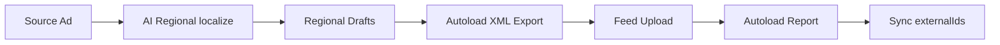

---

## 10. Autoload / Feed Manager

### 10.1. Official Autoload API (section `autoload`)

Operations in spec: **22**

| Method | Path | Summary |
| --- | --- | --- |
| GET | `/autoload/v1/profile` | Получение профиля пользователя автозагрузки (deprecated) |
| POST | `/autoload/v1/profile` | Создание/редактирование настроек профиля пользователя автозагрузки (deprecated) |
| POST | `/autoload/v1/upload` | Загрузка файла по ссылке |
| GET | `/autoload/v1/user-docs/node/{node_slug}/fields` | Получения полей категории |
| GET | `/autoload/v1/user-docs/tree` | Получение дерева категорий |
| GET | `/autoload/v2/items/ad_ids` | ID объявлений из файла |
| GET | `/autoload/v2/items/avito_ids` | ID объявлений на Авито |
| GET | `/autoload/v2/profile` | Получение профиля пользователя автозагрузки |
| POST | `/autoload/v2/profile` | Создание/редактирование настроек профиля пользователя автозагрузки |
| GET | `/autoload/v2/reports` | Список отчётов автозагрузки (deprecated) |
| GET | `/autoload/v2/reports/items` | Объявления по ID в автозагрузке (deprecated) |
| GET | `/autoload/v2/reports/last_completed_report` | Статистика по последней выгрузке (deprecated) |
| GET | `/autoload/v2/reports/{report_id}` | Статистика по конкретной выгрузке (deprecated) |
| GET | `/autoload/v2/reports/{report_id}/items` | Все объявления из конкретной выгрузки (deprecated) |
| GET | `/autoload/v2/reports/{report_id}/items/fees` | Списания за объявления в конкретной выгрузке (deprecated) |
| GET | `/autoload/v3/reports/last_completed_report` | Статистика по последней выгрузке (deprecated) |
| GET | `/autoload/v3/reports/{report_id}` | Статистика по конкретной выгрузке (deprecated) |
| GET | `/autoload/v4/uploads` | История загрузок |
| GET | `/autoload/v4/uploads/current` | Текущая загрузка |
| GET | `/autoload/v4/uploads/current/items` | Объявления текущей загрузки |
| GET | `/autoload/v4/uploads/last_successful` | Последняя успешно завершённая загрузка |
| GET | `/autoload/v4/uploads/last_successful/items` | Объявления последней успешно завершённой загрузки |

**Important:** v1/v2/v3 report endpoints deprecated → use **autoload/v4**

### 10.2. Feed Manager product spec

| Feature | Format | API | Status |
| --- | --- | --- | --- |
| Upload feed | XML (primary), CSV/JSON convert → XML | autoload upload | 🔴 |
| Schedule auto-update | Cron + diff | NEEKLO job engine | 🔴 |
| Upload history | — | autoload v4 uploads | 🔴 |
| Error report | — | autoload reports | 🔴 |
| Validation preview | — | Local XSD + Avito rules | 🔴 |
| Preview rendered ad | — | Local template | 🔴 |

### 10.3. Feed formats

| Format | Support | Notes |
| --- | --- | --- |
| XML | ✔ Primary | Avito Autoload native |
| CSV | 🟡 Import | Convert to XML internally |
| JSON | 🟡 Import | Convert to XML internally |

Support contact: supportautoload@avito.ru

---

## 11. Messenger / Inbox

### 11.1. Official Messenger endpoints

| Method | Path | operationId | Summary |
| --- | --- | --- | --- |
| POST | `/messenger/v1/accounts/{user_id}/chats/{chat_id}/messages` | `postSendMessage` | Отправка сообщения |
| POST | `/messenger/v1/accounts/{user_id}/chats/{chat_id}/messages/image` | `postSendImageMessage` | Отправка сообщения с изображением |
| POST | `/messenger/v1/accounts/{user_id}/chats/{chat_id}/messages/{message_id}` | `deleteMessage` | Удаление сообщения |
| POST | `/messenger/v1/accounts/{user_id}/chats/{chat_id}/read` | `chatRead` | Прочитать чат |
| GET | `/messenger/v1/accounts/{user_id}/getVoiceFiles` | `getVoiceFiles` | Получение голосовых сообщений |
| POST | `/messenger/v1/accounts/{user_id}/uploadImages` | `uploadImages` | Загрузка изображений |
| POST | `/messenger/v1/subscriptions` | `getSubscriptions` | Получение подписок (webhooks) |
| POST | `/messenger/v1/webhook/unsubscribe` | `postWebhookUnsubscribe` | Отключение уведомлений (webhooks) |
| POST | `/messenger/v2/accounts/{user_id}/blacklist` | `postBlacklistV2` | Добавление пользователя в blacklist |
| GET | `/messenger/v2/accounts/{user_id}/chats` | `getChatsV2` | Получение информации по чатам |
| GET | `/messenger/v2/accounts/{user_id}/chats/{chat_id}` | `getChatByIdV2` | Получение информации по чату |
| GET | `/messenger/v3/accounts/{user_id}/chats/{chat_id}/messages/` | `getMessagesV3` | Получение списка сообщений V3 |
| POST | `/messenger/v3/webhook` | `postWebhookV3` | Включение уведомлений V3 (webhooks) |

### 11.2. Inbox UI spec (3-column — existing /avito/inbox via /chats)

| Column | Content | API |
| --- | --- | --- |
| Left | Conversation list, filters unread/pinned | GET messenger v2 chats → commerce inbox |
| Center | Message thread | GET messenger v3 messages |
| Right | Customer 360, ad context, AI | commerce customers + ads |

### 11.3. Feature matrix

| Feature | API | Status |
| --- | --- | --- |
| Receive messages | webhook v3 + poll | 🟡 |
| Send text | POST v1 messages | ✔* |
| Send image | uploadImages | 🔴 |
| Attachments | API limited | 🔴 |
| Read receipts | chatRead | 🔴 |
| Blacklist | postBlacklistV2 | 🔴 |
| Voice messages | getVoiceFiles | 🔴 |
| AI Draft | — | ✔* AiGateway |
| AI Summary | — | ✔* |
| AI Agent auto-send | messenger:write | 🟡 confidence gate 0.7 |

### 11.4. Webhook sequence

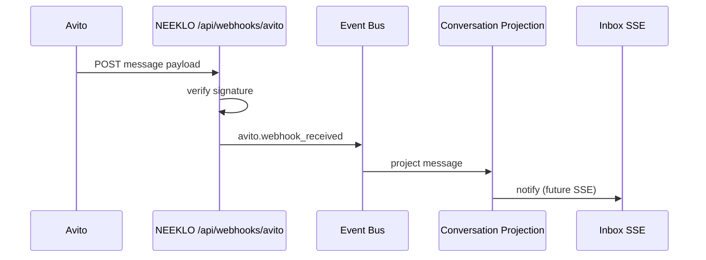

---

## 12. AI Agent

Uses **NEEKLO AI Platform** (Stage 0.5) — not Avito-native.
Avito API involvement: `messenger:write` for send only.

### 12.1. Settings

| Setting | Type | Default | Data source |
| --- | --- | --- | --- |
| enabled | boolean | false | Tenant aiSettings |
| workingHours | schedule | 09-21 | Tenant settings |
| maxDiscountPercent | number | 0 | Tenant policy |
| maxDialogTurns | number | 20 | Agent config |
| handoffToManager | boolean | true | Agent config |
| useKnowledgeBase | boolean | true | Avito KB service |
| useCustomerHistory | boolean | true | CustomerReadModel |
| useAdHistory | boolean | true | ListingHistory |
| useRegionalIntel | boolean | true | RegionalIntelligenceEngine |
| useForecast | boolean | true | ForecastEngine |
| useDecisionEngine | boolean | true | DecisionEngine |
| useMemory | boolean | true | AiMemory v2 |
| tone | enum | professional | Prompt registry |
| systemPromptId | uuid | — | PromptRegistry |
| strategy | enum | balanced | StrategyReadModel |

### 12.2. Safety gates

- Auto-send only if confidence ≥ 0.7 (existing SalesAgentService)
- Never auto-send outside workingHours
- Audit every AI send as event with correlationId
- Rate limit sends per Avito messenger limits

---

## 13. Notifications

| Channel | Avito API | NEEKLO | Status |
| --- | --- | --- | --- |
| Telegram | — | TELEGRAM_BOT_TOKEN | 🟡 config only |
| MAX | — | maxUserId field | 🟡 |
| Email | — | SMTP (future) | 🔴 |
| Web Push | — | browser API | 🔴 |

### Event triggers

| Event | Source | Default |
| --- | --- | --- |
| New message | webhook | ✔ on |
| New deal | NEEKLO deal event | ✔ on |
| API error | observability | ✔ on |
| Promotion ending | promotion API poll | 🟡 future |
| AI recommendation | RecommendationEngine | ✔ on |

---

## 14. Analytics

### 14.1. Official stats fields (stats/v1)

| Metric | API field | NEEKLO field |
| --- | --- | --- |
| Views | uniqViews | views |
| Contacts | uniqContacts | contacts |
| Favorites | uniqFavorites | favorites |
| CTR | derived | ctr (MetricsEngine) |
| ROI/ROAS | — | derived + budget import |
| CPA | — | MetricsEngine |

### 14.2. Granularity

| Period | API | UI |
| --- | --- | --- |
| Daily | periodGrouping=day | ✔ charts |
| Weekly | aggregate in NEEKLO | Intelligence warehouse |
| By region | RegionalIntelligenceEngine | /analytics/regional |
| By ad | itemIds[] | /avito/analytics/ads/:id |

---

## 15. Expenses / Budget

| Data | Official API | NEEKLO |
| --- | --- | --- |
| Wallet balance | user_balance:read | Future |
| Operations history | user_operations:read | Future auto-import |
| CPA spend | cpa API | Future |
| Promotion spend | promotion API | Future |
| Manual CSV import | — | ✔* BudgetImportReadModel |
| Excel import | — | 🟡 parse xlsx → CSV |

---

## 16. Media Studio

**Not Avito API** — NEEKLO AI + Selectel S3.

| Asset | Generation | Storage | Link to ad |
| --- | --- | --- | --- |
| Photo | AI image model via OpenRouter | S3 storageKey | MediaAssetReadModel |
| Banner | AI | S3 | entityType=ad |
| Infographic | AI | S3 | |
| Presentation PDF | AI + pdf lib | S3 | |

Publish to Avito: include URLs in Autoload XML image fields.

---

## 17. Competitors

### ⚠️ OFFICIAL STATUS: NO API

Avito Business API **не предоставляет** endpoints для:
- мониторинга чужих объявлений
- отслеживания цен конкурентов
- позиций в выдаче

### NEEKLO honest approach

| Approach | Compliance | Status |
| --- | --- | --- |
| Competitor Intelligence Engine (internal snapshots) | Only user-provided data | 🟡 scaffold |
| Manual competitor URL entry | User responsibility | Future |
| Third-party parsers | **Risk** — may violate ToS | **Not recommended** |
| UI scaffold /competitors | Shows «В разработке» | ✔ honest |

---

## 18. UI/UX + API Mapping per Screen

| Screen | Route | NEEKLO API | Avito API | Purpose |
| --- | --- | --- | --- | --- |
| Account Center | /avito/accounts | GET /api/avito/accounts | AvitoAccountDetailReadModel | Manage linked accounts, sync |
| Analytics Center | /avito/analytics | GET /api/avito/analytics/* | stats/v1 + MetricsWarehouse | Tabs: summary, ads, regional |
| Listing Generator | /avito/listing | POST /api/avito/listing/generate | AI pipeline 8 steps | Not direct Avito publish |
| Regional Publishing | /avito/regional | POST /api/avito/regional/publish | RegionalDraftReadModel | Draft + autoload export |
| Knowledge Base | /avito/knowledge | /api/avito/knowledge/* | S3 + chunks | RAG for agent |
| Notifications | /avito/notifications | /api/avito/notifications/* | NotificationChannelReadModel | Channel config |
| Inbox | /chats | /api/commerce/inbox/* | messenger + ConversationReadModel | 3-column workspace |
| Ads Workspace | /ads | /api/ads | AdReadModel + events | Virtual scroll list |
| Dashboard | / | aggregate APIs | multiple | Executive KPIs |
| Settings Avito | /settings/avito | NEW | vault + plugin | OAuth + webhooks |
| Feed Manager | /avito/feeds | NEW | autoload/v4 | Not built |
| Promotion Center | /avito/promotion | NEW | promotion API | Not built |

Each screen requires (before implementation):
- UI Specification (layout, states, empty/error/loading)
- UX Specification (flows, keyboard, a11y)
- API Mapping table
- Mermaid sequence diagram
- Use cases + edge cases

Detailed per-screen specs: see **Appendix D**.

---

## 19. NEEKLO Architecture Mapping

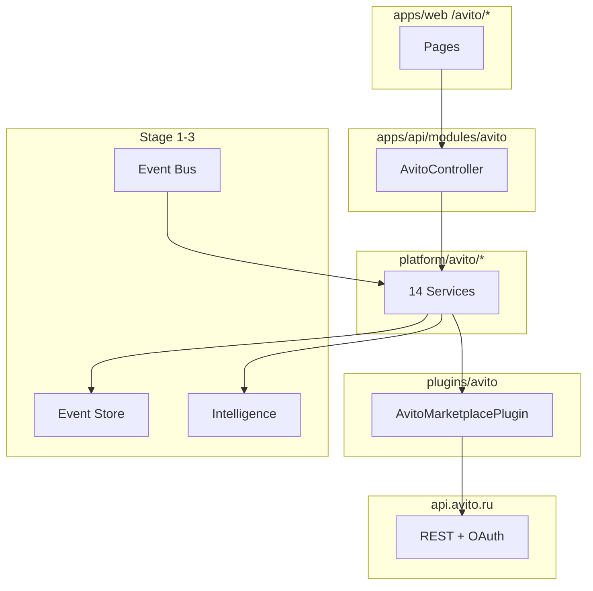

| Stage | Reuse for Avito |
| --- | --- |
| 0.1 Event Store | avito.* event catalog |
| 0.2 Marketplace SDK | Plugin capabilities |
| 0.3 Intelligence | Forecast, Regional, Recommendations |
| 0.4 Commerce | Inbox, Deals, Budget, Agent |
| 0.5 AI Platform | Listing Generator, Sales Agent |
| 0.6 Avito Enterprise | platform/avito/* |
| 0.7 Professional Workspace | Dashboard, Copilot, Command Palette |

---

## 20. Final Audit + Roadmap Avito Complete

### 20.1. Compliance audit

| Check | Result |
| --- | --- |
| Every feature mapped to official API or marked unavailable | ✔ |
| No fake REST publish | ✔ — Autoload path documented |
| Messenger tariff warning | ✔ |
| Competitors marked unavailable | ✔ |
| Webhook signature TODO flagged | ✔ — must implement before prod webhooks |
| Architecture reuses Stage 1-7 | ✔ |

### 20.2. Roadmap Avito Complete

| Phase | Feature | Status | Depends on |
| --- | --- | --- | --- |
| A1 | Fix TypeScript + build | 🟡 | — |
| A2 | OAuth authorization_code + vault | 🔴 | ADR Stage 4 |
| A3 | Webhook ingress + signature | 🔴 | HTTPS integrator.neeklo.ru |
| A4 | Messenger v2/v3 full (list/read) | 🟡 | Tariff |
| A5 | Autoload Feed Manager v4 | 🔴 | autoload API |
| A6 | Settings screen | 🔴 | A2 |
| A7 | Promotion Center | 🔴 | promotion API |
| A8 | Image messages | 🔴 | messenger API |
| A9 | Wallet/operations auto-sync | 🔴 | user API |
| A10 | Competitor module (manual) | 🔴 | No API |
| B1 | Account Center | ✔ | client_credentials |
| B2 | Stats sync | ✔ | stats:read |
| B3 | Send message | ✔ | messenger:write |
| B4 | Listing Generator AI | ✔ | AI platform |
| B5 | Regional drafts | ✔ | local |
| B6 | Inbox UI | ✔ | commerce |
| B7 | Analytics UI | ✔ | projections |
| B8 | KB + RAG | ✔ | S3 |
| B9 | Budget CSV import | ✔ | local |
| B10 | AI Agent reply | ✔ | gateway |

### 20.3. Production deployment (integrator.neeklo.ru)

| Item | Value |
| --- | --- |
| Server | root@212.67.9.173 |
| App path | /opt/neeklo-integrator |
| API port | 127.0.0.1:3022 |
| Webhook URL | https://integrator.neeklo.ru/api/webhooks/avito |
| OAuth callback | https://integrator.neeklo.ru/api/auth/os/callback |
| Demo login | owner@neeklo.dev (change in prod) |

---

## Appendix A: Full Endpoint Catalog

Total: **248** operations across **25** sections.

| # | Section | Method | Path | operationId | Summary | Deprecated |
| ---: | --- | --- | --- | --- | --- | --- |
| 1 | accounts-hierarchy | GET | `/checkAhUserV1` | `checkAhUserV1` | Получение информации о статусе пользователя в ИА | yes |
| 2 | accounts-hierarchy | GET | `/checkAhUserV2` | `checkAhUserV2` | Получение информации о статусе пользователя в ИА |  |
| 3 | accounts-hierarchy | GET | `/getAhInfoV1` | `getAhInfoV1` | Получение полной информации о статусе пользователя в ИА |  |
| 4 | accounts-hierarchy | GET | `/getEmployeesV1` | `getEmployeesV1` | Получение списка сотрудников иерархии |  |
| 5 | accounts-hierarchy | POST | `/linkItemsV1` | `linkItemsV1` | Прикрепление сотрудника иерархии к объявлениям, перезакрепление объявлений между сотрудниками иерархии |  |
| 6 | accounts-hierarchy | GET | `/listCompanyPhonesV1` | `listCompanyPhonesV1` | Получение списка телефонов компании |  |
| 7 | accounts-hierarchy | POST | `/listItemsByEmployeeIdV1` | `listItemsByEmployeeIdV1` | Получение списка объявлений по сотруднику |  |
| 8 | ads | GET | `/ads/v1/account/{accountID}` | `V1GetAccountByID` | Получить аккаунт по ID |  |
| 9 | ads | POST | `/ads/v1/account/{accountID}` | `V1CreateAccount` | Создать аккаунт в песочнице |  |
| 10 | ads | POST | `/ads/v1/account/{accountID}/add-user` | `V1AddUser` | Добавить пользователя в аккаунт |  |
| 11 | ads | POST | `/ads/v1/account/{accountID}/advertisers` | `V1GetAdvertisersList` | Получить список рекламодателей по фильтрам |  |
| 12 | ads | GET | `/ads/v1/account/{accountID}/balance` | `V1GetAccountBalanceByID` | Получить баланс аккаунта по ID |  |
| 13 | ads | POST | `/ads/v1/account/{accountID}/bonus-transfer` | `V1TransferBonus` | Перевод бонусов между аккаунтом родителем и дочерними на одном договоре |  |
| 14 | ads | POST | `/ads/v1/account/{accountID}/campaigns` | `V1GetCampaignsList` | Получить список кампаний по фильтрам |  |
| 15 | ads | POST | `/ads/v1/account/{accountID}/campaigns/{campaignID}/creatives/stats` | `V1GetCreativesStatistic` | Получить статистику по креативам кампании |  |
| 16 | ads | POST | `/ads/v1/account/{accountID}/campaigns/{campaignID}/groups/stats` | `V1GetGroupsStatistic` | Получить статистику по группам кампании |  |
| 17 | ads | POST | `/ads/v1/account/{accountID}/campaigns/{campaignID}/stats` | `V1GetCampaignStatistic` | Получить статистику по кампании |  |
| 18 | ads | GET | `/ads/v1/account/{accountID}/children` | `V1GetChildAccountsList` | Получить список дочерних аккаунтов |  |
| 19 | ads | GET | `/ads/v1/account/{accountID}/children-with-balances` | `V1GetChildAccountsWithBalancesList` | Получить список дочерних аккаунтов с балансами |  |
| 20 | ads | POST | `/ads/v1/account/{accountID}/contracts` | `V1GetContractsList` | Получить список договоров по фильтрам |  |
| 21 | ads | POST | `/ads/v1/account/{accountID}/create-advertiser` | `V1CreateAdvertiser` | Создать рекламодателя |  |
| 22 | ads | POST | `/ads/v1/account/{accountID}/create-contract` | `V1CreateContract` | Создание изначального договора |  |
| 23 | ads | POST | `/ads/v1/account/{accountID}/create-nonpayer-child-account` | `V1CreateNonPayerAccount` | Создание дочернего аккаунта на договоре родителя |  |
| 24 | ads | POST | `/ads/v1/account/{accountID}/creatives` | `V1GetCreativesList` | Получить список креативов по фильтрам |  |
| 25 | ads | DELETE | `/ads/v1/account/{accountID}/delete-user/{userID}` | `V1DeleteUser` | Удалить пользователя из аккаунта |  |
| 26 | ads | POST | `/ads/v1/account/{accountID}/funds-transfer` | `V1TransferFunds` | Перевод денег между аккаунтом родителем и дочерними на одном договоре |  |
| 27 | ads | POST | `/ads/v1/account/{accountID}/group/{groupID}/change-budget` | `V1ChangeBudget` | Изменить бюджет группы |  |
| 28 | ads | POST | `/ads/v1/account/{accountID}/group/{groupID}/change-price` | `V1ChangePrice` | Изменить цену группы |  |
| 29 | ads | POST | `/ads/v1/account/{accountID}/groups` | `V1GetGroupsList` | Получить список групп по фильтрам |  |
| 30 | ads | POST | `/ads/v1/account/{accountID}/set-user-role` | `V1SetUserRole` | Изменить роль пользователя в аккаунте |  |
| 31 | ads | GET | `/ads/v1/account/{accountID}/users` | `V1GetUsersListByAccount` | Получить список пользователей аккаунта |  |
| 32 | auction | GET | `/auction/1/bids` | `getUserBids` | Получение информации о действующих и доступных ставках |  |
| 33 | auction | POST | `/auction/1/bids` | `saveItemBids` | Сохранение новых ставок |  |
| 34 | auth | POST | `/token` | `getAccessToken` | Получение access token |  |
| 35 | auth | POST | `/token‎` | `getAccessTokenAuthorizationCode` | Получение access token |  |
| 36 | auth | POST | `/token‎‎` | `refreshAccessTokenAuthorizationCode` | Обновление access token |  |
| 37 | autoload | GET | `/autoload/v1/profile` | `getProfile` | Получение профиля пользователя автозагрузки (deprecated) | yes |
| 38 | autoload | POST | `/autoload/v1/profile` | `createOrUpdateProfile` | Создание/редактирование настроек профиля пользователя автозагрузки (deprecated) | yes |
| 39 | autoload | POST | `/autoload/v1/upload` | `upload` | Загрузка файла по ссылке |  |
| 40 | autoload | GET | `/autoload/v1/user-docs/node/{node_slug}/fields` | `userDocsNodeFields` | Получения полей категории |  |
| 41 | autoload | GET | `/autoload/v1/user-docs/tree` | `userDocsTree` | Получение дерева категорий |  |
| 42 | autoload | GET | `/autoload/v2/items/ad_ids` | `getAdIdsByAvitoIds` | ID объявлений из файла |  |
| 43 | autoload | GET | `/autoload/v2/items/avito_ids` | `getAvitoIdsByAdIds` | ID объявлений на Авито |  |
| 44 | autoload | GET | `/autoload/v2/profile` | `getProfileV2` | Получение профиля пользователя автозагрузки |  |
| 45 | autoload | POST | `/autoload/v2/profile` | `createOrUpdateProfileV2` | Создание/редактирование настроек профиля пользователя автозагрузки |  |
| 46 | autoload | GET | `/autoload/v2/reports` | `getReportsV2` | Список отчётов автозагрузки (deprecated) | yes |
| 47 | autoload | GET | `/autoload/v2/reports/items` | `getAutoloadItemsInfoV2` | Объявления по ID в автозагрузке (deprecated) | yes |
| 48 | autoload | GET | `/autoload/v2/reports/last_completed_report` | `getLastCompletedReport` | Статистика по последней выгрузке (deprecated) | yes |
| 49 | autoload | GET | `/autoload/v2/reports/{report_id}` | `getReportByIdV2` | Статистика по конкретной выгрузке (deprecated) | yes |
| 50 | autoload | GET | `/autoload/v2/reports/{report_id}/items` | `getReportItemsById` | Все объявления из конкретной выгрузки (deprecated) | yes |
| 51 | autoload | GET | `/autoload/v2/reports/{report_id}/items/fees` | `getReportItemsFeesById` | Списания за объявления в конкретной выгрузке (deprecated) | yes |
| 52 | autoload | GET | `/autoload/v3/reports/last_completed_report` | `getLastCompletedReportV3` | Статистика по последней выгрузке (deprecated) | yes |
| 53 | autoload | GET | `/autoload/v3/reports/{report_id}` | `getReportByIdV3` | Статистика по конкретной выгрузке (deprecated) | yes |
| 54 | autoload | GET | `/autoload/v4/uploads` | `getUploads` | История загрузок |  |
| 55 | autoload | GET | `/autoload/v4/uploads/current` | `getCurrentUpload` | Текущая загрузка |  |
| 56 | autoload | GET | `/autoload/v4/uploads/current/items` | `getCurrentUploadItems` | Объявления текущей загрузки |  |
| 57 | autoload | GET | `/autoload/v4/uploads/last_successful` | `getLastSuccessfulUpload` | Последняя успешно завершённая загрузка |  |
| 58 | autoload | GET | `/autoload/v4/uploads/last_successful/items` | `getLastSuccessfulUploadItems` | Объявления последней успешно завершённой загрузки |  |
| 59 | autostrategy | POST | `/autostrategy/v1/budget` | `getAutostrategyBudget` | Расчет бюджета кампании |  |
| 60 | autostrategy | POST | `/autostrategy/v1/campaign/create` | `createAutostrategyCampaign` | Создание новой кампании |  |
| 61 | autostrategy | POST | `/autostrategy/v1/campaign/edit` | `editAutostrategyCampaign` | Редактирование кампании |  |
| 62 | autostrategy | POST | `/autostrategy/v1/campaign/info` | `getAutostrategyCampaignInfo` | Получение полной информации о кампании |  |
| 63 | autostrategy | POST | `/autostrategy/v1/campaign/stop` | `stopAutostrategyCampaign` | Остановка кампании |  |
| 64 | autostrategy | POST | `/autostrategy/v1/campaigns` | `getAutostrategyCampaigns` | Получение списка кампаний |  |
| 65 | autostrategy | POST | `/autostrategy/v1/stat` | `getAutostrategyStat` | Получение статистики по кампании |  |
| 66 | autoteka | POST | `/autoteka/v1/catalogs/resolve` | `catalogsResolve` | Получение актуальных параметров Автокаталога
 |  |
| 67 | autoteka | POST | `/autoteka/v1/get-leads/` | `getLeads` | Получение событий сервиса Сигнал
 |  |
| 68 | autoteka | POST | `/autoteka/v1/monitoring/bucket/add` | `monitoringBucketAdd` | Добавить идентификаторы (vin/frame) на мониторинг
 |  |
| 69 | autoteka | POST | `/autoteka/v1/monitoring/bucket/delete` | `monitoringBucketDelete` | Полная очистка списка мониторинга
 |  |
| 70 | autoteka | POST | `/autoteka/v1/monitoring/bucket/remove` | `monitoringBucketRemove` | Удаление идентификаторов из мониторинга (vin/frame)
 |  |
| 71 | autoteka | GET | `/autoteka/v1/monitoring/get-reg-actions/` | `monitoringGetRegActions` | Получение событий мониторинга
 |  |
| 72 | autoteka | GET | `/autoteka/v1/packages/active_package` | `getActivePackage` | Запрос остатка отчётов пользователя
 |  |
| 73 | autoteka | POST | `/autoteka/v1/previews` | `postPreviewByVin` | Превью по VIN или номеру кузова
 |  |
| 74 | autoteka | GET | `/autoteka/v1/previews/{previewId}` | `getPreview` | Получение превью по его ID
 |  |
| 75 | autoteka | POST | `/autoteka/v1/reports` | `postReport` | Отчет по превью
 |  |
| 76 | autoteka | POST | `/autoteka/v1/reports-by-vehicle-id` | `postReportByVehicleId` | Отчет по идентификатору авто (vin/frame)
 |  |
| 77 | autoteka | GET | `/autoteka/v1/reports/list/` | `getReportList` | Получение списка отчётов
 |  |
| 78 | autoteka | GET | `/autoteka/v1/reports/{report_id}` | `getReport` | Получение отчета по его ID
 |  |
| 79 | autoteka | POST | `/autoteka/v1/request-preview-by-external-item` | `postPreviewByExternalItem` | Превью по ID объявления другой площадки
 |  |
| 80 | autoteka | POST | `/autoteka/v1/request-preview-by-item-id` | `postPreviewByItemId` | Превью по ID объявления Авито |  |
| 81 | autoteka | POST | `/autoteka/v1/request-preview-by-regnumber` | `postPreviewByRegNumber` | Превью по государственному номеру
 |  |
| 82 | autoteka | POST | `/autoteka/v1/scoring/by-vehicle-id` | `scoringByVehicleId` | Скоринг рисков по идентификатору авто (vin/frame)
 |  |
| 83 | autoteka | GET | `/autoteka/v1/scoring/{scoring_id}` | `scoringGetById` | Получение скоринга рисков по его ID
 |  |
| 84 | autoteka | POST | `/autoteka/v1/specifications/by-plate-number` | `specificationByPlateNumber` | Запрос характеристик по регистрационному номеру
 |  |
| 85 | autoteka | POST | `/autoteka/v1/specifications/by-vehicle-id` | `specificationByVehicleId` | Запрос характеристик по идентификатору авто (vin/frame)
 |  |
| 86 | autoteka | GET | `/autoteka/v1/specifications/specification/{specificationID}` | `specificationGetById` | Получение характеристик по ID запроса
 |  |
| 87 | autoteka | POST | `/autoteka/v1/sync/create-by-regnumber` | `postSyncCreateReportByRegNumber` | Синхронное создание отчета по ГРЗ
 |  |
| 88 | autoteka | POST | `/autoteka/v1/sync/create-by-vin` | `postSyncCreateReportByVin` | Синхронное создание отчёта по VIN или номеру кузова
 |  |
| 89 | autoteka | POST | `/autoteka/v1/teasers` | `postTeaser` | Тизер по идентификатору авто (vin/frame)
 |  |
| 90 | autoteka | GET | `/autoteka/v1/teasers/{teaser_id}` | `getTeaser` | Получение тизера по ID тизера
 |  |
| 91 | autoteka | POST | `/autoteka/v1/valuation/by-specification` | `valuationBySpecification` | Получение оценки по параметрам
 |  |
| 92 | autoteka | POST | `/token` | `getAccessToken` | Получение access token
 |  |
| 93 | avito-promo | POST | `/agency/balance` | `agencyBalance` | Перевод средств на счёт клиента |  |
| 94 | avito-promo | GET | `/agency/transactions` | `agencyTransactions` | Получение списка незавершённых транзакций |  |
| 95 | avito-promo | GET | `/agency/transactions/{transaction_id}` | `agencyTransaction` | Получение информации о транзакции |  |
| 96 | avito-promo | POST | `/api/1/agency/clients` | `agencyClients` | Получение списка клиентов |  |
| 97 | avito-promo | POST | `/api/1/agency/clients/target/create` | `agencyClientsTargetCreate` | Создание задачи на проверку ИНН клиентов |  |
| 98 | avito-promo | POST | `/api/1/agency/clients/target/result` | `agencyClientsTargetResult` | Получение результата проверки ИНН клиентов |  |
| 99 | avito-promo | GET | `/api/1/agency/finances/balance` | `agencyFinancesBalance` | Получение баланса агентства |  |
| 100 | avito-promo | POST | `/api/1/agency/finances/transactionsHistory` | `agencyFinancesTransactionsHistory` | Получение всех операций с балансом агентства |  |
| 101 | avito-promo | POST | `/api/1/agency/users/invite/send` | `agencyUsersInviteSend` | Отправка приглашения нового клиента |  |
| 102 | avito-promo | POST | `/api/1/agency/users/invite/status` | `agencyUsersInviteStatus` | Получение статуса приглашения нового клиента |  |
| 103 | avito-promo | POST | `/api/1/agency/users/verificationStatus` | `agencyUsersVerificationStatus` | Получение статуса верификации нового клиента |  |
| 104 | avito-promo | POST | `/stats/v2/accounts/{user_id}/items` | `statsAccountsItems` | Получение статистических показателей клиента |  |
| 105 | avito-promo | POST | `/stats/v2/accounts/{user_id}/spendings` | `statsAccountsSpendings` | Получение статистики расходов клиента |  |
| 106 | calltracking | POST | `/calltracking/v1/getCallById/` | `get_call_by_id` | Звонок по идентификатору |  |
| 107 | calltracking | POST | `/calltracking/v1/getCalls/` | `get_calls` | Звонки по времени |  |
| 108 | calltracking | GET | `/calltracking/v1/getRecordByCallId/` | `get_record_by_call_id` | Получение аудиозаписи звонка по идентификатору |  |
| 109 | cpa | GET | `/cpa/v1/call/{call_id}` | `getCall` | Запись звонка (deprecated) | yes |
| 110 | cpa | GET | `/cpa/v1/chatByActionId/{actionId}` | `chatByActionId` | Чат |  |
| 111 | cpa | POST | `/cpa/v1/chatsByTime` | `chatsByTime` | Чаты по времени (deprecated) |  |
| 112 | cpa | POST | `/cpa/v1/createComplaint` | `postCreateComplaint` | Создание жалобы для звонков |  |
| 113 | cpa | POST | `/cpa/v1/createComplaintByActionId` | `createComplaintByActionId` | Создание жалобы для звонков/чатов |  |
| 114 | cpa | POST | `/cpa/v1/phonesInfoFromChats` | `phonesInfoFromChats` | Информация по номерам телефонов из целевых чатов |  |
| 115 | cpa | POST | `/cpa/v2/balanceInfo` | `balanceInfoV2` | Баланс (deprecated) | yes |
| 116 | cpa | POST | `/cpa/v2/callById` | `getCallByIdV2` | Звонок | yes |
| 117 | cpa | POST | `/cpa/v2/callsByTime` | `getCallsByTimeV2` | Звонки по времени |  |
| 118 | cpa | POST | `/cpa/v2/chatsByTime` | `chatsByTime` | Чаты по времени |  |
| 119 | cpa | POST | `/cpa/v3/balanceInfo` | `balanceInfoV3` | Баланс |  |
| 120 | cpxpromo | GET | `/cpxpromo/1/getBids/{itemId}` | `getBids` | Получение детализированной информации о действующих и доступных ценах за целевые действия и бюджетах |  |
| 121 | cpxpromo | POST | `/cpxpromo/1/getPromotionsByItemIds` | `getPromotionsByItemIds` | Получение текущих цен за целевое действие и бюджетов по нескольким объявлениям |  |
| 122 | cpxpromo | POST | `/cpxpromo/1/remove` | `removePromotion` | Остановка продвижения |  |
| 123 | cpxpromo | POST | `/cpxpromo/1/setAuto` | `saveAutoBid` | Применение автоматической настройки |  |
| 124 | cpxpromo | POST | `/cpxpromo/1/setManual` | `saveManualBid` | Применение ручной настройки |  |
| 125 | delivery-sandbox | POST | `/cancelAnnouncement` | `CancelAnnouncement3PL` | Отмена анонса в СД |  |
| 126 | delivery-sandbox | POST | `/createAnnouncement` | `CreateAnnouncement3PL` | Создание анонса в СД |  |
| 127 | delivery-sandbox | POST | `/createParcel` | `createParcel` | Создание посылки |  |
| 128 | delivery-sandbox | POST | `/delivery-sandbox/announcements/create` | `CreateAnnouncement` | Создание анонса в Avito |  |
| 129 | delivery-sandbox | POST | `/delivery-sandbox/announcements/track` | `TrackAnnouncement` | Трекинг анонсов |  |
| 130 | delivery-sandbox | POST | `/delivery-sandbox/areas/custom-schedule` | `customAreaSchedule` | Установка графика работы на определённый день |  |
| 131 | delivery-sandbox | POST | `/delivery-sandbox/cancelParcel` | `cancelParcel` | Отмена посылки |  |
| 132 | delivery-sandbox | POST | `/delivery-sandbox/order/checkConfirmationCode` | `checkConfirmationCode` | Проверка кода подтверждения |  |
| 133 | delivery-sandbox | POST | `/delivery-sandbox/order/properties` | `setOrderProperties` | Добавление / изменение параметров доставки посылки |  |
| 134 | delivery-sandbox | POST | `/delivery-sandbox/order/realAddress` | `setOrderRealAddress` | Фактический адрес приёма / возврата посылки |  |
| 135 | delivery-sandbox | POST | `/delivery-sandbox/order/tracking` | `tracking` | Трекинг |  |
| 136 | delivery-sandbox | POST | `/delivery-sandbox/prohibitOrderAcceptance` | `prohibitOrderAcceptance` | Запрет приёма посылки от отправителя |  |
| 137 | delivery-sandbox | GET | `/delivery-sandbox/sorting-center` | `GetSortingCenter` | Получить список сортировочных центров |  |
| 138 | delivery-sandbox | POST | `/delivery-sandbox/tariffs/sorting-center` | `AddSortingCenter` | Загрузить сортировочные центры |  |
| 139 | delivery-sandbox | POST | `/delivery-sandbox/tariffs/{tariff_id}/areas` | `AddAreasSandbox` | Загрузить области доставки |  |
| 140 | delivery-sandbox | POST | `/delivery-sandbox/tariffs/{tariff_id}/tagged-sorting-centers` | `AddTagsToSortingCenter` | Установка тэгов своим и/или чужим сортировочным центрам |  |
| 141 | delivery-sandbox | POST | `/delivery-sandbox/tariffs/{tariff_id}/terminals` | `AddTerminalsSandbox` | Загрузить терминалы |  |
| 142 | delivery-sandbox | POST | `/delivery-sandbox/tariffs/{tariff_id}/terms` | `UpdateTerms` | Обновить сроки по тарифу |  |
| 143 | delivery-sandbox | POST | `/delivery-sandbox/tariffsV2` | `AddTariffSandboxV2` | Загрузить новый тариф v2 |  |
| 144 | delivery-sandbox | GET | `/delivery-sandbox/tasks/{task_id}` | `GetTask` | Получение информации по задаче |  |
| 145 | delivery-sandbox | POST | `/delivery-sandbox/v1/cancelAnnouncement` | `v1cancelAnnouncement` | Отправка события об отмене тестового анонса |  |
| 146 | delivery-sandbox | POST | `/delivery-sandbox/v1/cancelParcel` | `v1CancelParcel` | Отмена тестовой посылки |  |
| 147 | delivery-sandbox | POST | `/delivery-sandbox/v1/changeParcel` | `v1changeParcel` | Создание заявки на изменение данных тестовой посылки |  |
| 148 | delivery-sandbox | POST | `/delivery-sandbox/v1/createAnnouncement` | `v1createAnnouncement` | Создание тестового анонса |  |
| 149 | delivery-sandbox | POST | `/delivery-sandbox/v1/getAnnouncementEvent` | `v1getAnnouncementEvent` | Получение последнего события тестового анонса |  |
| 150 | delivery-sandbox | POST | `/delivery-sandbox/v1/getChangeParcelInfo` | `v1getChangeParcelInfo` | Получение информации об изменении тестовой посылки |  |
| 151 | delivery-sandbox | POST | `/delivery-sandbox/v1/getParcelInfo` | `v1getParcelInfo` | Получение информации о тестовой посылке |  |
| 152 | delivery-sandbox | POST | `/delivery-sandbox/v1/getRegisteredParcelID` | `v1getRegisteredParcelID` | Получение ID зарегистрированной тестовой посылки |  |
| 153 | delivery-sandbox | POST | `/delivery-sandbox/v2/createParcel` | `CreateSandboxParcelV2` | Создание тестовой посылки |  |
| 154 | delivery-sandbox | POST | `/delivery/order/changeParcelResult` | `ChangeParcelResult` | Отправка результата исполнения заявки |  |
| 155 | delivery-sandbox | POST | `/sandbox/changeParcels` | `ChangeParcels` | Обновление свойств посылок |  |
| 156 | item | POST | `/core/v1/accounts/{userId}/vas/prices` | `vasPrices` | Получение информации о стоимости услуг продвижения и доступных значках |  |
| 157 | item | POST | `/core/v1/accounts/{user_id}/calls/stats/` | `postCallsStats` | Получение статистики по звонкам |  |
| 158 | item | GET | `/core/v1/accounts/{user_id}/items/{item_id}/` | `getItemInfo` | Получение информации по объявлению |  |
| 159 | item | PUT | `/core/v1/accounts/{user_id}/items/{item_id}/vas` | `putItemVas` | Применение дополнительных услуг |  |
| 160 | item | GET | `/core/v1/items` | `getItemsInfo` | Получение информации по объявлениям |  |
| 161 | item | POST | `/core/v1/items/{item_id}/update_price` | `updatePrice` | Обновление цены объявления
 |  |
| 162 | item | PUT | `/core/v2/accounts/{user_id}/items/{item_id}/vas_packages` | `putItemVasPackageV2` | Применение пакета дополнительных услуг |  |
| 163 | item | PUT | `/core/v2/items/{itemId}/vas/` | `applyVas` | Применение услуг продвижения |  |
| 164 | item | POST | `/stats/v1/accounts/{user_id}/items` | `itemStatsShallow` | Получение статистики по списку объявлений |  |
| 165 | item | POST | `/stats/v2/accounts/{user_id}/items` | `itemAnalytics` | Получение статистических показателей по профилю |  |
| 166 | item | POST | `/stats/v2/accounts/{user_id}/spendings` | `accountSpendings` | Получение статистики расходов профиля |  |
| 167 | job | POST | `/job/v1/applications/apply_actions` | `applicationsApplyActions` | Батчевая смена статуса откликов
 |  |
| 168 | job | POST | `/job/v1/applications/get_by_ids` | `applicationsGetByIds` | Получение списка откликов
 |  |
| 169 | job | GET | `/job/v1/applications/get_ids` | `applicationsGetIds` | Получение идентификаторов откликов
 |  |
| 170 | job | GET | `/job/v1/applications/get_states` | `applicationsGetStates` | Получение списка возможных статусов откликов
 |  |
| 171 | job | POST | `/job/v1/applications/set_is_viewed` | `applicationsSetIsViewed` | Изменение статуса отклика
 |  |
| 172 | job | DELETE | `/job/v1/applications/webhook` | `applicationsWebhookDelete` | Отключение уведомлений по откликам (webhook)
 |  |
| 173 | job | GET | `/job/v1/applications/webhook` | `applicationsWebhookGet` | Получение информации о подписках (webhook)
 |  |
| 174 | job | PUT | `/job/v1/applications/webhook` | `applicationsWebhookPut` | Включение уведомлений по откликам (webhook)
 |  |
| 175 | job | GET | `/job/v1/applications/webhooks` | `applicationsWebhooksGet` | Получение списка подписок (webhook)
 |  |
| 176 | job | GET | `/job/v1/resumes/` | `resumesGet` | Поиск резюме
 |  |
| 177 | job | GET | `/job/v1/resumes/{resume_id}/contacts/` | `resumeGetContacts` | Доступ к контактным данным соискателя
 |  |
| 178 | job | POST | `/job/v1/vacancies` | `vacancyCreate` | Публикация вакансии |  |
| 179 | job | PUT | `/job/v1/vacancies/archived/{vacancy_id}` | `vacancyArchive` | Остановка публикации вакансии |  |
| 180 | job | PUT | `/job/v1/vacancies/{vacancy_id}` | `vacancyUpdate` | Редактирование вакансии |  |
| 181 | job | POST | `/job/v1/vacancies/{vacancy_id}/prolongate` | `vacancyProlongate` | Реактивация вакансии |  |
| 182 | job | GET | `/job/v2/resumes/{resume_id}` | `resumeGetItem` | Просмотр данных резюме
 |  |
| 183 | job | GET | `/job/v2/vacancies` | `searchVacancy` | Поиск вакансий
 |  |
| 184 | job | POST | `/job/v2/vacancies` | `vacancyCreateV2` | Публикация вакансии v2 |  |
| 185 | job | POST | `/job/v2/vacancies/batch` | `vacanciesGetByIds` | Просмотр данных вакансий
 |  |
| 186 | job | POST | `/job/v2/vacancies/statuses` | `vacancyGetStatuses` | Получение статуса публикации вакансий V2 |  |
| 187 | job | POST | `/job/v2/vacancies/update/{vacancy_uuid}` | `vacancyUpdateV2` | Редактирование вакансии v2 |  |
| 188 | job | GET | `/job/v2/vacancies/{vacancy_id}` | `vacancyGetItem` | Просмотр данных вакансии
 |  |
| 189 | job | PUT | `/job/v2/vacancies/{vacancy_uuid}/auto_renewal` | `vacancyAutoRenewal` | Автопродление вакансии v2 |  |
| 190 | job | GET | `/job/v2/vacancy/dict` | `getDicts` | Получение списка доступных словарей |  |
| 191 | job | GET | `/job/v2/vacancy/dict/{dictionary_id}` | `getDictByID` | Получение доступных значений списка по ID словаря |  |
| 192 | messenger | POST | `/messenger/v1/accounts/{user_id}/chats/{chat_id}/messages` | `postSendMessage` | Отправка сообщения |  |
| 193 | messenger | POST | `/messenger/v1/accounts/{user_id}/chats/{chat_id}/messages/image` | `postSendImageMessage` | Отправка сообщения с изображением |  |
| 194 | messenger | POST | `/messenger/v1/accounts/{user_id}/chats/{chat_id}/messages/{message_id}` | `deleteMessage` | Удаление сообщения |  |
| 195 | messenger | POST | `/messenger/v1/accounts/{user_id}/chats/{chat_id}/read` | `chatRead` | Прочитать чат |  |
| 196 | messenger | GET | `/messenger/v1/accounts/{user_id}/getVoiceFiles` | `getVoiceFiles` | Получение голосовых сообщений |  |
| 197 | messenger | POST | `/messenger/v1/accounts/{user_id}/uploadImages` | `uploadImages` | Загрузка изображений |  |
| 198 | messenger | POST | `/messenger/v1/subscriptions` | `getSubscriptions` | Получение подписок (webhooks) |  |
| 199 | messenger | POST | `/messenger/v1/webhook/unsubscribe` | `postWebhookUnsubscribe` | Отключение уведомлений (webhooks) |  |
| 200 | messenger | POST | `/messenger/v2/accounts/{user_id}/blacklist` | `postBlacklistV2` | Добавление пользователя в blacklist |  |
| 201 | messenger | GET | `/messenger/v2/accounts/{user_id}/chats` | `getChatsV2` | Получение информации по чатам |  |
| 202 | messenger | GET | `/messenger/v2/accounts/{user_id}/chats/{chat_id}` | `getChatByIdV2` | Получение информации по чату |  |
| 203 | messenger | GET | `/messenger/v3/accounts/{user_id}/chats/{chat_id}/messages/` | `getMessagesV3` | Получение списка сообщений V3 |  |
| 204 | messenger | POST | `/messenger/v3/webhook` | `postWebhookV3` | Включение уведомлений V3 (webhooks) |  |
| 205 | order-management | POST | `/order-management/1/markings` | `markings` | Передача честного знака |  |
| 206 | order-management | POST | `/order-management/1/order/acceptReturnOrder` | `acceptReturnOrder` | Выбор отделения отделения Почты России для получения возврата |  |
| 207 | order-management | POST | `/order-management/1/order/applyTransition` | `applyTransition` | Изменение статуса заказа |  |
| 208 | order-management | POST | `/order-management/1/order/checkConfirmationCode` | `checkConfirmationCode` | Метод для проверки кода подтверждения заказа. |  |
| 209 | order-management | POST | `/order-management/1/order/cncSetDetails` | `cncSetDetails` | Метод для подготовки заказа с самовывозом |  |
| 210 | order-management | GET | `/order-management/1/order/getCourierDeliveryRange` | `getCourierDeliveryRange` | Метод получения доступных временных промежутков приезда курьера |  |
| 211 | order-management | POST | `/order-management/1/order/setCourierDeliveryRange` | `setCourierDeliveryRange` | Метод выбора определённого доступного временного промежутка для приезда курьера |  |
| 212 | order-management | POST | `/order-management/1/order/setTrackingNumber` | `setOrderTrackingNumber` | Передача трек-номера |  |
| 213 | order-management | GET | `/order-management/1/orders` | `getOrders` | Получение информации о заказах |  |
| 214 | order-management | POST | `/order-management/1/orders/labels` | `generateLabels` | Создать задачу на генерацию этикеток (до 100). |  |
| 215 | order-management | POST | `/order-management/1/orders/labels/extended` | `generateLabelsExtended` | Создать задачу на генерацию этикеток (до 1000). |  |
| 216 | order-management | GET | `/order-management/1/orders/labels/{taskID}/download` | `downloadLabel` | Скачать сгенерированный PDF-файл (этикетку). |  |
| 217 | promotion | POST | `/promotion/v1/items/services/bbip/forecasts/get` | `get_bbip_forecasts_by_items_v1` | BBIP. Прогноз продвижения |  |
| 218 | promotion | PUT | `/promotion/v1/items/services/bbip/orders/create` | `create_bbip_order_for_items_v1` | BBIP. Подключение услуги продвижения |  |
| 219 | promotion | POST | `/promotion/v1/items/services/bbip/suggests/get` | `get_bbip_suggests_by_items_v1` | BBIP. Варианты бюджета продвижения |  |
| 220 | promotion | POST | `/promotion/v1/items/services/dict` | `get_dict_of_services_v1` | Словарь типов услуг продвижения |  |
| 221 | promotion | POST | `/promotion/v1/items/services/get` | `get_services_by_items_v1` | Список услуг продвижения |  |
| 222 | promotion | POST | `/promotion/v1/items/services/orders/get` | `list_orders_by_user_v1` | Список заявок |  |
| 223 | promotion | POST | `/promotion/v1/items/services/orders/status` | `get_order_status_v1` | Статус заявки |  |
| 224 | ratings | POST | `/ratings/v1/answers` | `createReviewAnswerV1` | Отправка ответа на отзыв |  |
| 225 | ratings | DELETE | `/ratings/v1/answers/{answer_id}` | `removeReviewAnswerV1` | Запрос на удаление ответа на отзыв |  |
| 226 | ratings | GET | `/ratings/v1/info` | `getRatingsInfoV1` | Получение информации о рейтинге пользователя |  |
| 227 | ratings | GET | `/ratings/v1/reviews` | `getReviewsV1` | Получение списка активных отзывов на пользователя с пагинацией |  |
| 228 | realty-reports | GET | `/realty/v1/marketPriceCorrespondence/{itemId}/{price}` | `market_price_correspondence_v1` | Получение соответствия переданной цены рыночной цене |  |
| 229 | realty-reports | POST | `/realty/v1/report/create/{itemId}` | `CreateReportForClassified` | Получение аналитического отчета по недвижимости |  |
| 230 | sbc-gateway | POST | `/special-offers/v1/available` | `openApiAvailable` | Получение информации об объявлениях |  |
| 231 | sbc-gateway | POST | `/special-offers/v1/multiConfirm` | `openApiMultiConfirm` | Отправка и оплата рассылки |  |
| 232 | sbc-gateway | POST | `/special-offers/v1/multiCreate` | `openApiMultiCreate` | Создание рассылки |  |
| 233 | sbc-gateway | POST | `/special-offers/v1/stats` | `openApiStats` | Получение статистики |  |
| 234 | sbc-gateway | POST | `/special-offers/v1/tariffInfo` | `openApiTariffInfo` | Получение информации о тарифе |  |
| 235 | stock-management | POST | `/stock-management/1/info` | `` | Получение остатков |  |
| 236 | stock-management | PUT | `/stock-management/1/stocks` | `` | Редактирование остатков |  |
| 237 | str | POST | `/core/v1/accounts/{user_id}/items/{item_id}/bookings` | `putBookingsInfo` | Заполнение календаря занятости объекта недвижимости |  |
| 238 | str | GET | `/realty/v1/accounts/{user_id}/items/{item_id}/bookings` | `getRealtyBookings` | Получение списка броней по объявлению
 |  |
| 239 | str | POST | `/realty/v1/accounts/{user_id}/items/{item_id}/prices` | `postRealtyPrices` | Актуализация параметров для выбранных периодов
 |  |
| 240 | str | POST | `/realty/v1/items/intervals` | `putIntervals` | Заполнение доступности объекта недвижимости с квотами и без |  |
| 241 | str | POST | `/realty/v1/items/{item_id}/base` | `postBaseParams` | Установка базовых параметров
 |  |
| 242 | tariff | GET | `/tariff/info/1` | `getTariffInfo` | Информация по тарифу |  |
| 243 | trxpromo | POST | `/trx-promo/1/apply` | `api_trx_promo_open_api_apply` | Запуск продвижения |  |
| 244 | trxpromo | POST | `/trx-promo/1/cancel` | `api_trx_promo_open_api_cancel` | Остановка продвижения |  |
| 245 | trxpromo | GET | `/trx-promo/1/commissions` | `api_trx_promo_open_api_commissions` | Проверка доступности продвижения и размера комиссий |  |
| 246 | user | POST | `/core/v1/accounts/operations_history/` | `postOperationsHistory` | Получение истории операций пользователя |  |
| 247 | user | GET | `/core/v1/accounts/self` | `getUserInfoSelf` | Получение информации об авторизованном пользователе |  |
| 248 | user | GET | `/core/v1/accounts/{user_id}/balance/` | `getUserBalance` | Получение баланса кошелька пользователя |  |

---

## Appendix B: OAuth Scopes

| Scope | Description | Required for |
| --- | --- | --- |
| `ah:access` | Взаимодействие с иерархией аккаунтов | See capability matrix |
| `cpa-auction:bids` | Управление ставками | See capability matrix |
| `autoload:reports` | Получение отчетов Автозагрузки | See capability matrix |
| `items:apply_vas` | Применение дополнительных услуг | See capability matrix |
| `items:info` | Получение информации об объявлениях | See capability matrix |
| `job:applications` | Получение информации об откликах на вакансии | See capability matrix |
| `job:cv` | Получение информации резюме | See capability matrix |
| `job:vacancy` | Получение информации о вакансиях | See capability matrix |
| `job:write` | Изменение объявлений вертикали Работа | See capability matrix |
| `messenger:read` | Чтение сообщений в мессенджере Авито | See capability matrix |
| `messenger:write` | Модифицирование сообщений в мессенджере Авито | See capability matrix |
| `short_term_rent:read` | Получение информации об объявлениях краткосрочной аренды | See capability matrix |
| `short_term_rent:write` | Изменение объявлений краткосрочной аренды | See capability matrix |
| `stats:read` | Получение статистики объявлений | See capability matrix |
| `user:read` | Получение информации о пользователе | See capability matrix |
| `user_balance:read` | Получение баланса пользователя | See capability matrix |
| `user_operations:read` | Получение истории операций пользователя | See capability matrix |
| `cpxpromo:edit` | Редактирование цен за целевые действия | See capability matrix |
| `cpxpromo:read` | Получение цен за целевые действия | See capability matrix |
| `items:apply_bbip` | Применение услуг продвижения BBIP | See capability matrix |
| `ratings:read` | Получение отзывов | See capability matrix |
| `ratings:write` | Отправка ответа на отзыв | See capability matrix |
| `special_offers:sending` | Маркетинговые рассылки | See capability matrix |
| `trx:apply` | применение продвижения за комиссию | See capability matrix |
| `trx:cancel` | отмена продвижения за комиссию | See capability matrix |
| `trx:commission` | получение настроек продвижения за комиссию | See capability matrix |

---

## Appendix C: Errors & Rate Limits

### Standard HTTP errors (Avito API)

| Code | Meaning | Action |
| --- | --- | --- |
| 400 | Bad request / validation | Show field errors |
| 401 | Unauthorized | Refresh token or reauth |
| 402 | Payment required / subscription | Show tariff upgrade CTA |
| 403 | Forbidden / expired token | Reauth |
| 404 | Not found | Check path version (v1 vs v2) |
| 429 | Rate limited | Backoff using X-RateLimit-Remaining |
| 500 | Server error | Retry with exponential backoff |

### Rate limit headers (when present)

| Header | Description |
| --- | --- |
| X-RateLimit-Limit | Requests per minute |
| X-RateLimit-Remaining | Remaining in window |

---

## Appendix D: Screen Specifications

### D.1. Account Center

- **Route:** `/avito/accounts`
- **NEEKLO API:** `GET /api/avito/accounts`
- **Avito grounding:** AvitoAccountDetailReadModel
- **Purpose:** Manage linked accounts, sync

#### UI States

| State | Behavior |
| --- | --- |
| Loading | Skeleton matching page layout |
| Empty | Calm empty state with next action CTA |
| Error | ApiError code + retry button |
| Degraded | Avito not configured — local-only mode banner |

#### Edge Cases

- 402 subscription: block messenger actions, show tariff info
- Token expired mid-session: silent refresh or redirect to settings
- Rate limit 429: queue job, notify user

---

### D.2. Analytics Center

- **Route:** `/avito/analytics`
- **NEEKLO API:** `GET /api/avito/analytics/*`
- **Avito grounding:** stats/v1 + MetricsWarehouse
- **Purpose:** Tabs: summary, ads, regional

#### UI States

| State | Behavior |
| --- | --- |
| Loading | Skeleton matching page layout |
| Empty | Calm empty state with next action CTA |
| Error | ApiError code + retry button |
| Degraded | Avito not configured — local-only mode banner |

#### Edge Cases

- 402 subscription: block messenger actions, show tariff info
- Token expired mid-session: silent refresh or redirect to settings
- Rate limit 429: queue job, notify user

---

### D.3. Listing Generator

- **Route:** `/avito/listing`
- **NEEKLO API:** `POST /api/avito/listing/generate`
- **Avito grounding:** AI pipeline 8 steps
- **Purpose:** Not direct Avito publish

#### UI States

| State | Behavior |
| --- | --- |
| Loading | Skeleton matching page layout |
| Empty | Calm empty state with next action CTA |
| Error | ApiError code + retry button |
| Degraded | Avito not configured — local-only mode banner |

#### Edge Cases

- 402 subscription: block messenger actions, show tariff info
- Token expired mid-session: silent refresh or redirect to settings
- Rate limit 429: queue job, notify user

---

### D.4. Regional Publishing

- **Route:** `/avito/regional`
- **NEEKLO API:** `POST /api/avito/regional/publish`
- **Avito grounding:** RegionalDraftReadModel
- **Purpose:** Draft + autoload export

#### UI States

| State | Behavior |
| --- | --- |
| Loading | Skeleton matching page layout |
| Empty | Calm empty state with next action CTA |
| Error | ApiError code + retry button |
| Degraded | Avito not configured — local-only mode banner |

#### Edge Cases

- 402 subscription: block messenger actions, show tariff info
- Token expired mid-session: silent refresh or redirect to settings
- Rate limit 429: queue job, notify user

---

### D.5. Knowledge Base

- **Route:** `/avito/knowledge`
- **NEEKLO API:** `/api/avito/knowledge/*`
- **Avito grounding:** S3 + chunks
- **Purpose:** RAG for agent

#### UI States

| State | Behavior |
| --- | --- |
| Loading | Skeleton matching page layout |
| Empty | Calm empty state with next action CTA |
| Error | ApiError code + retry button |
| Degraded | Avito not configured — local-only mode banner |

#### Edge Cases

- 402 subscription: block messenger actions, show tariff info
- Token expired mid-session: silent refresh or redirect to settings
- Rate limit 429: queue job, notify user

---

### D.6. Notifications

- **Route:** `/avito/notifications`
- **NEEKLO API:** `/api/avito/notifications/*`
- **Avito grounding:** NotificationChannelReadModel
- **Purpose:** Channel config

#### UI States

| State | Behavior |
| --- | --- |
| Loading | Skeleton matching page layout |
| Empty | Calm empty state with next action CTA |
| Error | ApiError code + retry button |
| Degraded | Avito not configured — local-only mode banner |

#### Edge Cases

- 402 subscription: block messenger actions, show tariff info
- Token expired mid-session: silent refresh or redirect to settings
- Rate limit 429: queue job, notify user

---

### D.7. Inbox

- **Route:** `/chats`
- **NEEKLO API:** `/api/commerce/inbox/*`
- **Avito grounding:** messenger + ConversationReadModel
- **Purpose:** 3-column workspace

#### UI States

| State | Behavior |
| --- | --- |
| Loading | Skeleton matching page layout |
| Empty | Calm empty state with next action CTA |
| Error | ApiError code + retry button |
| Degraded | Avito not configured — local-only mode banner |

#### Edge Cases

- 402 subscription: block messenger actions, show tariff info
- Token expired mid-session: silent refresh or redirect to settings
- Rate limit 429: queue job, notify user

---

### D.8. Ads Workspace

- **Route:** `/ads`
- **NEEKLO API:** `/api/ads`
- **Avito grounding:** AdReadModel + events
- **Purpose:** Virtual scroll list

#### UI States

| State | Behavior |
| --- | --- |
| Loading | Skeleton matching page layout |
| Empty | Calm empty state with next action CTA |
| Error | ApiError code + retry button |
| Degraded | Avito not configured — local-only mode banner |

#### Edge Cases

- 402 subscription: block messenger actions, show tariff info
- Token expired mid-session: silent refresh or redirect to settings
- Rate limit 429: queue job, notify user

---

### D.9. Dashboard

- **Route:** `/`
- **NEEKLO API:** `aggregate APIs`
- **Avito grounding:** multiple
- **Purpose:** Executive KPIs

#### UI States

| State | Behavior |
| --- | --- |
| Loading | Skeleton matching page layout |
| Empty | Calm empty state with next action CTA |
| Error | ApiError code + retry button |
| Degraded | Avito not configured — local-only mode banner |

#### Edge Cases

- 402 subscription: block messenger actions, show tariff info
- Token expired mid-session: silent refresh or redirect to settings
- Rate limit 429: queue job, notify user

---

### D.10. Settings Avito

- **Route:** `/settings/avito`
- **NEEKLO API:** `NEW`
- **Avito grounding:** vault + plugin
- **Purpose:** OAuth + webhooks

#### UI States

| State | Behavior |
| --- | --- |
| Loading | Skeleton matching page layout |
| Empty | Calm empty state with next action CTA |
| Error | ApiError code + retry button |
| Degraded | Avito not configured — local-only mode banner |

#### Edge Cases

- 402 subscription: block messenger actions, show tariff info
- Token expired mid-session: silent refresh or redirect to settings
- Rate limit 429: queue job, notify user

---

### D.11. Feed Manager

- **Route:** `/avito/feeds`
- **NEEKLO API:** `NEW`
- **Avito grounding:** autoload/v4
- **Purpose:** Not built

#### UI States

| State | Behavior |
| --- | --- |
| Loading | Skeleton matching page layout |
| Empty | Calm empty state with next action CTA |
| Error | ApiError code + retry button |
| Degraded | Avito not configured — local-only mode banner |

#### Edge Cases

- 402 subscription: block messenger actions, show tariff info
- Token expired mid-session: silent refresh or redirect to settings
- Rate limit 429: queue job, notify user

---

### D.12. Promotion Center

- **Route:** `/avito/promotion`
- **NEEKLO API:** `NEW`
- **Avito grounding:** promotion API
- **Purpose:** Not built

#### UI States

| State | Behavior |
| --- | --- |
| Loading | Skeleton matching page layout |
| Empty | Calm empty state with next action CTA |
| Error | ApiError code + retry button |
| Degraded | Avito not configured — local-only mode banner |

#### Edge Cases

- 402 subscription: block messenger actions, show tariff info
- Token expired mid-session: silent refresh or redirect to settings
- Rate limit 429: queue job, notify user

---


---

## Appendix E: Extended UI/UX Specifications

> Полные спецификации экранов для команды реализации Release Avito Complete.

### E.1 Account Center

| Property | Value |
| --- | --- |
| Route | `/avito/accounts` |
| NEEKLO API | /api/avito/accounts, POST /api/avito/accounts/:id/sync |
| Avito API | GET /core/v1/accounts/self, sync orchestrator |
| Layout | PageHeader + table of accounts + detail drawer |
| Components | `AccountTable`, `SyncStatusBadge`, `SyncHistoryTimeline`, `ConnectButton` |

#### Use Cases

- UC-ACC-01: Owner views all linked Avito accounts for tenant
- UC-ACC-02: Manager triggers manual sync for one account
- UC-ACC-03: System shows last sync error with correlationId
- UC-ACC-04: User connects new account via OAuth (future)

#### Edge Cases

- Avito credentials missing → degraded mode banner
- Sync returns limited → explain autoload not configured
- Multiple accounts → company key vs employee key warning

#### Sequence Diagram

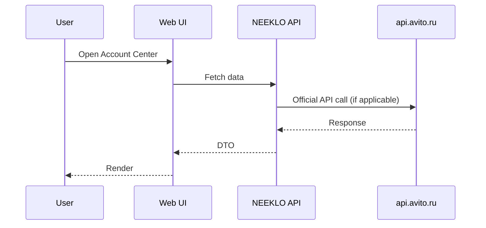

#### UI States Table

| State | Visual | Action |
| --- | --- | --- |
| loading | Skeleton | — |
| empty | Icon + hint + CTA | Primary action |
| error | Inline alert | Retry |
| degraded | Yellow banner | Link to Settings |
| success | Data view | — |

#### Accessibility

- Keyboard navigation for tables and dialogs
- Focus trap in modals
- aria-live for new messages (inbox)
- Color contrast per oklch design tokens

---

### E.2 Analytics Center

| Property | Value |
| --- | --- |
| Route | `/avito/analytics` |
| NEEKLO API | GET /api/avito/analytics/summary, /ads/:id, /regional |
| Avito API | POST /stats/v1/accounts/{user_id}/items |
| Layout | Tabs: Overview \| Ads \| Regional + Recharts |
| Components | `SummaryCards`, `AdStatsChart`, `RegionalTable`, `PeriodPicker` |

#### Use Cases

- UC-ANA-01: View daily views/contacts/favorites for date range
- UC-ANA-02: Compare ads by CTR
- UC-ANA-03: Drill into single ad stats

#### Edge Cases

- itemIds batch > limit → chunk requests
- No externalId on ad → show local metrics only
- stats:read scope missing → permission error

#### Sequence Diagram

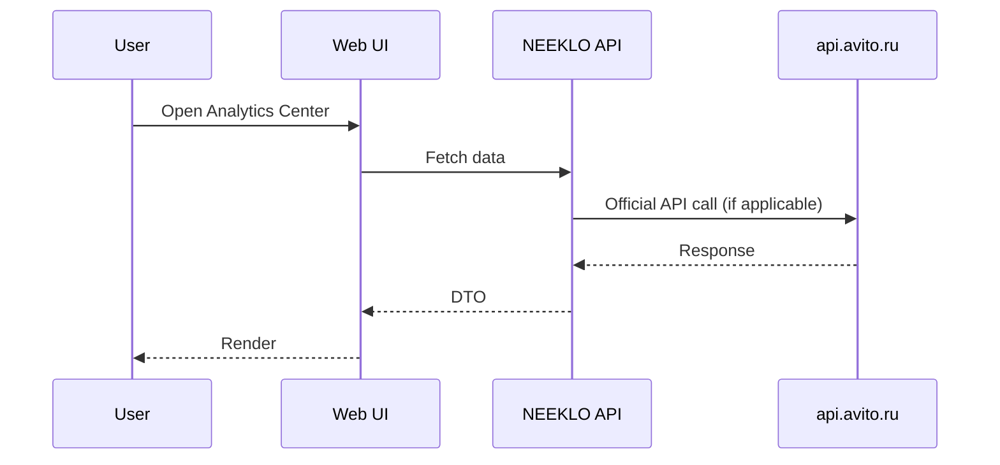

#### UI States Table

| State | Visual | Action |
| --- | --- | --- |
| loading | Skeleton | — |
| empty | Icon + hint + CTA | Primary action |
| error | Inline alert | Retry |
| degraded | Yellow banner | Link to Settings |
| success | Data view | — |

#### Accessibility

- Keyboard navigation for tables and dialogs
- Focus trap in modals
- aria-live for new messages (inbox)
- Color contrast per oklch design tokens

---

### E.3 Listing Generator

| Property | Value |
| --- | --- |
| Route | `/avito/listing` |
| NEEKLO API | POST /api/avito/listing/generate, GET pipelines |
| Avito API | None direct — output → Autoload XML |
| Layout | Input panel + 8-step pipeline stepper + output preview |
| Components | `ProductInput`, `PipelineStepper`, `QualityScore`, `ExportButton` |

#### Use Cases

- UC-LST-01: Enter product description → run AI pipeline
- UC-LST-02: Review each step output before final
- UC-LST-03: Save as local ad draft
- UC-LST-04: Export to Autoload feed

#### Edge Cases

- OpenRouter unavailable → step fails gracefully
- Rate limit on AI → queue job
- Category unknown → prompt user to select

#### Sequence Diagram

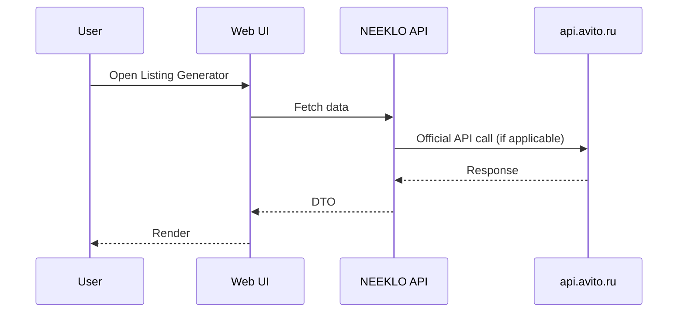

#### UI States Table

| State | Visual | Action |
| --- | --- | --- |
| loading | Skeleton | — |
| empty | Icon + hint + CTA | Primary action |
| error | Inline alert | Retry |
| degraded | Yellow banner | Link to Settings |
| success | Data view | — |

#### Accessibility

- Keyboard navigation for tables and dialogs
- Focus trap in modals
- aria-live for new messages (inbox)
- Color contrast per oklch design tokens

---

### E.4 Regional Publishing

| Property | Value |
| --- | --- |
| Route | `/avito/regional` |
| NEEKLO API | POST /api/avito/regional/publish, GET drafts |
| Avito API | Autoload multi-item feed (no single regional API) |
| Layout | Source ad picker + region multi-select + batch preview table |
| Components | `RegionPicker`, `DraftBatchTable`, `PublishModeSelector`, `ExportXml` |

#### Use Cases

- UC-REG-01: Select source ad and target regions
- UC-REG-02: AI generates localized title/price per region
- UC-REG-03: User reviews batch before export
- UC-REG-04: Export Autoload XML for upload

#### Edge Cases

- User expects one-click publish → show honest modal about Autoload
- 100+ regions → async job + progress

#### Sequence Diagram

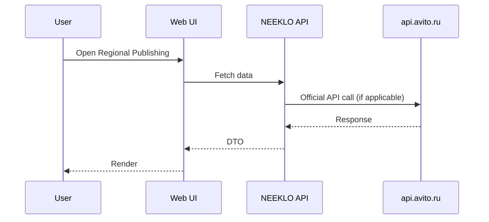

#### UI States Table

| State | Visual | Action |
| --- | --- | --- |
| loading | Skeleton | — |
| empty | Icon + hint + CTA | Primary action |
| error | Inline alert | Retry |
| degraded | Yellow banner | Link to Settings |
| success | Data view | — |

#### Accessibility

- Keyboard navigation for tables and dialogs
- Focus trap in modals
- aria-live for new messages (inbox)
- Color contrast per oklch design tokens

---

### E.5 Knowledge Base

| Property | Value |
| --- | --- |
| Route | `/avito/knowledge` |
| NEEKLO API | GET/POST /api/avito/knowledge, search |
| Avito API | None — NEEKLO S3 storage |
| Layout | Document list + upload dropzone + search |
| Components | `DocTable`, `UploadZone`, `CategoryFilter`, `ChunkIndicator` |

#### Use Cases

- UC-KB-01: Upload PDF/DOCX policy document
- UC-KB-02: Search chunks for Sales Agent RAG
- UC-KB-03: Re-index document after edit

#### Edge Cases

- Large file → size limit + S3 multipart
- No embeddings yet → keyword search fallback

#### Sequence Diagram

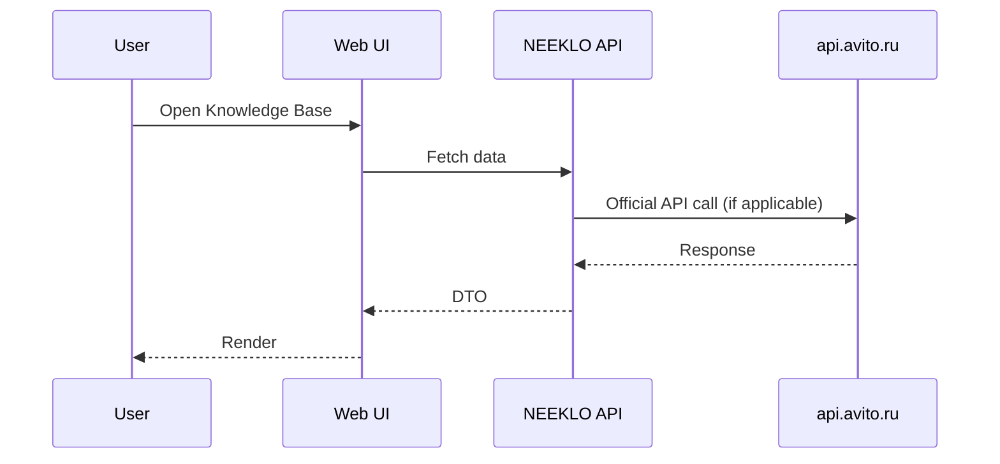

#### UI States Table

| State | Visual | Action |
| --- | --- | --- |
| loading | Skeleton | — |
| empty | Icon + hint + CTA | Primary action |
| error | Inline alert | Retry |
| degraded | Yellow banner | Link to Settings |
| success | Data view | — |

#### Accessibility

- Keyboard navigation for tables and dialogs
- Focus trap in modals
- aria-live for new messages (inbox)
- Color contrast per oklch design tokens

---

### E.6 Unified Inbox

| Property | Value |
| --- | --- |
| Route | `/chats` |
| NEEKLO API | /api/commerce/inbox/*, POST /api/avito/agent/reply |
| Avito API | messenger v2 chats, v3 messages, v1 send |
| Layout | 3-column: list \| thread \| context panel |
| Components | `ConversationList`, `MessageThread`, `Customer360`, `AiDraftBar` |

#### Use Cases

- UC-INB-01: List unread conversations sorted by lastMessageAt
- UC-INB-02: Send reply to customer
- UC-INB-03: AI draft → edit → send
- UC-INB-04: Pin conversation
- UC-INB-05: AI agent auto-reply with confidence gate

#### Edge Cases

- 402 messenger tariff → block send, show upgrade
- Webhook delay → show polling indicator
- Mobile → stack columns, drawer for context

#### Sequence Diagram

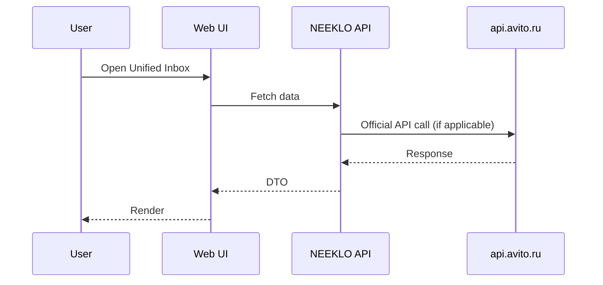

#### UI States Table

| State | Visual | Action |
| --- | --- | --- |
| loading | Skeleton | — |
| empty | Icon + hint + CTA | Primary action |
| error | Inline alert | Retry |
| degraded | Yellow banner | Link to Settings |
| success | Data view | — |

#### Accessibility

- Keyboard navigation for tables and dialogs
- Focus trap in modals
- aria-live for new messages (inbox)
- Color contrast per oklch design tokens

---

### E.7 Ads Workspace

| Property | Value |
| --- | --- |
| Route | `/ads` |
| NEEKLO API | /api/ads, /api/ads/:id |
| Avito API | items:info (enrichment), autoload (publish) |
| Layout | Virtual list + detail studio panel |
| Components | `VirtualAdList`, `AdStudioPanel`, `FilterBar`, `BulkActionBar` |

#### Use Cases

- UC-ADS-01: Scroll 10k+ ads with virtual list
- UC-ADS-02: Change price → AdPriceChanged event
- UC-ADS-03: Archive ad
- UC-ADS-04: Open in Listing Generator

#### Edge Cases

- Optimistic update failure → rollback + toast
- externalId missing → badge «Не синхронизировано»

#### Sequence Diagram

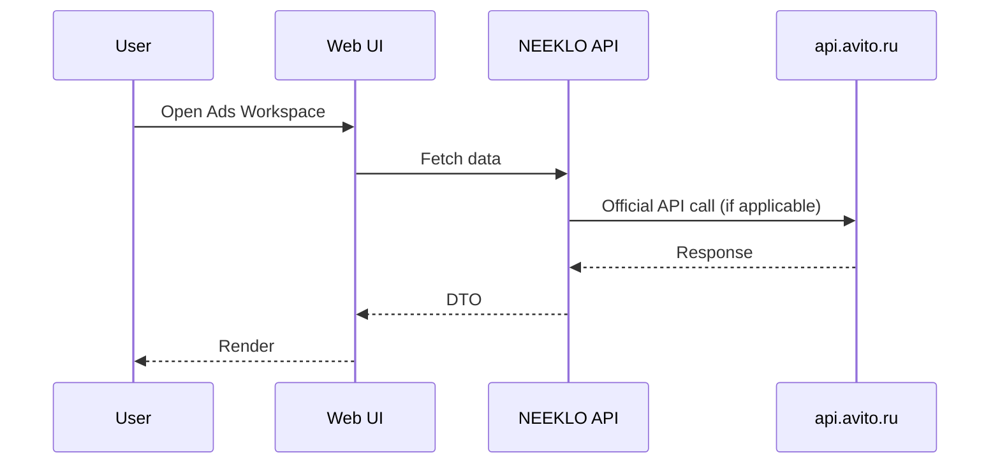

#### UI States Table

| State | Visual | Action |
| --- | --- | --- |
| loading | Skeleton | — |
| empty | Icon + hint + CTA | Primary action |
| error | Inline alert | Retry |
| degraded | Yellow banner | Link to Settings |
| success | Data view | — |

#### Accessibility

- Keyboard navigation for tables and dialogs
- Focus trap in modals
- aria-live for new messages (inbox)
- Color contrast per oklch design tokens

---

### E.8 Avito Settings

| Property | Value |
| --- | --- |
| Route | `/settings/avito` |
| NEEKLO API | NEW: /api/avito/settings, /api/avito/oauth/* |
| Avito API | POST /token, postWebhookV3 |
| Layout | Sectioned form with status sidebar |
| Components | `CredentialForm`, `WebhookConfig`, `ScopeChecklist`, `TestConnection`, `ApiLogTable` |

#### Use Cases

- UC-SET-01: Configure client_credentials
- UC-SET-02: Complete OAuth for multi-user app
- UC-SET-03: Register webhook URL
- UC-SET-04: Test connection
- UC-SET-05: View API error log

#### Edge Cases

- Secret rotation → invalidate cached token
- Webhook URL must be HTTPS

#### Sequence Diagram


#### UI States Table

| State | Visual | Action |
| --- | --- | --- |
| loading | Skeleton | — |
| empty | Icon + hint + CTA | Primary action |
| error | Inline alert | Retry |
| degraded | Yellow banner | Link to Settings |
| success | Data view | — |

#### Accessibility

- Keyboard navigation for tables and dialogs
- Focus trap in modals
- aria-live for new messages (inbox)
- Color contrast per oklch design tokens

---

### E.9 Feed Manager

| Property | Value |
| --- | --- |
| Route | `/avito/feeds` |
| NEEKLO API | NEW: /api/avito/autoload/* |
| Avito API | autoload/v4/uploads, reports |
| Layout | Feed list + upload wizard + report viewer |
| Components | `FeedList`, `UploadWizard`, `ValidationReport`, `ScheduleCron` |

#### Use Cases

- UC-FED-01: Upload XML feed
- UC-FED-02: View upload report errors
- UC-FED-03: Schedule recurring sync
- UC-FED-04: Preview XML before upload

#### Edge Cases

- Invalid XML schema → line-level errors
- Partial success in report → highlight failed items

#### Sequence Diagram

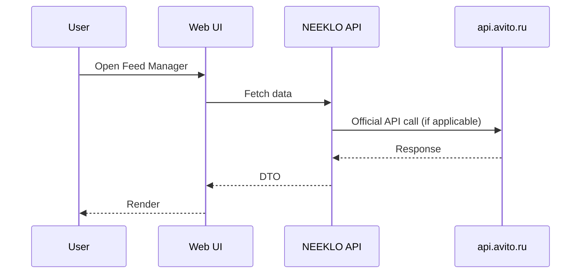

#### UI States Table

| State | Visual | Action |
| --- | --- | --- |
| loading | Skeleton | — |
| empty | Icon + hint + CTA | Primary action |
| error | Inline alert | Retry |
| degraded | Yellow banner | Link to Settings |
| success | Data view | — |

#### Accessibility

- Keyboard navigation for tables and dialogs
- Focus trap in modals
- aria-live for new messages (inbox)
- Color contrast per oklch design tokens

---

### E.10 Promotion Center

| Property | Value |
| --- | --- |
| Route | `/avito/promotion` |
| NEEKLO API | NEW: /api/avito/promotion/* |
| Avito API | promotion, cpxpromo, trxpromo APIs |
| Layout | Ad selector + VAS catalog + apply confirmation |
| Components | `VasCatalog`, `ApplyVasModal`, `PromotionHistory` |

#### Use Cases

- UC-PRO-01: List available VAS for item
- UC-PRO-02: Apply XL/Premium to ad
- UC-PRO-03: View promotion spend

#### Edge Cases

- items:apply_vas scope required
- Insufficient balance → user_balance API

#### Sequence Diagram

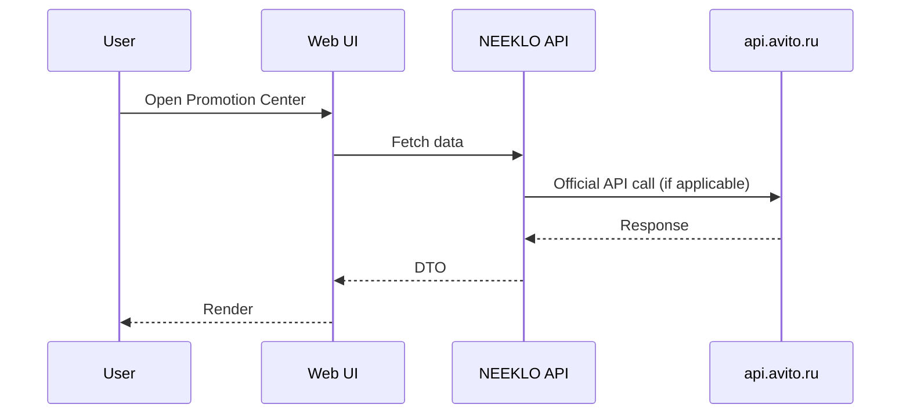

#### UI States Table

| State | Visual | Action |
| --- | --- | --- |
| loading | Skeleton | — |
| empty | Icon + hint + CTA | Primary action |
| error | Inline alert | Retry |
| degraded | Yellow banner | Link to Settings |
| success | Data view | — |

#### Accessibility

- Keyboard navigation for tables and dialogs
- Focus trap in modals
- aria-live for new messages (inbox)
- Color contrast per oklch design tokens

---

### E.11 AI Cost / Agent Settings

| Property | Value |
| --- | --- |
| Route | `/ai/assistant, /ai/cost` |
| NEEKLO API | /api/ai/*, /api/avito/agent/reply |
| Avito API | messenger:write only for send |
| Layout | Agent toggles + cost charts |
| Components | `AgentToggle`, `WorkingHours`, `MaxDiscount`, `CostChart` |

#### Use Cases

- UC-AI-01: Enable/disable sales agent per tenant
- UC-AI-02: Configure handoff rules
- UC-AI-03: Monitor AI spend

#### Edge Cases

- Agent sends during off-hours → queue for morning
- Discount exceeds max → require manager approval

#### Sequence Diagram

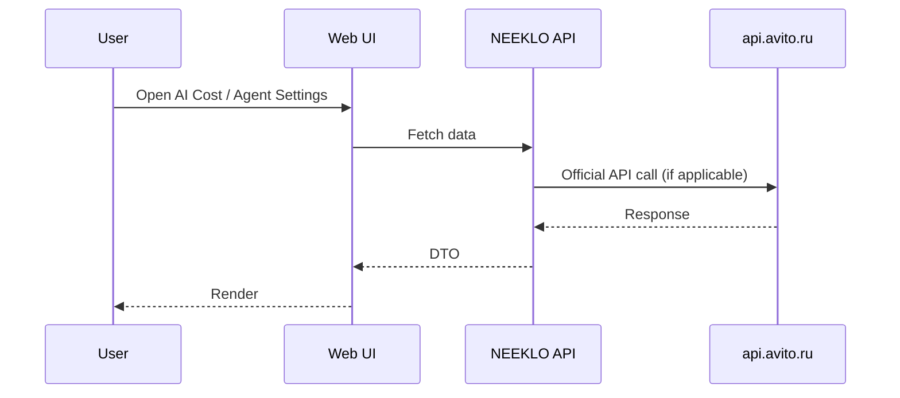

#### UI States Table

| State | Visual | Action |
| --- | --- | --- |
| loading | Skeleton | — |
| empty | Icon + hint + CTA | Primary action |
| error | Inline alert | Retry |
| degraded | Yellow banner | Link to Settings |
| success | Data view | — |

#### Accessibility

- Keyboard navigation for tables and dialogs
- Focus trap in modals
- aria-live for new messages (inbox)
- Color contrast per oklch design tokens

---

### E.12 Budget / Expenses

| Property | Value |
| --- | --- |
| Route | `/budget` |
| NEEKLO API | /api/commerce/budget, /api/avito/budget/import |
| Avito API | user_operations (future), manual CSV |
| Layout | Summary cards + import + region breakdown |
| Components | `BudgetSummary`, `ImportCsv`, `RegionBreakdown` |

#### Use Cases

- UC-BUD-01: Import CSV expenses
- UC-BUD-02: View ROI/ROAS from MetricsEngine
- UC-BUD-03: Auto-sync wallet operations (future)

#### Edge Cases

- Duplicate import rows → idempotent by hash
- Missing Avito spend data → manual only label

#### Sequence Diagram

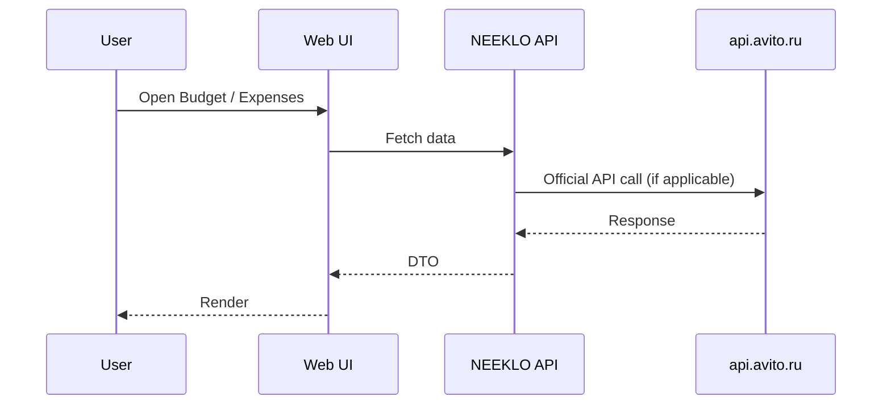

#### UI States Table

| State | Visual | Action |
| --- | --- | --- |
| loading | Skeleton | — |
| empty | Icon + hint + CTA | Primary action |
| error | Inline alert | Retry |
| degraded | Yellow banner | Link to Settings |
| success | Data view | — |

#### Accessibility

- Keyboard navigation for tables and dialogs
- Focus trap in modals
- aria-live for new messages (inbox)
- Color contrast per oklch design tokens

---

## Appendix F: Vertical-Specific Avito APIs

> Секции API, не входящие в MVP Avito Complete, но доступные официально.

### F.1 Авито.Работа (`job`)

> Вакансии и резюме — scopes job:*

| Method | Path | Summary |
| --- | --- | --- |
| POST | `/job/v1/applications/apply_actions` | Батчевая смена статуса откликов
 |
| POST | `/job/v1/applications/get_by_ids` | Получение списка откликов
 |
| GET | `/job/v1/applications/get_ids` | Получение идентификаторов откликов
 |
| GET | `/job/v1/applications/get_states` | Получение списка возможных статусов откликов
 |
| POST | `/job/v1/applications/set_is_viewed` | Изменение статуса отклика
 |
| DELETE | `/job/v1/applications/webhook` | Отключение уведомлений по откликам (webhook)
 |
| GET | `/job/v1/applications/webhook` | Получение информации о подписках (webhook)
 |
| PUT | `/job/v1/applications/webhook` | Включение уведомлений по откликам (webhook)
 |
| GET | `/job/v1/applications/webhooks` | Получение списка подписок (webhook)
 |
| GET | `/job/v1/resumes/` | Поиск резюме
 |
| GET | `/job/v1/resumes/{resume_id}/contacts/` | Доступ к контактным данным соискателя
 |
| POST | `/job/v1/vacancies` | Публикация вакансии |
| PUT | `/job/v1/vacancies/archived/{vacancy_id}` | Остановка публикации вакансии |
| PUT | `/job/v1/vacancies/{vacancy_id}` | Редактирование вакансии |
| POST | `/job/v1/vacancies/{vacancy_id}/prolongate` | Реактивация вакансии |
| GET | `/job/v2/resumes/{resume_id}` | Просмотр данных резюме
 |
| GET | `/job/v2/vacancies` | Поиск вакансий
 |
| POST | `/job/v2/vacancies` | Публикация вакансии v2 |
| POST | `/job/v2/vacancies/batch` | Просмотр данных вакансий
 |
| POST | `/job/v2/vacancies/statuses` | Получение статуса публикации вакансий V2 |
| POST | `/job/v2/vacancies/update/{vacancy_uuid}` | Редактирование вакансии v2 |
| GET | `/job/v2/vacancies/{vacancy_id}` | Просмотр данных вакансии
 |
| PUT | `/job/v2/vacancies/{vacancy_uuid}/auto_renewal` | Автопродление вакансии v2 |
| GET | `/job/v2/vacancy/dict` | Получение списка доступных словарей |
| GET | `/job/v2/vacancy/dict/{dictionary_id}` | Получение доступных значений списка по ID словаря |

**NEEKLO status:** Out of scope for Avito Complete MVP unless tenant vertical requires it.

---

### F.2 Краткосрочная аренда (`str`)

> Краткосрочная аренда — scopes short_term_rent:*

| Method | Path | Summary |
| --- | --- | --- |
| POST | `/core/v1/accounts/{user_id}/items/{item_id}/bookings` | Заполнение календаря занятости объекта недвижимости |
| GET | `/realty/v1/accounts/{user_id}/items/{item_id}/bookings` | Получение списка броней по объявлению
 |
| POST | `/realty/v1/accounts/{user_id}/items/{item_id}/prices` | Актуализация параметров для выбранных периодов
 |
| POST | `/realty/v1/items/intervals` | Заполнение доступности объекта недвижимости с квотами и без |
| POST | `/realty/v1/items/{item_id}/base` | Установка базовых параметров
 |

**NEEKLO status:** Out of scope for Avito Complete MVP unless tenant vertical requires it.

---

### F.3 Доставка (`delivery-sandbox`)

> Sandbox только для логистики

| Method | Path | Summary |
| --- | --- | --- |
| POST | `/cancelAnnouncement` | Отмена анонса в СД |
| POST | `/createAnnouncement` | Создание анонса в СД |
| POST | `/createParcel` | Создание посылки |
| POST | `/delivery-sandbox/announcements/create` | Создание анонса в Avito |
| POST | `/delivery-sandbox/announcements/track` | Трекинг анонсов |
| POST | `/delivery-sandbox/areas/custom-schedule` | Установка графика работы на определённый день |
| POST | `/delivery-sandbox/cancelParcel` | Отмена посылки |
| POST | `/delivery-sandbox/order/checkConfirmationCode` | Проверка кода подтверждения |
| POST | `/delivery-sandbox/order/properties` | Добавление / изменение параметров доставки посылки |
| POST | `/delivery-sandbox/order/realAddress` | Фактический адрес приёма / возврата посылки |
| POST | `/delivery-sandbox/order/tracking` | Трекинг |
| POST | `/delivery-sandbox/prohibitOrderAcceptance` | Запрет приёма посылки от отправителя |
| GET | `/delivery-sandbox/sorting-center` | Получить список сортировочных центров |
| POST | `/delivery-sandbox/tariffs/sorting-center` | Загрузить сортировочные центры |
| POST | `/delivery-sandbox/tariffs/{tariff_id}/areas` | Загрузить области доставки |
| POST | `/delivery-sandbox/tariffs/{tariff_id}/tagged-sorting-centers` | Установка тэгов своим и/или чужим сортировочным центрам |
| POST | `/delivery-sandbox/tariffs/{tariff_id}/terminals` | Загрузить терминалы |
| POST | `/delivery-sandbox/tariffs/{tariff_id}/terms` | Обновить сроки по тарифу |
| POST | `/delivery-sandbox/tariffsV2` | Загрузить новый тариф v2 |
| GET | `/delivery-sandbox/tasks/{task_id}` | Получение информации по задаче |
| POST | `/delivery-sandbox/v1/cancelAnnouncement` | Отправка события об отмене тестового анонса |
| POST | `/delivery-sandbox/v1/cancelParcel` | Отмена тестовой посылки |
| POST | `/delivery-sandbox/v1/changeParcel` | Создание заявки на изменение данных тестовой посылки |
| POST | `/delivery-sandbox/v1/createAnnouncement` | Создание тестового анонса |
| POST | `/delivery-sandbox/v1/getAnnouncementEvent` | Получение последнего события тестового анонса |
| POST | `/delivery-sandbox/v1/getChangeParcelInfo` | Получение информации об изменении тестовой посылки |
| POST | `/delivery-sandbox/v1/getParcelInfo` | Получение информации о тестовой посылке |
| POST | `/delivery-sandbox/v1/getRegisteredParcelID` | Получение ID зарегистрированной тестовой посылки |
| POST | `/delivery-sandbox/v2/createParcel` | Создание тестовой посылки |
| POST | `/delivery/order/changeParcelResult` | Отправка результата исполнения заявки |
| POST | `/sandbox/changeParcels` | Обновление свойств посылок |

**NEEKLO status:** Out of scope for Avito Complete MVP unless tenant vertical requires it.

---

### F.4 Управление заказами (`order-management`)

> B2C продавцы — управление заказами доставки

| Method | Path | Summary |
| --- | --- | --- |
| POST | `/order-management/1/markings` | Передача честного знака |
| POST | `/order-management/1/order/acceptReturnOrder` | Выбор отделения отделения Почты России для получения возврата |
| POST | `/order-management/1/order/applyTransition` | Изменение статуса заказа |
| POST | `/order-management/1/order/checkConfirmationCode` | Метод для проверки кода подтверждения заказа. |
| POST | `/order-management/1/order/cncSetDetails` | Метод для подготовки заказа с самовывозом |
| GET | `/order-management/1/order/getCourierDeliveryRange` | Метод получения доступных временных промежутков приезда курьера |
| POST | `/order-management/1/order/setCourierDeliveryRange` | Метод выбора определённого доступного временного промежутка для приезда курьера |
| POST | `/order-management/1/order/setTrackingNumber` | Передача трек-номера |
| GET | `/order-management/1/orders` | Получение информации о заказах |
| POST | `/order-management/1/orders/labels` | Создать задачу на генерацию этикеток (до 100). |
| POST | `/order-management/1/orders/labels/extended` | Создать задачу на генерацию этикеток (до 1000). |
| GET | `/order-management/1/orders/labels/{taskID}/download` | Скачать сгенерированный PDF-файл (этикетку). |

**NEEKLO status:** Out of scope for Avito Complete MVP unless tenant vertical requires it.

---

### F.5 Аналитика по недвижимости (`realty-reports`)

> Аналитика недвижимости

| Method | Path | Summary |
| --- | --- | --- |
| GET | `/realty/v1/marketPriceCorrespondence/{itemId}/{price}` | Получение соответствия переданной цены рыночной цене |
| POST | `/realty/v1/report/create/{itemId}` | Получение аналитического отчета по недвижимости |

**NEEKLO status:** Out of scope for Avito Complete MVP unless tenant vertical requires it.

---

### F.6 CallTracking[КТ] (`calltracking`)

> Колл-трекинг

| Method | Path | Summary |
| --- | --- | --- |
| POST | `/calltracking/v1/getCallById/` | Звонок по идентификатору |
| POST | `/calltracking/v1/getCalls/` | Звонки по времени |
| GET | `/calltracking/v1/getRecordByCallId/` | Получение аудиозаписи звонка по идентификатору |

**NEEKLO status:** Out of scope for Avito Complete MVP unless tenant vertical requires it.

---

### F.7 Автотека (`autoteka`)

> Проверка авто

| Method | Path | Summary |
| --- | --- | --- |
| POST | `/autoteka/v1/catalogs/resolve` | Получение актуальных параметров Автокаталога
 |
| POST | `/autoteka/v1/get-leads/` | Получение событий сервиса Сигнал
 |
| POST | `/autoteka/v1/monitoring/bucket/add` | Добавить идентификаторы (vin/frame) на мониторинг
 |
| POST | `/autoteka/v1/monitoring/bucket/delete` | Полная очистка списка мониторинга
 |
| POST | `/autoteka/v1/monitoring/bucket/remove` | Удаление идентификаторов из мониторинга (vin/frame)
 |
| GET | `/autoteka/v1/monitoring/get-reg-actions/` | Получение событий мониторинга
 |
| GET | `/autoteka/v1/packages/active_package` | Запрос остатка отчётов пользователя
 |
| POST | `/autoteka/v1/previews` | Превью по VIN или номеру кузова
 |
| GET | `/autoteka/v1/previews/{previewId}` | Получение превью по его ID
 |
| POST | `/autoteka/v1/reports` | Отчет по превью
 |
| POST | `/autoteka/v1/reports-by-vehicle-id` | Отчет по идентификатору авто (vin/frame)
 |
| GET | `/autoteka/v1/reports/list/` | Получение списка отчётов
 |
| GET | `/autoteka/v1/reports/{report_id}` | Получение отчета по его ID
 |
| POST | `/autoteka/v1/request-preview-by-external-item` | Превью по ID объявления другой площадки
 |
| POST | `/autoteka/v1/request-preview-by-item-id` | Превью по ID объявления Авито |
| POST | `/autoteka/v1/request-preview-by-regnumber` | Превью по государственному номеру
 |
| POST | `/autoteka/v1/scoring/by-vehicle-id` | Скоринг рисков по идентификатору авто (vin/frame)
 |
| GET | `/autoteka/v1/scoring/{scoring_id}` | Получение скоринга рисков по его ID
 |
| POST | `/autoteka/v1/specifications/by-plate-number` | Запрос характеристик по регистрационному номеру
 |
| POST | `/autoteka/v1/specifications/by-vehicle-id` | Запрос характеристик по идентификатору авто (vin/frame)
 |
| GET | `/autoteka/v1/specifications/specification/{specificationID}` | Получение характеристик по ID запроса
 |
| POST | `/autoteka/v1/sync/create-by-regnumber` | Синхронное создание отчета по ГРЗ
 |
| POST | `/autoteka/v1/sync/create-by-vin` | Синхронное создание отчёта по VIN или номеру кузова
 |
| POST | `/autoteka/v1/teasers` | Тизер по идентификатору авто (vin/frame)
 |
| GET | `/autoteka/v1/teasers/{teaser_id}` | Получение тизера по ID тизера
 |
| POST | `/autoteka/v1/valuation/by-specification` | Получение оценки по параметрам
 |
| POST | `/token` | Получение access token
 |

**NEEKLO status:** Out of scope for Avito Complete MVP unless tenant vertical requires it.

---

### F.8 Тарифы (`tariff`)

> Тарифы транспорт

| Method | Path | Summary |
| --- | --- | --- |
| GET | `/tariff/info/1` | Информация по тарифу |

**NEEKLO status:** Out of scope for Avito Complete MVP unless tenant vertical requires it.

---

### F.9 Авито Реклама (`ads`)

> Авито Реклама кабинет

| Method | Path | Summary |
| --- | --- | --- |
| GET | `/ads/v1/account/{accountID}` | Получить аккаунт по ID |
| POST | `/ads/v1/account/{accountID}` | Создать аккаунт в песочнице |
| POST | `/ads/v1/account/{accountID}/add-user` | Добавить пользователя в аккаунт |
| POST | `/ads/v1/account/{accountID}/advertisers` | Получить список рекламодателей по фильтрам |
| GET | `/ads/v1/account/{accountID}/balance` | Получить баланс аккаунта по ID |
| POST | `/ads/v1/account/{accountID}/bonus-transfer` | Перевод бонусов между аккаунтом родителем и дочерними на одном договоре |
| POST | `/ads/v1/account/{accountID}/campaigns` | Получить список кампаний по фильтрам |
| POST | `/ads/v1/account/{accountID}/campaigns/{campaignID}/creatives/stats` | Получить статистику по креативам кампании |
| POST | `/ads/v1/account/{accountID}/campaigns/{campaignID}/groups/stats` | Получить статистику по группам кампании |
| POST | `/ads/v1/account/{accountID}/campaigns/{campaignID}/stats` | Получить статистику по кампании |
| GET | `/ads/v1/account/{accountID}/children` | Получить список дочерних аккаунтов |
| GET | `/ads/v1/account/{accountID}/children-with-balances` | Получить список дочерних аккаунтов с балансами |
| POST | `/ads/v1/account/{accountID}/contracts` | Получить список договоров по фильтрам |
| POST | `/ads/v1/account/{accountID}/create-advertiser` | Создать рекламодателя |
| POST | `/ads/v1/account/{accountID}/create-contract` | Создание изначального договора |
| POST | `/ads/v1/account/{accountID}/create-nonpayer-child-account` | Создание дочернего аккаунта на договоре родителя |
| POST | `/ads/v1/account/{accountID}/creatives` | Получить список креативов по фильтрам |
| DELETE | `/ads/v1/account/{accountID}/delete-user/{userID}` | Удалить пользователя из аккаунта |
| POST | `/ads/v1/account/{accountID}/funds-transfer` | Перевод денег между аккаунтом родителем и дочерними на одном договоре |
| POST | `/ads/v1/account/{accountID}/group/{groupID}/change-budget` | Изменить бюджет группы |
| POST | `/ads/v1/account/{accountID}/group/{groupID}/change-price` | Изменить цену группы |
| POST | `/ads/v1/account/{accountID}/groups` | Получить список групп по фильтрам |
| POST | `/ads/v1/account/{accountID}/set-user-role` | Изменить роль пользователя в аккаунте |
| GET | `/ads/v1/account/{accountID}/users` | Получить список пользователей аккаунта |

**NEEKLO status:** Out of scope for Avito Complete MVP unless tenant vertical requires it.

---

### F.10 Авито Promo (`avito-promo`)

> Avito Promo агентства

| Method | Path | Summary |
| --- | --- | --- |
| POST | `/agency/balance` | Перевод средств на счёт клиента |
| GET | `/agency/transactions` | Получение списка незавершённых транзакций |
| GET | `/agency/transactions/{transaction_id}` | Получение информации о транзакции |
| POST | `/api/1/agency/clients` | Получение списка клиентов |
| POST | `/api/1/agency/clients/target/create` | Создание задачи на проверку ИНН клиентов |
| POST | `/api/1/agency/clients/target/result` | Получение результата проверки ИНН клиентов |
| GET | `/api/1/agency/finances/balance` | Получение баланса агентства |
| POST | `/api/1/agency/finances/transactionsHistory` | Получение всех операций с балансом агентства |
| POST | `/api/1/agency/users/invite/send` | Отправка приглашения нового клиента |
| POST | `/api/1/agency/users/invite/status` | Получение статуса приглашения нового клиента |
| POST | `/api/1/agency/users/verificationStatus` | Получение статуса верификации нового клиента |
| POST | `/stats/v2/accounts/{user_id}/items` | Получение статистических показателей клиента |
| POST | `/stats/v2/accounts/{user_id}/spendings` | Получение статистики расходов клиента |

**NEEKLO status:** Out of scope for Avito Complete MVP unless tenant vertical requires it.

---

### F.11 Рассылка скидок и спецпредложений в мессенджере (beta-version) (`sbc-gateway`)

> Beta — рассылка скидок в messenger

| Method | Path | Summary |
| --- | --- | --- |
| POST | `/special-offers/v1/available` | Получение информации об объявлениях |
| POST | `/special-offers/v1/multiConfirm` | Отправка и оплата рассылки |
| POST | `/special-offers/v1/multiCreate` | Создание рассылки |
| POST | `/special-offers/v1/stats` | Получение статистики |
| POST | `/special-offers/v1/tariffInfo` | Получение информации о тарифе |

**NEEKLO status:** Out of scope for Avito Complete MVP unless tenant vertical requires it.

---

## Appendix G: Glossary & References

| Term | Definition |
| --- | --- |
| Autoload | Avito bulk listing upload via XML/feed files |
| VAS | Value Added Service — paid promotion (XL, Premium, etc.) |
| client_credentials | OAuth flow for own Avito Pro account |
| authorization_code | OAuth flow for accessing other users data |
| Item | Avito listing/ad |
| Feed | Autoload upload file (usually XML) |
| Scope | OAuth permission string |
| Webhook | HTTPS callback from Avito messenger |
| Projection | NEEKLO read model rebuilt from events |
| Credential Vault | Planned encrypted per-tenant token storage |

### Official links

- [Портал разработчика Авито](https://developers.avito.ru/)
- [Каталог API](https://developers.avito.ru/api-catalog)
- [Регистрация приложения](https://developers.avito.ru/applications)
- [API keys (личный кабинет)](https://www.avito.ru/professionals/api)
- [Условия использования API](https://www.avito.ru/legal/pro_tools/public-api)
- [OpenAPI 3.0 Specification](https://github.com/OAI/OpenAPI-Specification/blob/main/versions/3.0.0.md)
- Support: supportautoload@avito.ru, 8 800 600-00-01

### NEEKLO internal docs

- `docs/avito-platform.md` — Release 0.6 architecture
- `docs/decision-records.md` — ADR + gap analysis
- `docs/architecture.md` — Stage 1–3 platform
- `deploy/README.md` — integrator.neeklo.ru deployment

---

## Appendix H: Terms of Service Compliance Checklist

| Rule | NEEKLO compliance |
| --- | --- |
| Use only official API | ✔ — no scraping in product spec |
| Respect rate limits | ✔ — backoff + header tracking planned |
| Paid tariff for Messenger | ✔ — disclosed in UI |
| Secure credential storage | 🟡 — vault planned |
| Webhook signature verification | 🟡 — must implement before prod |
| No competitor scraping | ✔ — marked unavailable |
| User consent for OAuth scopes | ✔ — minimal scope principle |

## Document End

> Generated from official Avito OpenAPI specs via `scripts/generate-avito-spec.mjs`
> 248 endpoints | 25 sections | 2026-07-03

**Next step:** Review and approve this specification before implementation.