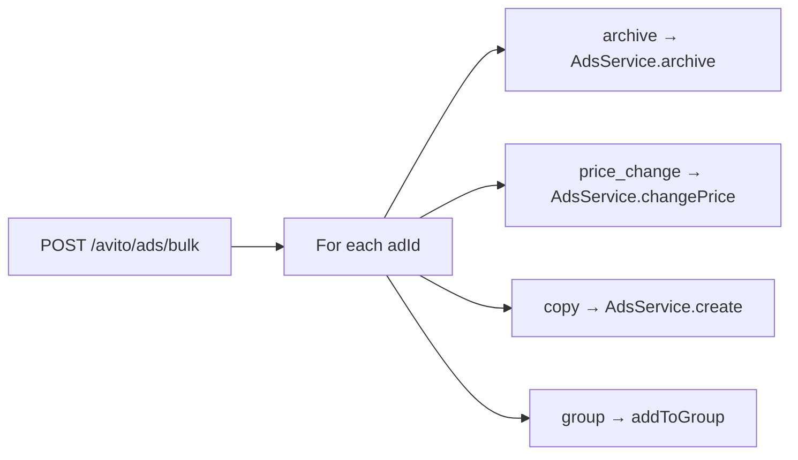

# Ads Manager

Avito Ads Manager — bulk operations, templates, groups, and search extensions over the existing `ad` aggregate. Delegates mutations to `AdsService`; studio view reuses Commerce Listing Studio.

## API

| Method | Path | Purpose |
| --- | --- | --- |
| `GET` | `/api/avito/ads` | Search ads (`q`, `status`, `groupId`, `regionId`) |
| `POST` | `/api/avito/ads/bulk` | Bulk archive, price change, copy, group assign |
| `GET` | `/api/avito/ads/templates` | List title/description templates |
| `POST` | `/api/avito/ads/templates` | Create template |
| `GET` | `/api/avito/ads/groups` | List ad groups |
| `POST` | `/api/avito/ads/groups` | Create group |
| `GET` | `/api/avito/ads/:id/studio` | Listing studio workspace |

Path: `apps/api/src/platform/avito/ads/avito-ads-manager.service.ts`

## Bulk actions

Supported actions: `archive`, `price_change` (with `priceDelta`), `copy`, `group` (with `groupId`).

## Read models

| Model | Purpose |
| --- | --- |
| `AdReadModel` | Filtered by `marketplace: AVITO` |
| `AdTemplateReadModel` | Reusable listing templates |
| `AdGroupReadModel` | Named collections of ad IDs |

## Integration

- **Listing Studio** — `getStudio()` → `ListingStudioService` (metrics, experiments, conversations)
- **Event Store** — ad mutations emit existing `ad.*` events via `AdsService`
- **No publication API** — bulk ops affect local aggregate only; Avito Autoload deferred (see [regional-publishing.md](./regional-publishing.md))

## Design notes

- Search is projection-based; no duplicate Avito catalog sync
- Templates and groups are Avito-layer read models — not duplicated in Commerce module
- Studio analytics delegate to Intelligence Layer (same as [listing-studio.md](./listing-studio.md))
