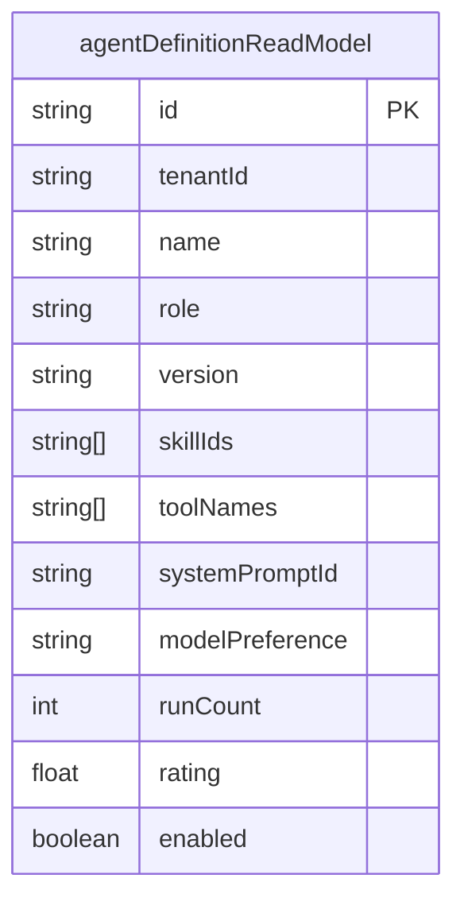
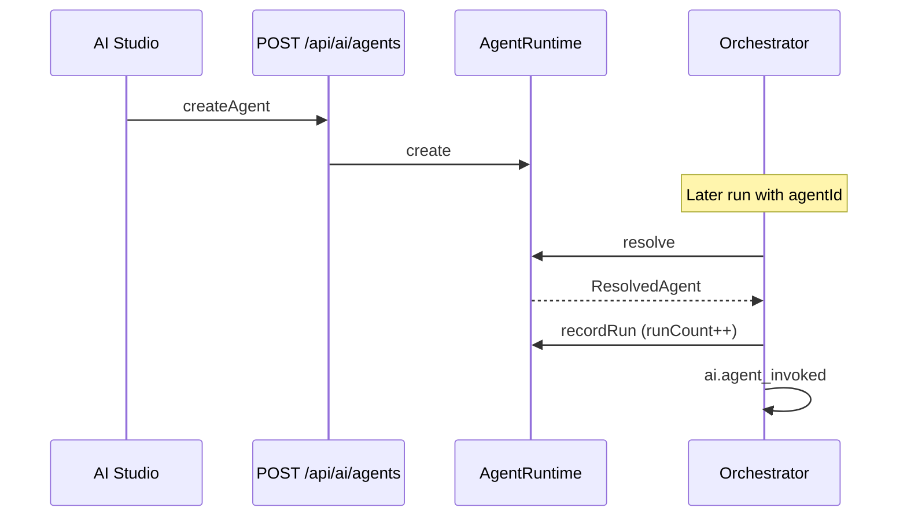

# Agent Runtime

`AgentRuntimeService` manages **tenant-scoped AI agents** — definitions, roles, skill bindings, tool lists, and run statistics. Agents are optional on `AiRunRequest`; when `agentId` is set, orchestrator resolves prompt and records invocation.

## Agent roles

From `AgentRole` in contracts:

| Role | Intended use |
| --- | --- |
| `supervisor` | Coordinates worker agents (future multi-agent) |
| `worker` | Default — executes tasks |
| `planner` | Plan-heavy workflows |
| `reviewer` | Post-run validation |
| `specialist` | Domain-specific (listing, support) |

## Agent definition

## Lifecycle

## resolve

Returns `null` if agent disabled or wrong tenant — orchestrator proceeds without agent context.

## API

| Method | Route |
| --- | --- |
| POST | `/api/ai/agents` — create |
| GET | `/api/ai/agents` — via marketplace catalog |

Create schema: `{ name, description?, role?, skillIds?, toolNames?, modelPreference?, systemPromptId? }`

## Commerce integration

`SalesAgentService` does not pass `agentId` today — uses default chat prompt + sales skills. Tenant agents can be wired via Commerce settings (future).

## ADR

**Decision:** Agents are configuration read models, not autonomous processes. Runtime is request/response per Gateway call.

**Consequences:**
- (+) Simple mental model, scales with API
- (-) Multi-agent hierarchies not executed in 0.5

## Path

`apps/api/src/platform/ai-platform/agents/agent-runtime.service.ts` (`AgentRuntimeService`)

## See also

- [agent-marketplace.md](./agent-marketplace.md) · [skills.md](./skills.md) · [ai-studio.md](./ai-studio.md) · [ai-orchestrator.md](./ai-orchestrator.md)
