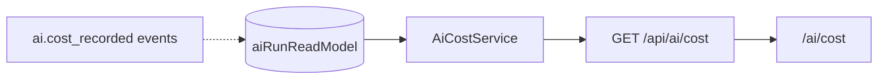

# AI Cost Center

`AiCostService` aggregates **token spend and run volume** by model and agent — backing `/api/ai/cost` and the `/ai/cost` web page.

## Data sources



Orchestrator writes `costUsd` on each completed run from router `estimatedCostPer1kTokens`:

```typescript
costUsd = ((tokensIn + tokensOut) / 1000) * costPer1k
```

## Summary shape

```typescript
{
  totalCostUsd: number;
  totalTokensIn: number;
  totalTokensOut: number;
  runCount: number;
  byModel: { model, costUsd, runs }[];
  byAgent: { agentId, costUsd, runs }[];
}
```

Aggregates last 1000 completed runs per tenant.

## Gateway limits

`AiGatewayService` enforces **10,000 runs/day/tenant** before orchestration — cost center complements this with spend visibility, not hard budget caps (future: Budget Center integration).

## Dashboard

`GET /api/ai/dashboard` merges cost summary with observability health and agent count.

## ADR

**Decision:** Cost computed at run completion from router estimates — not provider invoice reconciliation.

**Consequences:**
- (+) Real-time tenant dashboards
- (-) May drift from OpenRouter billing; add reconciliation job later

## Path

`apps/api/src/platform/ai-platform/learning/learning-engines.service.ts` (`AiCostService`)

## See also

- [ai-platform.md](./ai-platform.md) · [evaluation-engine.md](./evaluation-engine.md) · [benchmark.md](./benchmark.md) · [budget-center.md](./budget-center.md)
