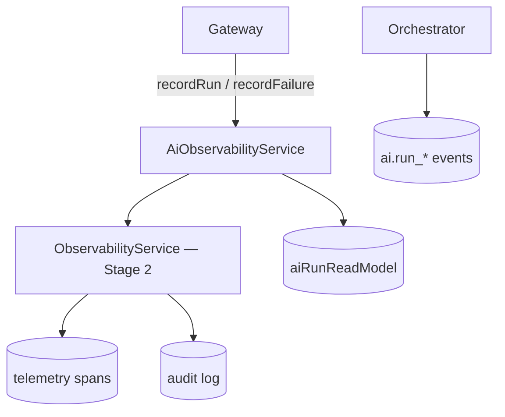

# AI Observability

`AiObservabilityService` provides **full-pipeline logging** — spans, audit entries, failure handling, and tenant health metrics for the AI stack.

## Observability stack

## recordRun

On success (from Gateway wrapper):

- Span: `ai.{taskType}`, tags `runId`, `model`, tokens, `costUsd`
- Audit: `ai.run_completed` on resource `ai_run`

## recordFailure

- Updates run status → `failed`
- Publishes `ai.run_failed`
- Error span with message preview

## Pipeline health

`GET /api/ai/observability` → `getPipelineHealth(tenantId)`:

| Metric | Source |
| --- | --- |
| `recentRuns` | Last 20 runs |
| `failureRate` / `errorRate` | failed / total |
| `avgLatencyMs` | Mean latency |
| `totalCostUsd` | Sum recent cost |
| `toolInvocations` | Count from `toolCalls` JSON |

## Correlation

Gateway passes `correlationId` from request context — sales agent uses `conversationId` for trace grouping across reply + tools.

## ADR

**Decision:** AI observability extends Stage 2 `ObservabilityService` — no separate APM product.

**Consequences:**
- (+) Unified traces with marketplace sync, commerce
- (-) No dedicated LLM trace UI (use audit + runs list)

## Path

`apps/api/src/platform/ai-platform/observability/ai-observability.service.ts`

## See also

- [ai-platform.md](./ai-platform.md) · [ai-cost-center.md](./ai-cost-center.md) · [commerce-platform.md](./commerce-platform.md)
