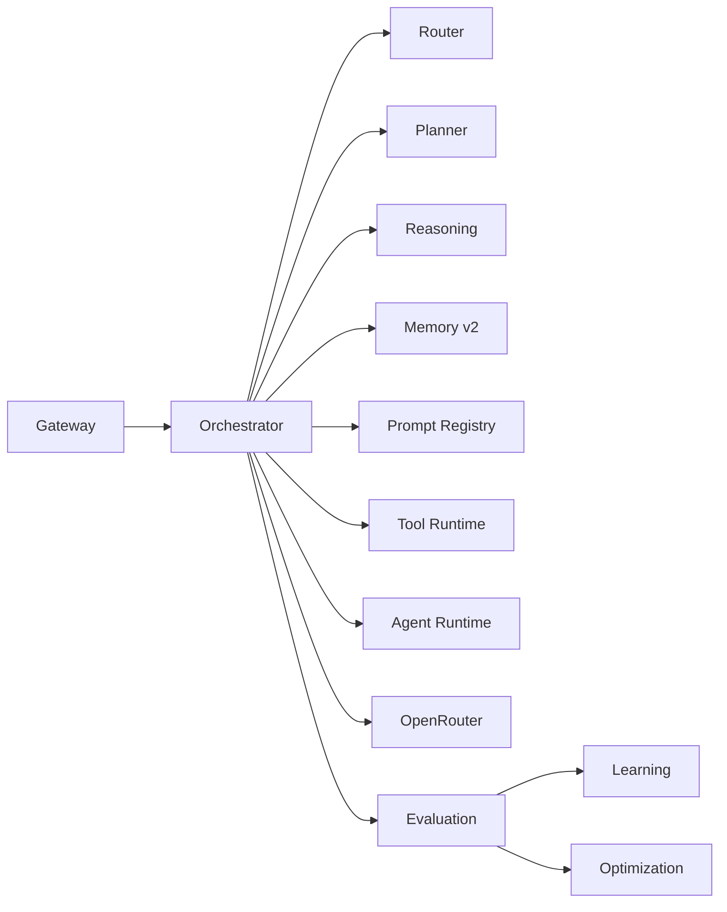
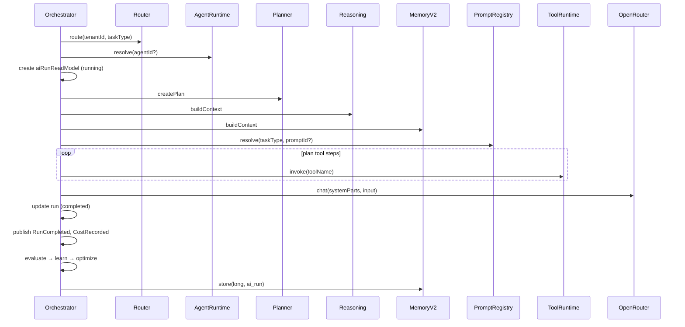

# AI Orchestrator

`AiOrchestratorService` coordinates the full AI run — model routing, planning, reasoning context, tool execution, LLM completion, evaluation, and learning. Called only from [AiGatewayService](./ai-platform.md); never directly from controllers.

## Position in pipeline



## Run sequence



## System prompt assembly

Orchestrator concatenates (in order):

1. **Prompt Registry** — tenant or default template for `taskType`
2. **Reasoning context** — KG, forecast, decisions, strategy (no LLM)
3. **Memory v2 context** — tiered entries for subject

```typescript
const systemParts = [prompt.template, reasoningCtx, memoryCtx].filter(Boolean).join('\n\n');
```

## Task type → OpenRouter role

| AiTaskType | OpenRouter role |
| --- | --- |
| CHAT, ANALYTICS, LISTING, SUMMARY, VISION, OCR | mapped in `ROLE_MAP` |
| REASONING, PLANNING, TOOL, EVALUATION | fallback `chat` |

Model selection is delegated to [AiRouterService](./ai-platform.md#modules) — not hardcoded in orchestrator.

## Read model updates

| Field | Source |
| --- | --- |
| `planId` | Planner |
| `tokensIn/Out`, `latencyMs`, `costUsd` | OpenRouter completion |
| `toolCalls` | Tool step results |
| `agentId` | Resolved agent |
| `outputPreview` | First 1000 chars |

## ADR

**Decision:** Orchestrator is stateless per run; all durable state → Event Store + Prisma read models.

**Consequences:**
- (+) Gateway can retry/idempotency at boundary (future)
- (+) Horizontal scale: any API instance can orchestrate
- (-) Long multi-step agent loops not yet implemented (single completion today)

## Path

`apps/api/src/platform/ai-platform/orchestrator/ai-orchestrator.service.ts`

## See also

- [ai-platform.md](./ai-platform.md) · [planner.md](./planner.md) · [reasoning.md](./reasoning.md)
- [tool-runtime.md](./tool-runtime.md) · [evaluation-engine.md](./evaluation-engine.md)
