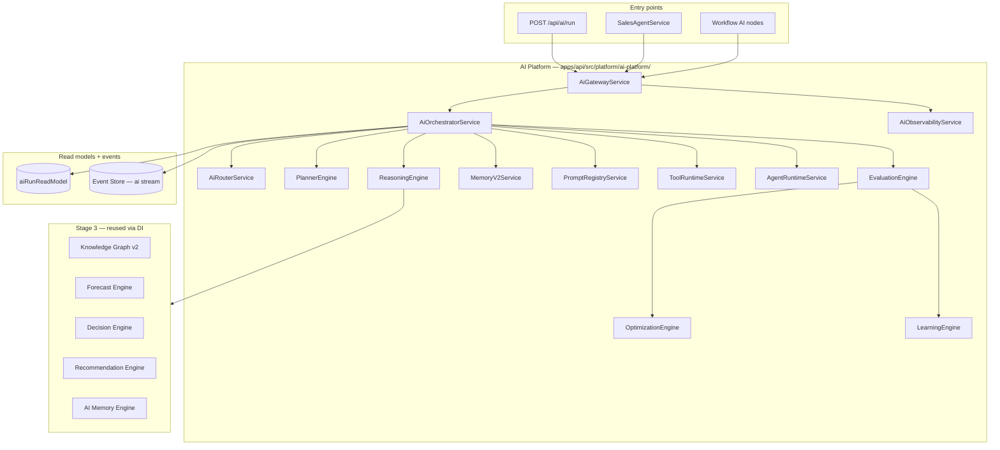
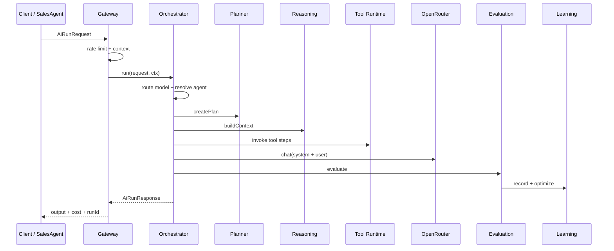

# AI Platform — Release 0.5

NEEKLO AI Platform is the **extension layer** for AI commerce — a unified pipeline from Gateway through Orchestrator, Planner, Reasoning, Tools, Agents, and Learning. Release 0.5 sits above Stage 3 Intelligence and Release 0.4 Commerce; it does not duplicate metrics, forecast, or decision logic.

## Full pipeline

## Run lifecycle

## Modules

| Component | Path | API / entry |
| --- | --- | --- |
| Gateway | `gateway/ai-gateway.service.ts` | `POST /api/ai/run` |
| Orchestrator | `orchestrator/ai-orchestrator.service.ts` | internal |
| Router | `router/ai-router.service.ts` | env + tenant `aiSettings` |
| Planner | `planner/planner.engine.ts` | plan steps in run |
| Reasoning | `reasoning/reasoning.engine.ts` | intelligence context |
| Memory v2 | `memory/memory-v2.service.ts` | multi-tier store |
| Prompt Registry | `prompts/prompt-registry.service.ts` | `GET/POST /api/ai/prompts` |
| Tool Runtime | `tools/tool-runtime.service.ts` | `GET /api/ai/tools` |
| Tool Registry v2 | `tools/tool-runtime.service.ts` | metadata catalog |
| Agent Runtime | `agents/agent-runtime.service.ts` | `GET/POST /api/ai/agents` |
| Skills | `agents/agent-runtime.service.ts` | `GET /api/ai/skills` |
| Evaluation | `learning/learning-engines.service.ts` | post-run |
| Optimization | `learning/learning-engines.service.ts` | post-eval |
| Learning | `learning/learning-engines.service.ts` | `GET /api/ai/learning` |
| Cost Center | `learning/learning-engines.service.ts` | `GET /api/ai/cost` |
| Benchmark | `learning/learning-engines.service.ts` | `POST /api/ai/benchmark` |
| Observability | `observability/ai-observability.service.ts` | `GET /api/ai/observability` |
| Bootstrap | `bootstrap/ai-platform-bootstrap.service.ts` | app start |

## Event catalog

All AI facts append to aggregate stream `ai`. Schemas in `packages/contracts/src/events/ai-catalog.ts`.

| Event | When |
| --- | --- |
| `ai.run_started` | Gateway accepts run |
| `ai.run_completed` | Model output ready |
| `ai.run_failed` | Unhandled error |
| `ai.plan_created` | Planner DAG persisted |
| `ai.tool_invoked` | Tool Runtime execution |
| `ai.prompt_used` | Prompt resolved |
| `ai.evaluation_recorded` | Quality scores |
| `ai.learning_recorded` | Insight stored |
| `ai.cost_recorded` | Token cost |
| `ai.agent_invoked` | Agent resolved |
| `ai.skill_applied` | Skill on run |

## Web UI

| Route | Purpose |
| --- | --- |
| `/ai/studio` | Agent builder, skills picker |
| `/ai/cost` | Spend by model/agent |
| `/ai/generator` | Listing/content generation |
| `/ai/assistant` | Chat assistant |
| `/ai/analytics` | AI analytics views |
| `/ai/media` | Media AI jobs |

Commerce sales agent continues at `POST /api/commerce/agent/*` — delegates to Gateway (see [commerce-platform.md](./commerce-platform.md)).

## Design principles

- **Extension layer, not replacement** — Intelligence + Commerce engines reused via DI
- **Single entry point** — all AI tasks through `AiGatewayService`
- **Event-sourced runs** — `ai.*` events + read models for queries
- **No duplicate intelligence** — ReasoningEngine calls Forecast/Decision/KG, not reimplements
- **MCP-ready tools** — Tool Registry v2 metadata + plugin-style `AiToolRegistry`
- **Tenant isolation** — rate limits, cost, agents scoped by `tenantId`

## ADR summary

See [ADR-014](./decision-records.md#adr-014-ai-platform-as-extension-layer-release-05) — AI Platform as extension layer (Release 0.5).

## See also

- [ai-orchestrator.md](./ai-orchestrator.md) · [planner.md](./planner.md) · [reasoning.md](./reasoning.md)
- [memory-v2.md](./memory-v2.md) · [skills.md](./skills.md) · [tool-runtime.md](./tool-runtime.md)
- [tool-registry-v2.md](./tool-registry-v2.md) · [prompt-registry.md](./prompt-registry.md)
- [learning-engine.md](./learning-engine.md) · [evaluation-engine.md](./evaluation-engine.md) · [optimization-engine.md](./optimization-engine.md)
- [agent-runtime.md](./agent-runtime.md) · [agent-marketplace.md](./agent-marketplace.md)
- [ai-studio.md](./ai-studio.md) · [ai-cost-center.md](./ai-cost-center.md) · [ai-observability.md](./ai-observability.md) · [benchmark.md](./benchmark.md)
- [intelligence-engine.md](./intelligence-engine.md) · [commerce-platform.md](./commerce-platform.md)
