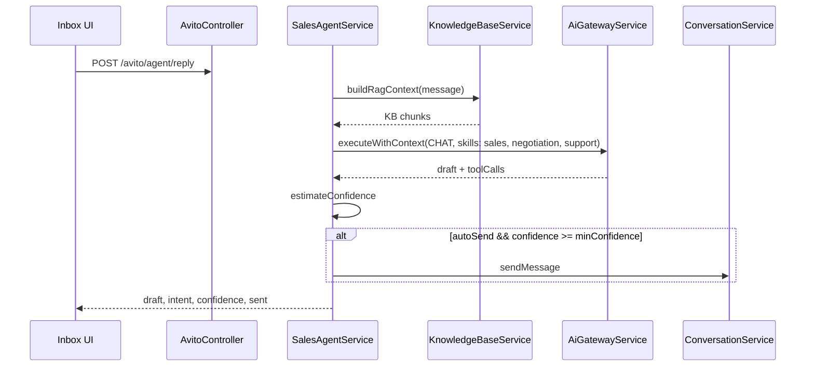

# AI Sales Agent

Avito-facing entry point for the Commerce AI Sales Agent — Gateway-powered replies with Knowledge Base RAG, confidence gating, and optional auto-send to conversation.

## API

| Method | Path | Purpose |
| --- | --- | --- |
| `POST` | `/api/avito/agent/reply` | Generate reply draft / auto-send |
| `POST` | `/api/avito/inbox/:id/assign` | Assign conversation |

Commerce equivalent: `POST /api/commerce/agent/reply` — same `SalesAgentService`.

Path: `apps/api/src/platform/commerce/sales-agent.service.ts`

## Reply flow

## Request / response

Input: `agentReplyOptionsSchema` — `conversationId`, `customerId`, `adId`, `message`, optional `autoSend`, `minConfidence` (default 0.7).

Output: `{ draft, intent, confidence, actions[], sent, stopped?, reason? }`

Low-confidence replies are held as drafts; auto-send blocked when below threshold.

## Integration stack

| Layer | Role |
| --- | --- |
| AI Platform | `AiGatewayService` — single LLM entry, cost, `ai.*` events |
| Knowledge Base | `KnowledgeBaseService.buildRagContext` — tenant docs injected into prompt |
| Commerce | `ConversationService`, `TaskEngine`, `NotificationEngine` |
| Intelligence | Reasoning context via Gateway (Forecast, Decision, KG — not reimplemented) |
| Observability | `ObservabilityService` audit spans |

## Design principles

- **No fork of Commerce agent** — Avito route is a thin controller alias
- **RAG without duplicate memory** — KB chunks + `AiMemoryEngine.remember` on upload
- **Confidence gating** — production-safe auto-reply guardrail
- **Messaging via SDK** — outbound send uses Marketplace messaging capability when channel is Avito

## Web UI

`/chats` — three-pane inbox with AI draft panel (see [unified-inbox.md](./unified-inbox.md)).
