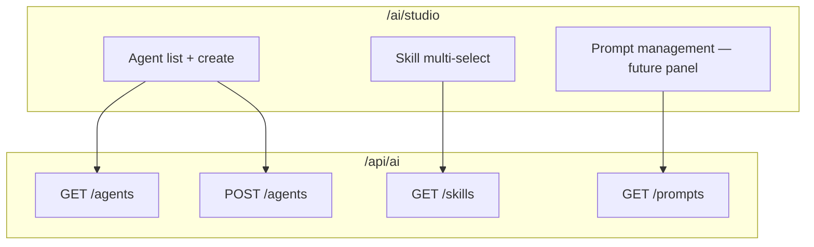

# AI Studio

AI Studio is the **web workspace** for building and managing agents, skills, and prompts — route `/ai/studio`.

## UI map

## Implementation

| Asset | Path |
| --- | --- |
| Page | `apps/web/src/pages/ai/ai-studio-page.tsx` |
| Hooks | `apps/web/src/entities/ai/api.ts` — `useAiAgents`, `useAiSkills`, `useCreateAgent` |
| Router | `apps/web/src/app/router.tsx` — `/ai/studio` |

## Create agent flow

1. User enters name, description, role
2. Selects skills from builtin catalog (`sales`, `support`, `listing`, …)
3. `POST /api/ai/agents` with `{ name, skillIds, ... }`
4. Agent appears in marketplace catalog

Default selected skill in UI: `sales`.

## Related AI routes

| Route | Purpose |
| --- | --- |
| `/ai/generator` | Content generation |
| `/ai/assistant` | Interactive chat |
| `/ai/analytics` | AI analytics |
| `/ai/media` | Media jobs |
| `/ai/cost` | [Cost Center](./ai-cost-center.md) |

## Permissions

- Agent list: `ChatRead`
- Agent create: `SettingsWrite`
- Skills list: `ChatRead`

## ADR

**Decision:** AI Studio is a thin client over `/api/ai/*` — no business logic in frontend.

**Consequences:**
- (+) API reusable by CLI, MCP, automations
- (-) Advanced prompt editor UI minimal in 0.5

## See also

- [agent-runtime.md](./agent-runtime.md) · [skills.md](./skills.md) · [prompt-registry.md](./prompt-registry.md) · [ai-platform.md](./ai-platform.md)
