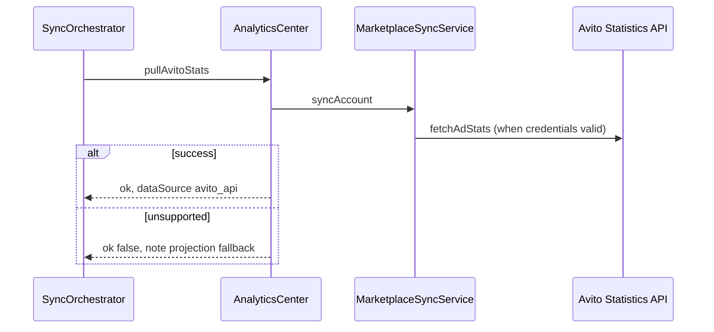

# Analytics Center

Avito Analytics Center — tenant-wide and per-ad KPIs from projections, enriched with Forecast and Recommendation engines. API stats pulled where Avito Statistics capability is configured.

## API

| Method | Path | Purpose |
| --- | --- | --- |
| `GET` | `/api/avito/analytics/summary` | Tenant Avito KPI rollup |
| `GET` | `/api/avito/analytics/ads/:id` | Per-ad metrics + forecast + recs |
| `GET` | `/api/avito/analytics/regional` | Regional intelligence rankings |

Path: `apps/api/src/platform/avito/analytics/avito-analytics-center.service.ts`

## Summary metrics

| Metric | Source |
| --- | --- |
| views, contacts, favorites, messages | `AdReadModel` aggregation |
| ctr, conversionRate | Derived (no duplicate MetricsEngine fork) |
| spend, revenue, roi, roas, cpa | Ad projections + budget imports |
| aiScore | Average ad AI score |
| forecastTrend | `ForecastEngine.getLatest` |
| recommendationCount | `RecommendationEngine.listPending` |
| dataSource | `projection` \| `mixed` (when budget imports exist) |

## Stats sync

On sync failure, platform returns honest `limited` status — projection metrics remain authoritative until Autoload/full sync ships.

## Events

| Event | When |
| --- | --- |
| `avito.stats_pulled` | API stats ingested for account |

## Integration

- **Stage 3** — `ForecastEngine`, `RecommendationEngine`, `RegionalIntelligenceEngine`
- **No duplicate formulas** — ROI/ROAS align with ad read model fields populated by Metrics projections
- **Account sync** — triggered from Account Center (`POST /avito/accounts/:id/sync`)

## Web UI

`/avito/analytics` — summary cards, trend indicators, recommendation count.

See also: [analytics-engine.md](./analytics-engine.md), [regional-center.md](./regional-center.md).
