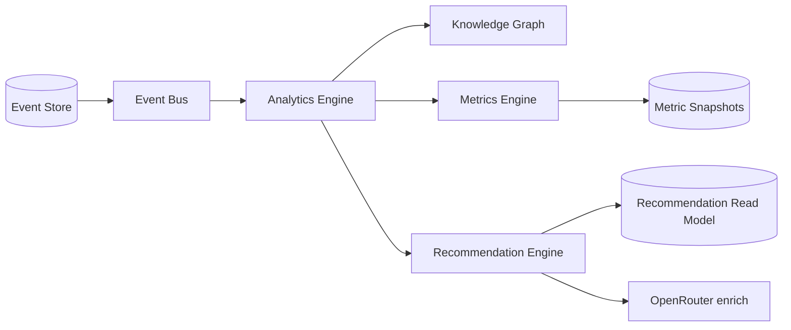

# Analytics Engine

Standalone service consuming the event bus — **not coupled to UI**.

Location: `apps/api/src/platform/marketplace-core/analytics/analytics.engine.ts`

## Pipeline

## Responsibilities

1. Subscribe to global event stream (consumer group: `analytics-engine`)
2. Ingest events into Knowledge Graph
3. Recompute metrics on ad performance events
4. Trigger recommendation analysis
5. Expose tenant analytics summary API

## Forecasts

`MarketplaceForecastService` uses current metrics to produce:

- CTR forecast
- ROI forecast
- Sale probability

## Recommendations (not raw events to AI)

Recommendation kinds:

- `boost`, `change_price`, `change_photo`, `change_description`
- `add_video`, `disable_region`, `increase_budget`, `change_category`

AI receives recommendation objects via `RecommendationEngine.enrichWithAi()`.

## API

- `GET /api/marketplace/analytics/summary` — tenant rollup
- `GET /api/marketplace/recommendations` — pending recommendations
