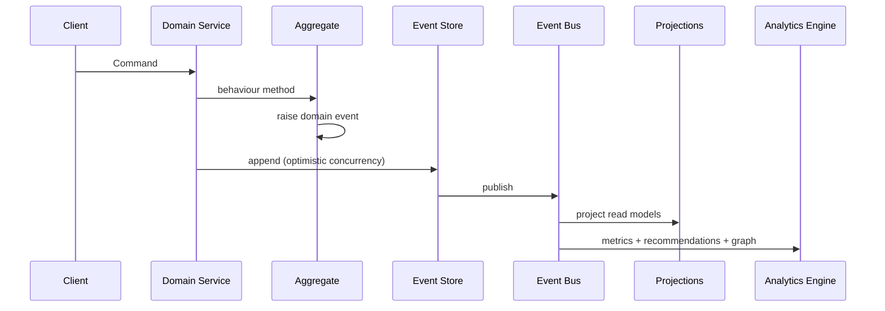
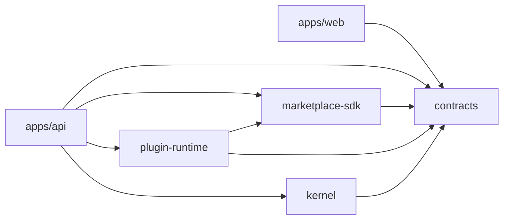

# NEEKLO Marketplace OS — Architecture

Stage 3 adds the **Intelligence Layer** — warehouses, forecasting, decision-making, and market intelligence APIs on top of the Stage 2 Marketplace Core Platform.

## System context

```mermaid
flowchart TB
  subgraph Clients
    WEB[React Web App]
    API_CLIENT[REST / Webhooks]
  end

  subgraph Platform["Platform Layer"]
    ES[(Event Store Postgres)]
    EB[Event Bus Redis Streams]
    SNAP[Snapshot Engine]
    PROJ[Projection Manager]
    MET[Metrics Engine]
    ANA[Analytics Engine]
    REC[Recommendation Engine]
    KG[Knowledge Graph v2]
    SYNC[Sync Engine]
    OBS[Observability]
  end

  subgraph Intelligence["Intelligence Layer — Stage 3"]
    PIPE[Intelligence Pipeline]
    HW[Historical Warehouse]
    MW[Metrics Warehouse]
    FE[Forecast Engine]
    DE[Decision Engine]
    RI[Regional / Competitor / Opportunity]
    EXP[Experiment + AI Memory]
  end

  subgraph Core["Marketplace Core"]
    REG[Marketplace Registry]
    PLG[Plugin Runtime]
    SDK[Marketplace SDK]
    POL[Domain Policies]
  end

  subgraph Plugins["Marketplace Plugins"]
    AVITO[@neeklo/marketplace-avito]
    OZON[Future: Ozon]
    WB[Future: Wildberries]
  end

  WEB --> API[NestJS API]
  API_CLIENT --> API
  API --> Core
  API --> Intelligence
  Core --> SDK
  PLG --> Plugins
  REG --> PLG
  API --> Platform
  Platform --> ES
  Platform --> EB
  EB --> ANA
  EB --> PROJ
  EB --> PIPE
  ANA --> MET
  ANA --> REC
  ANA --> KG
  PIPE --> HW --> MW --> FE --> DE
  DE --> ES
```

## Layering

| Layer | Responsibility | Key paths |
| --- | --- | --- |
| **Contracts** | Event catalog, DTOs, enums | `packages/contracts` |
| **Kernel** | ES/CQRS/Snapshot ports | `packages/kernel` |
| **Marketplace SDK** | Provider capability interfaces | `packages/marketplace-sdk` |
| **Plugin Runtime** | Plugin lifecycle + registry | `packages/plugin-runtime` |
| **Platform** | Infrastructure adapters | `apps/api/src/platform` |
| **Domain** | Aggregates, projections, HTTP | `apps/api/src/modules` |
| **Plugins** | Marketplace implementations | `apps/api/src/plugins` |

## Data flow (write path)



## Scalability assumptions

- **100+ marketplaces** — plugin registry, no core branching
- **10M ads** — cursor pagination, read models, snapshots
- **100M messages** — append-only events, partitioned projections
- **Billions of events** — global log + checkpoints, never delete

## Package dependency graph



See also: [marketplace-sdk.md](./marketplace-sdk.md), [plugin-runtime.md](./plugin-runtime.md), [domain-model.md](./domain-model.md), [intelligence-engine.md](./intelligence-engine.md).

## Intelligence Layer (Stage 3)

| Component | Path | Role |
| --- | --- | --- |
| Historical Warehouse | `platform/intelligence/warehouse/` | Hour→year rollups |
| Metrics Warehouse | `platform/intelligence/warehouse/` | Centralized KPI storage |
| Forecast Engine | `platform/intelligence/forecast/` | Pluggable prediction |
| Decision Engine | `platform/intelligence/decision/` | Strategy-weighted actions |
| Regional / Competitor / Opportunity | `platform/intelligence/*/` | Market intelligence |
| Experiment + AI Memory | `platform/intelligence/experiment/`, `memory/` | Testing + long-term memory |
| Knowledge Graph v2 | `platform/intelligence/knowledge-graph/` | BFS + intelligence nodes |
| Intelligence API | `modules/intelligence/` | `/api/intelligence/*` |

Intelligence events use aggregate stream `intelligence` with optimistic concurrency via `IntelligenceEventPublisher`.

## Commerce Platform (Release 0.4)

| Component | Path | Role |
| --- | --- | --- |
| Unified Inbox | `modules/conversation/` | Conversation aggregate |
| Customer 360 | `modules/customer/` | Customer aggregate |
| Deal Pipeline | `modules/deal/` | Deal aggregate |
| Commerce API | `modules/commerce/` | `/api/commerce/*` |
| Platform services | `platform/commerce/` | Job, Task, Agent, Search, Timeline |
| AI Sales Agent | `platform/commerce/sales-agent.service.ts` | Memory + KG + Forecast + Decision |

See [commerce-platform.md](./commerce-platform.md).
