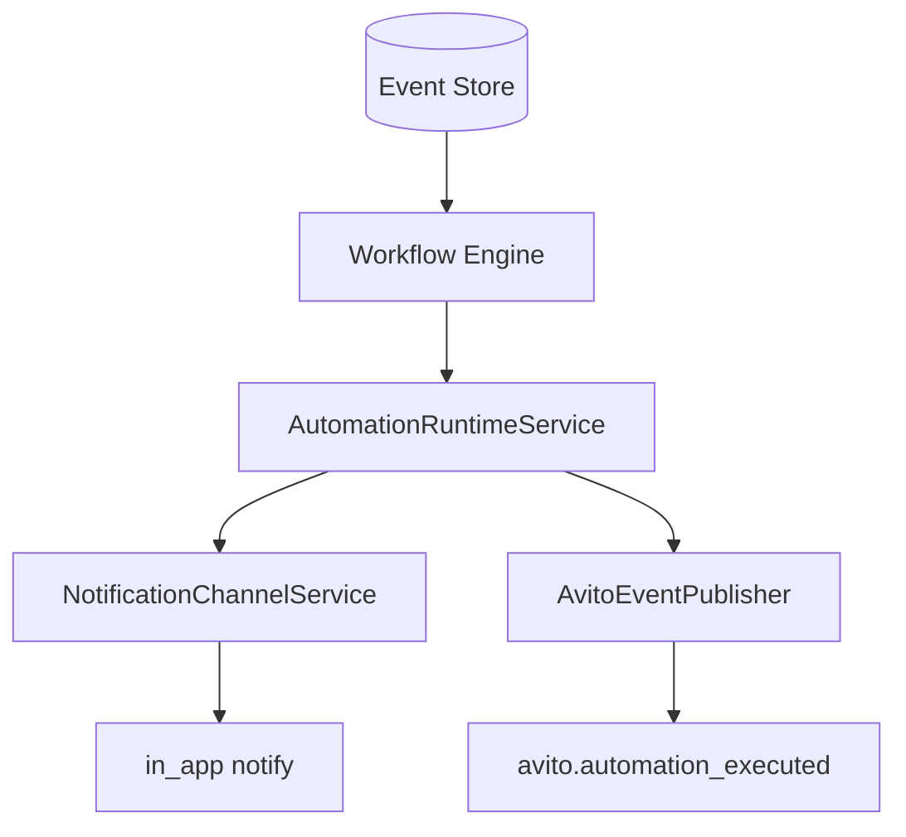

# Automation Center

Avito Automation Center wires marketplace event triggers to the **Workflow Engine** — builtin Avito alert workflows at bootstrap plus tenant-defined automations from Automation Studio.

## Runtime

Path: `apps/api/src/platform/avito/automation/automation-runtime.service.ts`

Bootstraps on `OnApplicationBootstrap`:

1. Register six builtin Avito trigger workflows
2. Load enabled automations from `AutomationReadModel`

## Builtin triggers

| Trigger ID | Events | Action |
| --- | --- | --- |
| `avito-new-message` | `MessageReceived` | In-app notification |
| `avito-ad-created` | `AdCreated` | In-app notification |
| `avito-price-changed` | `PriceChanged` | In-app notification |
| `avito-status-changed` | `AdStatusChanged` | In-app notification |
| `avito-recommendation` | `RecommendationGenerated` | In-app notification |
| `avito-promotion-end` | `PromotionActivated` | In-app notification |

## Saved automations

Definitions from Automation Studio (`GET/POST /api/commerce/automations`) stored in `AutomationReadModel`. Enabled automations register additional workflows with triggers from `definition.triggers[]`.

Studio UI: `/automations` (React Flow editor — see [automation-studio.md](./automation-studio.md)).

## Events

| Event | When |
| --- | --- |
| `avito.automation_executed` | Workflow run completed |

Commerce stream also records `automation.executed` for studio-created flows.

## Integration

- **Workflow Engine** — single registration point; no parallel automation runtime
- **Notification Center** — builtin triggers dispatch in-app alerts
- **Commerce Automation Studio** — CRUD for visual workflows; Avito runtime loads at boot

## Design notes

- Avito-specific triggers live in Avito platform — core Workflow Engine unchanged
- Saved automation execution increments `runCount` on read model
- External channel actions (Telegram, email) deferred to Notification Center stub adapters
