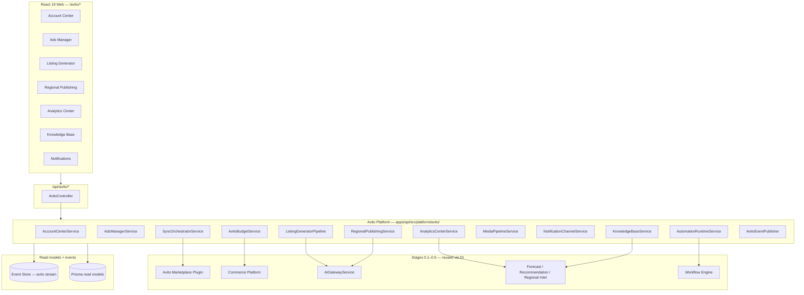
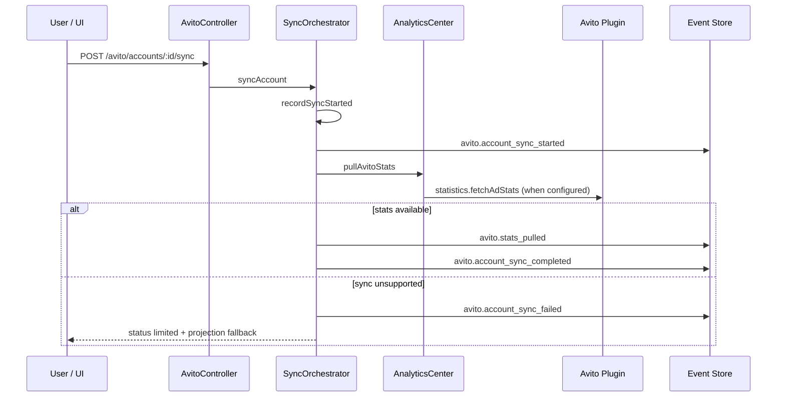

# Avito Enterprise Platform — Release 0.6

NEEKLO Avito Enterprise Platform is the **marketplace-specific layer** for Avito operations — account center, ads manager, listing generator, regional publishing, analytics, budget import, knowledge base, media pipeline, notifications, and automation triggers. Release 0.6 sits above Stage 1–2 Marketplace SDK, Stage 3 Intelligence, Release 0.4 Commerce, and Release 0.5 AI Platform; it does not duplicate metrics, forecast, inbox, or AI orchestration logic.

## Architecture

## Account sync flow

## Modules

| Module | Path | API | Web route |
| --- | --- | --- | --- |
| Account Center | `account/avito-account-center.service.ts` | `GET /avito/accounts`, `POST /avito/accounts/:id/sync` | `/avito/accounts` |
| Ads Manager | `ads/avito-ads-manager.service.ts` | `GET/POST /avito/ads*` | via `/chats`, listing studio |
| Listing Generator | `listing/listing-generator.pipeline.ts` | `POST /avito/listing/generate` | `/avito/listing` |
| Regional Publishing | `regional/regional-publishing.service.ts` | `POST /avito/regional/publish` | `/avito/regional` |
| Analytics Center | `analytics/avito-analytics-center.service.ts` | `GET /avito/analytics/*` | `/avito/analytics` |
| Budget Center | `budget/avito-budget.service.ts` | `GET/POST /avito/budget*` | `/budget` (commerce) |
| Knowledge Base | `knowledge/knowledge-base.service.ts` | `GET/POST /avito/knowledge*` | `/avito/knowledge` |
| Media Pipeline | `media/media-pipeline.service.ts` | `GET /avito/media/*` | `/ai/media` |
| Notification Center | `notifications/notification-channel.service.ts` | `GET/PUT /avito/notifications/*` | `/avito/notifications` |
| Automation Center | `automation/automation-runtime.service.ts` | via Workflow + `/commerce/automations` | `/automations` |
| AI Sales Agent | Commerce `SalesAgentService` | `POST /avito/agent/reply` | `/chats` |
| Dashboard | controller aggregate | `GET /avito/dashboard` | Account Center |

## Official Avito API alignment

Capabilities declared in `@neeklo/marketplace-avito` plugin (`apps/api/src/plugins/avito/avito-marketplace.plugin.ts`):

| Capability | Supported | Notes |
| --- | --- | --- |
| identity / account | ✅ | OAuth client_credentials |
| messaging | ✅ | Messenger API send |
| statistics | ✅ | `/stats/v1/accounts/{id}/items` |
| webhooks | ✅ | Message payload parser |
| health | ✅ | Auth probe |
| publication | ❌ deferred | Autoload module — local drafts only |
| promotion | ❌ deferred | No official REST in this release |
| sync (full catalog) | ❌ deferred | Projection + manual import |

## Event catalog

All Avito facts append to aggregate stream `avito`. Schemas in `packages/contracts/src/events/avito-catalog.ts`.

| Event | When |
| --- | --- |
| `avito.account_linked` | Account connected |
| `avito.account_sync_*` | Sync lifecycle |
| `avito.stats_pulled` | API stats ingested |
| `avito.listing_pipeline_*` | Listing Generator steps |
| `avito.regional_draft_created` | Regional draft ad |
| `avito.regional_publish_planned` | Batch planned (draft mode) |
| `avito.knowledge_document_uploaded` | KB upload |
| `avito.knowledge_chunk_indexed` | Chunk indexing |
| `avito.media_asset_stored` | Media job output |
| `avito.notification_dispatched` | Channel dispatch |
| `avito.automation_executed` | Workflow trigger fired |
| `avito.budget_imported` | Manual/CSV spend |
| `avito.webhook_received` | Inbound webhook |

## Design principles

- **Marketplace-specific layer, not core fork** — Avito logic under `platform/avito/`; core remains marketplace-agnostic
- **Plugin-first integration** — REST calls via `AvitoMarketplacePlugin`, not hardcoded in controllers
- **No duplicate intelligence** — Analytics delegates to `ForecastEngine`, `RecommendationEngine`, `RegionalIntelligenceEngine`
- **No duplicate commerce** — Budget, inbox, agent, jobs reuse Commerce Platform services
- **Single AI entry** — Listing Generator and Sales Agent route through `AiGatewayService`
- **Honest capability limits** — Publication/autoload deferred; drafts + manual export documented
- **Event-sourced facts** — `avito.*` events + read models for queries
- **Tenant isolation** — all read models scoped by `tenantId`

## ADR summary

See [ADR-015](./decision-records.md#adr-015-avito-enterprise-as-marketplace-specific-layer-release-06) — Avito Enterprise as marketplace-specific layer (Release 0.6).

## See also

- [ads-manager.md](./ads-manager.md) · [listing-generator.md](./listing-generator.md) · [regional-publishing.md](./regional-publishing.md)
- [ai-sales-agent.md](./ai-sales-agent.md) · [analytics-center.md](./analytics-center.md) · [budget-center.md](./budget-center.md)
- [media-pipeline.md](./media-pipeline.md) · [notification-center.md](./notification-center.md) · [automation-center.md](./automation-center.md)
- [knowledge-base.md](./knowledge-base.md)
- [commerce-platform.md](./commerce-platform.md) · [ai-platform.md](./ai-platform.md) · [marketplace-sdk.md](./marketplace-sdk.md)
