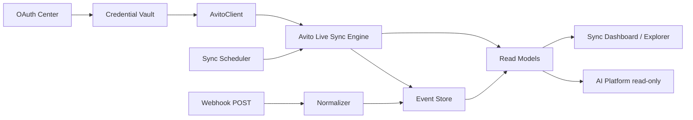

# Avito Sync Platform (Phase A3)

Avito Live Platform delivers post-OAuth synchronization on top of the existing OAuth Center, Credential Vault, Event Store, and CQRS stack — without modifying those subsystems.

## Architecture

## Components

| Component | Path |
| --- | --- |
| Sync Engine | `apps/api/src/platform/avito-live/sync/avito-live-sync-engine.service.ts` |
| Scheduler | `apps/api/src/platform/avito-live/sync/avito-live-scheduler.service.ts` |
| Platform API | `apps/api/src/platform/avito-live/avito-live-platform.service.ts` |
| REST API | `apps/api/src/modules/avito/avito-live.controller.ts` |
| Webhook ingress | `apps/api/src/modules/webhooks/avito-webhook.controller.ts` |
| UI | `apps/web/src/pages/avito/avito-live-page.tsx` |

## Post-OAuth bootstrap

When an account reaches `ready` or `live`, the scheduler:

1. Ensures all sync workers exist in `AvitoLiveSyncWorkerReadModel`
2. Enqueues a full sync (profile → items → … → api catalog)
3. Processes the in-memory queue

Manual sync: `POST /api/avito/live/sync?accountId=` or `POST /api/avito/accounts/:id/sync`.

## Read models

- `AvitoLiveSyncWorkerReadModel` — per-worker state, intervals, retry
- `AvitoLiveSnapshotReadModel` — domain payloads (profile, items, messenger, …)
- `AvitoWebhookConfigReadModel` — webhook URL, history
- `AvitoLiveRequestLogReadModel` — request ID, correlation ID, latency, rate limits
- `AdReadModel` — items synced from official `GET /core/v1/items`

## Domain events (after sync)

`ProfileUpdated`, `ItemsUpdated`, `ChatsUpdated`, `StatsUpdated`, `RatingsUpdated`, `TariffUpdated`, `PromotionUpdated`, `AutoloadUpdated`, `WebhookUpdated`, `SyncWorkerCompleted`.

## Official API only

Workers are defined in `avito-official-endpoints.ts` from Avito OpenAPI (`docs/avito-openapi/`). Missing capabilities are marked `unavailable` or `limited` — never emulated.

## AI integration

AI reads **read models only**. It never calls Avito API directly.

## Related docs

- [sync-engine.md](./sync-engine.md) — Avito Live sync engine
- [sync-workers.md](./sync-workers.md) — worker catalog
- [sync-dashboard.md](./sync-dashboard.md)
- [webhook-center.md](./webhook-center.md)
- [marketplace-explorer.md](./marketplace-explorer.md)
- [api-usage-center.md](./api-usage-center.md)
- [health-center.md](./health-center.md)
- [timeline.md](./timeline.md)
