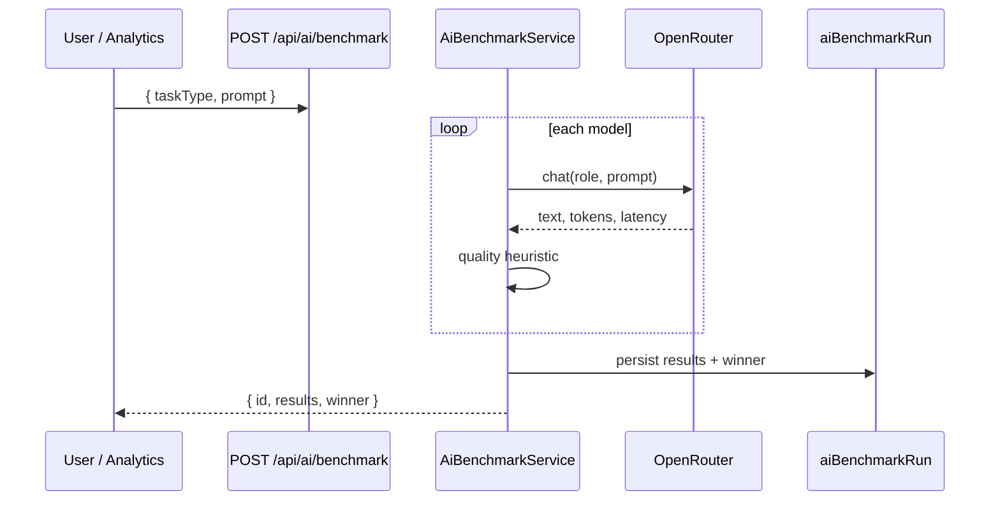

# AI Benchmark

`AiBenchmarkService` compares **multiple LLM providers** on the same prompt and task type — results stored in `aiBenchmarkRun` for model selection decisions.

## Benchmark flow



## Default model set

```typescript
['openai/gpt-4o-mini', 'anthropic/claude-3.7-sonnet', 'google/gemini-2.0-flash']
```

Role mapping: `analytics` → analytics role; others → chat.

## Quality heuristic (0.5)

| Condition | quality |
| --- | --- |
| Response length &gt; 10 | 0.8 |
| else | 0.3 |
| API error | 0, `success: false` |

Winner = highest quality among successful runs.

## API

```
POST /api/ai/benchmark
Body: { taskType: string, prompt: string }
Permission: AnalyticsRead
```

## Use cases

- Tenant picks default model before setting `OrganizationReadModel.aiSettings`
- Validate [Router](./ai-platform.md) defaults after prompt changes
- Compare cost/latency tradeoffs (extend with [Cost Center](./ai-cost-center.md) data)

## Future

- Persist token cost per benchmark arm
- Auto-update router from benchmark winners (with guardrails)
- Task-type-specific suites (listing, sales, OCR)

## ADR

**Decision:** Benchmark is on-demand, not continuous eval — avoids runaway API spend.

**Consequences:**
- (+) Explicit operator control
- (-) Production drift undetected until scheduled benchmarks added

## Path

`apps/api/src/platform/ai-platform/learning/learning-engines.service.ts` (`AiBenchmarkService`)

## See also

- [evaluation-engine.md](./evaluation-engine.md) · [optimization-engine.md](./optimization-engine.md) · [ai-cost-center.md](./ai-cost-center.md)
