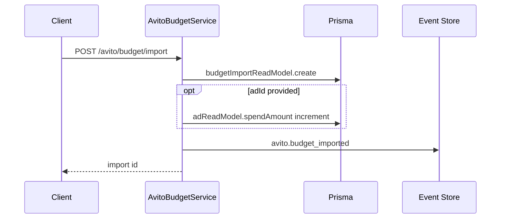

# Budget Center — Avito extensions

Avito Budget Center extends Commerce Budget Center with **manual and CSV spend import** when Avito billing API is unavailable. Summary queries delegate to shared `BudgetCenterService` — no duplicate ROI/ROAS formulas.

## API

| Method | Path | Purpose |
| --- | --- | --- |
| `GET` | `/api/avito/budget` | Spend summary (delegates to Commerce) |
| `POST` | `/api/avito/budget/import` | Import spend row |
| `GET` | `/api/avito/budget/imports` | Recent imports |

Commerce baseline: `GET /api/commerce/budget` — same summary service.

Path: `apps/api/src/platform/avito/budget/avito-budget.service.ts`

## Import flow

## Input

`budgetImportSchema`: `source` (`manual` \| `csv` \| `api`), `amount`, `category`, optional `adId`, `regionId`, `note`.

## Summary metrics

Delegated to `BudgetCenterService.getSummary()`:

totalSpend, totalRevenue, ROI, ROAS, byRegion[], byAd[]

Source: `AdReadModel` + `OrganizationReadModel.budgetTotal` + `MetricsEngine` formulas (see Commerce [budget-center](./commerce-platform.md#modules) module table).

## Events

| Event | When |
| --- | --- |
| `avito.budget_imported` | Manual/CSV/API import recorded |

Read model: `BudgetImportReadModel` — drives `dataSource: mixed` in Analytics Center when imports exist.

## Design notes

- **Single metrics source** — import increments `spendAmount` on ads; Analytics reads same projection
- **No Avito billing API** in 0.6 — imports bridge the gap until official billing sync
- **Future** — link AI Cost Center hard caps to Budget Center (ADR-014 backlog)
