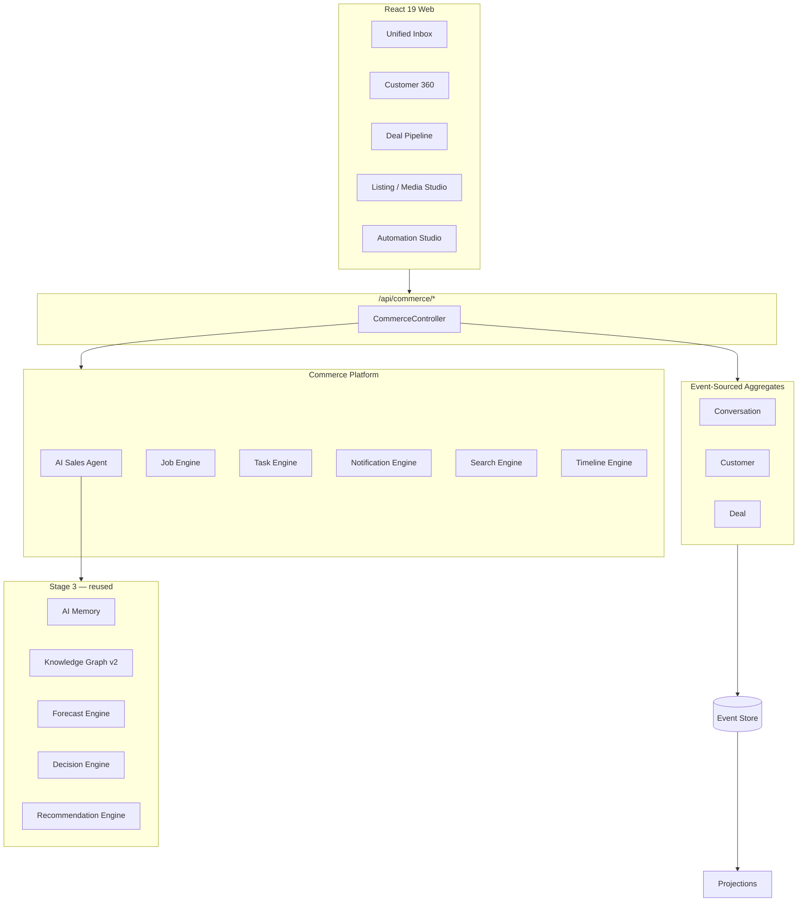

# Commerce Platform — Release 0.4

NEEKLO Commerce Platform is the operational layer for marketplace sales — unified inbox, customer profiles, deal pipeline, listing/media studios, AI sales agent, and operational centers (budget, regions, tasks, calendar, notifications).

## Architecture

## Modules

| Module | API | Aggregate |
| --- | --- | --- |
| Unified Inbox | `GET/POST /commerce/inbox*` | `conversation` |
| Customer 360 | `GET/POST /commerce/customers*` | `customer` |
| Deal Pipeline | `GET/POST /commerce/deals*` | `deal` |
| Listing Studio | `GET /commerce/listings/:id/studio` | `ad` (existing) |
| Media Studio | `POST /commerce/media/jobs` | `commerce` stream |
| AI Sales Agent | `POST /commerce/agent/*` | — |
| Budget Center | `GET /commerce/budget` | Metrics Warehouse |
| Regional Center | `GET /commerce/regions` | Regional Intelligence |
| Automation Studio | `GET/POST /commerce/automations` | Workflow Engine |
| Notification Center | `GET /commerce/notifications` | read model |
| Activity Timeline | `GET /commerce/timeline` | Event Store |
| Task Center | `GET /commerce/tasks` | read model |
| Search Everywhere | `GET /commerce/search` | SearchIndex |

## Design principles

- **No CRM reimplementation** — operational OS for marketplace sales
- **Platform-agnostic inbox** — channel hidden in UI, unified thread UX
- **All mutations → Event Store** — conversations, customers, deals
- **Intelligence reuse** — no duplicate metrics/forecast/decision logic
- **Workflow Engine** — automations registered at bootstrap

See also: [unified-inbox.md](./unified-inbox.md), [customer-360.md](./customer-360.md), [deal-pipeline.md](./deal-pipeline.md)
