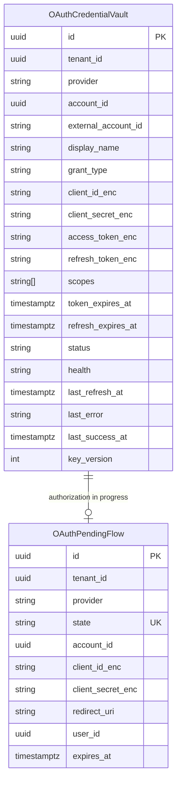
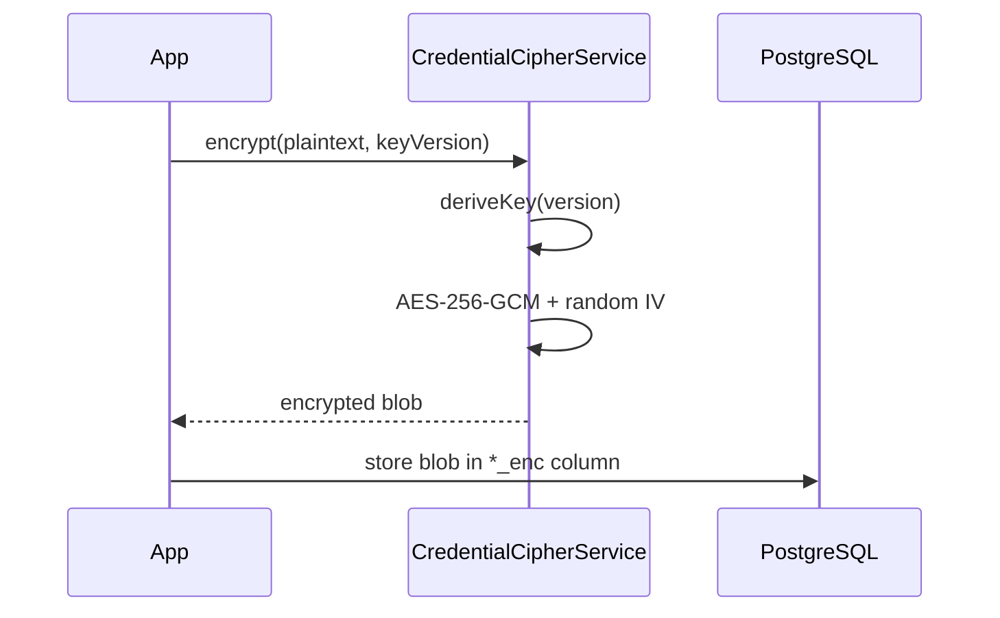
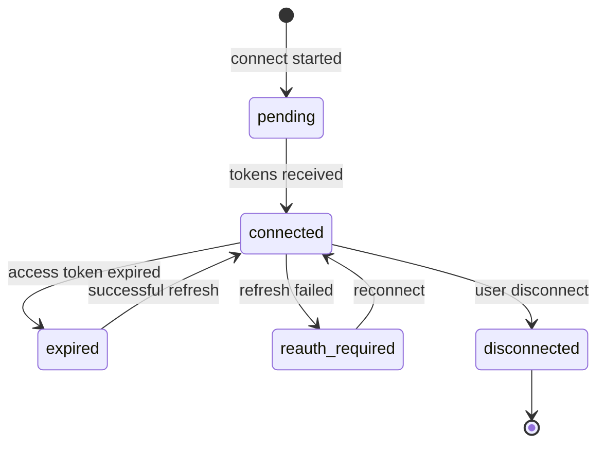

# Credential Vault

Encrypted storage for marketplace OAuth secrets — **never plaintext**, **never `.env` tokens**.

## Data model

## Stored fields

| Field | Encrypted | Exposed in UI |
|-------|-----------|--------------|
| Client ID | ✅ | Masked (never returned via API) |
| Client Secret | ✅ | Never |
| Access Token | ✅ | Never (only expiry shown) |
| Refresh Token | ✅ | Never |
| Scopes | ❌ | ✅ |
| Status / Health | ❌ | ✅ |
| Expires At | ❌ | ✅ |

## Encryption

- Algorithm: **AES-256-GCM**
- Key derivation: `SHA-256(OAUTH_VAULT_MASTER_KEY + ":v" + keyVersion)`
- Blob format: `version:iv:tag:ciphertext` (base64url)

## Key rotation

1. Increment `OAUTH_VAULT_KEY_VERSION` in environment
2. Call `CredentialVaultService.rotateAllKeys(tenantId)` (admin operation)
3. Each blob is decrypted with old version and re-encrypted with new version

## Unique constraint

`(tenantId, provider, accountId)` — one credential row per marketplace account.

## Status lifecycle

## Implementation

- Service: `apps/api/src/platform/oauth-center/vault/credential-vault.service.ts`
- Cipher: `apps/api/src/platform/oauth-center/encryption/credential-cipher.service.ts`
- Schema: `apps/api/prisma/schema.prisma` → `OAuthCredentialVault`, `OAuthPendingFlow`
