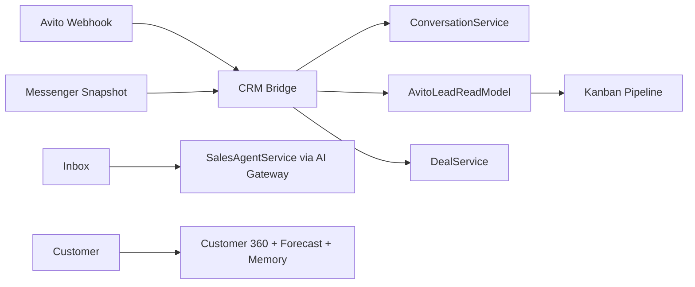

# Avito CRM Platform (Phase A5)

Enterprise Sales Center поверх Commerce Platform (Release 0.4) + Avito Live snapshots.

## Route

- UI: `/avito/sales`
- API: `/api/avito/sales/*`

## Architecture

## Read models (new)

- `AvitoLeadReadModel`
- `AvitoSalesAgentConfigReadModel`
- `AvitoFollowUpReadModel`
- `AvitoDealAnalysisReadModel`
- `AvitoSalesDocumentReadModel`

Uses existing: `ConversationReadModel`, `CustomerReadModel`, `DealReadModel`, `TaskReadModel`, `CalendarEventReadModel`, `NotificationReadModel`.

## Integration rules

- AI reads read models only — never Avito API directly
- Outbound send via existing `ConversationService` (Avito API send = future wiring through adapter)
- Webhook + scheduler sync messenger → CRM

## Final audit (Phase A5)

| Area | Status | Notes |
| --- | --- | --- |
| CRM / Lead Center | ✅ | Webhook + messenger sync → `AvitoCrmBridgeService` → leads |
| Pipeline | ✅ | Kanban + DnD columns via `@dnd-kit` + `PUT /pipeline/move` |
| AI Agent / Smart Replies | ✅ | `AiGatewayService` + per-account config read model |
| Smart Inbox | ✅ | 3-pane UI, Commerce read models |
| Forecast / Memory | ✅ | `ForecastEngine`, `AiMemoryEngine` in Customer 360 |
| Task / Calendar / Docs | ✅ | Delegates to Commerce engines + S3 document center |
| Follow-up / Notifications | ✅ | Scheduled rules 1/3/7/30 days |
| Executive Dashboard | ✅ | Conversion, funnel, ROI from read models |
| Documentation | ✅ | 9 docs in `docs/` |
| Performance | ✅ | Read-model queries, capped lists (500 leads, 30 msgs) |

**Known limitation:** outbound Avito messenger send remains local via `ConversationService` — Avito API adapter wiring is a future enhancement.

## Docs

[sales-center.md](./sales-center.md) · [lead-center.md](./lead-center.md) · [pipeline.md](./pipeline.md) · [customer360.md](./customer360.md) · [smart-inbox.md](./smart-inbox.md) · [sales-agent.md](./sales-agent.md) · [followup.md](./followup.md) · [deal-analyzer.md](./deal-analyzer.md)
