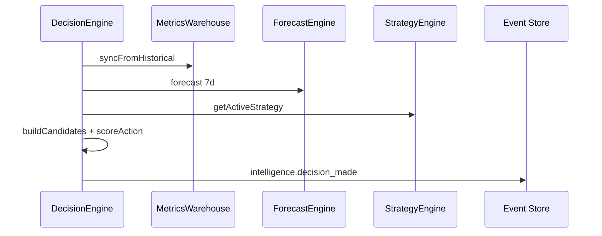

# Decision Engine

Synthesizes **metrics**, **forecasts**, **knowledge graph context**, and **active strategy** into ranked decisions.

## Inputs

| Source | Data |
| --- | --- |
| Metrics Warehouse | CTR, ROI, opportunity score, cost |
| Forecast Engine | View/contact trends |
| Strategy Engine | Weight presets per strategy type |
| Knowledge Graph v2 | Entity neighborhood (BFS depth 2) |

## Decision actions

All actions from `DecisionAction` enum in contracts:

- boost, change_price, add_photos, replace_cover, rewrite_description
- stop_promotion, increase_budget, reallocate_budget
- add_region, remove_region

## Output

Every decision:

1. Persisted to `DecisionReadModel` (status: pending)
2. Emitted as `intelligence.decision_made` on aggregate stream `intelligence`

Apply/dismiss emit `decision_applied` / `decision_dismissed`.

## Strategy weighting

`StrategyEngine.scoreAction()` maps action + signals + weights → confidence score.
Decisions below 0.3 confidence are filtered out.

## API

- Decisions included in `GET /api/intelligence/dashboard`
- `POST /api/intelligence/decisions/:id/apply`
- `POST /api/intelligence/decisions/:id/dismiss`

## Sequence

