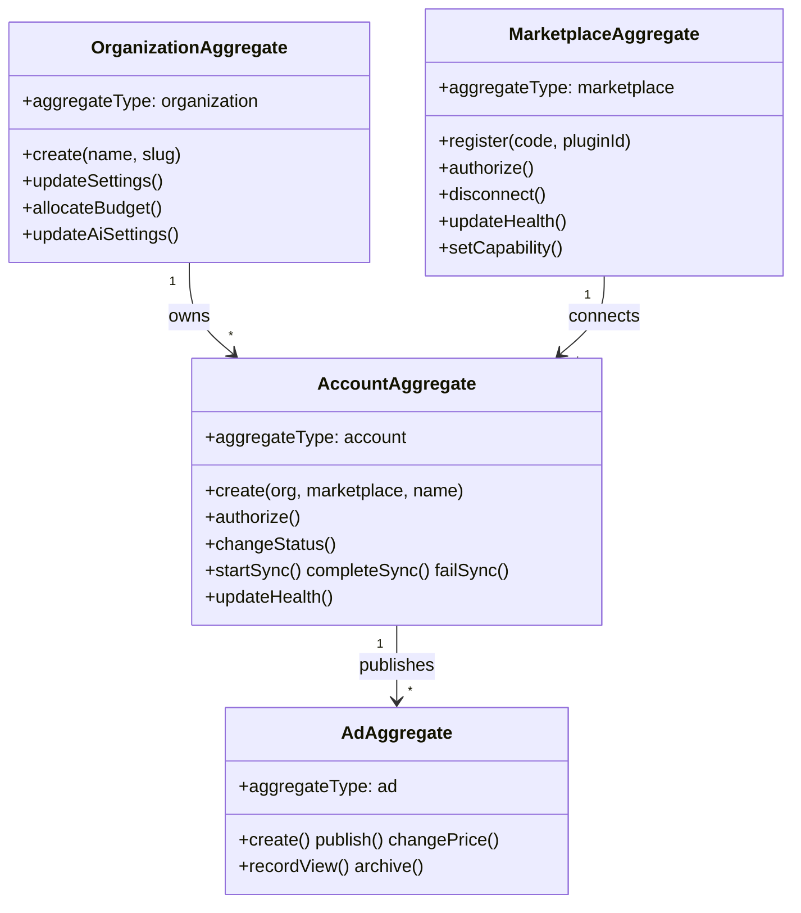

# Domain Model

## Aggregates

## Organization ↔ Tenant mapping

`OrganizationAggregate.id` maps 1:1 to existing `Tenant.id` for backward compatibility. No migration required for auth/users.

## Read models (projections)

| Projection | Source aggregate | Table |
| --- | --- | --- |
| `ad_read_model` | ad | `AdReadModel` |
| `account_read_model` | account | `AccountReadModel` |
| `marketplace_read_model` | marketplace | `MarketplaceReadModel` |
| `plugin_read_model` | marketplace events | `PluginReadModel` |

## Domain services

Located in `apps/api/src/platform/marketplace-core/services/`:

- `MarketplaceService` — list/connect/create
- `MarketplaceAuthorizationService` — account OAuth
- `MarketplaceSyncService` — trigger sync jobs
- `MarketplaceHealthService` — health probes
- `MarketplaceCapabilityService` — capability introspection
- `MarketplaceStatisticsService` — stats fetch
- `MarketplaceRecommendationService` — recommendation CRUD
- `MarketplaceForecastService` — CTR/ROI/sale forecasts
- `MarketplaceBudgetService` — spend aggregation
- `MarketplacePublicationService` — publish with policies
- `MarketplaceModerationService` — moderation checks

## Domain policies

`MarketplacePolicyEngine` enforces rules before publication:

- Account must be authorized
- Limits not exceeded
- At least one photo
- Moderation not rejected
- Region allowed

Violations throw `DomainError('policy_violation', ...)`.
