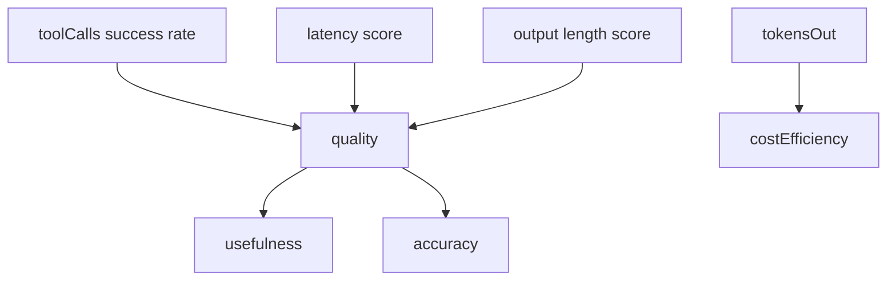
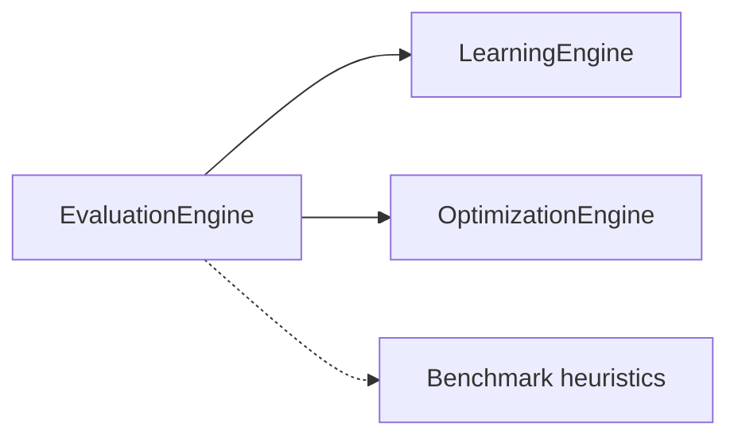

# Evaluation Engine

`EvaluationEngine` scores **every AI response** after model completion — quality, usefulness, accuracy, cost efficiency, and latency. Results persist to `aiEvaluationReadModel` and emit `ai.evaluation_recorded`.

## Scoring model

| Metric | Formula (simplified) |
| --- | --- |
| `toolSuccessRate` | successful tools / total tools (or 1) |
| `latencyScore` | `max(0, 1 - latencyMs/30000)` |
| `lengthScore` | 0.9 if 20–5000 chars, else 0.6 |
| `quality` | `0.3×tool + 0.2×latency + 0.5×length` |
| `usefulness` | `quality × 0.95` |
| `accuracy` | `quality × 0.9` |
| `costEfficiency` | `min(1, 500/tokensOut)` |

## Downstream consumers

Optimization triggers when `quality < 0.5` — creates learning entry suggesting prompt/model review.

## Future: LLM-as-judge

`AiTaskType.EVALUATION` routed to cheap summary model via [Router](./ai-platform.md) for semantic scoring — heuristic engine is Release 0.5 baseline.

## ADR

**Decision:** Heuristic evaluation runs synchronously post-run — zero extra LLM cost by default.

**Consequences:**
- (+) Predictable cost, always-on
- (-) Semantic quality not fully captured until LLM judge added

## Path

`apps/api/src/platform/ai-platform/learning/learning-engines.service.ts` (`EvaluationEngine`)

## See also

- [learning-engine.md](./learning-engine.md) · [optimization-engine.md](./optimization-engine.md) · [benchmark.md](./benchmark.md)
