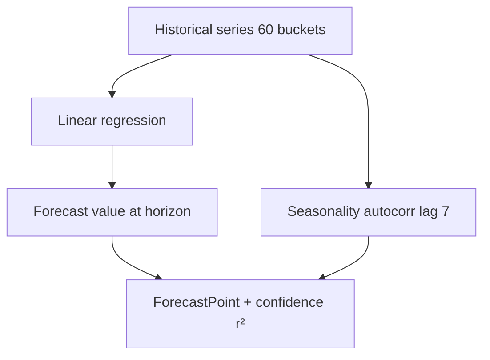

# Forecast Engine

Predicts future performance from **historical warehouse data only**. No hardcoded growth multipliers.

## Predicted signals

| Signal | Historical series |
| --- | --- |
| Views | views |
| Contacts | contacts |
| Revenue / ROI proxy | revenue, spend |
| CTR / popularity | derived from contacts/views in provider extensions |
| Seasonality | autocorrelation at lag 7 |
| Interest rise/fall | trend from regression slope |

## Pluggable provider

```typescript
export const FORECAST_PROVIDER = Symbol('FORECAST_PROVIDER');

export interface ForecastProvider {
  readonly name: string;
  predict(request: ForecastRequest): Promise<ForecastResult>;
}
```

Default: `TimeSeriesForecastProvider` — linear regression + seasonality detection.

Replace with ML model by binding a new provider in `IntelligenceModule`:

```typescript
{ provide: FORECAST_PROVIDER, useClass: MlForecastProvider }
```

**Public API (`ForecastEngine.forecast`) remains unchanged.**

## Output

- Persisted to `ForecastSnapshot`
- Event: `intelligence.forecast_generated`
- Linked in Knowledge Graph v2

## API

`GET /api/intelligence/forecast?entityType=ad&entityId={id}&horizonDays=7`

## Algorithm (v1)


