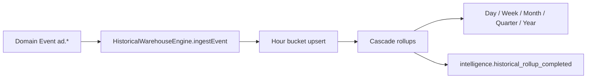

# Historical Data Warehouse

Event Store is the **source of truth** for domain events. The Historical Warehouse is a **read-optimized analytics layer** for time-series counters used by forecasting and metrics.

## Granularities

Automatic cascade rollups:

```
HOUR → DAY → WEEK → MONTH → QUARTER → YEAR
```

Implemented in `granularity.utils.ts` via `ROLLUP_CHAIN`.

## Stored counters

| Counter | Source events |
| --- | --- |
| views | `ad.view_recorded` |
| contacts | `ad.contact_recorded` |
| favorites | `ad.favorite_added` |
| messages | `conversation.message_received` |
| spend | `ad.budget_spent` |
| revenue | `ad.ad_sold` |
| events | all ingested events |

## Data flow



## Storage

Prisma model: `HistoricalAggregate` — unique key `(tenantId, entityType, entityId, granularity, periodStart)`.

## Design rules

- No UI-side aggregation — all rollups happen in the pipeline.
- Rollup completion emits `IntelligenceEventType.HistoricalRollupCompleted` via `IntelligenceEventPublisher`.
- Event Store streams are **not** queried for dashboard history; use `/api/intelligence/history`.
