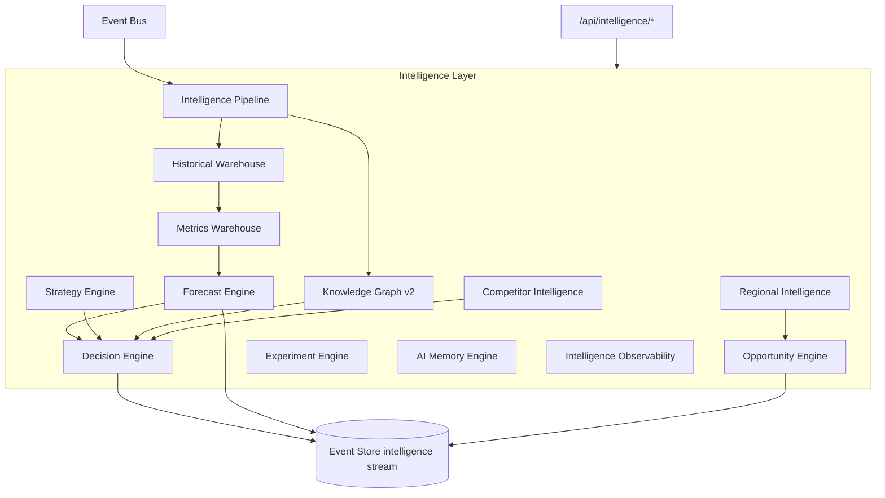
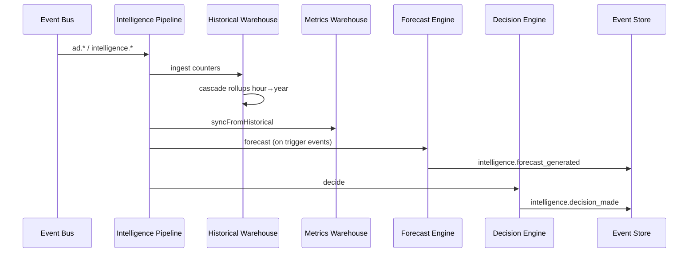

# Intelligence Engine — Stage 3

The **Intelligence Layer** is the analytical and decision-making core of NEEKLO Marketplace OS. It sits above Event Store projections and Stage 2 engines, consuming the event stream to build warehouses, forecasts, and actionable decisions.

## Architecture

## Event flow

## Components

| Engine | Path | Responsibility |
| --- | --- | --- |
| Historical Warehouse | `warehouse/historical-warehouse.engine.ts` | Hour→year rollups from domain events |
| Metrics Warehouse | `warehouse/metrics-warehouse.engine.ts` | Full metrics vector per bucket |
| Forecast Engine | `forecast/` | Pluggable `ForecastProvider` (default: time-series regression) |
| Decision Engine | `decision/decision.engine.ts` | Strategy-weighted decisions as domain events |
| Strategy Engine | `strategy/strategy.engine.ts` | Tenant strategy profiles |
| Regional Intelligence | `regional/` | Region ranking + opportunity index |
| Competitor Intelligence | `competitor/` | Price/photo/description/rank history |
| Opportunity Engine | `opportunity/` | Scans regions + ads for opportunities |
| Experiment Engine | `experiment/` | A/B/C multivariate tests |
| AI Memory Engine | `memory/` | Long-term structured memory |
| Knowledge Graph v2 | `knowledge-graph/` | BFS traversal + intelligence event ingestion |
| Pipeline | `pipeline/intelligence-pipeline.service.ts` | Orchestration consumer group |

## API

All routes under `/api/intelligence/*` (see `modules/intelligence/intelligence.controller.ts`).

## Scalability notes

- Warehouses are **partitioned by tenant + entity** with indexed time buckets.
- Pipeline uses consumer group `intelligence-pipeline` with checkpoint table.
- Forecast provider is swappable via `FORECAST_PROVIDER` DI token — no API change for ML upgrade.
- No marketplace-specific logic in intelligence core.

## Related docs

- [historical-warehouse.md](./historical-warehouse.md)
- [metrics-warehouse.md](./metrics-warehouse.md)
- [forecast-engine.md](./forecast-engine.md)
- [decision-engine.md](./decision-engine.md)
- [regional-intelligence.md](./regional-intelligence.md)
- [competitor-intelligence.md](./competitor-intelligence.md)
- [strategy-engine.md](./strategy-engine.md)
- [knowledge-graph-v2.md](./knowledge-graph-v2.md)
