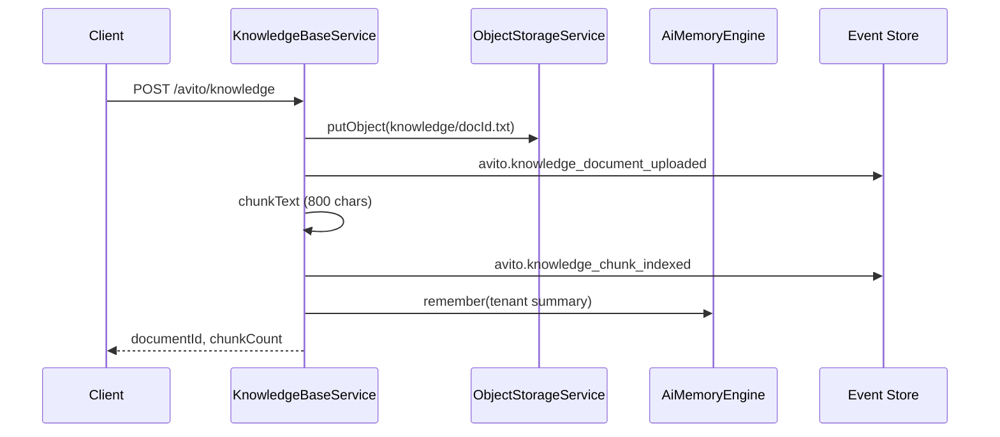

# Knowledge Base

Tenant document store for Avito sales — upload, chunk indexing, keyword retrieval, and RAG context injection into the AI Sales Agent. Documents stored in object storage; facts event-sourced on `avito` stream.

## API

| Method | Path | Purpose |
| --- | --- | --- |
| `GET` | `/api/avito/knowledge` | List documents |
| `POST` | `/api/avito/knowledge` | Upload document |
| `GET` | `/api/avito/knowledge/search` | Retrieve chunks (`q`) |

Path: `apps/api/src/platform/avito/knowledge/knowledge-base.service.ts`

## Upload pipeline

## Input

`knowledgeUploadSchema`: `name`, `category`, `content`, `mimeType`.

## Retrieval

- `retrieve(tenantId, query)` — keyword match on first token; fallback to first N chunks
- `buildRagContext(tenantId, query)` — top 5 chunks formatted for Sales Agent prompt injection

Read models: `KnowledgeDocumentReadModel`, `KnowledgeChunkReadModel` (embeddings array reserved for future vector search).

## Events

| Event | When |
| --- | --- |
| `avito.knowledge_document_uploaded` | Document stored |
| `avito.knowledge_chunk_indexed` | Chunks persisted |

## Integration

| Consumer | Usage |
| --- | --- |
| AI Sales Agent | `buildRagContext` before Gateway CHAT run |
| AI Memory | `AiMemoryEngine.remember` on upload — Stage 3 bridge |
| Object storage | Selectel-compatible blob store |

## Design notes

- **Not a duplicate Knowledge Graph** — KB is tenant-authored docs; KG v2 remains event-derived intelligence
- **Embeddings deferred** — chunk model ready; keyword retrieval in 0.6
- **Agent-safe** — RAG bounded to 5 chunks; no raw event log exposure

## Web UI

`/avito/knowledge` — document list, upload form, search.

See also: [knowledge-graph-v2.md](./knowledge-graph-v2.md), [ai-sales-agent.md](./ai-sales-agent.md).
