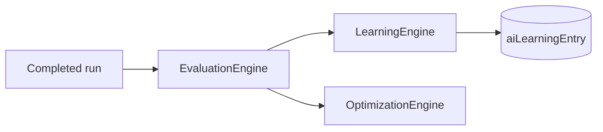

# Learning Engine

`LearningEngine` captures **continuous learning insights** from run outcomes — pairing task type, evaluation scores, and human-readable recommendations in `aiLearningEntry`.

## Pipeline position



## record logic

After each run, orchestrator calls:

```typescript
learning.record(tenantId, taskType, evalResult, runId);
```

| quality | insight |
| --- | --- |
| &gt; 0.8 | `Successful {taskType} pattern — quality X.XX` |
| else | `Suboptimal {taskType} — review prompt and tools` |

`confidence` = evaluation quality; `sourceRunId` links back to run.

## Events

Catalog includes `ai.learning_recorded` — optimization path writes category `optimization` entries directly to Prisma today.

## API

- `GET /api/ai/learning` — last 50 entries for tenant

## Future

- Feed learnings into Prompt Registry auto-tuning
- Cross-tenant anonymized patterns (enterprise)
- Wire `ai.learning_recorded` on every `record()`

## ADR

**Decision:** Learning is append-only insights, not model fine-tuning. Keeps platform provider-agnostic.

**Consequences:**
- (+) Safe, inspectable improvements
- (-) No automatic weight updates without explicit optimization rules

## Path

`apps/api/src/platform/ai-platform/learning/learning-engines.service.ts` (`LearningEngine`)

## See also

- [evaluation-engine.md](./evaluation-engine.md) · [optimization-engine.md](./optimization-engine.md) · [ai-platform.md](./ai-platform.md)
