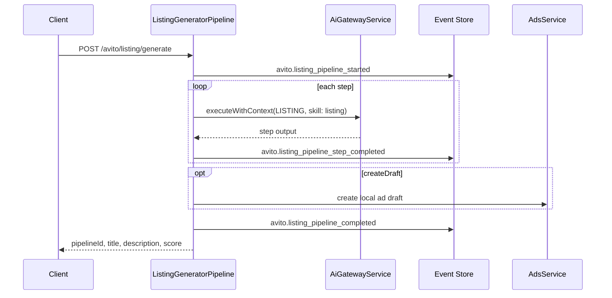

# Listing Generator

Multi-step AI pipeline that produces optimized Avito listings — research through final JSON output. Each step runs via AI Platform Gateway; progress is event-sourced on the `avito` stream.

## Pipeline steps

| Step | Purpose |
| --- | --- |
| `research` | Product and audience research |
| `title` | Optimized title (max 50 chars) |
| `description` | Compelling product copy |
| `seo` | Keywords and structure |
| `psychology` | Urgency, trust, benefits |
| `regional` | Region-specific adaptation |
| `quality` | Quality review + score |
| `final` | JSON `{ title, description, score }` |

Path: `apps/api/src/platform/avito/listing/listing-generator.pipeline.ts`

## Run lifecycle

## API

| Method | Path | Purpose |
| --- | --- | --- |
| `POST` | `/api/avito/listing/generate` | Run full pipeline |
| `GET` | `/api/avito/listing/pipelines` | List recent runs |
| `GET` | `/api/avito/listing/pipelines/:id` | Pipeline detail + steps |

Input schema: `listingGeneratorInputSchema` — `product`, optional `categoryId`, `regionId`, `createDraft`.

## Events

| Event | Payload highlights |
| --- | --- |
| `avito.listing_pipeline_started` | `pipelineId`, `productInput` |
| `avito.listing_pipeline_step_completed` | `step`, `outputPreview` |
| `avito.listing_pipeline_completed` | `adId`, `qualityScore` |

Read model: `ListingPipelineReadModel` — status, steps[], `finalTitle`, `finalDescription`, `qualityScore`.

## Integration

- **AI Platform** — `AiGatewayService.executeWithContext`, task `LISTING`, skill `listing`
- **Ads aggregate** — optional local draft via `AdsService.create` (not Avito publication)
- **No duplicate AI logic** — no direct OpenRouter calls; Gateway handles cost, observability, events

## Web UI

`/avito/listing` — product input, pipeline history, step progress.
