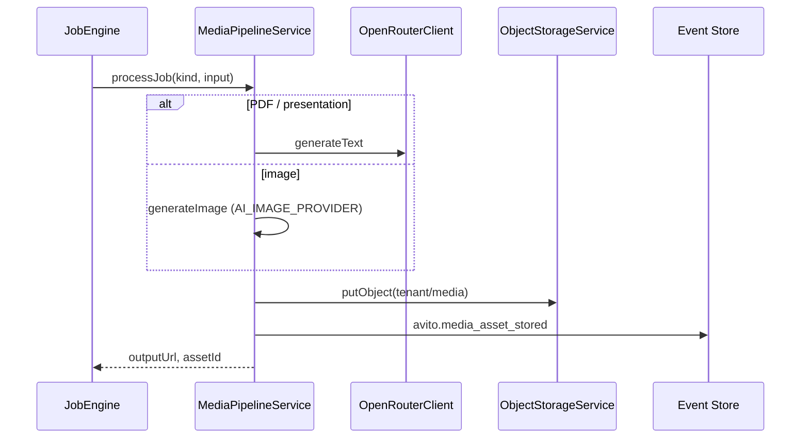

# Media Pipeline

AI Media Pipeline — image and document jobs processed via Commerce Job Engine, stored in Selectel-compatible object storage, tracked on the `avito` stream.

## API

| Method | Path | Purpose |
| --- | --- | --- |
| `GET` | `/api/avito/media/assets` | List stored assets (`kind` filter) |
| `GET` | `/api/avito/media/jobs` | List media jobs (Job Engine) |

Job submission: Commerce `POST /api/commerce/media/jobs` → `JobEngine` → `MediaPipelineService.processJob`.

Path: `apps/api/src/platform/avito/media/media-pipeline.service.ts`

## Job processing

## Supported kinds

| Kind | Output |
| --- | --- |
| Image jobs | PNG via provider (`stub` default, configurable) |
| `PDF`, `PRESENTATION` | PDF stub with generated text |

Read model: `MediaAssetReadModel` — `kind`, `storageKey`, `publicUrl`, linked `entityType` / `entityId` / `jobId`.

## Events

| Event | When |
| --- | --- |
| `avito.media_asset_stored` | Asset persisted to object storage |

## Integration

- **Object storage** — `ObjectStorageService` (Selectel S3-compatible)
- **Commerce Job Engine** — async job lifecycle, shared with Commerce Media Studio
- **AI Platform** — text generation via OpenRouter; image provider pluggable via env

## Web UI

- `/avito/notifications` — media asset gallery (read-only)
- `/ai/media` — AI media job submission (Commerce/AI routes)

See also: [media-studio.md](./media-studio.md).
