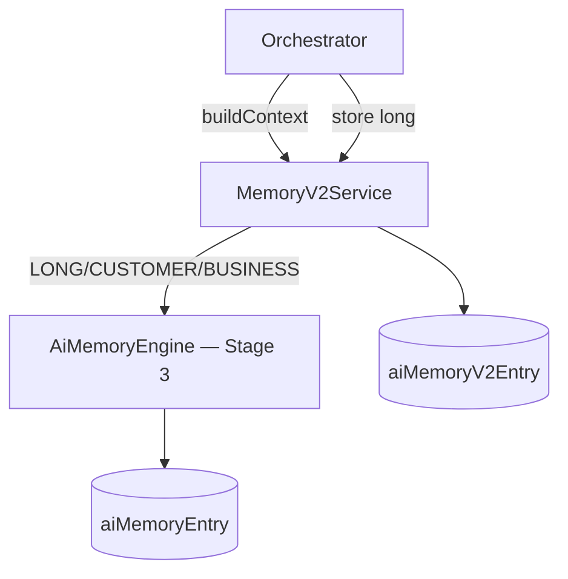

# Memory Engine v2

`MemoryV2Service` provides **multi-tier memory** for AI runs — short-lived session facts, long-term business memory, and integration with Stage 3 `AiMemoryEngine`.

## Memory tiers

From `packages/contracts/src/events/ai-catalog.ts`:

| Tier | TTL | Use case |
| --- | --- | --- |
| `short` | 1 hour | Ephemeral run context |
| `long` | none | Run summaries, patterns |
| `semantic` | none | Embeddings-ready (future) |
| `conversation` | none | Thread-scoped |
| `business` | none | Tenant policies |
| `marketplace` | none | Channel-specific |
| `customer` | none | Customer 360 |
| `knowledge` | none | KG-linked facts |

## Architecture



## buildContext

Resolves `context.subjectKind` / `context.subjectId` (defaults: `tenant` / `tenantId`):

1. Top 10 v2 entries by `importance`, non-expired
2. Stage 3 memory via `AiMemoryEngine.buildContext`

## store

After each completed run, orchestrator stores:

```typescript
memory.store(tenantId, 'long', 'ai_run', runId, outputPreview)
```

Long/customer/business tiers also call `v1.remember()` for backward compatibility with Intelligence pipeline.

## ADR

**Decision:** Memory v2 wraps v1 — no fork of memory logic. v2 adds tiering and TTL in `aiMemoryV2Entry`.

**Consequences:**
- (+) Commerce + Intelligence memory unified over time
- (-) Dual write until v1 deprecated

## Path

`apps/api/src/platform/ai-platform/memory/memory-v2.service.ts`

## See also

- [intelligence-engine.md](./intelligence-engine.md) · [customer-360.md](./customer-360.md) · [ai-orchestrator.md](./ai-orchestrator.md)
