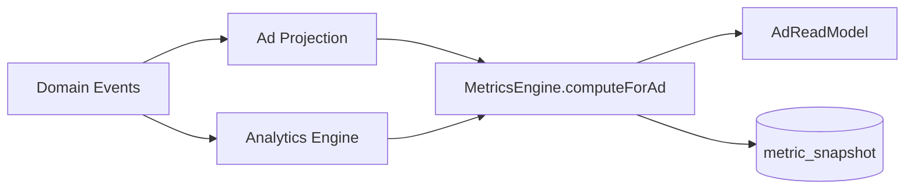

# Metrics Engine

`MetricsEngine` is the **single source of truth** for all derived metric calculations.

Location: `apps/api/src/platform/marketplace-core/metrics/metrics.engine.ts`

## Computed metrics

| Metric | Formula |
| --- | --- |
| CTR | contacts / views |
| ROI | (revenue - spend) / spend |
| ROAS | revenue / spend |
| Conversion | f(contacts, revenue) |
| Engagement | (favorites + messages) / views |
| CPA / CPC | spend / contacts |
| CPM | (spend / views) × 1000 |
| Response Time | from input |
| AI Score | from input |

## Usage

## Persistence

`MetricSnapshot` table stores time-series metric values per entity — append-only snapshots for analytics and forecasting.

## Rule

**UI and projections must not compute CTR/ROI locally.** Always delegate to MetricsEngine.

Stage 2 improvement: `AdProjection` now uses MetricsEngine (previously inline formulas).
