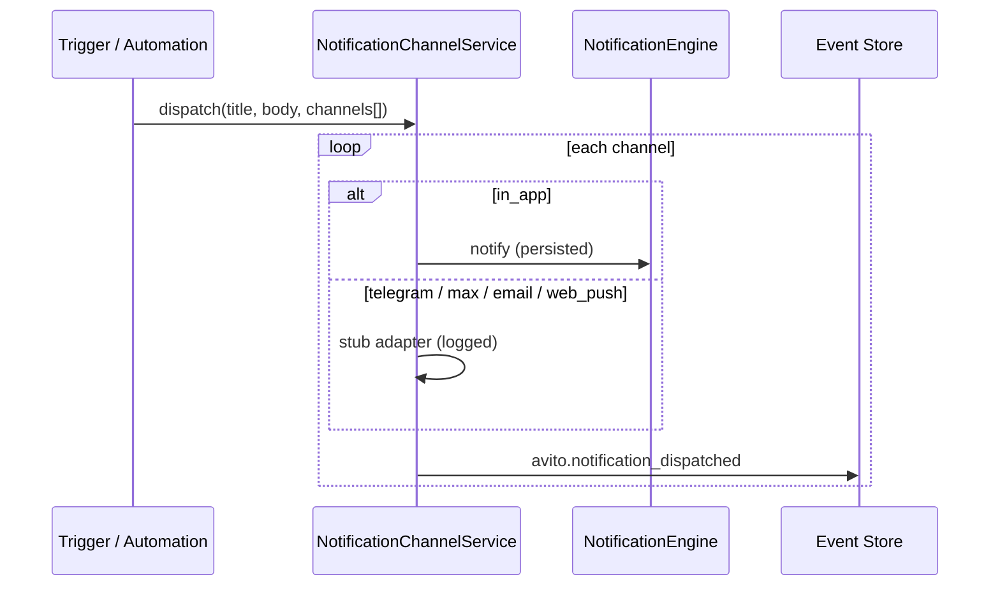

# Notification Center

Multi-channel notification dispatch for Avito operations — in-app (production-ready), plus Telegram, MAX, email, and web push (stub adapters). Channel config is tenant-scoped; automations route through this service.

## API

| Method | Path | Purpose |
| --- | --- | --- |
| `GET` | `/api/avito/notifications` | In-app notifications (`unread` filter) |
| `GET` | `/api/avito/notifications/channels` | Channel configuration |
| `PUT` | `/api/avito/notifications/channels` | Save channel config |

In-app list delegates to Commerce `NotificationEngine`.

Path: `apps/api/src/platform/avito/notifications/notification-channel.service.ts`

## Dispatch flow

## Channels

| Channel | Status | Config field |
| --- | --- | --- |
| `in_app` | ✅ Production | — |
| `telegram` | ⚠️ Stub | `telegramChatId` |
| `max` | ⚠️ Stub | `maxUserId` |
| `email` | ⚠️ Stub | `email` |
| `web_push` | ⚠️ Stub | `webPushEnabled` |

Read model: `NotificationChannelReadModel` — one row per tenant.

## Events

| Event | Payload |
| --- | --- |
| `avito.notification_dispatched` | `channel`, `notificationId`, `category`, `success` |

## Integration

- **Automation Center** — builtin triggers call `dispatch(..., ['in_app'])`
- **Commerce notifications** — shared read model for inbox badge counts
- **No duplicate notification store** — in-app uses `NotificationEngine`

## Web UI

`/avito/notifications` — in-app feed + channel settings + media assets panel.
