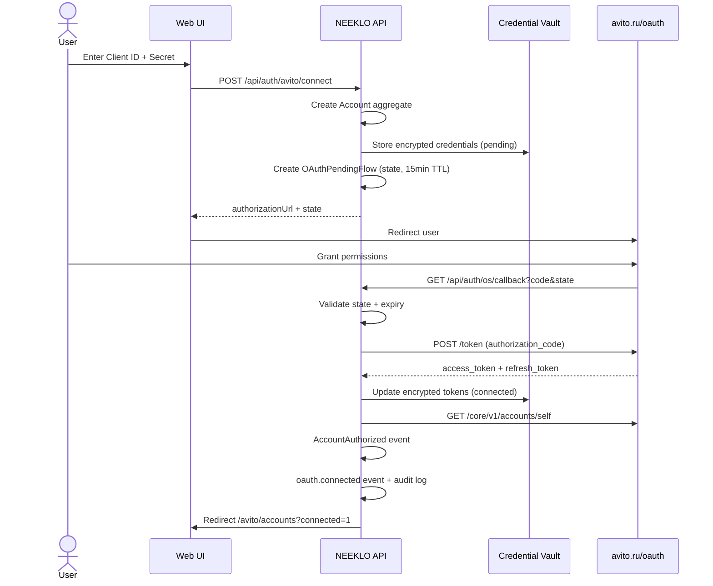
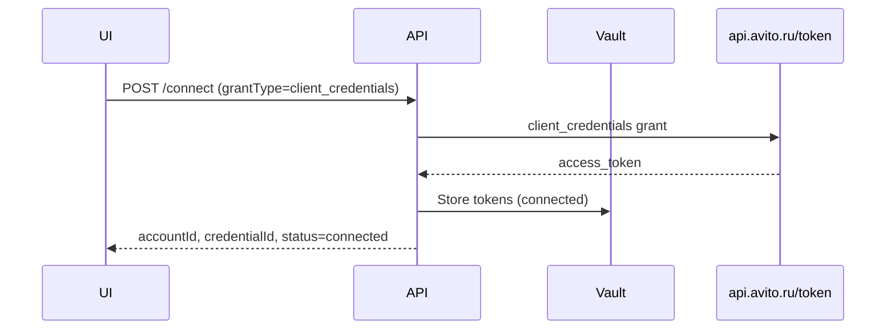
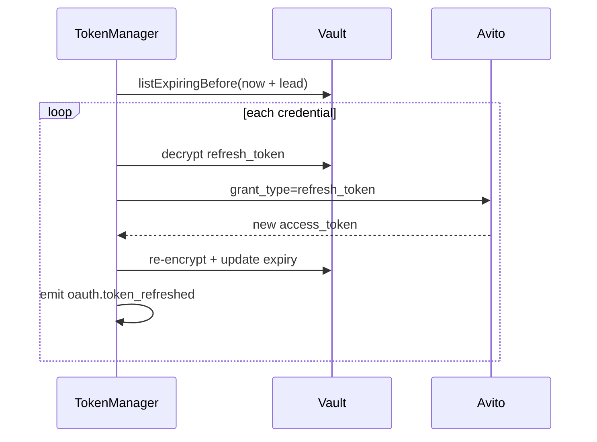
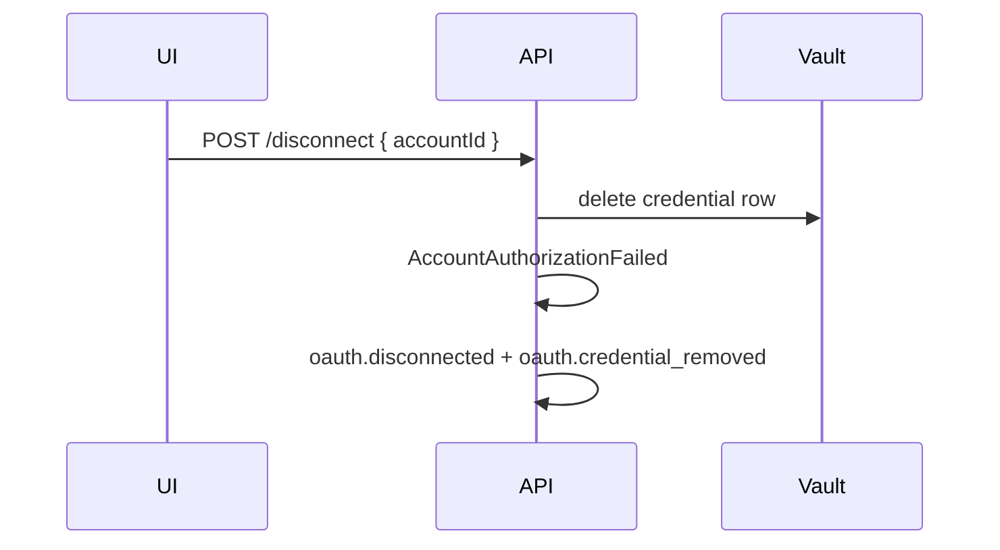

# OAuth Flow — Avito

Production Authorization Code flow with optional Client Credentials for service apps.

## Authorization Code (recommended)



## Client Credentials

For applications without user delegation:



## Token refresh

Automatic (Token Manager) and manual (`POST /api/auth/avito/refresh`):



## Disconnect



## Redirect URIs

| Environment | Callback URL |
|-------------|--------------|
| Local | `http://localhost:3001/api/auth/os/callback` |
| Production | `https://integrator.neeklo.ru/api/auth/os/callback` |

Configure the same URI in Avito developer portal.

## State & CSRF

- `state` = cryptographically random UUID v4
- Stored in `oauth_pending_flow` with 15-minute TTL
- Callback rejected if state unknown or expired

## PKCE

Avito OAuth provider supports PKCE (`supportsPkce: true` in adapter config when required). Code verifier stored in `OAuthPendingFlow.codeVerifier` when enabled.

## UI flow

```
Marketplace → Avito → Подключить → OAuth → Проверка → Токены → ✓ Connected
```

Implemented in `apps/web/src/pages/settings/oauth-settings-page.tsx` (`/settings/oauth`).
