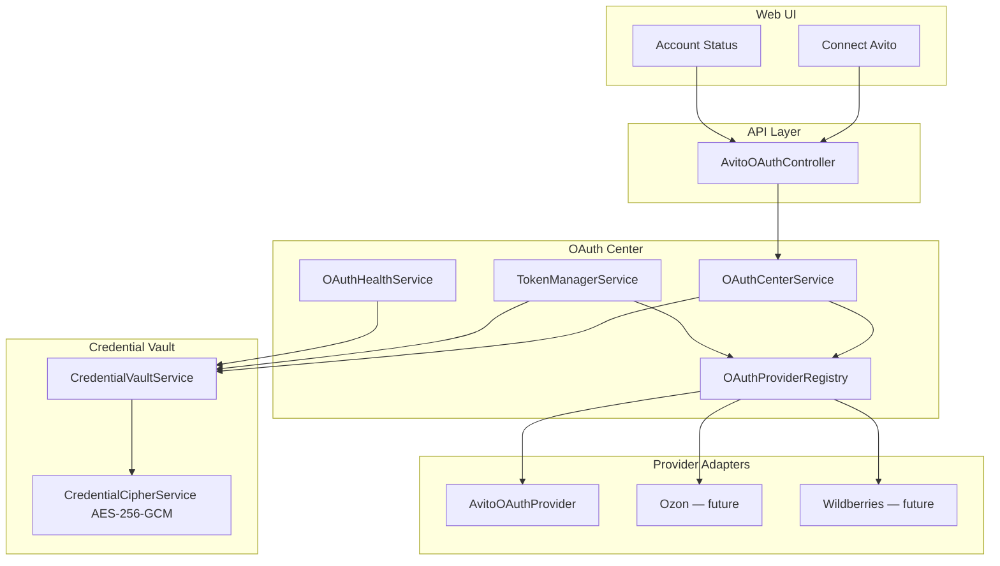
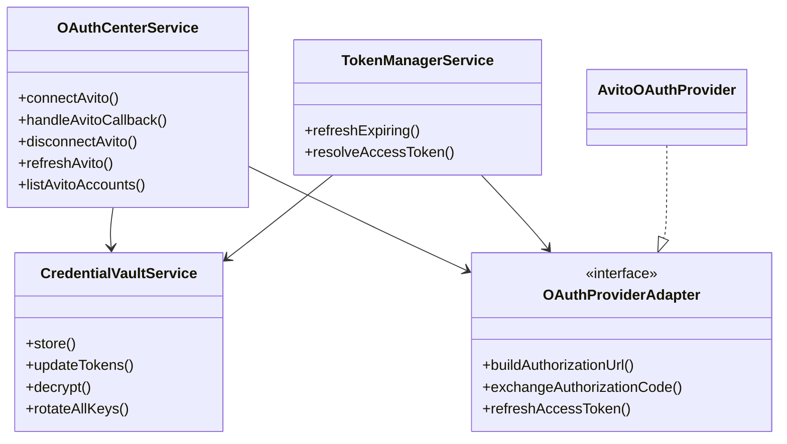

# OAuth Platform — NEEKLO Marketplace OS

Phase A2 production OAuth layer for all marketplace integrations.

## Overview



## Modules

| Module | Path | Responsibility |
|--------|------|----------------|
| OAuth Center | `apps/api/src/platform/oauth-center/` | Authorization, token exchange, refresh, health |
| Credential Vault | `.../vault/credential-vault.service.ts` | Encrypted secret storage per account |
| Provider Registry | `.../providers/oauth-provider.registry.ts` | Marketplace-specific OAuth adapters |
| Token Manager | `.../token-manager.service.ts` | Proactive refresh before expiry |
| API | `apps/api/src/modules/oauth/` | HTTP routes under `/api/auth/avito/*` |

## Supported marketplaces

| Provider | Status | Adapter |
|----------|--------|---------|
| Avito | ✅ Production | `AvitoOAuthProvider` |
| Ozon | 🔜 Planned | Register in `OAuthProviderRegistry` |
| Wildberries | 🔜 Planned | — |
| Yandex Market | 🔜 Planned | — |
| VK | 🔜 Planned | — |
| Telegram | 🔜 Planned | — |
| MAX | 🔜 Planned | — |

## Multi-account

One tenant (`organizationId`) may connect **multiple independent Avito accounts**. Each account has:

- Unique `accountId` (UUID)
- Isolated Credential Vault row (`tenantId + provider + accountId`)
- Independent token lifecycle and health

## API routes

| Method | Route | Auth | Description |
|--------|-------|------|-------------|
| POST | `/api/auth/avito/connect` | JWT + `settings:write` | Start OAuth or client_credentials |
| GET | `/api/auth/os/callback` | Public | Unified OAuth redirect (Avito registered URI) |
| POST | `/api/auth/avito/disconnect` | JWT | Revoke and remove credentials |
| POST | `/api/auth/avito/refresh` | JWT | Manual token refresh |
| GET | `/api/auth/avito/status` | JWT | Single account OAuth status |
| GET | `/api/auth/os/config` | JWT | Redirect URI config |
| GET | `/api/auth/os/debug` | JWT | Debug info per account |
| POST | `/api/auth/os/validate` | JWT | Validation suite |
| POST | `/api/auth/os/test` | JWT | OAuth test actions |
| GET | `/api/auth/os/console` | JWT | API request log |
| GET | `/api/auth/os/health` | JWT | Health dashboard |
| GET | `/api/auth/avito/accounts` | JWT | All Avito OAuth accounts |

## Domain events

| Event | Type |
|-------|------|
| OAuthConnected | `oauth.connected` |
| OAuthDisconnected | `oauth.disconnected` |
| TokenRefreshed | `oauth.token_refreshed` |
| TokenExpired | `oauth.token_expired` |
| TokenRefreshFailed | `oauth.token_refresh_failed` |
| CredentialUpdated | `oauth.credential_updated` |
| CredentialRemoved | `oauth.credential_removed` |

## Class diagram



## Environment

```bash
API_URL=http://localhost:3001
OAUTH_REDIRECT_PATH=/api/auth/os/callback
OAUTH_VAULT_MASTER_KEY=<64-char-hex>
OAUTH_VAULT_KEY_VERSION=1
OAUTH_TOKEN_REFRESH_LEAD_SEC=300
```

See also: [credential-vault.md](./credential-vault.md), [oauth-flow.md](./oauth-flow.md), [security.md](./security.md), [token-manager.md](./token-manager.md), [oauth-validation.md](./oauth-validation.md).
