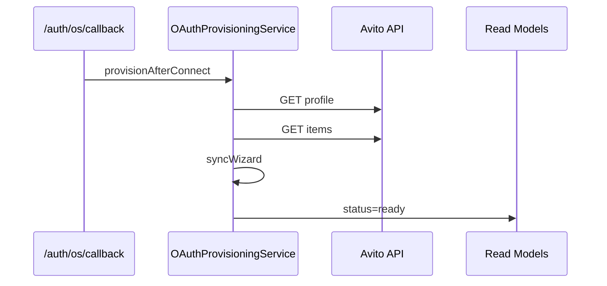

# OAuth Validation Suite — Phase A2.1

Production validation for Avito OAuth before go-live.

## Endpoint

`POST /api/auth/os/validate?accountId={uuid}`

## Checks

| ID | Name | Description |
|----|------|-------------|
| `redirect_uri` | Redirect URI | Must be `/api/auth/os/callback` |
| `state` | State storage | Pending flow table operational |
| `csrf` | CSRF | UUID state enforced on callback |
| `access_token` | Access Token | Resolves via Token Manager |
| `refresh_token` | Token Refresh | Refresh or client_credentials re-issue |
| `expiration` | Token Expiration | Expiry within refresh lead window |
| `health` | Health | Profile probe via OAuthHealthService |
| `reconnect` | Reconnect | Warns if reauth required |
| `disconnect` | Disconnect | Credential present for safe disconnect |

## UI

OAuth Debug Center: `/settings/oauth` → **Run Validation Suite**

## Test actions

`POST /api/auth/os/test` with `{ accountId, action }`:

- `redirect` — verify configured URI
- `token` — resolve access token
- `refresh` — manual refresh
- `profile` — GET `/core/v1/accounts/self`
- `account` — marketplace account read model
- `api` — API connectivity probe

## Production checklist

`GET /api/auth/os/checklist?accountId={uuid}`

| Item | pass | warn | fail |
|------|------|------|------|
| OAuth | Connected + redirect match | — | Not connected |
| Profile | externalAccountId set | — | Missing |
| Ads | Items API reachable | — | Failed |
| Messenger | Chats API | Scope/endpoint | — |
| Stats | Stats API | Empty scope | — |
| Webhook | — | Not configured | — |
| Autoload | — | Separate module | — |
| Health | healthy | degraded | unhealthy |

## Post-connect automation

After successful OAuth callback or client_credentials:

1. GET profile → save `externalAccountId`, `displayName`
2. GET items → count ads
3. Sync Wizard: profile, ads, stats, messenger
4. Account status → `ready`

