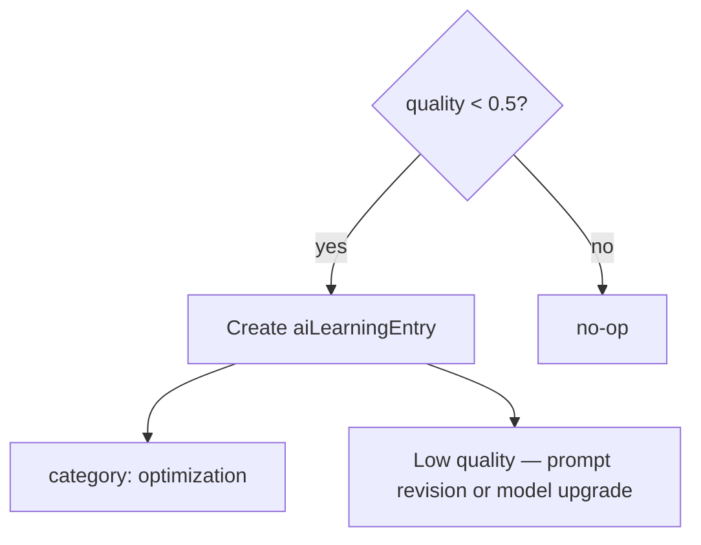

# Optimization Engine

`OptimizationEngine` analyzes evaluation results and produces **actionable optimization signals** — prompt revisions, router hints, and skill gaps. Release 0.5 implements rule-based analysis; ML-driven routing is future work.

## Trigger

Called from orchestrator after every run:

```typescript
await optimization.analyze(tenantId, evalResult);
```

## Current rules



Also considers `costEfficiency` in eval payload for future rules (e.g. suggest cheaper model when quality high but cost low).

## Planned optimizations

| Signal | Target |
| --- | --- |
| Low quality + high latency | Router → faster model |
| Low quality + chat task | Prompt Registry variant |
| Tool failures | Skill/tool mapping fix |
| High cost, high quality | Document as acceptable pattern |

## Relationship to Learning

Optimization writes to same `aiLearningEntry` table as [Learning Engine](./learning-engine.md) with `category: 'optimization'`. Distinction: optimization is **reactive rules**; learning is **per-run pattern log**.

## ADR

**Decision:** Optimization does not auto-mutate prompts or routes in 0.5 — insights only. Human or AI Studio applies changes.

**Consequences:**
- (+) Safe production behavior
- (-) Closed-loop automation deferred to 0.6

## Path

`apps/api/src/platform/ai-platform/learning/learning-engines.service.ts` (`OptimizationEngine`)

## See also

- [evaluation-engine.md](./evaluation-engine.md) · [prompt-registry.md](./prompt-registry.md) · [ai-cost-center.md](./ai-cost-center.md)
