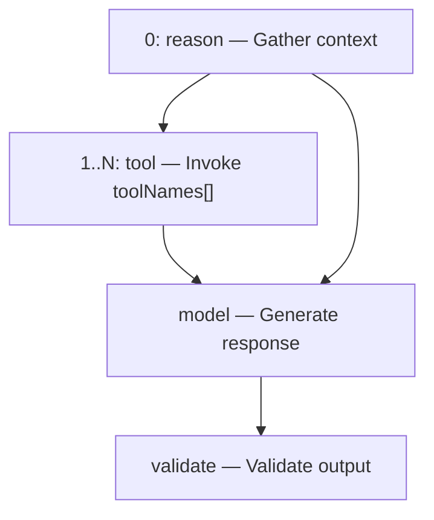
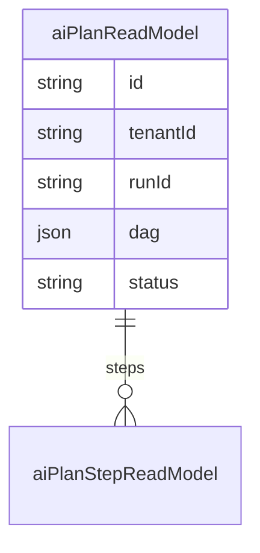

# Planner Engine

`PlannerEngine` decomposes an `AiRunRequest` into a **DAG of execution steps** — reason → tools → model → validate. Plans are persisted to `aiPlanReadModel` and emitted as `ai.plan_created`.

## Step kinds

| Kind | Purpose |
| --- | --- |
| `reason` | Gather context (always step 0) |
| `tool` | Invoke named tool from request |
| `model` | LLM generation |
| `validate` | Output validation (placeholder) |

## Default DAG

When `request.toolNames` is empty, DAG is: `reason → model → validate`.

## Request controls

| Field | Effect |
| --- | --- |
| `toolNames[]` | One tool step per name, all depend on step 0 |
| `maxSteps` | Caps total steps: `steps.slice(0, maxSteps + 2)` |

## Persistence

Event payload includes `stepCount` and simplified DAG labels for observability.

## Orchestrator execution

Today the orchestrator executes **tool steps** from the plan; model and validate steps are logical markers — actual LLM call happens once after the tool loop. Future: step-by-step execution with `ai.step_completed` per step.

## ADR

**Decision:** Plans are read models, not aggregates. Re-planning on failure is a future enhancement.

**Consequences:**
- (+) Fast persistence, no replay needed for UI
- (-) Plan mutations not event-sourced individually yet

## Path

`apps/api/src/platform/ai-platform/planner/planner.engine.ts`

## See also

- [ai-orchestrator.md](./ai-orchestrator.md) · [tool-runtime.md](./tool-runtime.md) · [ai-platform.md](./ai-platform.md)
