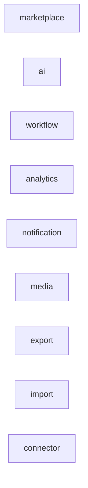
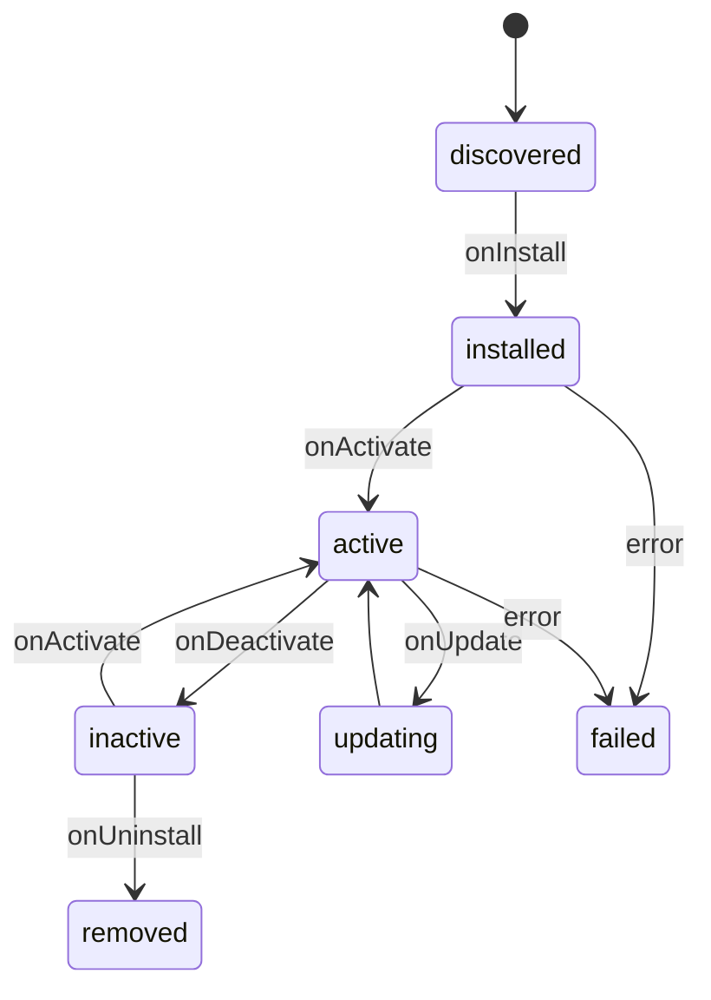

# Plugin Runtime

`@neeklo/plugin-runtime` manages plugin lifecycle without modifying platform core.

## Plugin kinds



## Lifecycle



## Core classes

| Class | Role |
| --- | --- |
| `PluginRegistry` | Validate, install, activate, deactivate, update, uninstall |
| `MarketplaceRegistry` | Map `MarketplaceCode` → `MarketplaceProvider` |
| `MarketplacePluginRuntime` | Bootstrap marketplace plugins end-to-end |

## NestJS integration

- `PluginRuntimeModule` — wires bootstrap
- `PluginBootstrapService` — activates plugins on `OnApplicationBootstrap`
- `MarketplaceRegistryService` — DI-facing registry singleton

## Adding Ozon (example)

```typescript
// 1. Implement OzonMarketplaceProvider extends BaseMarketplaceProvider
// 2. Implement OzonMarketplacePlugin implements NeekloPlugin
// 3. Register in PluginBootstrapService:
this.registry.registerBootstrap({
  plugin: this.ozonPlugin,
  marketplaceCode: MarketplaceCode.OZON,
  providerFactory: () => this.ozonPlugin.createProvider(),
});
```

Core, Sync Engine, Metrics Engine, Analytics — unchanged.

## Backward compatibility

Legacy `MarketplaceAdapter` interface is preserved via `ProviderAdapterBridge` — delegates to SDK provider.
