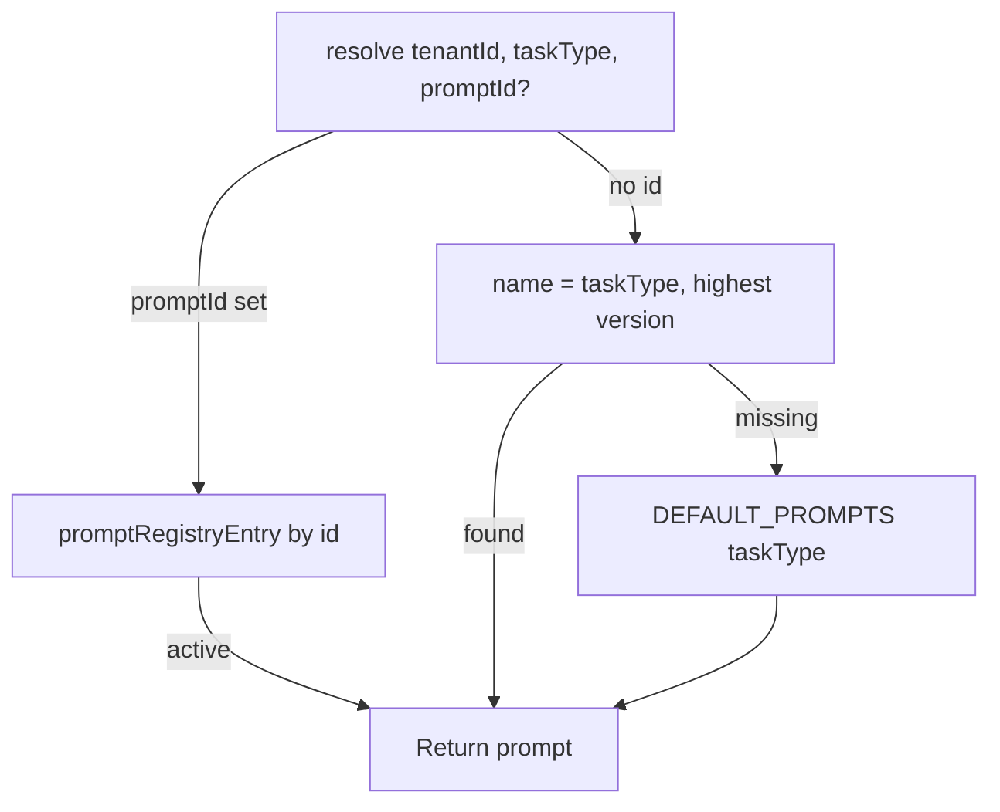

# Prompt Registry

`PromptRegistryService` stores **versioned prompts outside code** — tenant overrides, categories, tags, and usage events. Resolved per run by task type or explicit `systemPromptId` on agent.

## Resolution order

## Default prompts

| taskType | category | template (abbrev) |
| --- | --- | --- |
| `chat` | sales | Professional marketplace sales agent |
| `analytics` | analytics | Actionable insights |
| `listing` | marketing | Optimized listing content |
| `summary` | support | Concise manager summary |
| `reasoning` | reasoning | Structured reasoning |

## API

| Method | Route | Permission |
| --- | --- | --- |
| GET | `/api/ai/prompts` | ChatRead |
| POST | `/api/ai/prompts` | SettingsWrite |

Create body: `{ name, category?, template, tags? }`

## Events

`ai.prompt_used` — `{ runId, promptId, promptVersion, tokensIn }` via `recordUsage()` (call site in orchestrator — future wire).

## Optimization loop

[Optimization Engine](./optimization-engine.md) suggests prompt revision when [Evaluation](./evaluation-engine.md) quality &lt; 0.5.

## ADR

**Decision:** Prompts are tenant-scoped read models, not Event Store aggregates. Hot edits without deploy.

**Consequences:**
- (+) AI Studio / admin can iterate prompts
- (-) Prompt history/rollback via version field only (no full audit stream yet)

## Path

`apps/api/src/platform/ai-platform/prompts/prompt-registry.service.ts`

## See also

- [ai-orchestrator.md](./ai-orchestrator.md) · [optimization-engine.md](./optimization-engine.md) · [ai-studio.md](./ai-studio.md)
