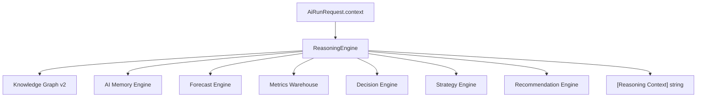
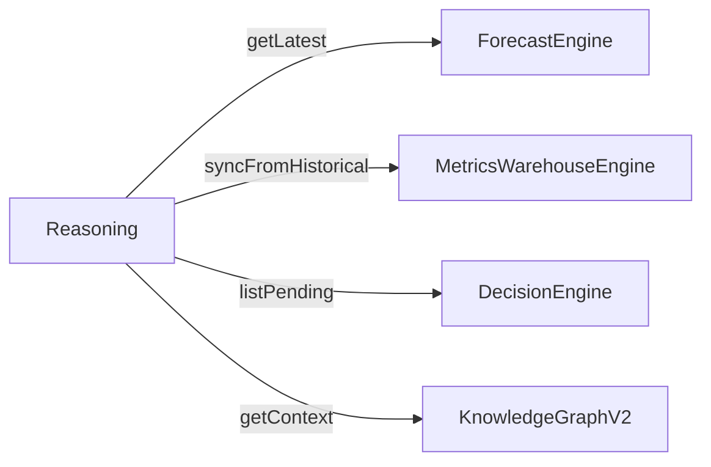

# Reasoning Engine

`ReasoningEngine` synthesizes **Stage 3 Intelligence** context for AI runs **without calling LLMs**. It is the bridge between warehouses, forecasts, decisions, and the system prompt.

## Architecture



## Context resolution

When `context.entityType` + `context.entityId` are set:

| Entity | Additional context |
| --- | --- |
| Any | KG neighborhood (depth 2), AI Memory |
| `ad` | Forecast, ROI/CTR metrics, pending decisions |
| All runs | Active strategy, open recommendations count |

Example output fragment:

```
[Reasoning Context]
Knowledge Graph: 12 related entities
Forecast (linear_regression): available
ROI: 142.3%, CTR: 2.15%
Pending decisions: boost, change_price
Active strategy: growth
Open recommendations: 3
```

## No duplication rule

ReasoningEngine **delegates** to existing engines — it does not compute CTR, ROI, or forecasts inline. Same rule as Commerce Platform agent (ADR-013).



## Sales agent usage

`SalesAgentService` passes:

```typescript
context: {
  entityType: 'conversation',
  entityId: conversationId,
  customerId, adId,
}
```

For `ad`-linked conversations, extend context with `entityType: 'ad'` in future for richer reasoning.

## ADR

**Decision:** Reasoning is pre-LLM deterministic context — keeps token cost low and ensures numeric facts match dashboards.

**Consequences:**
- (+) Consistent numbers across UI and AI
- (-) Requires entity context in request; generic chat gets strategy + recs only

## Path

`apps/api/src/platform/ai-platform/reasoning/reasoning.engine.ts`

## See also

- [intelligence-engine.md](./intelligence-engine.md) · [decision-engine.md](./decision-engine.md) · [forecast-engine.md](./forecast-engine.md)
- [knowledge-graph-v2.md](./knowledge-graph-v2.md) · [ai-orchestrator.md](./ai-orchestrator.md)
