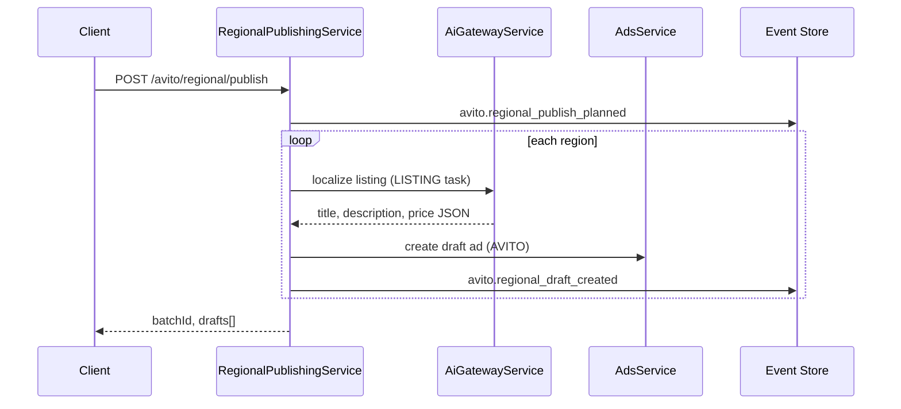

# Regional Publishing

Localized listing drafts per city/region — AI-adapted copy and prices stored as local ad drafts. **Publication to Avito via Autoload is deferred** in Release 0.6; batches operate in `draft` / `manual_export` mode.

## API

| Method | Path | Purpose |
| --- | --- | --- |
| `POST` | `/api/avito/regional/publish` | Create regional draft batch |
| `GET` | `/api/avito/regional/drafts` | List drafts (`batchId` filter) |

Path: `apps/api/src/platform/avito/regional/regional-publishing.service.ts`

## Batch flow

## Input

`regionalPublishInputSchema`:

- `sourceAdId` — optional base ad
- `product` — product description when no source ad
- `basePrice` — RUB baseline
- `regions[]` — `{ regionId, cityId }`

## Events

| Event | When |
| --- | --- |
| `avito.regional_publish_planned` | Batch started; includes capability note |
| `avito.regional_draft_created` | Per-city draft with `publishMode: draft` |

Read model: `RegionalDraftReadModel` — `batchId`, `sourceAdId`, `draftAdId`, localized title/price.

## Official API alignment

Avito plugin declares `publication: supported: false`. Regional Publishing creates **local drafts** for manual export or future Autoload module — it does not call Avito publication REST.

## Integration

- **AI Platform** — per-region localization via Gateway
- **Regional Intelligence** — analytics at `GET /avito/analytics/regional` → `RegionalIntelligenceEngine` (Stage 3)
- **Commerce Regional Center** — complementary view at `/analytics/regional` (see [regional-center.md](./regional-center.md))

## Web UI

`/avito/regional` — region picker, batch publish, draft list.
