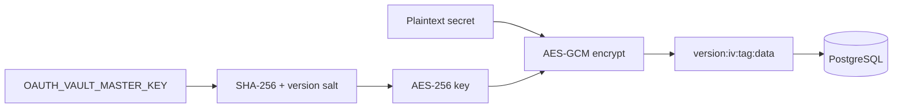

# OAuth Security

Security requirements and controls for Phase A2 OAuth Platform.

## Threat model

| Threat | Mitigation |
|--------|------------|
| Token leakage via logs | Secrets never logged; API responses exclude tokens |
| Token storage in `.env` | Prohibited — vault only |
| DB breach exposes tokens | AES-256-GCM encryption at rest |
| CSRF on OAuth callback | `state` parameter + TTL on pending flows |
| Client secret in UI | Password input; never returned from API |
| Stale/compromised keys | Key version + rotation support |

## Encryption



**Requirements:**

- `OAUTH_VAULT_MASTER_KEY` ≥ 32 characters (64-char hex recommended)
- Unique per environment (dev/staging/prod)
- Stored in secrets manager / deploy env — not in git

Generate:

```bash
node -e "console.log(require('crypto').randomBytes(32).toString('hex'))"
```

## What is NEVER exposed

- `clientSecret`
- `accessToken`
- `refreshToken`
- Raw encrypted blobs

## Audit log

Every OAuth operation writes to `audit_log` via `ObservabilityService`:

| Action | Trigger |
|--------|---------|
| `oauth.connect.start` | Connect initiated |
| `oauth.connect.completed` | Client credentials connected |
| `oauth.callback.success` | Authorization code exchanged |
| `oauth.callback.failed` | Exchange error |
| `oauth.disconnect` | User disconnect |
| `oauth.refresh.manual` | Manual refresh |

## Access control

- Connect / disconnect / refresh: JWT + `settings:write` permission
- Callback: `@Public()` — validated via `state` + pending flow record

## Key rotation procedure

1. Deploy new `OAUTH_VAULT_KEY_VERSION` (increment)
2. Run rotation for each tenant (admin endpoint or script calling `rotateAllKeys`)
3. Verify credentials still decrypt
4. Retire old master key only after all blobs use new version

## Compliance checklist

- [x] Secrets encrypted at rest
- [x] No tokens in `.env` (legacy `AVITO_CLIENT_ID/SECRET` deprecated for tokens)
- [x] OAuth 2.0 authorization code flow
- [x] State parameter for CSRF
- [x] Token refresh before expiry
- [x] Full audit trail
- [x] Domain events for observability
- [x] Client secret not in API responses or UI after save

## Production hardening (recommended)

- Rate-limit `/api/auth/os/callback`
- IP allowlist for admin rotation endpoints
- Alert on `oauth.token_refresh_failed` events
- Periodic credential health checks via `OAuthHealthService`
