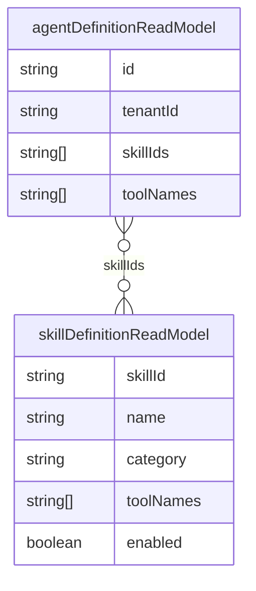

# Skills Framework

`SkillFrameworkService` defines **composable capability bundles** — each skill maps to a category, description, and default tool set. Agents attach skills; orchestrator can apply them to runs via `skillIds` on `AiRunRequest`.

## Built-in skills

Seeded at bootstrap in `agent-runtime.service.ts`:

| skillId | Category | Tools |
| --- | --- | --- |
| `sales` | commerce | `decision.list`, `forecast.get` |
| `support` | commerce | `memory.recall` |
| `listing` | marketing | `metrics.query`, `marketplace.search` |
| `analytics` | intelligence | `metrics.query`, `forecast.get` |
| `negotiation` | commerce | `decision.list` |

## Model

## API

- `GET /api/ai/skills` — list enabled skills
- Agent create: `skillIds[]` on `POST /api/ai/agents`

## Web UI

[AI Studio](./ai-studio.md) (`/ai/studio`) — multi-select skills when creating agents.

## Sales agent default

`SalesAgentService` passes `skillIds: ['sales', 'negotiation']` on every reply.

## Event

`ai.skill_applied` — catalog defined; wired when orchestrator explicitly records skill usage (future enhancement).

## ADR

**Decision:** Skills are metadata + tool hints, not separate executors. Tool execution stays in [Tool Runtime](./tool-runtime.md).

**Consequences:**
- (+) Simple agent authoring in UI
- (-) Skill → tool expansion not automatic in orchestrator yet (agent `toolNames` used directly)

## Path

`apps/api/src/platform/ai-platform/agents/agent-runtime.service.ts` (`SkillFrameworkService`)

## See also

- [agent-runtime.md](./agent-runtime.md) · [tool-registry-v2.md](./tool-registry-v2.md) · [ai-studio.md](./ai-studio.md)
