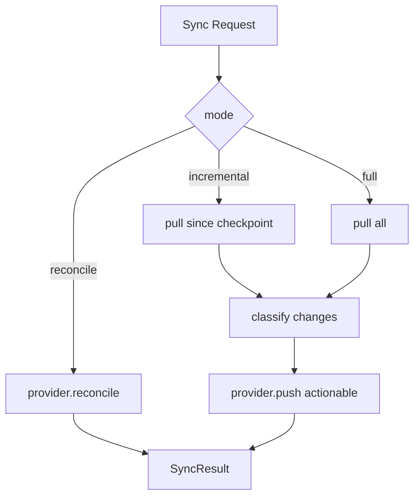

# Sync Engine

`SyncEngine` (`apps/api/src/platform/marketplace-core/sync/sync.engine.ts`) orchestrates bidirectional synchronization with marketplace providers.

## Operations

| Operation | Meaning |
| --- | --- |
| `create` | New entity on marketplace |
| `update` | Changed entity |
| `delete` | Removed remotely |
| `restore` | Previously deleted, now back |
| `skip` | No action needed |
| `conflict` | Local vs remote mismatch |

## Modes

## Flow

1. Create `SyncJobReadModel` (status: running)
2. Resolve provider `sync` capability
3. `pull()` or `reconcile()`
4. Classify conflicts vs actionable changes
5. `push()` actionable changes
6. Update job + emit account domain events

## Domain integration

`MarketplaceSyncService` calls `SyncEngine`, then updates `AccountAggregate`:

- `AccountSyncStarted`
- `AccountSyncCompleted` / `AccountSyncFailed`

## Provider requirement

Plugins implement `MarketplaceSync` when sync is supported. Avito: not yet (Autoload feed module).
