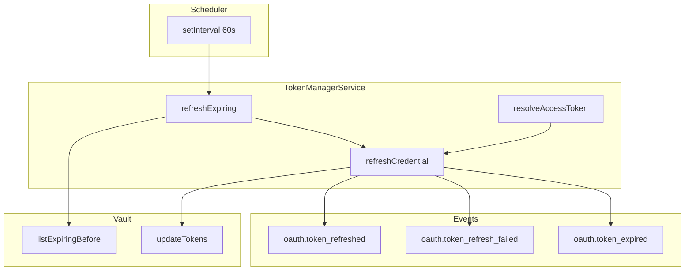
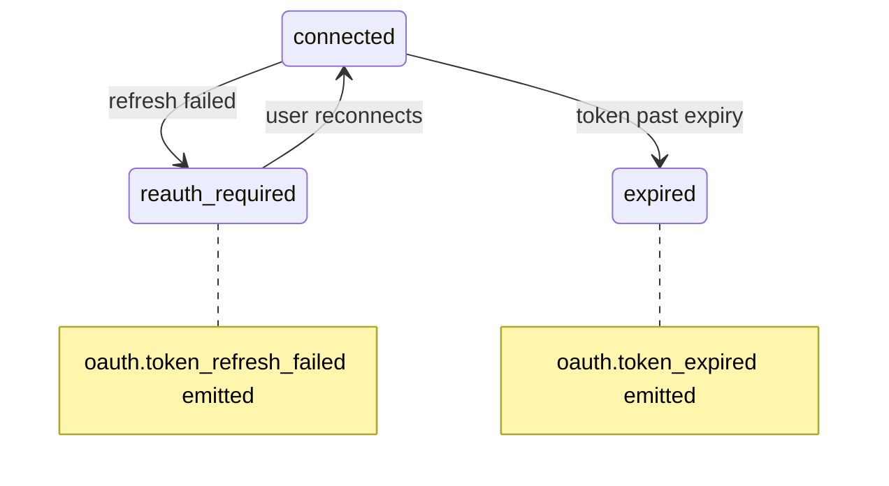

# Token Manager

Automatic access token lifecycle management for all marketplace OAuth credentials.

## Architecture



## Refresh lead time

Tokens are refreshed when:

```
tokenExpiresAt <= now + OAUTH_TOKEN_REFRESH_LEAD_SEC
```

Default: **300 seconds** (5 minutes) before expiry.

## Grant types

| Grant | Refresh strategy |
|-------|------------------|
| `authorization_code` | `refresh_token` grant |
| `client_credentials` | Re-issue via `client_credentials` grant |

## Failure handling



On failure:

1. `lastError` updated in vault
2. `health` → `unhealthy`
3. `oauth.token_refresh_failed` event published
4. If token already expired → `status: expired` + `oauth.token_expired`

## On-demand resolution

`AvitoClient` calls `TokenManagerService.resolveAccessToken(tenantId, provider, accountId)` before each API request:

1. Check expiry vs lead window
2. Refresh if needed
3. Return decrypted access token (in memory only)

## Manual refresh

UI button → `POST /api/auth/avito/refresh` → same `refreshCredential` path.

## Configuration

| Variable | Default | Description |
|----------|---------|-------------|
| `OAUTH_TOKEN_REFRESH_LEAD_SEC` | 300 | Seconds before expiry to refresh |
| Sweep interval | 60s | Hardcoded in `onModuleInit` |

## Implementation

`apps/api/src/platform/oauth-center/token-manager.service.ts`

## Monitoring

Subscribe to event bus:

- `oauth.token_refreshed` — healthy rotation
- `oauth.token_refresh_failed` — user notification required
- `oauth.token_expired` — integration degraded

Recommended alert: >3 consecutive `token_refresh_failed` for same `credentialId`.
