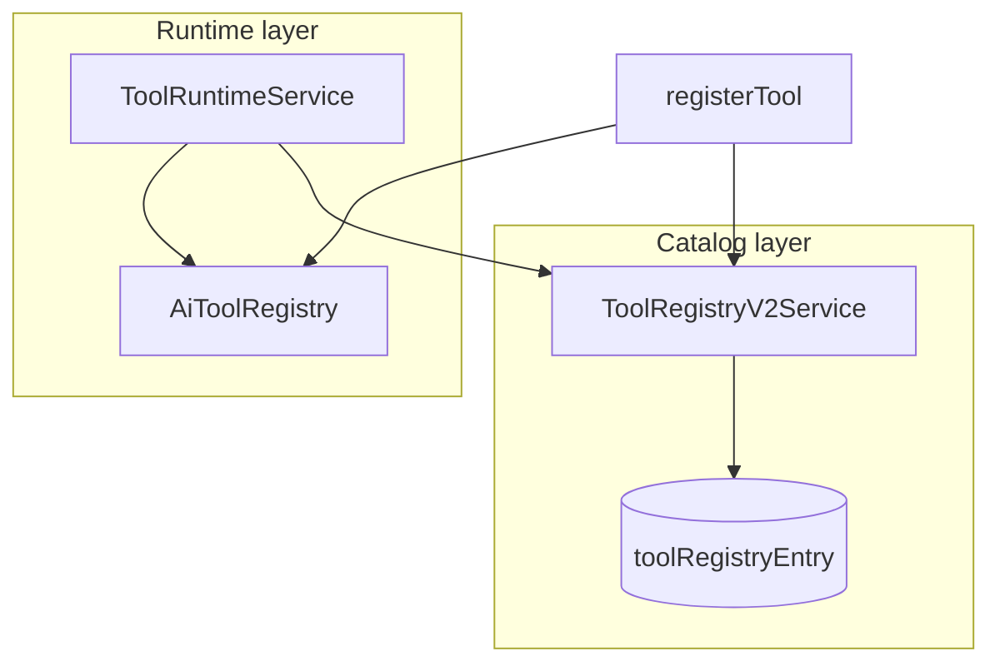
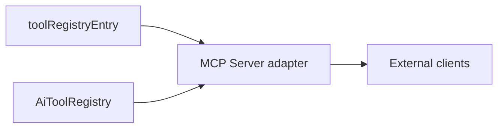

# Tool Registry v2

`ToolRegistryV2Service` is the **versioned metadata catalog** for AI tools — categories, permissions, cost per call, dependencies, and health flags. Execution remains in [Tool Runtime](./tool-runtime.md) via `AiToolRegistry`.

## Two-layer registry



| Layer | Responsibility |
| --- | --- |
| v1 `AiToolRegistry` | `execute()`, Zod schemas, in-memory map |
| v2 `ToolRegistryEntry` | Discovery, governance, MCP manifest source |

## Built-in catalog

Seeded on bootstrap:

| name | category |
| --- | --- |
| `marketplace.search` | marketplace |
| `forecast.get` | forecast |
| `decision.list` | decision |
| `metrics.query` | analytics |
| `memory.recall` | memory |
| `notification.send` | notification |
| `search.global` | search |
| `budget.summary` | budget |

## register API

```typescript
await registryV2.register({
  name: 'forecast.get',
  version: '1.0.0',
  category: 'forecast',
  description: 'Get forecast for entity',
  permissions: [],
  costPerCall: 0,
  dependencies: ['ForecastEngine'],
});
```

## API

- `GET /api/ai/tools?category=forecast` — list from v2 catalog

## MCP readiness

v2 entries are the source of truth for future MCP tool manifests:



## ADR

**Decision:** Split execution registry (v1) from governance catalog (v2) to avoid breaking Stage 1 agent code while adding enterprise metadata.

**Consequences:**
- (+) UI/API can list tools without loading executors
- (-) Must keep v1/v2 names in sync on register

## Path

`apps/api/src/platform/ai-platform/tools/tool-runtime.service.ts` (`ToolRegistryV2Service`)

## See also

- [tool-runtime.md](./tool-runtime.md) · [skills.md](./skills.md) · [ai-platform.md](./ai-platform.md)
