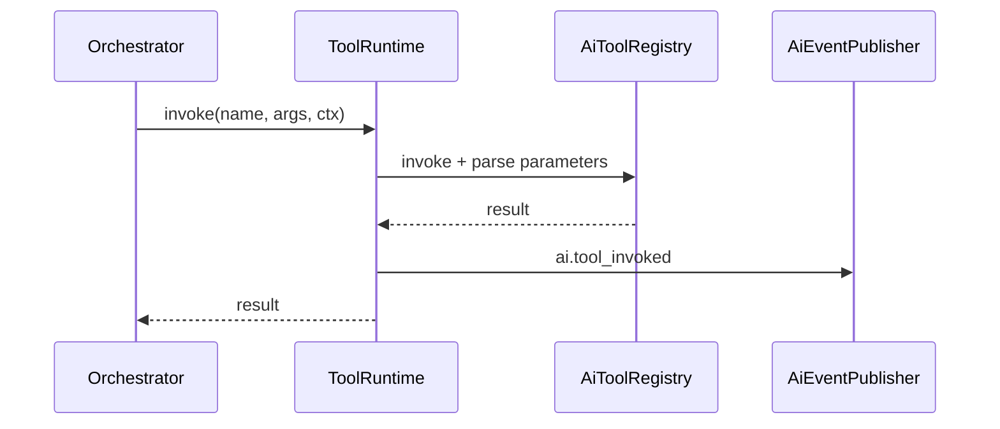

# Tool Runtime

`ToolRuntimeService` executes AI-callable tools with **Zod validation**, telemetry, and event publishing. It bridges the in-process `AiToolRegistry` (Stage 1) and [Tool Registry v2](./tool-registry-v2.md) metadata catalog.

## Execution flow



## Context

```typescript
interface ToolRuntimeContext {
  tenantId: string;
  actorId: string | null;
  correlationId: string;
  runId: string;
}
```

Every invocation emits `ai.tool_invoked` with `durationMs`, `success`, `toolVersion`.

## Bootstrap registrations

`AiPlatformBootstrapService` wires executable tools at app start:

| Tool | Backend |
| --- | --- |
| `search.global` | `SearchEngine` |
| `forecast.get` | `ForecastEngine.getLatest` |
| `decision.list` | `DecisionEngine.listPending` |
| `memory.recall` | `AiMemoryEngine.recall` |

Registry v2 seeds additional metadata-only builtins (marketplace.search, metrics.query, etc.) — wire executors as needed.

## Custom tools

```typescript
tools.registerTool({
  name: 'my.tool',
  description: '...',
  parameters: z.object({ ... }),
  execute: async (args, ctx) => { ... },
});
```

Dual-registers in v1 `AiToolRegistry` + v2 `toolRegistryEntry`.

## ADR

**Decision:** Tools are plugin-style functions, not HTTP microservices. MCP exposure is a thin adapter over the same registry (Release 0.5 readiness).

**Consequences:**
- (+) Type-safe, tenant-scoped, auditable
- (+) Same tools for Commerce agent and `/api/ai/run`
- (-) Cross-process tools require future MCP server

## Paths

- Runtime: `apps/api/src/platform/ai-platform/tools/tool-runtime.service.ts`
- Registry v1: `apps/api/src/platform/ai/tool-registry.ts`
- Bootstrap: `apps/api/src/platform/ai-platform/bootstrap/ai-platform-bootstrap.service.ts`

## See also

- [tool-registry-v2.md](./tool-registry-v2.md) · [ai-orchestrator.md](./ai-orchestrator.md) · [plugin-runtime.md](./plugin-runtime.md)
