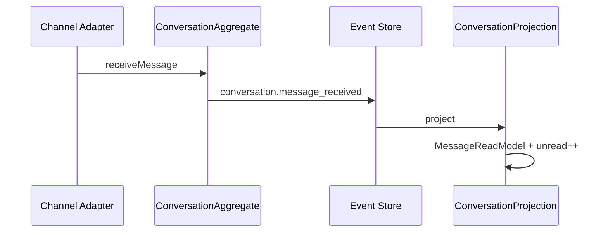

# Unified Inbox

Platform-agnostic messaging hub aggregating Avito, Telegram, MAX, WhatsApp, VK, Email, and Web Chat.

## Aggregate

Stream: `conversation:{id}`

Events: `conversation.started`, `conversation.message_*`, `conversation.ai_summary_generated`, pin/tag/assign/status.

## API

- `GET /api/commerce/inbox`
- `GET /api/commerce/inbox/:id/messages`
- `POST /api/commerce/inbox/:id/send`
- `POST /api/commerce/agent/reply` — AI draft / auto-send

## UI

`/chats` — three-pane inbox with AI draft, pinned threads, unread badges.

