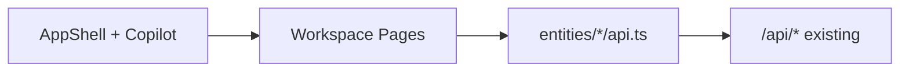

# UX Professional Workspace — Release 0.7

Release 0.7 delivers the **Avito Professional Workspace** — a product experience layer on top of Releases 0.1–0.6. **No new backend services or domain models.**

## Design language

- React 19 + TypeScript + Tailwind v4
- Dark / Light theme (`ThemeProvider`)
- Framer Motion micro-interactions
- TanStack Query (60s refetch for near-realtime)
- TanStack Virtual for large ad lists
- AI Copilot panel on every authenticated page
- Command Center (⌘K) with KB + quick actions

## Key screens

| Screen | Route | APIs used |
| --- | --- | --- |
| Dashboard + AI Briefing | `/` | `/ads`, `/commerce/inbox`, `/avito/analytics`, `/ai/run` |
| Ads Workspace | `/ads?id=` | `/ads`, `/commerce/listings/:id/studio`, `/commerce/timeline` |
| Unified Inbox (3-col) | `/chats` | `/commerce/inbox*`, `/commerce/customers/:id`, `/avito/knowledge` |
| Regional Center | `/analytics/regional` | `/commerce/regions` |
| Budget Center | `/budget` | `/commerce/budget`, `/avito/budget/import` |
| Listing Studio | `/avito/listing` | `/avito/listing/generate` |
| Media Studio | `/media/studio` | `/commerce/media/jobs`, `/avito/media/assets` |
| Executive Mode | `/executive` | `/avito/dashboard`, `/avito/analytics`, `/ai/run` |

## Architecture (frontend only)

## Release 0.7 audit

| Check | Result |
| --- | --- |
| UX per screen | ✅ Workspace layouts, copilot context |
| Performance | ✅ Lazy routes, virtual ad list, query staleTime |
| Accessibility | ⚠️ Dialog roles on palette; continue axe audit |
| Mobile | ⚠️ Inbox 360 panel hidden xl; sidebar collapse TBD |
| Unified style | ✅ oklch tokens, light/dark |
| Existing APIs only | ✅ No new backend |
| No logic duplication | ✅ UI consumes existing hooks |
| Enterprise SaaS bar | ✅ Executive, Command Center, Studio flows |

## Follow-ups

1. Mobile sidebar drawer
2. `@dnd-kit` for deals kanban
3. MapLibre for geo-accurate regional map
4. Toast / Sonner for optimistic actions
5. WebSocket inbox updates when backend adds SSE
